```{githubmd}
```

```{title}
3D Printing
```

```{toc}
```

# Operation

## Operational Placement

The H2S must be placed on a flat and stable surface. The operating space recommended is 80cm width x 102cm depth x 105cm !!height!!, which covers the space required in the back for the exhaust and an AMS 2 Pro to sit on top. `{ref} https://bambulab.com/en/support/academy/10/course/1031276070794240000/chapter/224`

## Operational Climate

The H2S is recommended to be operated in temperatures between between 15-30C (60-85F). If the temperature is ...

 * < 15C, there may be issues with adhesion to plate and / or weaken layer bonding
 * \> 30C, there filament may soften before reaching hotend, increasing risk of extruder or nozzle clogs.

The chamber has an assortment of fans and vents to circulate cool air / blow out hor air (e.g., chamber exhaust fan, auxiliary part cooling fan, and chamber intake vent), but in warmer climates that may not be enough. `{ref} https://bambulab.com/en/support/academy/10/course/1031276070794240000/chapter/224`

## Auto-calibration

H2S's auto-calibration attempts to adjust itself to account for the expected variances between manufactured H2S printers and variances caused by wear. Examples of calibrations include bed leveling (working around variances in the heatbed), motor noise cancellation, and vibration compensation.

Trigger auto-calibration manually by navigating to **[Wrench Icon]** → **Settings** → **Calibration**. Perform auto-calibrate whenever ...

 * there's a decrease in print quality.
 * after printer maintenance.
 * after firmware updates (recommended but not required). `{ref} https://bambulab.com/en/support/academy/10/course/1031276070794240000/chapter/224`

```{note}
There are optional modules to perform even tighter calibration. Specifically, the vision encoder.
```

## Filament Loading

Filament can be loaded through either an !!AMS!! unit (e.g., AMS 2 Pro or AMS HT) or the external spool holder. The external spool holder is used when ...

 * an !!AMS!! unit isn't attached to the H2S.
 * the spool is oversized for the !!AMS!! unit.
 * the spool is for a material the !!AMS!! unit doesn't !!support!! (but the H2S does).
 * the spool is from an !!unsupported!! third-party. `{ref} https://bambulab.com/en/support/academy/10/course/1031276070794240000/chapter/225`

```{note}
The source doesn't cite this, but I know for a fact that TPU is not !!supported!! by the AMS 2 Pro and must fed via the external spool holder (unless it's specifically branded as !!TPU for AMS!!, which Bambu Lab sells). 
```

To load filament using the AMS 2 Pro, ...

1. open the two tabs on the front edge and lift the cover.
1. stick the spool into one of the four slots, ensuring that it sits on the slot's roller and rotates freely.
1. push the slot's inlet release tab toward the spool and feed filament into that inlet - inlet will automatically grip and pull in filament.
1. close the cover and lock it in by closing the two tabs on the front edge.
1. select filament properties: 
   * For filament from Bambu Lab filament, filament color and  material should be automatically detected (using RFID).
   * For filament not from Bambu Lab, navigate to **[Spool Icon]** → **[Pencil Icon]** (for the slot spool was added to) and select filament brand, material, and color.

`{bm-disable-all}`


`{bm-enable-all}`

To load filament using the external spool holder, ...

1. place filament on external spool holder, where filament tip faces up.
1. push filament through PTFE tube until you feel resistance (should reach into printer's extruder).
1. load filament into extruder:
   1. navigate to **[Spool Icon]** and ensure extruder icon is green (confirms filament reaches extruder).
   1. tap the external spool, then select filament brand, material, and color, then tap **Confirm**.
   1. tap **Load** (pulls filament into extruder).
1. inspect as loading process performs a sample extrusion:
   * Tap **Filament Extruded, Continue** if extrusion is thin, even, and steady line free from gaps and sputtering.
   * Tap **Not Extruded Yet, Retry** and gently push filament further into PTFE tube (to help extruder grip it) if extrusion doesn't happen, happens in blobs, or extrusion curls instead of dropping freely.


`{ref} https://bambulab.com/en/support/academy/10/course/1031276070794240000/chapter/225`

## Filament Refill

Most Bambu Lab filaments come wound up on twist apart spools. Once the filament on the spool has been all used up, a refill may be purchased (refill means filament without a spool) and reinserted into the empty spool. Refills come pre-wound ready to be inserted directly on to the spool.

To refill a spool ...

1. twist apart the spool.
2. place pre-wound refill over interior cylinder of spool, aligning refill's notch against the tiny square extrusion.
3. place two sides of spool back together and twist until click.
4. remove plastic straps holding the refill's shape.
5. place sticker on outside of the spool.

Depending on the type of material, some filaments come wound up on cardboard spools. Only plastic Bambu Lab spools are refillable, not cardboard.

 `{ref} https://bambulab.com/en/support/academy/10/course/1031276070794240000/chapter/231`

## User Interface

The H2S's UI is exposed via a touch screen on the exterior of the front face, located on the top left.


Along left-side of the UI are 5 options, each represented by an icon:

1. **[Home]**: Primary functions and readings (e.g., triggering prints, sensor readings, WiFi status, and statistics).
2. **[Controls]**: Control panel for hardware settings (e.g., fan speed, nozzle and heatbed temperature, light, speed, and motion).
3. **[Filaments]**: Control panel for filament management (e.g., AMS 2 Pro functionality and manually selecting material and color).
4. **[Settings]**: Control panel for printer calibration as well as system and identity settings (e.g., account information, WiFi, firmware, and USB).
5. **[Health Monitoring System]**: Printer diagnostics. `{ref} https://bambulab.com/en/support/academy/10/course/1031276070794240000/chapter/226`

The subsections below provide instructions on how to navigate to important parts of the UI.

### Calibration

To calibrate the H2S, navigate to **[Settings]** → **Calibration** → **Print Calibration**, select the desired calibrations and hit **Start**. `{ref} https://bambulab.com/en/support/academy/10/course/1031276070794240000/chapter/226`

### Print

To print, navigate to **[Home]** → **Print Files** and select the drive and file to load. Two drives should be present:

 * **Internal**: Files preloaded onto the H2S's internal memory.
 * **USB**: Files on USB drive plugged into the H2S.

One a file is chosen, select the appropriate **Plate** and **Nozzle** (H2S comes with "Texture PEI" plate and "0.4mm Standard" nozzle - these should be selected as defaults). Then, hit **Next** select the filament to print with. Then, hit **Print** to begin printing. `{ref} https://bambulab.com/en/support/academy/10/course/1031276070794240000/chapter/226`

### Print Speed

To configure the printing speed, navigate to **[Controls]** → **Speed** and select either **Silent**, **Standard** (default), **Sport**, or **Ludicrous**. `{ref} https://bambulab.com/en/support/academy/10/course/1031276070794240000/chapter/226`

```{note}
An introductory YouTube video I watched mentioned that the faster the speed is, the lower quality the print will be. Some people are willing to accept lower quality prints in exchange for speed.
```

### Toolhead and Heatbed Movement

To perform movements of the toolhead (XZ axis) and heatbed (Y axis), navigate to **[Controls]** → **Motion** and tap the adjustment buttons as necessary. `{ref} https://bambulab.com/en/support/academy/10/course/1031276070794240000/chapter/226`

```{note}
This seems to only be for testing purposes and moving things to get at parts? I had to use this feature to get at a thin piece of plastic that popped off and fell on the bottom of the H2S. I moved the heatbed up so I could fit my hand in and reach it.
```

### Extruder Movement

To perform adhoc extrusion and retraction of filament, navigate to **[Controls]** → **Nozzle & Extruder** and use the up/down buttons under **Extruder**. `{ref} https://bambulab.com/en/support/academy/10/course/1031276070794240000/chapter/226`

```{note}
This seems to be for testing purposes. But also, does this have to be done when swapping between AMS 2 Pro and external spool holder?
```

### Nozzle Type

When nozzle has been swapped, navigate to **[Controls]** → **Nozzle & Extruder** and select the nozzle's type under **Nozzle**. `{ref} https://bambulab.com/en/support/academy/10/course/1031276070794240000/chapter/226`

### Nozzle Temperature

To set the nozzle's temperature, navigate to **[Controls]** → **Nozzle & Extruder** and select the nozzle's temperature under **Nozzle**. `{ref} https://bambulab.com/en/support/academy/10/course/1031276070794240000/chapter/226`

```{note}
This seems to only be for testing purposes and doesn't apply to any prints? AFAIK initiating a new print should unset this as the print needs specific temperatures !!based!! on the print and the filament used.
```

### Heatbed Temperature

To set the heatbed's temperature, navigate to **[Controls]** → **Heatbed** and select the temperature. `{ref} https://bambulab.com/en/support/academy/10/course/1031276070794240000/chapter/226`

```{note}
This seems to only be for testing purposes and doesn't apply to any prints? AFAIK initiating a new print should unset this as the print needs specific temperatures !!based!! on the print and the filament used.
```

### Chamber Temperature

To set the chamber's temperature, navigate to **[Controls]** → **Chamber** and select the temperature. `{ref} https://bambulab.com/en/support/academy/10/course/1031276070794240000/chapter/226`

```{note}
This seems to only be for testing purposes and doesn't apply to any prints? AFAIK initiating a new print should unset this as the print needs specific temperatures !!based!! on the print and the filament used.
```

### Chamber Light

To turn the chamber's light on/off, navigate to **[Controls]** and toggle the **Light** switch. `{ref} https://bambulab.com/en/support/academy/10/course/1031276070794240000/chapter/226`

### Heating and Cooling

To configure the H2S's internal climate, navigate to **[Controls]** → **Air Condition** and select either **Cooling** or **Heating**. Individual parts that control the climate (e.g., fans, heaters, and exhausts) are listed and can be individually controlled. `{ref} https://bambulab.com/en/support/academy/10/course/1031276070794240000/chapter/226`

When the mode is set to ...

 * cooling, the chamber heat circulation fan remains off and the filter switch flap is positioned down. Cooling mode should be used for filaments that have low heat resistance (e.g. PLA and TPU).
 * heating, the chamber heat circulation fan automatically turns on, the auxiliary part cooling fan remains off, and the filter switch flap is positioned up. Heating mode should be used for filaments with high heat resistance (e.g., ABS, ASA, PC, and PA). `{ref} https://wiki.bambulab.com/en/h2/manual/cooling-fan-system`

### Filament Type

To select which filaments are in the AMS 2 Pro and / or external spool holder, navigate to **[Filament]** and select the desired spool to input the type, color, and manufacturer of filament. Bambu Lab filaments come with RFID that allows the AMS 2 Pro to automatically identify material and color. `{ref} https://bambulab.com/en/support/academy/10/course/1031276070794240000/chapter/226`

### Filament Auto Refill

When a filament runs out, the H2S and attached AMS 2 Pro unit automatically swap to a second spool to continue printing, provided that second spool has the same brand, color, and material of the original spool being printed with. To enable auto refill, navigate to **[Settings]** → **!!AMS!! Options** and select **!!AMS!! Auto-Refill**. . Then, navigate to **[Filament]**, select the wrench icon, and select **Auto Refill** to view refill relationships. `{ref} https://wiki.bambulab.com/en/ams-2-pro/manual/setup-and-printting#ams-auto-refill`.

```{note}
On the H2D, there are 2 extruders (left and right) and apparently each of the H2D's AMS 2 Pro units is assigned to one of these heads (there may be multiple AMS 2 Pros per printer). The second spool must be in an AMS 2 Pro unit assigned to the same extruder for auto refill to use it.
```

### Filament Drying

To dry filament, ensure the spool is loaded into the AMS 2 Pro and navigate to **[Filament]** and find the water droplet icon. Below the icon should be a humidity sensor reading. Select the water droplet icon and either ...

 * manually enter a heat and duration
 * select the type of filament (loads in optimal heat and duration presets for the filament selected)
 
..., then select **Start**. `{ref} https://bambulab.com/en/support/academy/10/course/1031276070794240000/chapter/226`

```{note}
What happens when the filaments within hte AMS 2 Pro aren't all the same material? It seems there might be some guard rails preventing you from doing this with certain mixes of materials.

> When drying high-temperature filament, you need to take out the low-temperature filament. For example, when drying ABS, PLA filament cannot be placed in the !!AMS!!.

`{ref} https://wiki.bambulab.com/en/ams-2-pro/ams-2-pro-for-drying-in-x1-p1-series`
```

```{note}
Only some filament materials need an AMS HT for drying, not a AMS 2 Pro.
```

## Troubleshooting

 * is on flat and stable surface?
 * is room temperature of 15-30C (60-85F)?
 * requires auto-calibration? `{ref} https://bambulab.com/en/support/academy/10/course/1031276070794240000/chapter/224`
 * is filament dry? `{ref} ADD CITATION`
 * is filament tangled? `{ref} https://bambulab.com/en/support/academy/10/course/1031276070794240000/chapter/225`

# Filament Guide

The following table summarizes key characteristics of filaments !!supported!! by the H2S (as of time of writing). The column(s) ...

 * **Name** is the material's name. Each material may come in one of many modified forms: HF (High Flow) means the material has been modified for high speed printing `{ref} https://www.youtube.com/watch?v=1t_VpPj-9NY`, CF (Carbon Fiber) means the material has been fortified with carbon fiber. `{ref} https://bambulab.com/en/support/academy/10/course/1031276649528733696/chapter/215`, and GF (Glass Fiber) means the material has been fortified with glass fiber. `{ref} https://bambulab.com/en-us/filament/pla-cf`
 * **Stiffness** and **Impact Strength** givens a user-friendly for those specific properties.
 * **Heat Deflection Temperature** states the minimum temperature at which 0.45 MPa and 1.8 MPa of stress cause the material to bend by a small standardized amount (ISO 75 deflection threshold). It gives an idea of how much heat the material can withstand before deforming.
 * **Saturated Water Absorption Rate** states the percent increase in weight from absorbed moisture under a standardized climate. It gives an idea of how moisture resistant the material is.
 * **Nozzle temperature**, **Heatbed temperature**, and **Chamber temperature** collectively define the H2S's heating requirements to effectively print the material.
 * **Drying** states the temperature and time needed to dry out a material. Filaments must be dry prior to printing, and some materials require drying temperatures that neither the AMS 2 Pro nor the AMS HT can reach.
 * **Resistance** states the resistance properties of the material (e.g., flammability).

| Name | Stiffness | Impact Strength | Heat Deflection Temperature<br>(ISO 75) | Saturated Water Absorption Rate | Nozzle temperature | Heatbed temperature | Chamber temperature | Drying | Resistance |
|---|---|---|---|---|---|---|---|---|---|
| PLA `{ref} https://bambulab.com/en-us/filament/pla` | 1.5/5 | 2/5 | 1.8 MPa 54C<br>0.45 MPa 57C | 25C 55% RH 0.43% | 190-230C | 35-45C | 25-45C | 50C 8h | Acid: no<br>Alkali: no<br>Organic solvent: some no<br>Oil/grease: most yes<br>Flammable: yes |
| PLA-CF `{ref} https://bambulab.com/en-us/filament/pla-cf` | 2/5 | 1.5/5 | 1.8 MPa 54C<br>0.45 MPa 55C | 25C 55% RH 0.42% | 210-240C | 35-45C | | 55C 8h | Acid: no<br>Alkali: no<br>Organic solvent: some no<br>Oil/grease: most yes<br>Flammable: yes |
| PETG HF `{ref} https://bambulab.com/en-us/filament/petg-hf` | 1/5 | 2.5/5 | 1.8 MPa 62C<br>0.45 MPa 69C | 25C 55% RH 0.40% | | | | | Acid: no<br>Alkali: no<br>Organic solvent: some no<br>Oil/grease: most yes |
| PETG-CF `{ref} https://bambulab.com/en-us/filament/petg-cf` | 1.5/5 | 3/5 | 1.8 MPa 67C<br>0.45 MPa 74C | 25C 55% RH 0.30% | | | | | | |
| ABS `{ref} https://bambulab.com/en-us/filament/abs` | 1/5 | 3/5 | 1.8 MPa 84C<br>0.45 MPa 87C | 25C 55% RH 0.65% | 240-270C | 80-100C | 45-60C | 80C 8h | Acid: yes<br>Alkali: yes<br>Organic solvent: some no<br>Oil/grease: some no<br>Flammable: yes |
| ABS-GF `{ref} https://bambulab.com/en-us/filament/abs-gf` | 1.5/5 | 1/5 | 1.8 MPa 88C<br>0.45 MPa 99C | 25C 55% RH 0.53% | 260-280C | 90-100C | 60-70C | 80C 8h | Acid: yes<br>Alkali: yes<br>Organic solvent: some no<br>Oil/grease: some no<br>Flammable: yes |
| ASA `{ref} https://bambulab.com/en-us/filament/asa` | 1/5 | 3/5 | 1.8 MPa 92C<br>0.45 MPa 100C | 25C 55% RH 0.45% | 240-270C | 80-100C | 45-60C | 80C 8h | Acid: yes<br>Alkali: yes<br>Organic solvent: some no<br>Oil/grease: some no<br>Flammable: yes |
| ASA-CF `{ref} https://bambulab.com/en-us/filament/asa-cf` | 2/5 | 0.5/5 | 1.8 MPa 102C<br>0.45 MPa 110C | 25C 55% RH 0.33% | | | | | | |
| PC `{ref} https://bambulab.com/en-us/filament/pc` | 1.5/5 | 2.5/5 | 1.8 MPa 117C<br>0.45 MPa 112C | 25C 55% RH 0.25% | 260-280C | 90-100C | 45-60C | 80C 8h | Acid: no<br>Alkali: no<br>Organic solvent: some no<br>Oil/grease<br>Flammable: yes |
| PC FR `{ref} https://bambulab.com/en-us/filament/pc-fr` | 1/5 | 3.5/5 | 1.8 MPa 108C<br>0.45 MPa 113C | 25C 55% RH 0.12% | 260-280C | 90-100C | | 80C 8h | Flammable: retardant |
| TPU 95A HF `{ref} https://bambulab.com/en-us/filament/tpu-95a-hf` | 0.5/5 | 5/5 | N/A | 25C 55% RH 1.08% | | | | | | |
| TPU 90A `{ref} https://bambulab.com/en-us/filament/tpu-90a` | 0.5/5 | 5/5 | N/A | 25C 55% RH 0.61% | | | | | | |
| TPU 85A `{ref} https://bambulab.com/en-us/filament/tpu-85a` | 0.5/5 | 5/5 | N/A | 25C 55% RH 0.67% | | | | | | |
| TPU for !!AMS!! `{ref} https://bambulab.com/en-us/filament/tpu-for-ams` | 0.5/5 | 5/5 | N/A | 25C 55% RH 1.20% | 220-240C | 30-35C | | 70C 8h | Acid: no<br>Alkali: no<br>Organic solvent: some no<br>Oil/grease: most yes<br>Flammable: yes |
| PA6-CF `{ref} https://bambulab.com/en-us/filament/pa6-cf` | 3/5 | 3/5 | 1.8 MPa 164C<br>0.45 MPa 186C | 25C 55% RH 2.35% | | | | | | |
| PA6-GF `{ref} https://bambulab.com/en-us/filament/pa6-gf` | 2/5 | 2/5 | 1.8 MPa 158C<br>0.45 MPa 182C | 25C 55% RH 2.56% | | | | | | |
| PAHT-CF `{ref} https://bambulab.com/en-us/filament/paht-cf` | 2.5/5 | 3.5/5 | 1.8 MPa 170C<br>0.45 MPa 194C | 25C 55% RH 0.88% | | | | | | |
| PET-CF `{ref} https://bambulab.com/en-us/filament/pet-cf` | 3/5 | 2.5/5 | 1.8 MPa 182C<br>0.45 MPa 205C | 25C 55% RH 0.37% | 260-290C | 80-100C | 45-60C | 80C 8-12h | Acid: no<br>Alkali: no<br>Organic solvent: some no<br>Oil/grease: most yes<br>Flammable: yes |
| PPA-CF `{ref} https://bambulab.com/en-us/filament/ppa-cf` | 5/5 | 3/5 | 1.8 MPa 196C<br>0.45 MPa 227C | 25C 55% RH 1.30% | | | | | | |
| PPS-CF `{ref} https://bambulab.com/en-us/filament/pps-cf` | 4/5 | 1.5/5 | 1.8 MPa 235C<br>0.45 MPa 264C | 25C 55% RH 0.05% | 310-340C | 100-120C | 60-90C | 100-140C 8-12h | Acid: yes<br>Alkali: yes<br>Organic solvent: yes<br>Oil/grease: yes<br>Flammable: retardant<br>(self-extinguishing when away from fire) |

```{note}
Stiffness and impact strength columns come from the Bambu Lab product page for the specified filament. Remaining columns come from the Bambu Lab technical document sheet (TDS) for that product.
```

# Build Plate Guide

A plate that sits on the heatbed and serves as the print surface. There are different types of build plates, each with different properties targeting different filament materials (4 as of time of writing):

 * Cool Plate SuperTack Pro - Designed to reduce PLA and PETG print failures through better adhesion at lower heatbed temperatures.
 * Textured PEI Plate - Designed with a slightly rough surface enabling better first layer adhesion and allowing for the print to self-release (some filament materials only). 
 * Smooth PEI Plate - Designed with a smooth surface. Unlike the Texture PEI Plate, the smoothness of this plate contributes Z-axis precision (no roughness).
 * Engineering Plate - Designed as a universal build plate, compatible with all filament materials (but requires a layer of glue before printing).

The following table summarizes filament materials !!supported!! and material requirements for each build plate.

| Build Plate              | Material            | Heatbed Temperature | Glue Required? |
|--------------------------|---------------------|---------------------|----------------|
| Cool Plate SuperTack Pro | PLA                 | 40C                 | No             |
| Cool Plate SuperTack Pro | PETG                | 60C                 | No             |
| Textured PEI Plate       | PLA/PLA-CF/PLA-GF   | 45-60C              | No             |
| Textured PEI Plate       | ABS                 | 90-100C             | Stick          |
| Textured PEI Plate       | PETG/PETG-CF        | 60-80C              | No             |
| Textured PEI Plate       | PET-CF              | 80-100C             | No             |
| Textured PEI Plate       | TPU 85A/90A         | 35-45C              | No             |
| Textured PEI Plate       | TPU 95A for !!AMS!! | 35-45C              | Stick          |
| Textured PEI Plate       | ASA                 | 90-100C             | Stick          |
| Textured PEI Plate       | PVA                 | 45-60C              | No             |
| Textured PEI Plate       | PC/PC-CF            | 90-110C             | Stick          |
| Textured PEI Plate       | PA/PA-CF/PAHT-CF    | 90-110C             | Stick          |
| Smooth PEI Plate         | PLA/PLA-CF/PLA-GF   | 45-60C              | No             |
| Smooth PEI Plate         | PETG/PETG-CF        | 60-80C              | Stick/Liquid   |
| Smooth PEI Plate         | ABS                 | 90-100C             | Stick/Liquid   |
| Smooth PEI Plate         | ASA                 | 90-100C             | Stick/Liquid   |
| Smooth PEI Plate         | TPU                 | 35-45C              | Stick/Liquid   |
| Smooth PEI Plate         | PVA                 | 45-60C              | Stick/Liquid   |
| Smooth PEI Plate         | PC/PC-CF            | 90-110C             | Stick          |
| Smooth PEI Plate         | PA/PA-CF/PAHT-CF    | 90-110C             | Stick          |
| Smooth PEI Plate         | PET-CF              | 80-100C             | Stick/Liquid   |
| Engineering Plate        | PLA/PLA-CF/PLA-GF   | 45-60C              | Stick/Liquid   |
| Engineering Plate        | PETG/PETG-CF        | 60-80C              | Stick/Liquid   |
| Engineering Plate        | ABS                 | 90-100C             | Stick/Liquid   |
| Engineering Plate        | ASA                 | 90-100C             | Stick/Liquid   |
| Engineering Plate        | TPU                 | 35-45C              | Stick/Liquid   |
| Engineering Plate        | PVA                 | 45-60C              | Stick/Liquid   |
| Engineering Plate        | PC/PC-CF            | 90-110C             | Stick/Liquid   |
| Engineering Plate        | PA/PA-CF/PAHT-CF    | 90-110C             | Stick/Liquid   |
| Engineering Plate        | PET-CF              | 80-100C             | Stick/Liquid   |

Of the build plates listed, the ...

* Cool Plate SuperTack Pro targets PLA and PETG, allowing those filament materials to be printed at cooler temperatures.
* Textured PEI Plate primarily targets PLA, PETG, and TPU, but can also work with other filament materials. It has a rough surface to better bind against the first layer (some materials only - other materials may require glue). Prints can pop off of it by allowing the build plate to cool and slightly bending it (some materials only - other materials may bind too tightly to the build plate to allow it to pop off, meaning you need to use glue and maybe a scraper).
* Smooth PEI Plate is similar to Textured PEI Plate but its surface is smooth, meaning the first layer isn't textured and the print's Z-axis is more precise. Unlike the Textured PEI Plate, the initial layer doesn't naturally grip to the build plate (glue required) and prints can't pop off of the build plate (scraper required).
* Engineering Plate primarily targets high temperature filament materials, but is resilient enough to be an all-purpose build plate (!!supporting!! any filament material).

```{note}
Textured PEI Plate only !!supports!! glue sticks, not liquid glue? The table just says "Yes" or "No" but doesn't explicitly mention either, but the header of that column says "Requires Glue Stick?" so I specifically put down stick.

Textured PEI Plate's buy page (where the Textured PEI portion of the table above comes from) also had an extra column about whether the cover should be removed, but that has nothing to do with the build plate? It's to prevent heat creep?
```

`{ref} https://us.store.bambulab.com/products/bambu-cool-plate-supertack-pro` `{ref} https://bambulab.com/en/support/academy/10/course/1031276649528733696/chapter/220` `{ref} https://us.store.bambulab.com/products/bambu-textured-pei-plate` `{ref} https://us.store.bambulab.com/products/bambu-smooth-pei-plate` `{ref} https://us.store.bambulab.com/products/bambu-engineering-plate`

# Bambu Studio

`{bm} /(Bambu Studio)_TOPIC/i`

Bambu Studio is H2S's desktop software. It provides access to MakerWorld (a repository of printable object), processes 3D models for printing by slicing them, and controls and gets feedback from the H2S. `{ref} https://bambulab.com/en/support/academy/10/course/1031276070794240000/chapter/228` Bambu Studio works with many brands of 3D printers, not just Bambu Lab printers. `{ref} https://bambulab.com/en/support/academy/3/course/986946695195025408/chapter/31`.

```{note}
There's also a software product called Bambu Suite, but that's for cutting and engraving while Bambu Studio is for printing.
```

```{note}
This was written using Bambu Studio v2.6.0.51.
```

Bambu Studio has 6 main screens (referred to as tabs), which can be navigated between using the top toolbar:

1. **Home**: Welcome screen, user manuals, opening model, print history.
2. **Prepare**: Model placement, orientation, and manipulation.
3. **Preview**: Print instructions, information, and estimations.
4. **Device**: H2S !!interface!! and management.
5. **Project**: Informative fields describing project.
6. **Calibration**: H2S calibration.

Above the top toolbar is the main menu, packed to condensed space. Next to the packed main menu are a few quick access buttons: Save, undo, and redo. Regardless of which screen you're on, the top toolbar (and main menu and quick access buttons) should always be present.

The standard workflow is to plan out what and where get things printed on the Prepare screen, then review how the print will get sliced along with estimations on the Preview screen, then initiate the print.

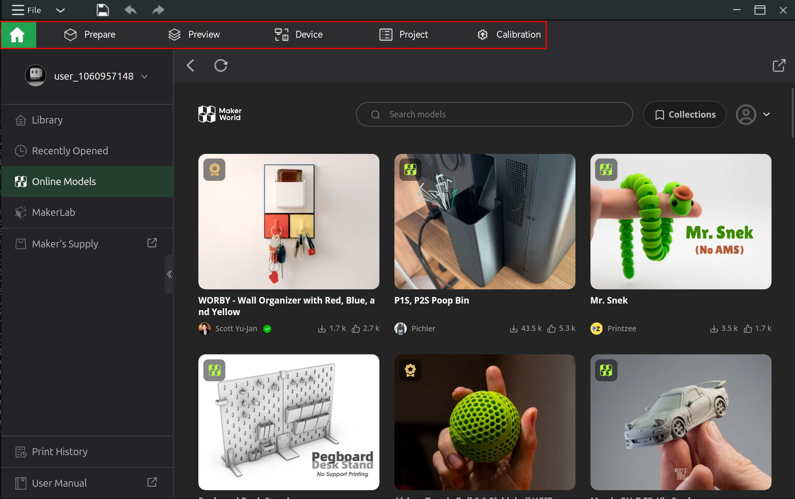 `{ref} https://bambulab.com/en/support/academy/3/course/986946695195025408/chapter/32`

## Project Persistence

`{bm} /(Bambu Studio\/Project Persistence)_TOPIC/i`

Bambu Studio saves and loads project state as a 3MF file.

* Load project: In the main menu, navigate to **File** → **Open Project...**.
* Save project: In the main menu, navigate to **File** → **Save Project** (or **Save Project as...**).

Alternatively, Bambu Studio's Home screen integrates MakerWorld. MakerWorld is an online repository of printable projects, openable as if opening a local project. `{ref} https://bambulab.com/en/support/academy/3/course/986946695195025408/chapter/33`

## 3D Viewport

`{bm} /(Bambu Studio\/3D Viewport)_TOPIC/i`

Bambu Studio has a 3D viewport on both the Prepare screen and the Preview screen.

Bambu Studio's Prepare screen is for transforming models for print (e.g., orientation, scale, position, and color) as well as configuring print settings (e.g., layer height and infill density).

Prepare viewport controls:

| Action                     | Shortcut                                                                                                        |
|----------------------------|-----------------------------------------------------------------------------------------------------------------|
| Rotate camera              | 🖰 Left-drag<br>(ensure no object is selected)                                                                   |
| Pan camera                 | 🖰 Right-drag                                                                                                    |
| Zoom camera                | 🖰 Scroll wheel                                                                                                  |
| Select object              | 🖰 Left-click object                                                                                             |
| Select additional object   | Ctrl + 🖰 Left-click object                                                                                      |
| Select multiple objects    | Shift + 🖰 Right-drag green selection rectangle over objects                                                     |
| Deselect objects           | 🖰 Left-click area without object                                                                                |
| Select all objects         | Ctrl + A                                                                                                        |
| Move selected objects 10mm | Arrow key (←, ↑, →, or ↓)<br>(ensure object is selected)<br>(movement occurs relative to camera's view)         |
| Move selected objects 1mm  | Shift + Arrow key (←, ↑, →, or ↓)<br>(ensure object is selected)<br>(movement occurs relative to camera's view) |
| Undo                       | Ctrl + Z                                                                                                        |
| Redo                       | Ctrl + Y                                                                                                        |

Bambu Studio's Preview screen is for exploring slices_SET. Each screen is partitioned into a 3D viewport and a left side-bar.

Preview viewport controls:

| Action                     | Shortcut                                                                                                        |
|----------------------------|-----------------------------------------------------------------------------------------------------------------|
| Move vertical slider       | ↑ or ↓                                                                                                          |
| Move horizontal slider     | ← or →                                                                                                          |
| Toggle single layer view   | L                                                                                                               |
| Pan camera                 | 🖰 Right-drag                                                                                                    |
| Zoom camera                | 🖰 Scroll wheel                                                                                                  |
| Select multiple objects    | Shift + 🖰 Right-drag green selection rectangle over objects                                                     |
| Select additional object   | Ctrl + 🖰 Left-click object                                                                                      |
| Select all objects         | Ctrl + A                                                                                                        |
| Move selected objects 10mm | Arrow key (←, ↑, →, or ↓)<br>(ensure object is selected)<br>(movement occurs relative to camera's view)         |
| Move selected objects 1mm  | Shift + Arrow key (←, ↑, →, or ↓)<br>(ensure object is selected)<br>(movement occurs relative to camera's view) |
| Undo                       | Ctrl + Z                                                                                                        |
| Redo                       | Ctrl + Y                                                                                                        |

To the right of the 3D viewport is a sidebar on the left-hand side.

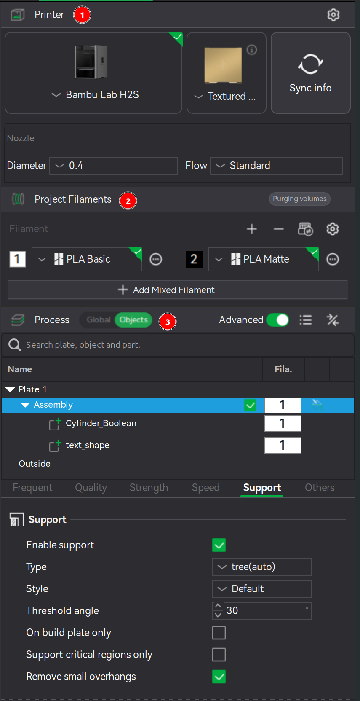

The sidebar contains a ...

* **Printer** section that controls which printer to use and its configuration (e.g., build plate and nozzle).
* **Project Filaments** section that controls the filaments are available to the project. For example, a model within the project can be painted such that different areas of the model use different filaments, but those filaments have to be made available to the project first via this section.
* **Process** section that controls the hierarchy of entities within the project (e.g., models may be grouped together, referred to as an assembly). Each entity has properties to it that can be modified (e.g., parameters that control how the model prints).

## Project Filaments

`{bm} /(Bambu Studio\/Project Filaments)_TOPIC/i`

```{prereq}
Bambu Studio/3D Viewport
```

Bambu Studio has a section for defining which filaments are available to a project. The Project Filaments section is in the sidebar of the Prepare screen and the Preview screen.

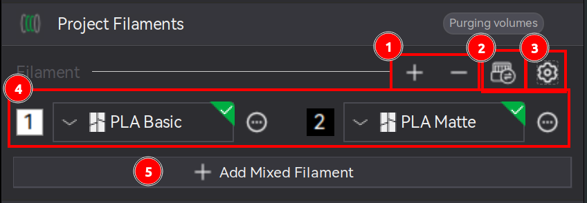

Each filament is assigned an ID (e.g., 1, 2, ...). Objects and layers within the 3D viewport, rather than being assigned an exact filament, are instead assigned one of these IDs. The filament assigned to the ID number can be swapped to a different filament via the dropdown next to the ID, thereby automatically updating any areas of an object layer making use of that ID.

* To add a filament to the list of available filaments, use the plus button.
* To remove a filament from the list of available filament, either use the minus button or click on the ellipsis next to the filament dropdown and select **Delete**.
* To remove a filament and reassign its usages to another ID, click the ellipsis next to one of the filaments, navigate to **Merge with**, and select the ID to merge with.
* To synchronize the available filaments with those loaded into the attached AMS 2 Pro / AMS HT units, use the button immediately to the right to the minus button.
* To configure the list of filaments available for adding, use the cog button.

At the bottom is an **Add Mixed Filament** button. Mixed filaments is a mix of existing filaments printed in interleaves layers to achieve a new color via half-toning (e.g., alternating between 1 layer black and 1 layer white gives the impression that the printed object is gray). Mixed filaments are not recommended on the H2S because it's a single nozzle printer - excessive swapping between filaments causes a lot of waste. `{ref} https://www.youtube.com/watch?v=ZsgJz0qk4eE` `{ref} https://wiki.bambulab.com/en/software/bambu-studio/release/release-note-2-5-3`

```{note}
Mixed filaments don't have the desired effected on top/bottom surfaces because those are single layers and only one color is printed per layer? They work best on near vertical walls. It may be possible to rotate the object such that top/bottom surfaces are reduced, but it'll likely require introducing supports_BO.
```

```{seealso}
Bambu Studio/Model Painting_TOPIC
Bambu Studio/Model Rotation_TOPIC
```

## Print Parameters

`{bm} /(Bambu Studio\/Print Parameters)_TOPIC/i`

```{prereq}
Bambu Studio/3D Viewport
Bambu Studio/Project Filaments
```

Bambu Studio has a section for defining how models and model groupings (assemblies) are printed. The Process section is in the sidebar of the Prepare screen and the Preview screen.

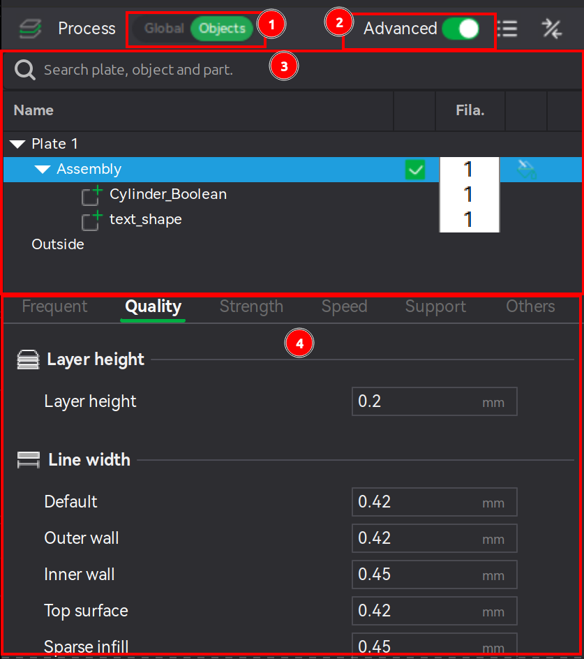

The Process section can change scope using a toggle (section 1). The scope can either be global, or it can target a specific set of objects (e.g., a model, an assembly, or some combination of models/assemblies). If not scoped globally, an object hierarchy will be displayed directly below the toggle (section 3). The selections in the object hierarchy will reflect those in the 3D viewport and vice versa.

Below the object hierarchy are a hierarchy of parameters that control printing:

* **Quality** tab organizes fidelity parameters (e.g., layer height and how to treat seams).
* **Strength** tab organizes solidity/firmness parameters (e.g., infill style/percentage and wall !!thickness!!).
* **Speed** tab organizes print speed (e.g., how fast toolhead moves when printing overhangs).
* **!!Support!!** tab organizes support_BO parameters (e.g., minimum angle for which supports_BO are required).
* **Others** tab organizes parameters that don't fit in one of the other tabs.
* **Frequent** tab caches parameters that have recently been changed.

A full accounting of parameters is beyond the scope of this section. Individual parameters will be referenced / explained in subsequent sections as needed.

`{ref} https://bambulab.com/en/support/academy/3/course/986946695195025408/chapter/35`

## Model Importing

`{bm} /(Bambu Studio\/Model Importing)_TOPIC/i`

```{prereq}
Bambu Studio/3D Viewport_TOPIC
```

Import 3D models into the project either via ...

* the main menu: **File** → **Import** → **Import 3MF/STL/STEP/SVG/OBJ/AMF...**.
* the Prepare screen's toolbar's import button (button 1, keyboard shortcut Ctrl+I).
  
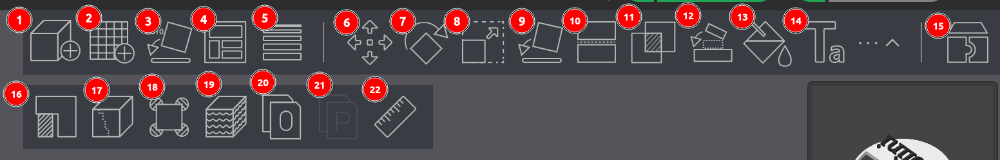

The file formats !!supported!! by the import function span both graphics formats (e.g., OBJ) and manufacturing formats (e.g., STL).

```{note}
Bambu Studio can export the project's 3D models under **File** → **Export**.
```

```{note}
A complete accounting of file formats isn't appropriate here. Just note that, if you importing SVGs, SVGs have no height_LAYER. Once an SVG is imported, Bambu Studio gives it a tiny height_LAYER and then you can scale it to make it taller.
```

Alternatively, Bambu Studio's Home screen integrates MakerWorld. MakerWorld is an online repository of printable projects. MakerWorld projects can't be imported directly into the current Bambu Studio project. However, it is possible to open a MakerWorld project, save it as a 3MF file (or export as some other file format), and import that file into an existing project. `{ref} https://bambulab.com/en/support/academy/3/course/986946695195025408/chapter/33`

## Model Placement

`{bm} /(Bambu Studio\/Model Placement)_TOPIC/i`

```{prereq}
Bambu Studio/3D Viewport_TOPIC
```

In the Prepare screen's 3D viewport, models can be moved by either ...

* selecting models, then left-clicking them and dragging.

* using the auto-arrange tool in Prepare screen's toolbar (button 4, keyboard shortcut A), which will arrange all models regardless of which are selected.

   `{ref} https://bambulab.com/en/support/academy/3/course/986946695195025408/chapter/33`

* selecting models, then hitting arrow keys for 10mm movement. `{ref} https://wiki.bambulab.com/en/software/bambu-studio/3d-scene-operations`

* selecting models, then hitting Shift + arrow keys for 1mm movement. `{ref} https://wiki.bambulab.com/en/software/bambu-studio/3d-scene-operations`

* selecting models, then using the move tool in the Prepare screen's toolbar (button 6, keyboard shortcut M), which will present both movement axis arms that can be left-click drag and a pop-up with coordinates and common alignment and distribution options.

  

  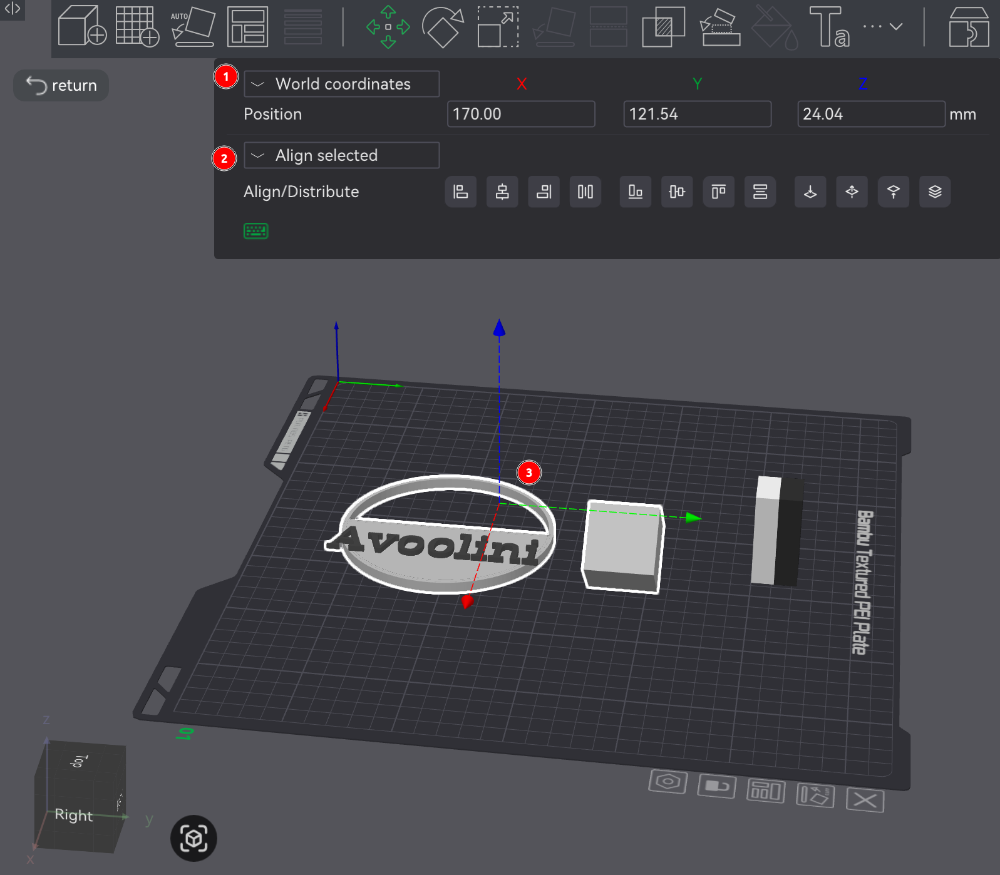

  The screenshot above has the following sections:

  1. Object coordinates: Controls and reflects the object's position. As the position fields are updated, the drop-down defines the anchor point from which the movement occurs:

     * **World Coordinates** anchors from the front-left of the build plate.
     * **Object Coordinates** anchors from the object's current position (it offsets the object).

  2. Distribution and alignment: Organizes the positions of a set of objects relative to each other and the build plate. The drop-down defines whether the distribution/alignment happens against ...
  
     * the selected objects, via **Align selected**.
     * the entire build plate, **Align plate**.

  3. Movement axis arms: Sets object's position via dragging arms. `{ref} https://wiki.bambulab.com/en/bambu-studio/skills/move`

```{note}
Models typically can't be lifted off the build plate without first merging. See Bambu Studio/Model Combining_TOPIC.
```

## Model Rotation

`{bm} /(Bambu Studio\/Model Rotation)_TOPIC/i`

```{prereq}
Bambu Studio/3D Viewport_TOPIC
```

In the Prepare screen's 3D viewport, selected models can be manually rotated by using the rotation tool in Prepare screen's toolbar (button 7, keyboard shortcut R), which will present rotational axis circles that can be left-click dragged and a pop-up with angles.


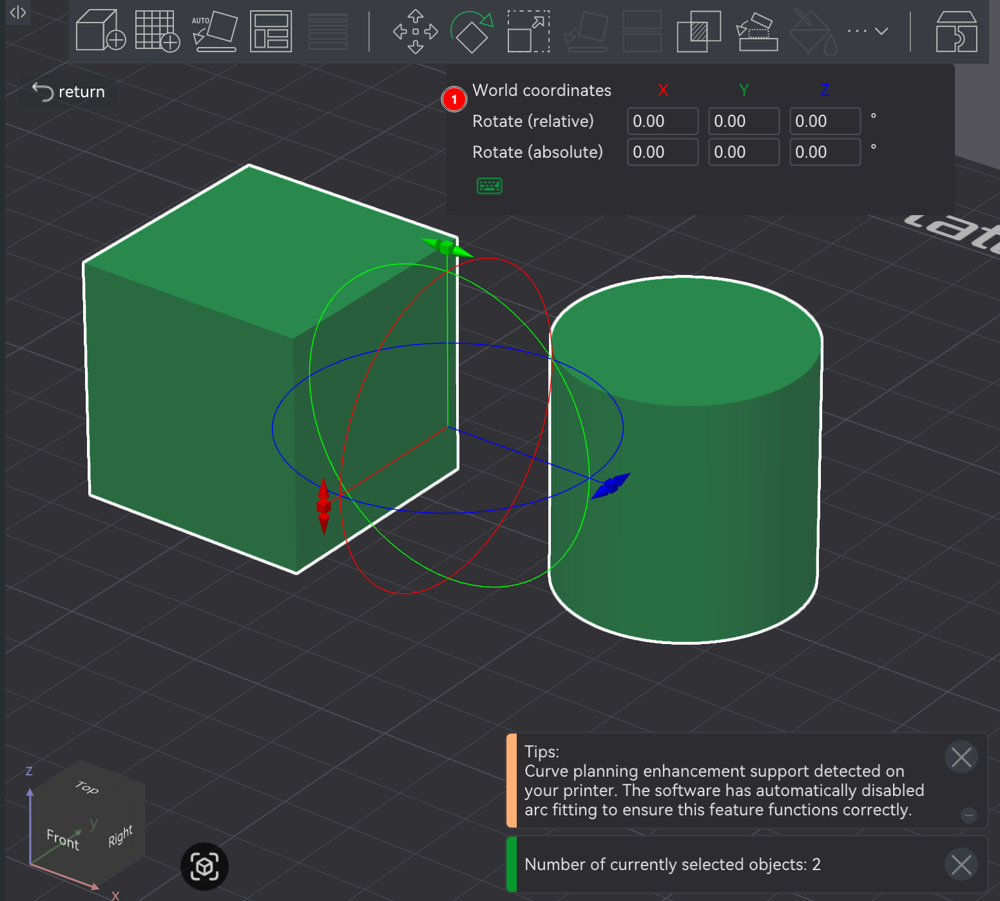

* **Rotate (relative)** offsets the existing rotation.
* **Rotate (absolute)** sets the rotation relative to the build plate.

Alternatively, a model may be rotated via ...

* the auto-orient tool in the Prepare screen's toolbar (button 3) automatically attempts to rotate in a suitable way for printing.
* the lay on face tool in the Prepare screen's toolbar (button 9, keyboard shortcut F) allows you to select a face on which to lay the model down on the build plate. `{ref} https://wiki.bambulab.com/en/software/bambu-studio/auto-orientation` `{ref} https://wiki.bambulab.com/en/software/bambu-studio/lay-on-face` `{ref} https://www.youtube.com/watch?v=ES9Fic__Y64`

## Model Scale

`{bm} /(Bambu Studio\/Model Scale)_TOPIC/i`

```{prereq}
Bambu Studio/3D Viewport_TOPIC
```

In the Prepare screen's 3D viewport, selected models can be manually scaled by using the scale tool in Prepare screen's toolbar (button 8, keyboard shortcut S), which will present scale axis points that can be left-click dragged and a pop-up with scaling parameters.


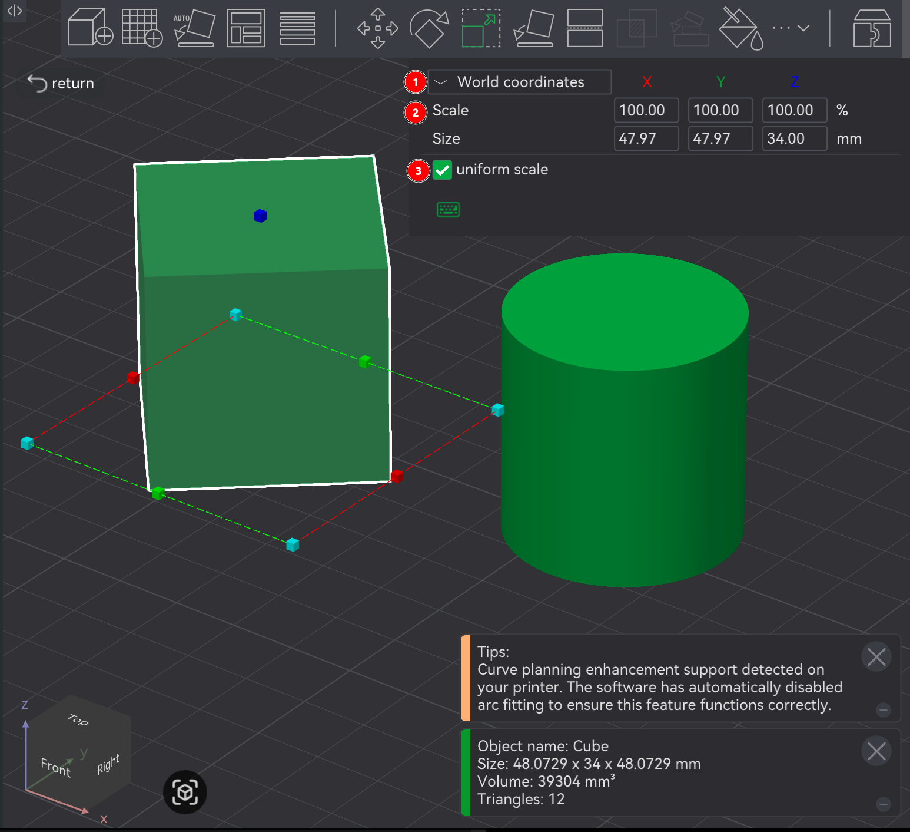

The screenshot above has the following sections:

1. **Coordinates** - ?

2. **Scale** - Percentage scaled vs original size (X, Y, and Z).

   **Size** - Absolute size on an axis (X, Y, and Z).

3. **uniform scale**: If clicked, other axis will maintain proportions by automatically scaling to !!based!! on a single axis that was scaled. `{ref} https://www.youtube.com/watch?v=ES9Fic__Y64`

```{note}
I couldn't figure out what the Coordinates dropdown actually does?
```

## Model Combining

`{bm} /(Bambu Studio\/Model Combining)_TOPIC/i`

```{prereq}
Bambu Studio/Model Placement_TOPIC
Bambu Studio/3D Viewport_TOPIC
```

In certain cases, two models may need to combine into one for printing, such that they print as a single object vs two separate objects.

In the Prepare screen's 3D viewport, select two or more models, then right-click to open the context menu and select **Merge**. Merged models are placed them under a single assembly.

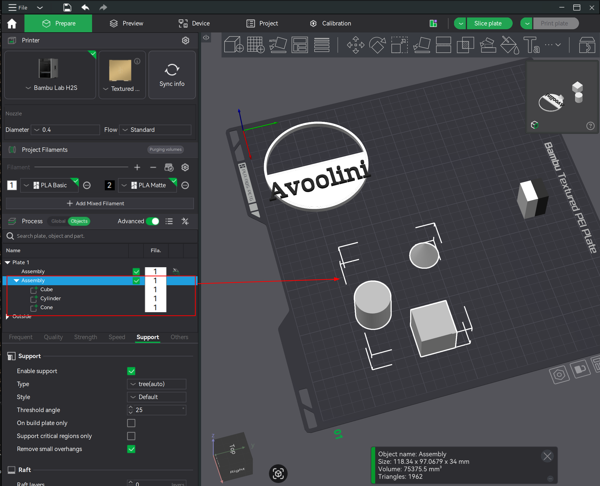

Once models are within a single assembly, they can be manually moved into each other and / or levitated off the build plate using the move tool (Prepare screen's toolbar button 6, keyboard shortcut M). If models aren't merged but occupy the same space, slicing will print them as if they're distinct. That is, if two models occupy the same space, the outer shell / wall of both objects will be drawn inside each other.

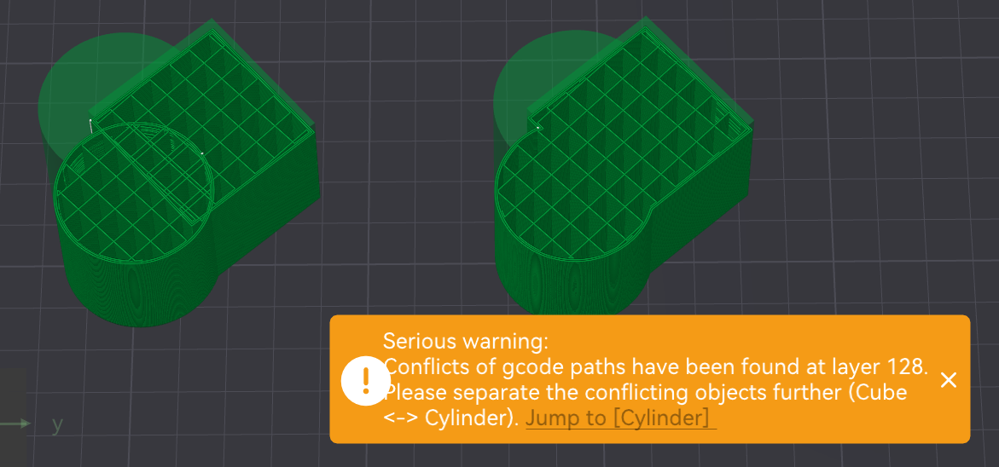

```{note}
Doing a mesh boolean union also fixed this outer wall drawing problem.
```

```{seealso}
Bambu Studio/Model Set Operations_TOPIC
```


```{note}
You can push models into each other without putting them under the same assembly, but it'll complain during slicing.
```

Alternatively, two models can be repositioned and reoriented such that they touch each other using the assembly tool (Prepare screen's toolbar button 12, keyboard shortcut Y). The assembly tool opens a open a pop-up used to target how and where the models touch.

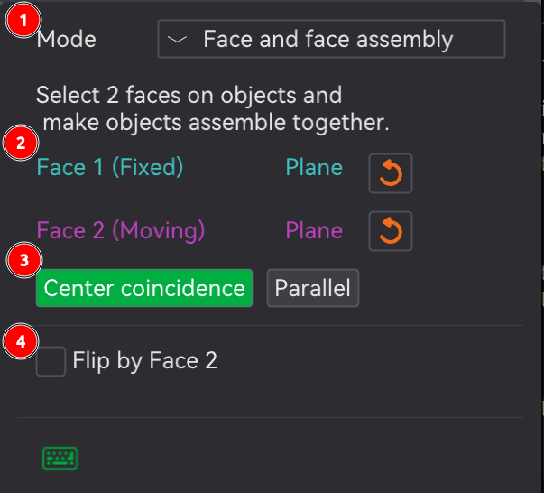

The assembly tool has two **Mode**: options

* **Point and Point Assembly**: Touches models on specific points (e.g., vertex).

  Click on a point on the first model and click on point on the second model. The first point should highlight as cyan while the second fact should highlight as purple, and sections 2 and 3 of the screenshot should update to indicate that a selection's been made. From there, XYZ coordinate fields should show up in the dialog. Set those fields to 0 to bring the points together.

* **Face and Face Assembly**: Touches models on specific faces.

  Click on a face of the first model and click on a face of the second model. The first face should highlight as cyan while the second fact should highlight as purple, and sections 2 and 3 of the screenshot should update to indicate that a selection's been made. From there, the ...

  * **Parallel** button will make reorient the models so the selected faces are parallel.
  * **Center coincidence** button will bring the selected faces together.
  * **Flip by Face 2** checkbox will flip second model such that the face's normal vector goes in the opposite direction.

`{ref} https://wiki.bambulab.com/en/software/bambu-studio/assemble` `{ref} https://wiki.bambulab.com/en/software/bambu-studio/stacking-objects`

```{note}
Technically, merging into an assembly isn't required to use the assembly tool in the toolbar. But, if the intent is to stack the models on top of each other such that one of them has a face off the build plate, it won't work (both models will be forced back down to touch the build plate). 
```

```{note}
The mesh boolean tool (button 11, keyboard shortcut B) can be used to merge the parts of an assembly back into a single model. The mesh boolean tool takes multiple models (e.g., parts of an assembly or multiple high-level models) and performs a boolean operation on them (e.g., union, intersect, subtraction). So, to combine an assembly to a single model, use the union option.
```

```{seealso}
Bambu Studio/Model Set Operations_TOPIC
```

## Model Painting

`{bm} /(Bambu Studio\/Model Painting)_TOPIC/i`

```{prereq}
Bambu Studio/3D Viewport_TOPIC
Bambu Studio/Project Filaments_TOPIC
```

In the Prepare screen's 3D viewport, selected models can be painted by using the paint tool in Prepare screen's toolbar (button 13, keyboard shortcut N), which will present a pop-up with scaling parameters / controls.


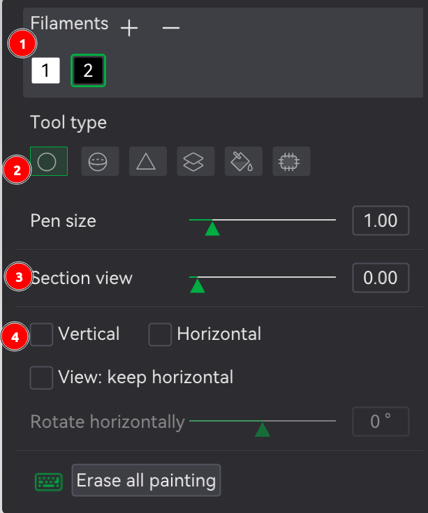

```{note}
Ensure more than 1 filament is included in the project via the **Project Filaments** section in the Prepare screen's left side-bar. Otherwise it'll be impossible to paint anything as there'll just be 1 color.
```

* **Filament** is the filament type to paint with.
* **Tool** is the painting tool to use when painting. Regardless of the tool, paint is always applied using the left mouse button.

The remaining fields change !!based!! on which painting tool is used. When the paint tool is ...

* **circle** and **sphere** use a circle and sphere respectively to paint on faces. Circle applies paint to intersecting areas of faces inside the circle, while sphere applies paint to the intersecting areas of faces inside the sphere (flat vs volume). Other than that, the two painting tools are essentially the same.

  The option ...

  * **Pen size** controls how large the circle is.
  * **Section view** temporarily cuts the model, exposing the interior and allowing painting of areas that may be obstructed. Note that the cut happens on the camera's viewing plane (e.g., if viewing from the front the front plane is used to cut, or if viewing from the top then the top view is used to cut).
  * **Vertical** will only allow painting to happen in a straight line vertically. Note that vertical means vertical on the camera's viewing plane.
  * **Horizontal** will only allow painting to happen in a straight line horizontally. Note that horizontal means horizontal on the camera's viewing plane.
  * **View: Keep horizontal** reorients the camera so that build plate is horizontal. A secondary slider **Rotate horizontally** rotates the camera around the object horizontally.

* **triangle**, paints the entirety of triangles that make up faces.

  The option ...

  * **Section view** is exactly the same circle/sphere's version of the option.

* **!!height!! range**, paints the entirety of a layer range.

  The option ...

  * **!!Height!! range** controls how many layers to paint at once.
  * **Section view** is exactly the same circle's version of the option.

* **fill**, paints everything connected !!based!! on a connection criteria.

  The option ...

  * **Connected same color** specifies that painting must continue to propagate outwards from the starting point until it reaches a color that's different than that of the starting point's original color.
  * **Edge detection** specifies that painting must continue until it hits an angle greater than the specified threshold in **Smart fill angle**.
  * **Section view** is exactly the same circle's version of the option.

* **gap fill**, fills in small gaps !!based!! on the color of neighboring faces. This is used to clean up edges that the **fill** tool couldn't reach into. Unlike the other tools above, this tool doesn't use the mouse. Instead, the **Apply** button is used to apply gap filling to the entire model.

  ```{note}
  There's a **Gap area** slider here but I don't know definitively what it does and the documentation doesn't state it either.
  ```

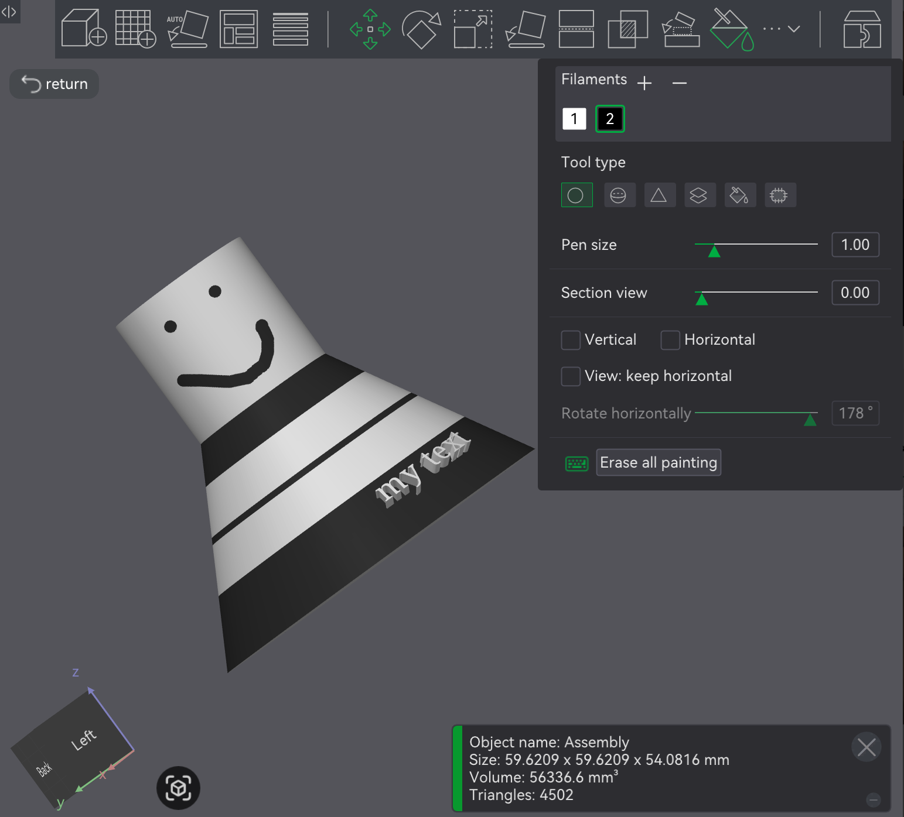

`{ref} https://wiki.bambulab.com/en/software/bambu-studio/color-painting-tool`

## Model Supports

`{bm} /(Bambu Studio\/Model Supports)_TOPIC/i`

```{prereq}
Bambu Studio/3D Viewport_TOPIC
```

Areas of a model that are overhangs may require supports_BO. Supports_BO are temporary additions added under these parts to help keep them stable during printing (e.g., prevent sagging). Supports_BO easily snap off once the print completes.

To have Bambu Studio automatically generate supports_BO, the option must be explicitly enabled. In the Prepare screen's side-panel, navigate to the **!!Support!!** tab and turn on **!!Enable support!!** the **!!Support!!** subsection. Supports_BO will only be visible in the Preview screen (the screen responsible for showing slices_SET), not this screen (Prepare screen).

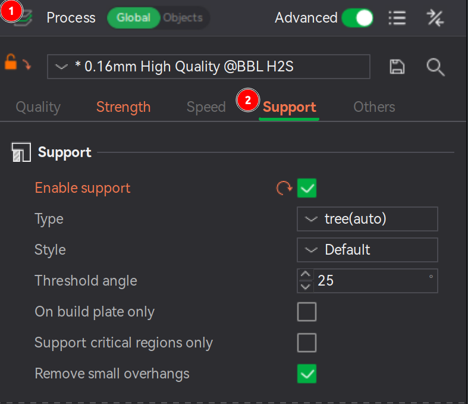 

`{ref} https://bambulab.com/en/support/academy/10/course/1031276649528733696/chapter/214` `{ref} https://bambulab.com/en/support/academy/3/course/986946695195025408/chapter/33` `{ref} https://wiki.bambulab.com/en/software/bambu-studio/support`

```{note}
What features qualify as a "critical region"? The [documentation](https://wiki.bambulab.com/en/software/bambu-studio/support) goes into further details: Cantilevers and sharp tails.

No sense going over that information here.
```

```{note}
The [documentation](https://wiki.bambulab.com/en/software/bambu-studio/support) goes over advanced controls near the second half of the page. It might be too much detail to cover here.
```

### Type

`{bm} /(Bambu Studio\/Model Supports\/Type)_TOPIC/i`

```{prereq}
Bambu Studio/Print Parameters_TOPIC
```

Supports_BO come in two types: **Normal** and **Tree**.

 

Each type comes in either **auto** mode or **manual** mode. When the mode is ...

* **auto**, supports_BO are automatically generated !!based!! on the support_BO parameters (e.g., threshold angle) and the user can choose to include / exclude areas (e.g., via support_BO painting).

  The areas targeted for supports_BO are defined by ...

  * **Threshold angle** - Generate supports_BO only for overhanging slopes below this angle (acute angle between build plate plane and face of overhang).
  * **Support critical regions only** - Generate supports_BO only for those areas deemed critical.
  * **Remove small overhangs** - Ignore small overhangs, as they're assumed to not need supports_BO.

* **manual**, the user is expected to specify areas of the model that need supports_BO (e.g., via support_BO painting).

```{seealso}
Bambu Studio/Model Supports/Painting_TOPIC
```

The support's_BO type defines the geometry generated:

* **Normal** support_BO: Overhangs are projected directly down to the heatbed.

  Normal supports_BO come in two styles:

  * **Grid** / **Default**: Support_BO areas are normalized to expanded rectangles.
  * **Snug**: Support_BO areas are tightly aligned to overhanging areas. is tightly aligned to overhanging areas.

* **Tree** support_BO: Overhangs are sampled to a set of circles propagating down to the heatbed, weaving around obstacles and possibly enlarging to provide better strength.

  Tree supports_BO come in many styles:

  * **Tree Slim:** Aggressively merge circles from different branches as it gets closer to the heatbed, resulting in less filament being used.
  * **Tree Strong:** Aggressively avoid merging circles from different branches as it gets closer to the heatbed, resulting in stronger supports_BO.
  * **Tree Organic:** Aggressively merge circles from different branches as it gets closer to the heatbed, resulting in less filament being used (similar end result as slim, but different approach).
  * **Tree Hybrid:** Combination of tree and normal supports_BO, selected !!based!! on criteria.
  * **Default:** Blends **Tree Organic** and **Tree Hybrid**, depending on model features.

```{note}
See source to figure out how default switches between and organic. Out of scope for this document.
```

Normal supports_BO work best with large planar overhangs, giving better surface quality vs tree supports_BO. Tree supports_BO often give better results with complex models where overhang are small and / ot not planar. When in doubt, use tree supports_BO in hybrid style, because it will explicitly check for planar overhangs and those areas to generate normal supports_BO while the remaining areas get tree supports_BO. `{ref} https://wiki.bambulab.com/en/software/bambu-studio/support`

### Painting

`{bm} /(Bambu Studio\/Model Supports\/Painting)_TOPIC/i`

```{prereq}
Bambu Studio/Model Supports/Type_TOPIC
Bambu Studio/Model Painting_TOPIC
```

In certain cases, it's beneficial to manually specify which areas of the model to explicitly support_BO and unsupport_BO. Two mechanisms exist for this: painting and blockers/enforcers.

* **Painting**: In the Prepare screen's 3D viewport, select a model and click !!support!! painting in the Prepare screen's toolbar (button 16, keyboard shortcut L). Bambu Studio will open a pop-up and present an isolated view of the model where areas can be painted as include vs exclude.

  
  
  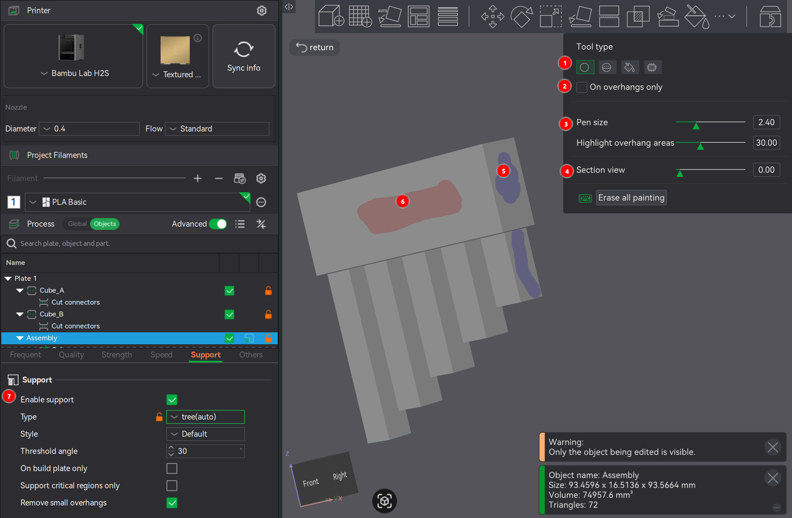
  
  To paint, select a **Tool type**. The tools configuration options will show up directly underneath. Regardless of the tool type, ...
  
  * using the **left** mouse button on the model to paint where supports_BO should exist (e.g., section 5 of the example screenshot above, painted blue).
  * using the **right** mouse button on the model to paint where supports_BO shouldn't exist (e.g., section 6 of the example screenshot above, painted red).
  
  Chances are the viewport will need to move around during the painting process. To move the viewport rather than paint (e.g., move camera, rotate camera, and zoom camera), use the same viewport controls as normal *with the exception that any mouse button presses required are not on the model to be painted*.
  
  **On overhangs only** defines whether surfaces available for painting are limited to only those deemed as needing supports_BO (e.g., as defined by **Threshold angle**).

* **Blockers/Enforcers**: By adding a secondary model and intersecting with the supported_BO model, supports_BO are explicitly added / removed from the intersecting portion. Right-click a model to get its context menu, and either navigate to **Support blocker** or **Support enforcer**. Regardless of which you choose, the same model options will display for both (e.g., load a custom model, preloaded cube, or preloaded cylinder,). If ...

  * **Support_BO blocker** is chosen, the new model loads tinted red, and can be moved over areas of the supported_BO model that need to have supports_BO excluded. A support_BO blocker removes supports_BO from the intersected area.
  * **Support_BO enforcer** is chosen, the new model loads tinted blue, and can be moved over areas of the supported_BO model that need to have supports_BO included. A support_BO enforcer adds supports_BO to the intersected area.

  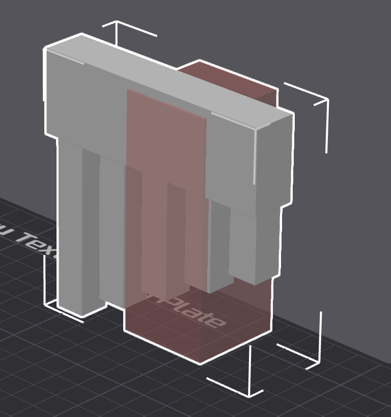

Where supports_BO generate depends on type of supports_BO being added (e.g. tree supports_BO). If the type is set to ...
  
* an **auto** type, any automatically generated supports_BO that would have ended up at red areas will be missing / any blue areas will have supports_BO if ones weren't automatically generated. In the sliced example below, the high-up right face has supports_BO running to it because that area was explicitly painted to include supports_BO. The high-up front face was explicitly painted to exclude supports_BO, but the automatic support_BO generation wouldn't have generated supports_BO for that area anyways (it would have been free of supports_BO regardless).
  
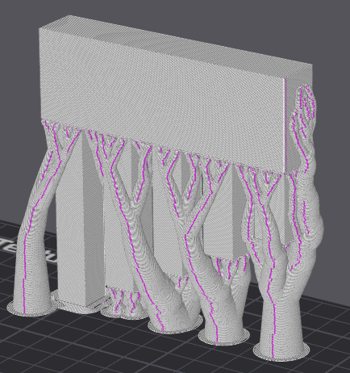
  
* a **manual** type, only blue areas will have supports_BO generated. In the sliced example below, the high-up right face has supports_BO running to it because that area was explicitly painted to include supports_BO. The high-up front face was explicitly painted to exclude supports_BO, but given that this is a manual type there wouldn't be supports_BO for that area anyways (it would have been free of supports_BO regardless).
  
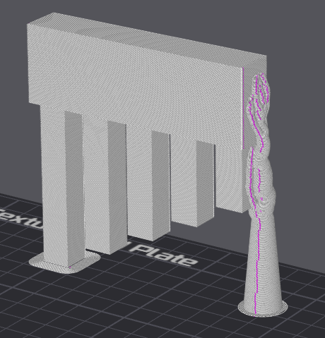
  
`{ref} https://wiki.bambulab.com/en/software/bambu-studio/support-painting`

```{note}
The example above isn't a valid print, but for some reason Bambu Studio isn't showing a warning / error popup slicing.
```

### Interface

`{bm} /(Bambu Studio\/Model Supports\/Interface)_TOPIC/i`

```{prereq}
Bambu Studio/Print Parameters_TOPIC
```

Interface_BO layers are support_BO layers that touch the model, while the rest of the support_BO body is referred to as the base_BO. Bambu studio allows targeting specific materials for a support's_BO base_BO and interface_BO. In the Prepare screen's side-panel, navigate to the **!!Support!!** tab and to the **!!Filament for Supports!!** subsection. The ...

* **!!Support!!/!!raft!! !!base!!** controls the filament to use for the support's_BO base_BO.
* **!!Support!!/!!raft!! !!interface!!** controls the filament to use for the support's_BO interface_BO.

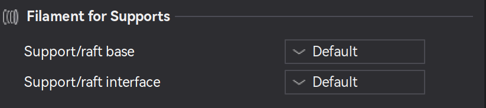

`{ref} https://wiki.bambulab.com/en/software/bambu-studio/support`

### Raft

`{bm} /(Bambu Studio\/Model Supports\/Raft)_TOPIC/i`

```{prereq}
Bambu Studio/Model Supports/Interface_TOPIC
Bambu Studio/Print Parameters_TOPIC
```

A raft_BO is a type of support_BO that elevates a model off the build plate. Rafts are commonly used for materials that are prone to warping (e.g., ABS).

In the Prepare screen's side-panel, navigate to the **!!Support!!** tab and to the **!!Raft!!** subsection. The ...

* **!!Raft!! layers** controls the number of support_BO layers used to lift the model off the build plate.
* **!!Raft!! contact Z distance** controls the gap between the top of the raft_BO and the model.

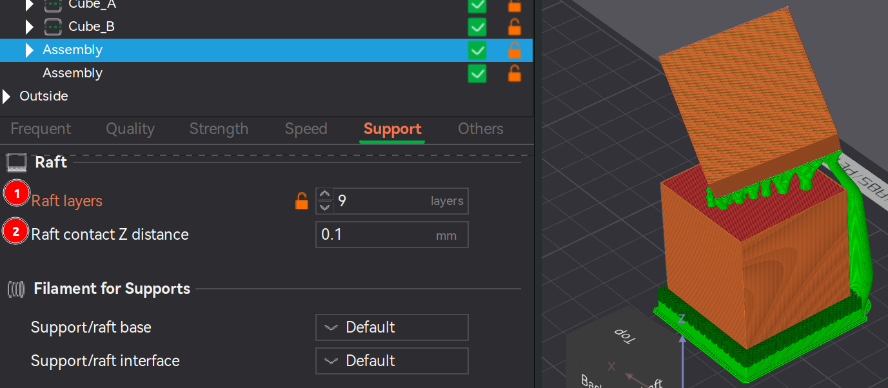

`{ref} https://wiki.bambulab.com/en/software/bambu-studio/support`

```{note}
The source mentions a couple of other parameters that are not present: First layer density and first layer expansion. I'm not sure if these have been removed, but I don't see them in my version of Bambu Studio.

Raft_BO contact Z distance description inside Bambu Studio mentions that the parameter is ignored for "soluble interfaces_BO". I'm not sure what that term means. Also, I don't know why there'd need to be a gap between the raft_BO and the model? How would it stop the model from sagging if there's a gap?
```

## Model Cutting

`{bm} /(Bambu Studio\/Model Cutting)_TOPIC/i`

```{prereq}
Bambu Studio/Model Combining_TOPIC
Bambu Studio/Model Supports_TOPIC
Bambu Studio/3D Viewport_TOPIC
```

In certain cases, a model may either need to be cut (e.g., oversized for printer) or may benefit from being cut (e.g., minimize need for supports_BO or make it easier to sand/paint/finish). Cut pieces are typically assembled and fused back together after printing (e.g., glue, pen welding, joinery).

In the Prepare screen's 3D viewport, a model can be cut by selecting it and clicking cut tool in the Prepare screen's toolbar (button 10, keyboard shortcut C), which will open a pop-up, present a cutting plane in the 3D viewport, and present cutting plane rotational axis and offset !!height!! controls in the 3D viewport.


The cutting tool has two modes, chosen using the **Mode** dropdown at the top of the pop-up:

* **Planar** cuts the model using a flat plane.

  2. **Rotation** reflects the 3D viewport's cutting plane rotational control.
  
  3. **Movement** / **!!Height!!** reflects the 3D viewport's cutting plane !!height!! control.
  
  4. **Add connectors** manipulates the cut final pieces to add joinery mechanisms, making them easier to reassemble.

     If clicked, the cut plane is highlighted in the viewport and a pop-up of joinery options is presented (e.g., plug, snap, and thread) along with parameters for each options (e.g., depth and size). Set the joinery options as desired and click on the cut plane to place the joinery. Most joinery options are self-explanatory.

     ```{note}
     For the Plug type, if you're confused about frustum vs prizm: Frustum tapers the sides as it goes up (similar to a pyramid) while the prizm option keeps the sides straight.
     ```

     To flip between the two sides of the cut plane, click the **Flip cut plane** button.

     To force the joinery in the middle of the cut plane, sleect **Middle of geometry** before clicking.

  5. **After cut** defines how the cut pieces are treated:

     * **Object A/B**: Model is split into two, where the checkboxes define how each piece gets oriented on the build plate.
     * **Cut to parts**: Model is split into an assembly of 2 parts, where parts remain in place.

  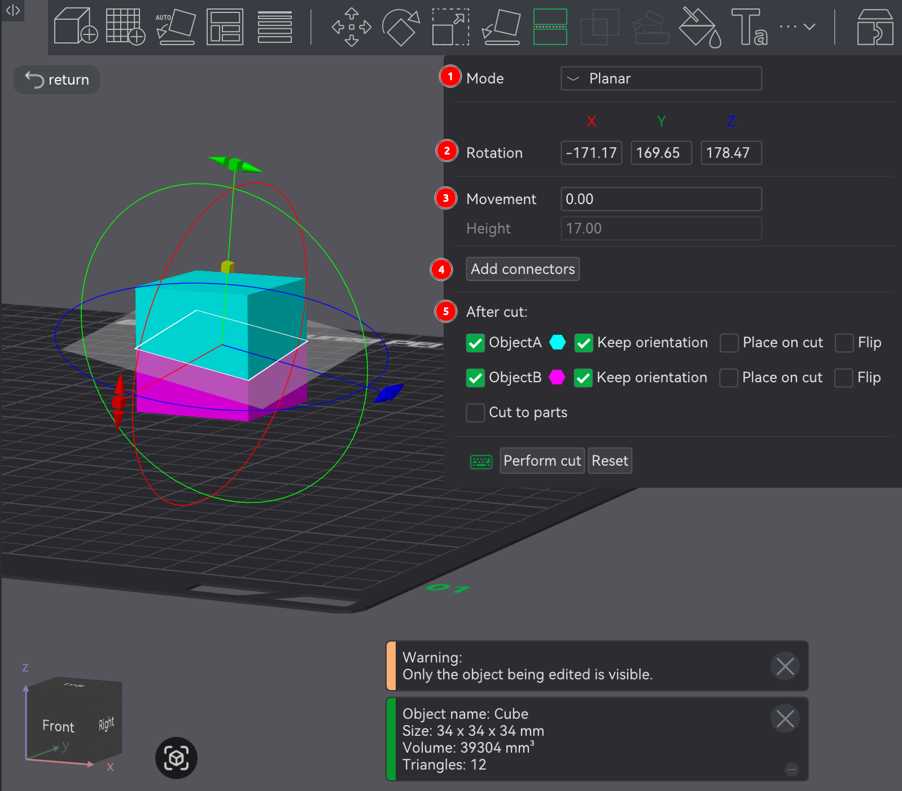

* **Dovetail** cuts the model using a a flat plane with a flared-out trapezoid indent, referred to as a dovetail. The two pieces are intended to slide into each other where the indent cutout is. 

  2. **Rotation** reflects the 3D viewport's cutting plane rotational control.
  
  3. **Movement** / **!!Height!!** reflects the 3D viewport's cutting plane !!height!! control.

  4. **Groove** manipulates the indent in the cut plane.

     Most of the options are self-explanatory. **Groove Angle** controls size asymmetry between the two sides of the indent. **Flap Angle** controls the angle at which the indent's flaps fan out.

  5. **After cut** defines how the cut pieces are treated:

     * **Object A/B**: Model is split into two, where the checkboxes define how each piece gets oriented on the build plate.
     * **Cut to parts**: Model is split into an assembly of 2 parts, where parts remain in place.

  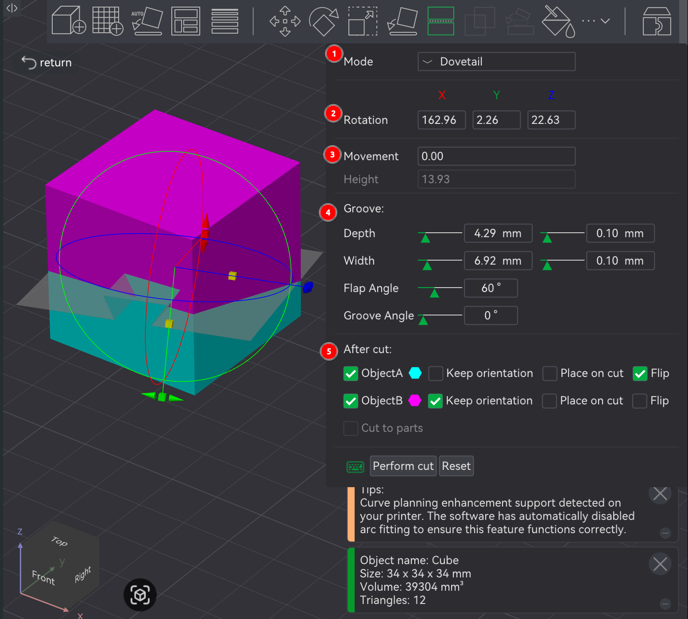

`{ref} https://bambulab.com/en/support/academy/3/course/986946695195025408/chapter/33` `{ref} https://wiki.bambulab.com/en/software/bambu-studio/cut-tool`

```{note}
The mesh boolean tool (button 11, keyboard shortcut B) can be used to merge the parts of an assembly back into a single model. The mesh boolean tool takes multiple models (e.g., parts of an assembly or multiple high-level models) and performs a boolean operation on them (e.g., union, intersect, subtraction). So, to combine an assembly to a single model, use the union option.
```

## Model Set Operations

`{bm} /(Bambu Studio\/Model Set Operations)_TOPIC/i`

```{prereq}
Bambu Studio/Model Combining_TOPIC
Bambu Studio/3D Viewport_TOPIC
```

In the Prepare screen's 3D viewport, selected models can have set operations applied (e.g., union, intersection, and subtraction) by using the mesh boolean tool in Prepare screen's toolbar (button 11, keyboard shortcut B), which present a pop-up with which which operations to apply.


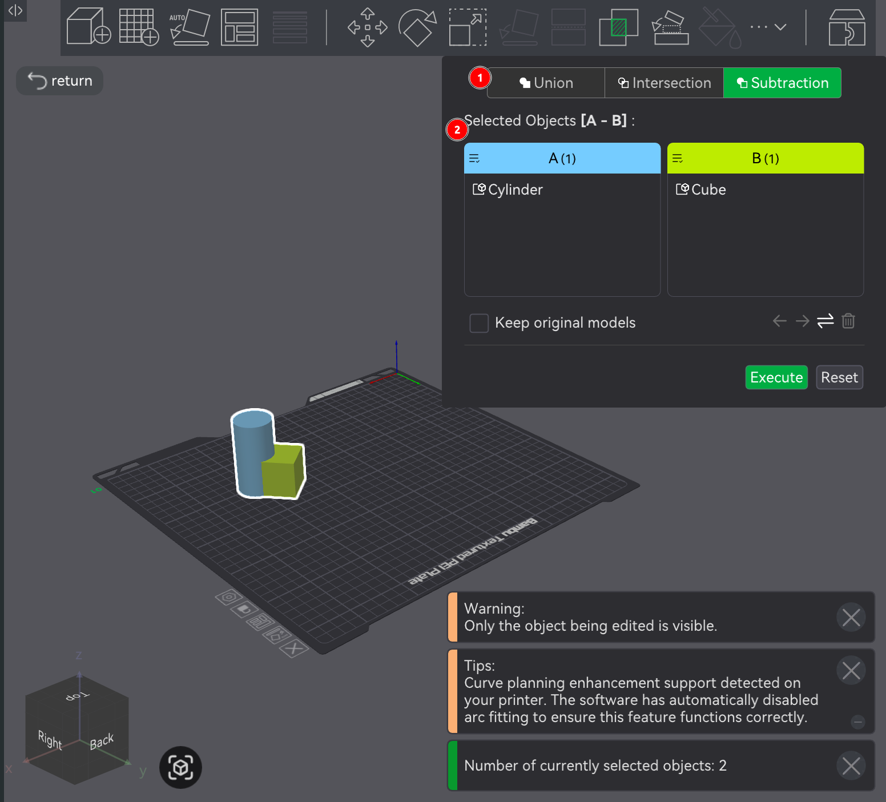

The mesh boolean tool has 3 possible operations:

* **Union**: Creates a new model comprised of all individual models together.
* **Intersection**: Creates a new model comprised of only the overlapping parts between all models.
* **Subtraction**: Removes a chunk from a model, using other models as the cut-out stencil.

Regardless of which you pick, you can specific which of the selected models to apply the operation to. The resulting operation creates a single model with the chosen set operation applied (*not an assembly of models*, but a single model).

Given that the mesh boolean tool creates a single new model, the resulting single model typically doesn't encounter overlap issues during slicing. For example, if models aren't union'd but occupy the same space, slicing will print them as if they're distinct. That is, if two models occupy the same space, the outer shell / wall of both objects will be drawn inside each other.

 `{ref} https://wiki.bambulab.com/en/software/bambu-studio/mesh-boolean`

```{note}
Merging two models under the same assembly also fixed this outer wall drawing problem.
```

```{seealso}
Bambu Studio/Model Combining_TOPIC
```

## Model Text

`{bm} /(Bambu Studio\/Model Text)_TOPIC/i`

```{prereq}
Bambu Studio/3D Viewport_TOPIC
```

Text can be placed on a model, extruded from a model, indented on to a model, or placed as a standalone extruded model on its own.

To generate standalone text, in the Prepare screen's 3D viewport, click the text shape tool in the Prepare screen's toolbar (button 14, keyboard shortcut T). Text wil show up in the middle of the build plate on the 3D viewport along with a pop-up where the text and its settings (e.g., font parameters) can be changed.

All parameters in the pop-up should be self explanatory, with the exception of **Angle**. **Angle** is the rotation of the text, which reflects the rotation circle in the 3D viewport.


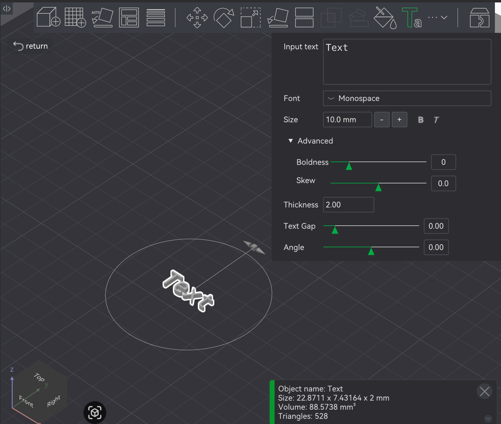

To generate text on a model, in the Prepare screen's 3D viewport, select the model and then click the text shape tool in the Prepare screen's toolbar (button 14, keyboard shortcut T). Text wil show up on the middle of the build plate on the 3D viewport along with a pop-up where the text, its settings (e.g., font parameters), and how its placed on the model can be changed.

The parameters are the same as the parameter before, except for **Mode** and **Operation**.

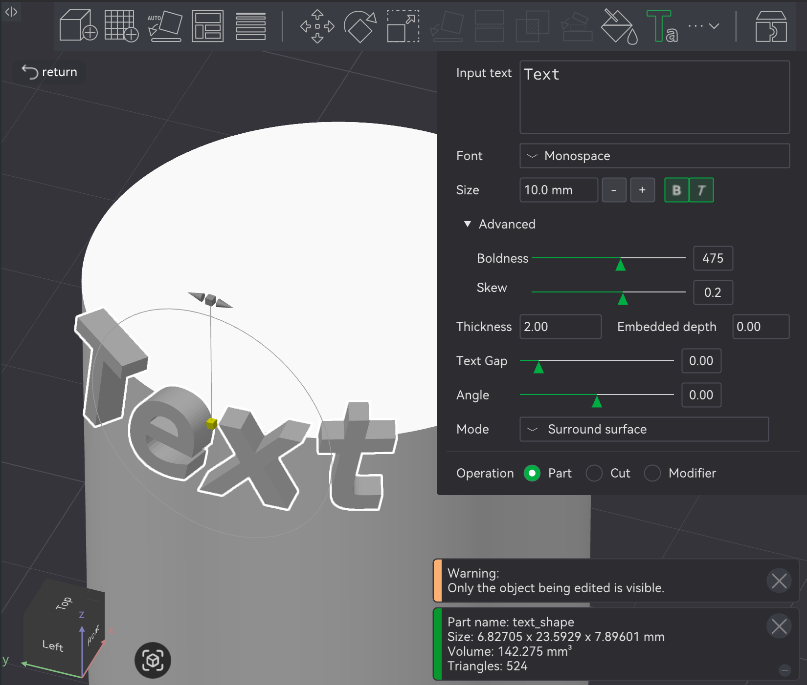

* **Mode** defines how the text interacts with the model:

  * **Surround surface** generates text that wraps the model's surface.
  * **Surround+Horizontal** generates text that wraps the model's surface, maintaining horizontal alignment (e.g., bottom of text will be equidistant to the build plate plane at all points).
  * **Surround projection by character** is similar to **Surround surface** but parts of the text that don't sit directly on the model are removed.
  * **Not surround** generates text tangent to to the face the text is positioned on (does not wrap / surround the model's surface).

  ```{note}
  At the very top of the example model below is the projection option. Note that the top of the text is cut off.
  ```
  
  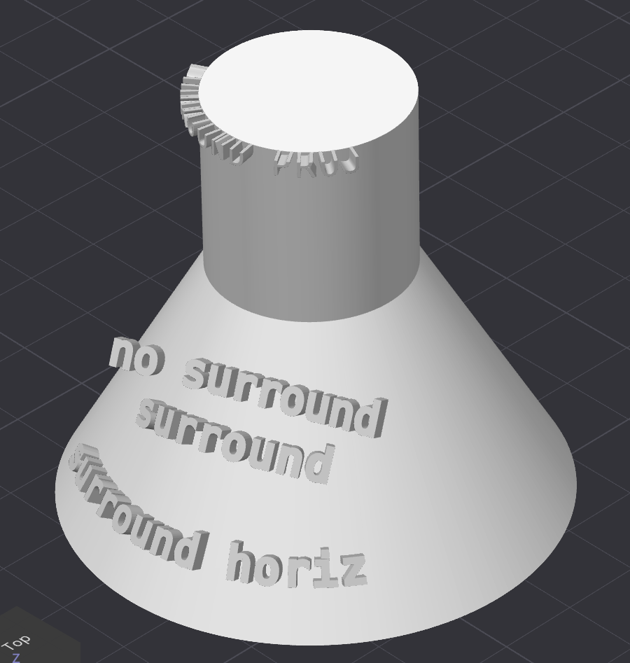

* **Operation** defines how the text is applied to the model:

  * **Part** embosses the text on the model.
  * **Cut** indents the text into the model.
  * **Modifier** doesn't change model's geometry, but modifies the printing parameters for the area of the model where the text overlaps (e.g., change color where text sits). This is typically used for creating 2D text patterns that are perfectly flush with the model's surface.

  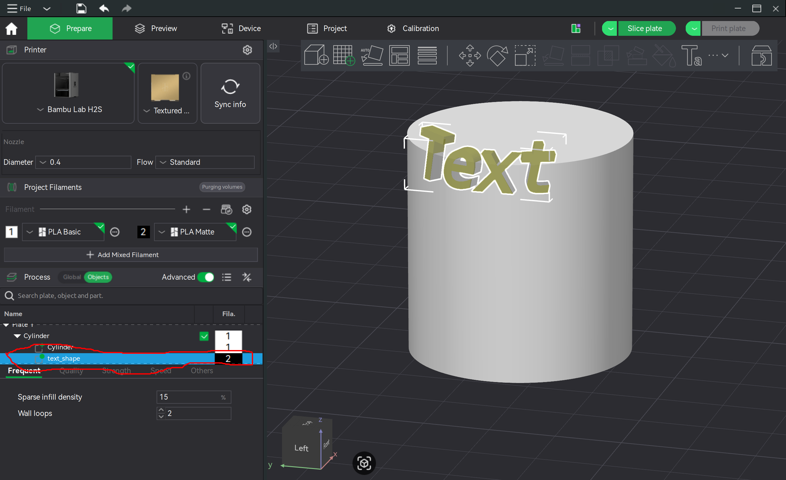

`{ref} https://wiki.bambulab.com/en/software/bambu-studio/3d-text`

## Layer Height

`{bm} /(Bambu Studio\/Layer Height)_TOPIC/i`

```{prereq}
Bambu Studio/Print Parameters_TOPIC
```

Layer height is the !!height!! of each layer in the print. The thinner the layer, the less ridges are visible as the model is printed upwards (Z axis), meaning a smoother overall appearance.

To set the layer height globally, ensure no model is selected and in the Prepare screen's side-panel navigate to the **!!Quality!!** tab and to the **!!Layer height!!** subsection:

* **Layer height** - Controls height_LAYER of each layer, except for the initial layer.
* **Initial layer height** - Controls height_LAYER of the initial layer. A thicker_LAYER initial layer may help with the print better stick to the build plate.

In addition, there are presets available for choosing common layer heights. These presets typically also set other other options, such as printing speeds.

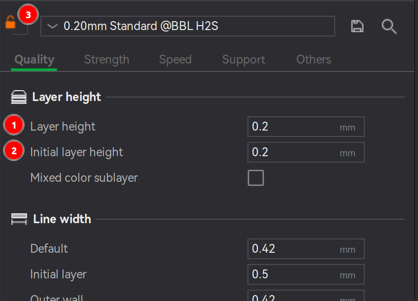

```{note}
Settings different layer heights for each object? You might need to print the objects individually or slicing will fail. In the Prepare screen's side-panel navigate to the **!!Other!!** tab, then to the **!!Special mode!!** subsection, then set **!!Print sequence!!** to "By object".
```

```{note}
There's an option here called "Mixed color sublayer" that seems to have to do with "fake color" printing where alternating real colors are banded together to generate some other color (e.g., alternating between black and white to get 50% gray). When this setting is set, it seems that the layer height is automatically cut down for coloring purposes? So if you set the layer height to 0.2mm but this option were turned on, that 0.2mm would actually be subdivided into n thinner layers? At least that's the vibe I got from https://www.reddit.com/r/BambuLab/comments/1ssuuqx/color_mixing_and_mixed_color_sublayer_wrt_layer
```

The initial layer height is recommended to be 50% of the nozzle's diameter. Subsequent layers are recommended to be between 20% to 70% of the nozzle's diameter. For example, if using the 0.4mm nozzle that comes with the H2S, the initial layer would be set to a layer height of 0.2mm and the remaining layers can be set to anywhere between 0.08mm to 0.28mm. This information is also available under the !!printer!! setting's **Extruder** section.

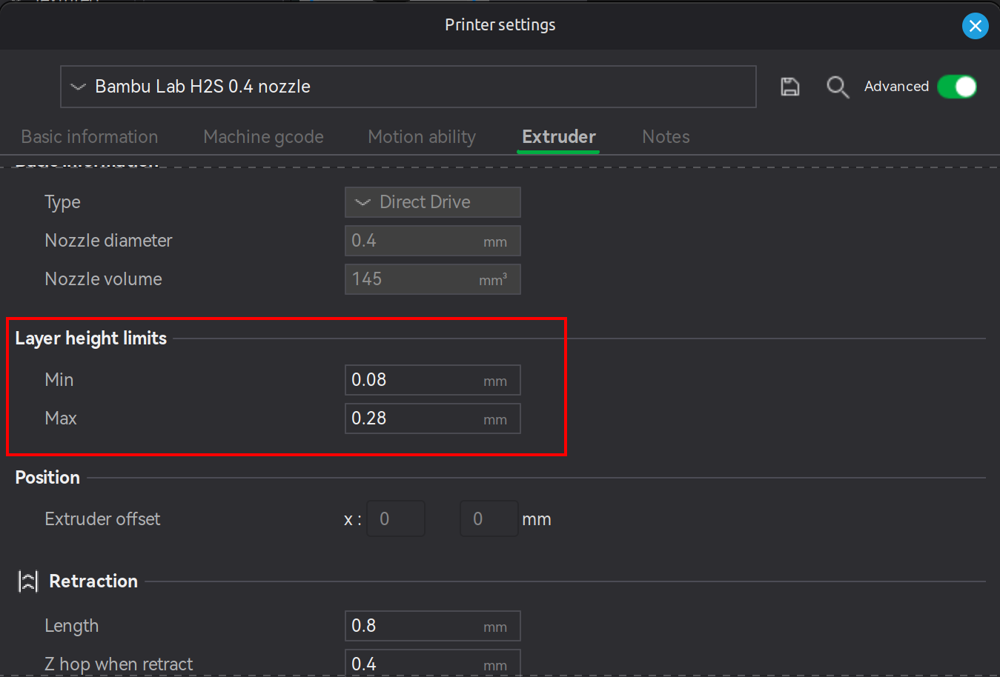

`{ref} https://wiki.bambulab.com/en/software/bambu-studio/layer-heigh` `{ref} https://bambulab.com/en/support/academy/3/course/986946695195025408/chapter/35`

## Seams

`{bm} /(Bambu Studio\/Seams)_TOPIC/i`

```{prereq}
Bambu Studio/Print Parameters_TOPIC
```

A seam is a mark that shows up when the toolhead prints an enclosed path, showing up where the start and end of the path meet. The screenshot below highlights where seams will show up on an example model once printed.

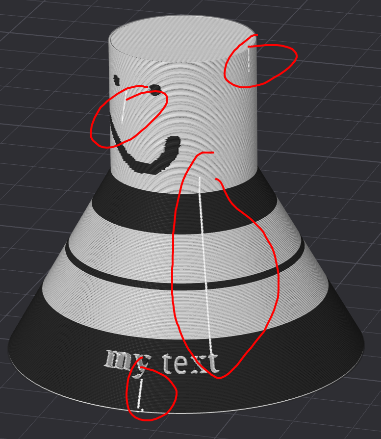

There are several ways to control the appearance of seams: Algorithmic placement (e.g., hiding seams on edges), manual placement (e.g., seam painting), and specialized printing techniques (e.g., scarf seams). The subsections below detail the common methods to mitigate seams.

### Algorithmic Seam Placement

`{bm} /(Bambu Studio\/Seams\/Algorithmic Seam Placement)_TOPIC/i`

Bambu Studio can algorithmically control the placement of seams in several ways. The easiest is through the **Quality** → **Seam** → **Seam position** parameter. The value ...

* **Nearest** positions seam on a vertex in attempt to hide it (suitable for models with sharp angles), prioritizing concave non-overhand vertex, then convex non-overhand vertex, then any non-overhang vertex, then finally overhang vertex. If no suitable vertex is available, seam is placed near the previous layer's seam.
* **Aligned** positions seam near the previous layer's seam.
* **Back** positions seam in the back, where back is defined as the back of the build plate.
* **Random** randomly distributes the seam, potentially giving the print irregular dots /scratch-like marks.

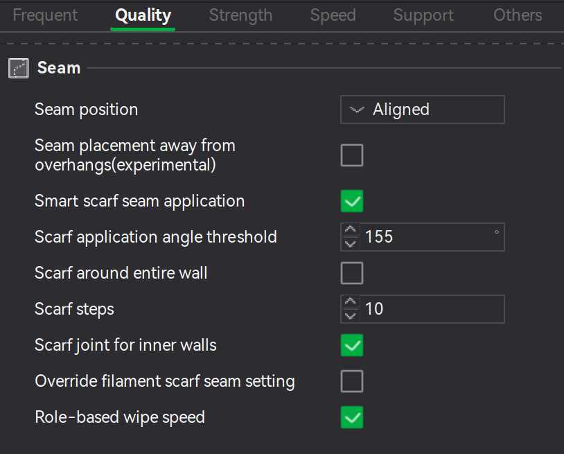

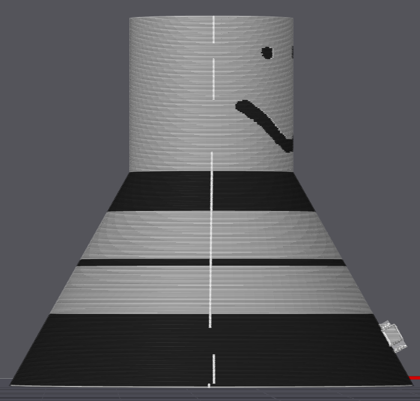 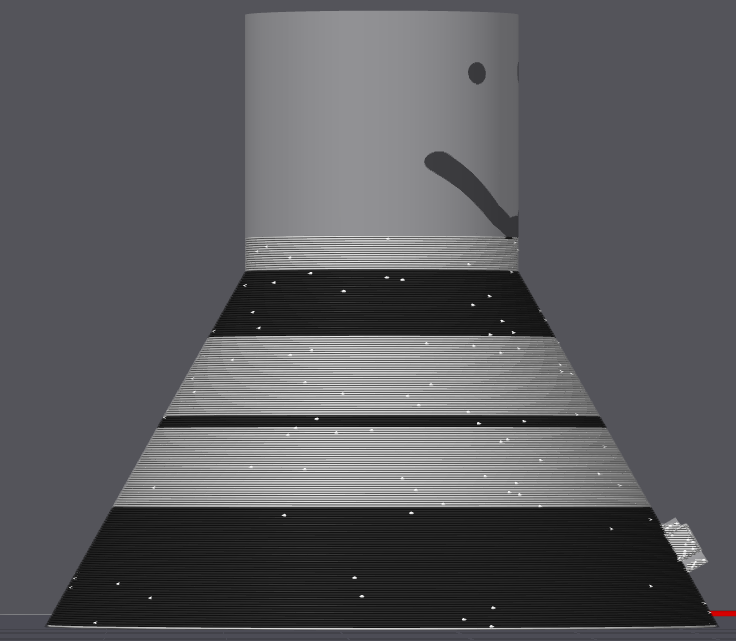 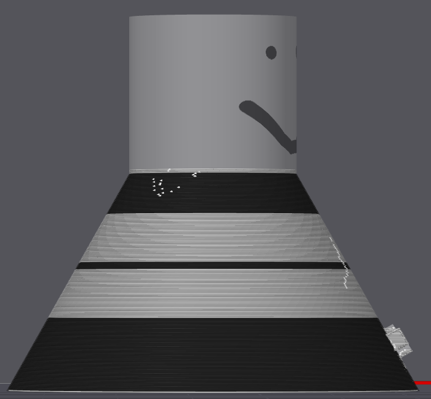

`{ref} https://bambulab.com/en/support/academy/3/course/986946695195025408/chapter/35` `{ref} https://wiki.bambulab.com/en/software/bambu-studio/Seam`

### Seam Painting

`{bm} /(Bambu Studio\/Seams\/Seam Painting)_TOPIC/i`

```{prereq}
Bambu Studio/Seams/Algorithmic Seam Placement_TOPIC
Bambu Studio/Model Painting_TOPIC
```

Similar to model painting, the placement of a seam can be painted on to the model. In the Prepare screen's 3D viewport, select the model and paint a seam by using the seam paint tool in Prepare screen's toolbar (button 17, keyboard shortcut P), which will present a pop-up with scaling parameters / controls.


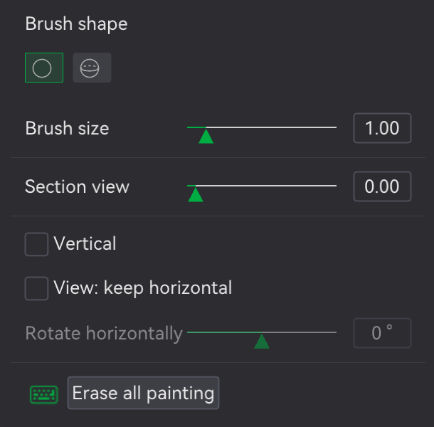

Seam painting is operationally very similar to normal model painting. Paint the area to force the seam at. During slicing. the seam should show up in the areas painted.

`{ref} https://wiki.bambulab.com/en/software/bambu-studio/Seam`

### Scarf Seams

`{bm} /(Bambu Studio\/Seams\/Scarf Seams)_TOPIC/i`

```{prereq}
Bambu Studio/Seams/Algorithmic Seam Placement_TOPIC
Bambu Studio/Seams/Seam Painting_TOPIC
```

A scarf seam is a specialized form of seam, intended to hide its appearance for objects that are round to the point where the seam can't be hidden (e.g., sphere, cylinder, or some round model that contains no natural edge for the seam to hide). At the ...

* beginning portion of the path, the amount of filament gradually increases as it lifts off (tapered).
* ending portion of the path, layer height gradually decreases as it comes to a stop (tapered).

The end result is the the start-stop region partially overlap vs a hard start-stop, blending in better.

```
-------------.  ,-----------
     end   ,' ,'
         ,' ,'
       ,' .'
     .' .'  
   .' .'   start
--'  '-------------
```

For scarf seams to be enabled, the filament being printed with must have scarf seams enabled in its filament settings: In the Prepare screen's sidebar, navigate to **Project Filaments**, then select the ellipsis for the desired filament and navigate to **Filament** → **Filament scarf seam settings**

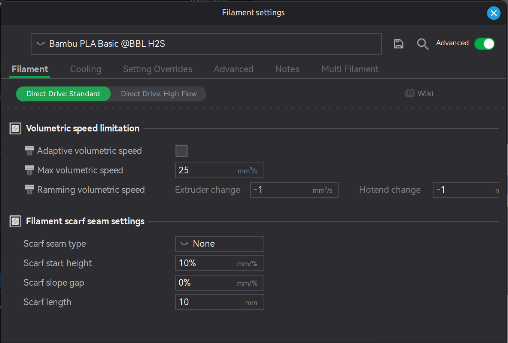

* **Scarf seam type**: Must be set to either **Contour** or **Contour and Hole** for scarf seams to be enabled.
* **Scarf start !!height!!**: Height at which the nozzle starts printing the wall, specified in mm or percentage of layer height.
* **Scarf slope gap**: Scarf seam cuts into the inner wall to accommodate excess material, represented as a percentage of the nozzle diameter multiplied by some internal constant.
* **Scarf length**: Length of the seam. Disabled if set to 0 or the option **Scarf around the entire wall** is enabled in print parameters.

````{note}
Unsure what "Contour" and "Contour and Hole" refer to? It has something to do with https://wiki.bambulab.com/en/software/bambu-studio/xy-hole-contour-compensation.

Unsure what the slope gap parameter actually does? It leaves a gap in the inner wall so the exterior wall can bleed extra material into it?

Scarf start !!height!! is the starting !!height!! that the scarf seam starts printing at, as shown in the following ASCII diagram.

```
-------------.  ,-----------
     end   ,' ,'
         ,' ,'
       ,'  '
     .'    | 
   .'      | start
--'        '------------------
```

````


In the object's parameters, ...

* when **Quality** → **Seam** → **Smart scarf seam application** is ...
  * enabled, scarf seams are applied as needed. Specifically, when the layer wall isn't part of an overhang and doesn't have any hard edges for the seam to hide in, that's when scarf seams are applied.
  * disabled,  scarf seams are applied to all areas.

  ```{note}
  Why not on overhangs? Because scarf seams are too weak for overhanging areas?
  ```

* **Quality** → **Seam** → **Scarf application angle threshold** is the angle that is considered sharp enough for seams to hide in. Angles wider than this will enable scarf seams.

* **Quality** → **Seam** → **Scarf around entire wall** makes the entire wall a scarf seam.

  ```{note}
  According to the source: Enabling this option requires caution as it may result in using a smaller extrusion amount for the entire perimeter, which may cause poor adhesion between lines and result in surface defects.
  ```

* **Quality** → **Seam** → **Scarf steps** is the number steps to print the scarf seam. That is, the toolhead prints the scarf seam as a series of incrementing steps rather than a raised slope. This value controls the number of steps.

  ```{note}
  According to the source: ..., it should be noted that some seam positions cannot be accurately divided into the set number of steps, so the actual scarf steps ≥ the set scarf steps.
  ```

* when **Quality** → **Seam** → **Seam joint for inner walls** is enabled, inner walls will also have a scarf seam.

`{ref} https://wiki.bambulab.com/en/software/bambu-studio/Seam`

## Curved Tops

`{bm} /(Bambu Studio\/Curved Tops)_TOPIC/i`

Models with a curved tops instead of flat tops (e.g., circle vs square) should set the property **Quality** → **Advanced** → **Only one wall on top surfaces** to **Not Applied**. Doing so reduces visible layer lines, resulting in a smoother finish.

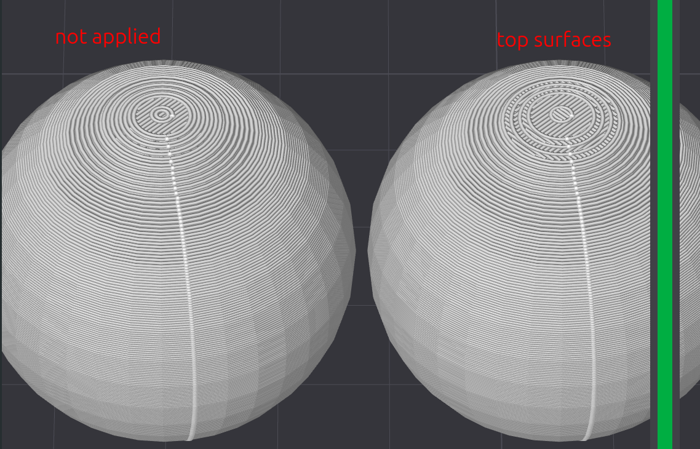

When this parameter is set to **Not Applied**, the number of walls on the top surface is the same as the number of wall loops set under **Strength** → **Walls** → **Wall loops**. Effectively, it's overwriting the parameter **Wall loops** for the top surface to be a single wall.

```{note}
There seems to also be a hidden developer property **Quality** → **Advanced** → **Top area threshold** that sets the threshold for what top surfaces use wall loops's count vs a single surface. I can't find this in my Bambu Studio. See https://wiki.bambulab.com/en/software/bambu-studio/parameter/quality-advance-settings.
```

`{ref} https://bambulab.com/en/support/academy/3/course/986946695195025408/chapter/35`  `{ref} https://wiki.bambulab.com/en/software/bambu-studio/parameter/quality-advance-settings`

## Walls

`{bm} /(Bambu Studio\/Walls)_TOPIC/i`

The number of walls printed for a model (Z axis) is set through the parameter **Strength** → **Walls** → **Wall loops**. The more walls, the stronger the print is (presumably). It's recommended that for ...

* functional models, 3 to 4 walls will enhance structural strength and durability.
* decorative models, 2 walls are sufficient to save material and improve print efficiency.

The number of solid layers for the top of the model is set through the parameter **Strength** → **Top/bottom shells** → **Top shell layers**. The thickness_LAYER of the top shell should approximately match the !!thickness!! of the walls. For example, if the !!thickness!! of 5 walls comes out to 5mm, then the number of top shell layers should approximately come out to 5mm as well.

```{note}
Prior to the top shell is the infill material. The infill material almost always has gaps, and so the that first shell layer is bridging all those gaps.
```

Similarly to the top shell layers, the number of solid layers for the bottom of the model is set through the parameter **Strength** → **Top/bottom shells** → **Bottom shell layers**. It's recommended that the bottom shell have a minimum of 4 layers to ensure a sturdy and flat foundation.

```{note}
Why shouldn't the bottom shell have the same !!thickness!! as the walls and top shell? Wouldn't that make more sense in that it's unified?
```

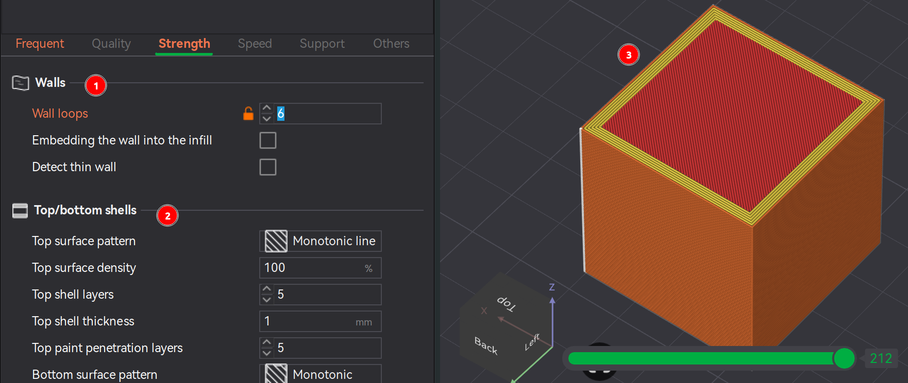

```{note}
There are the alternative parameters **!!Top shell thickness!!** / **!!Bottom shell thickness!!** that set using mm instead of number of layers. When set, the number of layers chosen is the maximum between **Top shell layers** / **Bottom shell layers** and the number of layers needed to match the !!thickness!! of **!!Top shell thickness!!** / **!!Bottom shell thickness!!**.
```

`{ref} https://bambulab.com/en/support/academy/3/course/986946695195025408/chapter/35`

## Infill

`{bm} /(Bambu Studio\/Infill)_TOPIC/i`

```{prereq}
Bambu Studio/Walls_TOPIC
```

While the exterior of a printed model are walls / surfaces, the interior area of is printed as an infill pattern. An infill patterns is a pattern where the user controls how densely the pattern is printed, where higher densities are typically associated with greater strength / greater load bearing capacity.

Infill parameters are found under **Strength** → **Sparse infill**:

* **Sparse infill density** controls the density of the infill. Infill densities of ...

  * \>= 30% are considered well suited for functional prints (load bearing).
  * ~15% are considered a good balance between print efficiency and strength.

* **Sparse infill pattern** is the infill pattern to use.
  
  | Pattern             | Target               | Details                                                                                              |
  |---------------------| ---------------------|------------------------------------------------------------------------------------------------------|
  | Concentric          | Aesthetic            | Transparent visuals; weak **horizontal strength**                                                    |
  | Rectilinear         | Speed                | Fast, low material; **low strength**                                                                 |
  | Grid                | Speed                | Fast; **material buildup at intersections → nozzle scraping/collisions**                             |
  | Line                | Strength             | Better **basic structure**                                                                           |
  | Cube                | Strength             | **Uniform X/Y/Z strength**; lightweight/insulating                                                   |
  | Triangles           | Strength             | Strong **shear resistance**; **bridging gaps → needs more top layers**, flow issues at intersections |
  | Tri-hexagon         | Strength             | Excellent **shear + tensile strength**; reduces warping                                              |
  | Gyroid              | Strength / Speed     | **All-direction !!support!!**; **long slicing time, large G-code, vibration at high speed**              |
  | Honeycomb           | Strength             | High **rigidity + impact resistance**; **more material, slower print + slicing**                     |
  | Adaptive Cubic      | Speed / Functional   | Saves material; prevents **top collapse**                                                            |
  | Aligned Rectilinear | Speed                | Efficient; **anisotropic strength**, **top surface may fall**                                        |
  | 3D Honeycomb        | Strength             | Better **interlayer bonding**; faster than honeycomb                                                 |
  | Hilbert Curve       | Aesthetic / Strength | Smooth surface, uniform stress; **slow print + slicing**                                             |
  | Archimedean Chords  | Speed / Quality      | Continuous path; avoids buildup                                                                      |
  | Octagonal Spiral    | Aesthetic            | Decorative; **weak strength**, **poor cohesion → deformation**                                       |
  | Supporting Cubic    | Strength             | Stable **multi-directional strength**                                                                |
  | Lightning           | Speed                | Minimal material; **non-structural**                                                                 |
  | Cross Hatch         | Speed                | Faster; **non-load-bearing**                                                                         |
  | Zig Zag             | Speed                | Continuous extrusion; **low strength**                                                               |
  | Cross Zag           | Structural Control   | Tunable intersections (rectilinear variant)                                                          |
  | Locked Zag          | Hybrid               | Balanced **appearance + strength**                                                                   |

  ```{note}
  List above generated by ChatGPT as a quick lookup guide.
  ```

In addition to the standard infill, it's possible to specify infill patterns for the top and bottom surfaces using the parameters **Strength** → **Top/bottom shells** → **Top surface pattern** and **Bottom surface pattern**. The patterns available are more limits than the full roster of infill patterns.

```{note}
Top/bottom surface patterns seem to only be line !!based!! infill patterns where lines don't intersect? And you can't set density? It seems to be maximum density?

What's the point of having these? I guess it has to do with the finish of the surface? I recall there was some option where you could have the heated nozzle go over the surface (without printing anything) to further smooth it out? I think it was under **Quality** → **Ironing**.
```

`{ref} https://bambulab.com/en/support/academy/3/course/986946695195025408/chapter/35` `{ref} https://wiki.bambulab.com/en/software/bambu-studio/fill-patterns`

# Terminology

* `{bm} Automatic Material System 2 Pro (AMS 2 Pro)/(AMS 2 Pro)/` `{bm} /(Automatic Material System 2 Pro)/i` - Automatic Material System 2 Pro, an extension to the H2S that manages filament(s). The AMS 2 Pro ...
  
  * enables multi-color and multi-material prints by swapping between filament spools during printing.
  * automatically switches between filament spools if a filament spool runs out during printing.
  * automatically identifies the color and type of filament spools (only for official Bambu Lab filaments, using RFID). 
  * drying filament spools (up to 65 celsius).

  The AMS 2 Pro !!supports!! 4 spools per unit, and !!supports!! chaining up to 4 AMS 2 Pro units together to !!support!! up to 16 spools per print. Additionally, the 4 chained AMS 2 Pro units may be chained up even further by 8 AMS HT units, enabling up to 24 spools per print.  `{ref} https://bambulab.com/en/support/academy/10/course/1031276070794240000/chapter/232` `{ref} https://us.store.bambulab.com/products/ams-multicolor-printing`

* `{bm} Automatic Material System High Temperature (AMS HT)/(AMS HT)/` `{bm} /(Automatic Material System High Temperature)/i` - Automatic Material System High Temperature, an extension to the H2S that manages handling engineering-grade high-temperature filaments that are sensitive to moisture (e.g., PPS and PPA). It has better a better motor, filament drying (up to 85 celsius), and better humidity control than the AMS 2 Pro. However, it only seems to !!support!! 1 spool.

  `{bm-error} Did you mean AMS 2 Pro or AMS HT?/(AMS\s?Pro\s?2|AMS\s?2|AMS\s?Pro|\bAMS\b)/i`

  `{bm-error} Did you mean AMS 2 Pro or AMS HT?/(Automatic Material System\s?Pro\s?2|Automatic Material System\s?2|Automatic Material System\s?Pro|Automatic Material System)/i`

* `{bm} external spool holder` - A spool holder attached to the H2S's left face exterior, near the rear. The external spool holder is intended to be used when either an AMS 2 Pro isn't available or the filament material isn't !!supported!! by the AMS 2 Pro.

  

* `{bm} toolhead` - An assembly consisting of ...

  * a PTFE connector
  * a filament sensor.
  * an extruder.
  * a hotend with nozzle.
  * a part cooling fan.
  * a filament cutter.
  
  Filament enters the nozzle through the PTFE connector located at the top, where the extruder motor grabs it and pushes it into the hotend located at the bottom. The hotend's nozzle poking out of the enclosure is sandwiched between cooling ducts, where the part cooling fan directs air to rapidly cool filament as its printed.

  

  The bottom bottom right-side of the toolhead has a toolhead camera attached. The toolhead moves left-right on the X-Axis linear rail. The X-Axis linear rail itself moves forward and backward on the Y-Axis. These rails are how the toolhead positions itself for printing. `{ref} https://bambulab.com/en/support/academy/10/course/1031276070794240000/chapter/227`

  ```{note}
  It sounds like the camera and the part cooling fan (and the railing) are not a part of the toolhead itself? These are attachments.
  ```

  ```{note}
  The H2D's toolhead is different from the H2S's toolhead? It has two PTFE connectors and two nozzles?
  ```

* `{bm} filament sensor` - A sensor detecting the presence of filament in the toolhead, located where the filament is fed into the toolhead. The filament sensor prevents printing without filament, allowing prints to resume once new filament is available. `{ref} https://bambulab.com/en/support/academy/10/course/1031276649528733696/chapter/214`

* `{bm} toolhead camera` - A camera attached to the toolhead, used for calibrating motion accuracy and build plate recognition. `{ref} https://bambulab.com/en/support/academy/10/course/1031276070794240000/chapter/227`

* `{bm} extruder` - A motor within the toolhead that grips and moves filament between the PTFE connector to the hotend.

  An extruder is part of a toolhead. `{ref} https://bambulab.com/en/support/academy/10/course/1031276070794240000/chapter/227`

* `{bm} hotend/(hotend|nozzle|silicone sock|heat sink|cold end|silicone sock|heating assembly)/i` - An assembly responsible for melting filament for deposit on to a print. A hotend includes a ...

  * coldend - keeps filament at lower temperature.
  * nozzle - heated to melt the filament and deposit it onto a print.
  
  A silicone sock fits over nozzle, insulating it from the cooling from the part cooling fan.

  ```{note}
  In the documentation, the coldend is also referred to as a heat sink.
  ```

  

  On the H2S, the hotend is part of the toolhead. A heating assembly within the toolhead clamps on to and heats the hotend, and is responsible for heating and temperature regulation of the nozzle.
  
  Unlike the H2S, some other printers have a different structure: The coldend is separated from the hotend as its own distinct piece and the hotend comes with heating, temperature regulation, and other hardware pieces builtin. On the H2S, the combination of coldend and nozzle are referred to as the hotend. `{ref} https://bambulab.com/en/support/academy/10/course/1031276070794240000/chapter/227`

  `{bm-error} Did you mean silicone sock (e at end)?/(silicon sock)/i`
  `{bm-error} Did you mean heat sink (space between)?/(heatsink)/i`
  `{bm-error} Did you mean hotend (no space)?/(hot\s+end)/i`
  `{bm-error} Did you mean coldend (no space)?/(cold\s+end)/i`

* `{bm} part cooling fan` - A fan located at the !!base!! of the toolhead. The part cooling fan directs are to the cooling ducts that sandwich the tip of the hotend's nozzle, rapidly cooling printed filament. `{ref} https://bambulab.com/en/support/academy/10/course/1031276070794240000/chapter/227`

* `{bm} CoreXY/(CoreXY|A motor|B motor|A stepper motor|B stepper motor|X[\- ]axis linear rail|Y[\- ]axis linear rod|X[\- ]axis rail|Y[\- ]axis rod)/` - H2S's system for moving the toolhead front-back and left-right. The system is comprised of a pair of synchronized motors within the H2S responsible for moving the toolhead on the X and Y axes: A motor and B motor. The motors are located at the rear inside face of the H2S, near the top. The B motor is on the left and the A motor is on the top.

  The motors connect through the X-axis linear rail and the Y-axis linear rods via a pair of belts. The ...
  
  * X-axis linear rail is responsible for left-right toolhead movement.
  * Y-axis linear rods is responsible for forward-backward toolhead movement (it moves the X-axis linear rail forward-backward).
  
  Both motors work in tandem to coordinate movement in both directions (e.g., one motor isn't solely responsible on an axis).
  
   `{ref} https://bambulab.com/en/support/academy/10/course/1031276070794240000/chapter/227`

  ```{note}
  There's also Z-axis threaded and linear rods, responsible for moving the heatbed up-down. It's unclear if these rods are part of the CoreXY movement system. Their description is included under the CoreXY system but it feels separate as it's not controlling the toolhead's position but the heatbed's position. `{ref} https://bambulab.com/en/support/academy/10/course/1031276070794240000/chapter/227`
  ```

  `{bm-error} Did you mean CoreXY (no space or dash, properly capitalized)?/(Core[ \-]XY|Corexy|coreXY)/`
  `{bm-error} Did you mean X-axis linear rail?/(X[\- ]axis linear rod|X[\- ]axis rod)/`
  `{bm-error} Did you mean Y-axis linear rod?/(Y[\- ]axis linear rail|Y[\- ]axis rail)/`

* `{bm} Z-axis threaded and linear rods/(Z-axis threaded and linear rod|Z-axis linear rod|Z-axis threaded rod|Z-axis rod)/` - Two threaded rods located at the front inside face of the H2S, on the left and right. These rods move the heatbed up-down.

   `{ref} https://bambulab.com/en/support/academy/10/course/1031276070794240000/chapter/227`

* `{bm} heatbed` - A heat controlled surface within the H2S that magnetically secures the build plate. The heatbed moves up-down using the Z-axis linear rods, allowing the toolhead to print one layer after the other onto the attached build plate.

  Depending on the material being printed, the heatbed's controlled heating may be required or otherwise beneficial for print quality (e.g., adhesion and / or reducing printing artifacts).

   `{ref} https://bambulab.com/en/support/academy/10/course/1031276070794240000/chapter/227`

  `{bm-error} Did you mean heatbed (no space)?/(heat bed)/i`

* `{bm} status light` - A light bar just below the heatbed, facing forward and running side-to-side. The light bar changes color to show the operating status of the H2S:

  * White slow pulse (or off): Idle.
  * Orange scroll: Print job preparing.
  * White left-to-right fill: Print job progress.
  * Red double flash: Print error.
  * Green solid: Print successful. `{ref} https://bambulab.com/en/support/academy/10/course/1031276070794240000/chapter/227`

* `{bm} build plate` - A plate that sits on the heatbed and serves as the print surface. There are different types of build plates, each with different properties targeting different filament materials. `{ref} https://bambulab.com/en/support/academy/10/course/1031276070794240000/chapter/227` Build plates are intended to be consumable, meaning that in comparison to other major components they're intended to be replaced much sooner. `{ref} https://us.store.bambulab.com/products/bambu-textured-pei-plate` `{ref} https://us.store.bambulab.com/products/bambu-smooth-pei-plate` `{ref} https://us.store.bambulab.com/products/bambu-engineering-plate` `{ref} https://us.store.bambulab.com/products/bambu-cool-plate-supertack-pro`

  ```{note}
  To avoid contamination, do not touch the build plate other than the front edge. `{ref} https://bambulab.com/en/support/academy/10/course/1031276070794240000/chapter/227`

  Most build plates are cleaned similarly to washing a dish: Warm water, dish washing detergent, and either paper towel to dry or let it air dry.
  ```

* `{bm} Cool Plate SuperTack Pro` - A build plate designed to reduce PLA and PETG printing failures through better adhesion at lower heatbed temperatures. Unlike the Textured PEI Plate which also primarily targets PLA and PETG, there is no self-release mechanism for prints. `{ref} https://us.store.bambulab.com/products/bambu-cool-plate-supertack-pro`

  ```{note}
  There's the SuperTack and the SuperTack Pro. The above table only covers the SuperTack Pro.
  ```

* `{bm} Textured PEI Plate` - A build plate with a slightly rough surface, primarily targeting PLA. The texturing makes enables better first layer adhesion and allows for the print to self-release (some filament materials only). `{ref} https://bambulab.com/en/support/academy/10/course/1031276649528733696/chapter/220` `{ref} https://us.store.bambulab.com/products/bambu-textured-pei-plate`


* `{bm} Smooth PEI Plate` - A build plate with a smooth surface, compatible with various filament types (especially PLA). Unlike the Texture PEI Plate, the smoothness of this plate contributes Z-axis precision. `{ref} https://us.store.bambulab.com/products/bambu-smooth-pei-plate`

* `{bm} Engineering Plate` - A build plate compatible with all filament materials but requires a layer of glue before printing. Although compatible with all filament materials, the Engineering Plate targets high temperature filament materials. `{ref} https://us.store.bambulab.com/products/bambu-engineering-plate`

* `{bm} vision encoder` - A calibration tool used to compensate for natural and wear related variances, allowing for high accuracy prints that can tightly assembly. The vision encoder is a slab that sits on the heatbed, shaped similarly to a build plate. However, it's only used for calibration and not meant to be printed on (replace with build plate once calibrated). `{ref} https://us.store.bambulab.com/products/vision-encoder?id=601545719002021889`

* `{bm} chamber` - The enclosure of the H2S, encapsulating everything within (e.g., toolhead, motors, heatbed, CoreXY system, and fans).

* `{bm} chamber heat circulation fan/(chamber heat circulation fan|heat circulation fan)/i` - A heater located at the rear face of the H2S, used to increase the chamber's temperature. The increased temperature is required for some filament materials which warp or have other issues if cooled too rapidly.

   `{ref} https://bambulab.com/en/support/academy/10/course/1031276070794240000/chapter/227` `{ref} https://wiki.bambulab.com/en/h2s/manual/screen-operation#h-1-air-management`

* `{bm} chamber exhaust fan/(chamber exhaust fan filter|chamber exhaust fan|chamber filter|exhaust fan filter|exhaust fan)/i` - An exhaust fan located at the rear face of the H2S. The chamber exhaust fan may have a filter in front of it, referred to as the chamber filter, that partially filters air as it's exhausted out of the chamber.

   `{ref} https://bambulab.com/en/support/academy/10/course/1031276070794240000/chapter/227`

* `{bm} chamber intake vent/(chamber intake vent|intake vent)/i` - A flap opening located at the top face of the H2S, bordering the front. The chamber intake vent opens to allow outside air in when the exhaust fan is running.  `{ref} https://bambulab.com/en/support/academy/10/course/1031276070794240000/chapter/227`

   `{ref} https://bambulab.com/en/support/academy/10/course/1031276070794240000/chapter/227`

* `{bm} filament buffer` - A filament tension-control / slack-management device at the rear face of the H2S, sitting between filament passing from outside the chamber to the extruder. The filament buffer is an orange slider that slides forward and backward, storing a small buffer of filament as it slides forward.

  When an AMS 2 Pro unit is connected, the unit's motor pushes filament into the filament buffer thereby storing a small buffer of filament. When the extruder consumes the filament in the filament buffer, the filament buffer slides backward. A sensor in the filament buffer feeds back to the AMS 2 Pro unit's motor to control filament feeding speed.

  When the external spool holder is used, the buffer acts as an entanglement sensor. When the spool is tangled, the tension of the extruder pulling is detected by the filament buffer thereby cause the print to pause and the user to be prompted.

   `{ref} https://bambulab.com/en/support/academy/10/course/1031276070794240000/chapter/227`

  ```{note}
  If printing TPU, unless it's specifically branded as !!TPU for AMS!!, bypass the filament buffer via the TPU inlet. `{ref} https://bambulab.com/en/support/academy/10/course/1031276070794240000/chapter/`
  ```

* `{bm} TPU inlet` - An inlet that bypasses the filament buffer, specifically intended for TPU filament (that isn't branded as !!TPU for AMS!!). The inlet in positioned just to the right of the filament buffer, feeding the PTFE directly from the exterior into the chamber. The PTFE tube used for the TPU inlet may either be the same PTFE tube attaching the filament buffer to the toolhead (disconnecting it and reconnecting it to the TPU inlet) or a separate PTFE tube.

   `{ref} https://bambulab.com/en/support/academy/10/course/1031276070794240000/chapter/227`

  ```{note}
  The example image shown at the source shows the PTFE tube going straight through the inlet and reaching outside the chamber. Is the existing filament buffer to toolhead PTFE tube long enough to repurpose for the TPU inlet? It needs to go from the toolhead, through the inlet, to the external spool holder. It seems not long enough for that?
  ```

* `{bm} purge wiper/(purge wiper|purge chute|nozzle wiper)/i` - A block at the back left of the H2S responsible for cleaning the toolhead between prints / filament changes. The purge wiper consists of ...

  * a nozzle wiper, which is silicone waffle and strips.
  * a purge chute, which is a chute leading to outside the chamber.
  
  The toolhead knocks into the waffle / strips to clean off old stuck filament, sending it down the purge chute.

    `{ref} https://bambulab.com/en/support/academy/10/course/1031276070794240000/chapter/227` `{ref} https://wiki.bambulab.com/en/h2s/maintenance/replace-purge-wiper`

  ```{note}
  The nozzle wiper is different from the nozzle wiper sheet on the heatbed?
  ```
 
* `{bm} nozzle wiper sheet` - A sheet on the edge of the heatbed that the nozzle moves across to keep the tip smooth and free of debris. `{ref} https://bambulab.com/en/support/academy/10/course/1031276070794240000/chapter/227`

  ```{note}
  This is different from the nozzle wiper, which is used for scrubbing / flicking off purged filament.
  ```

* `{bm} calibration sticker` - A sticker on the edge of the heatbed, next to the nozzle wiper sheet, that the toolhead camera uses for calibration. `{ref} https://bambulab.com/en/support/academy/10/course/1031276070794240000/chapter/227`

* `{bm} filament cutter/(filament cutter stopper|filament cutter|cutter stopper)/i` - An upright arm on the toolhead's right face. The filament cutter gets pushed into the filament cutter stopper, which is an arm located on the right inside face near the rear (close to motor A just above the Y-axis linear rod), to push it into the filament thereby cutting it. The filament cutter stopper rotates out in position when cutting and rotates back to be stowed away afterwards.

    `{ref} https://bambulab.com/en/support/academy/10/course/1031276070794240000/chapter/227` `{ref} https://wiki.bambulab.com/en/h2s/maintenance/replace-cutter-lever`

* `{bm} auxiliary part cooling fan` - A fan on the left face of the H2S that provides additional cooling, supplementing the cooling from the part cooling fan. The auxiliary part cooling fan layers an airflow blanket over the freshly printed layer, !!supporting!! quick and even solidifying of the layer and thereby reducing the likelihood of deformations and / or poor layer adhesion.

  The auxiliary part cooling fan helps improve layer bonding and reduce deformations, especially when ...

  * printing at high speeds.
  * printing materials that have tight cooling requirements (e.g., PLA).
  * printing smaller objects or objects with intricate details.
 
   `{ref} https://bambulab.com/en/support/academy/10/course/1031276070794240000/chapter/227`

* `{bm} Bambu Studio` - H2S desktop software. Bambu studio provides access to MakerWorld (a repository of printable object), processes 3D models for printing by slicing them, and controls and gets feedback from the H2S. `{ref} https://bambulab.com/en/support/academy/10/course/1031276070794240000/chapter/228`

* `{bm} Bambu Handy` - H2S mobile software. Bambu Handy provides access to MakerWorld as well as controls and gets feedback from the H2S. `{ref} https://bambulab.com/en/support/academy/10/course/1031276070794240000/chapter/228`

* `{bm} filament spool/(filament spool|spool)/i` - A !!spool!! holding rolled up filament, which can be installed either in the AMS 2 Pro or the external spool holder. A filament spool can either be made of ...

  * plastic: Most filament materials are wound up on plastic filament spools. Bambu Lab branded plastic filament spools twist apart, allowing them to be refilled once all the existing filament is used up.
  * cardboard: High temperature filament materials are wound up on cardboard filament spools because those high temperatures may cause plastic filament spools to melt (e.g., PPS-CF). Cardboard filament spools are incompatible with the AMS 2 Pro. `{ref} https://bambulab.com/en/support/academy/10/course/1031276070794240000/chapter/231`

  ```{note}
  Reusing a Bambu Lab plastic filament spool? Make sure you buy filament marketed as refill. I don't believe it has the be the same color or even the same material.
  ```

* `{bm} Stereolithography (STL)/\b(STL)\b/` `{bm} /(stereolithography)/i` - File format for single 3D object's geometry, stored as triangles. It does not contain any other information such as color or texture. `{ref} https://bambulab.com/en/support/academy/10/course/1031276649528733696/chapter/214`

  ```{note}
  This is intended for the surface geometry of a single object? You can technically include internal geometry or disjointed geometry but if it doesn't form a closed "watertight" volume then it's "non-manifold" and invalid for 3D printing.
  ```

* `{bm} 3D Manufacturing Format (3MF)/\b(3MF)\b/` `{bm} /(3D manufacturing format)/i` - File format for 3D objects destined for 3D printing. 3MF !!supports!! color, text, and material properties. 3MF is preferred to STL because it can store multiple objects, print settings, and other metadata. `{ref} https://bambulab.com/en/support/academy/10/course/1031276649528733696/chapter/214`.

* `{bm} Wavefront OBJ (OBJ)/\b(OBJ)\b/` `{bm} /(wavefront obj)/i` - File format for 3D object. OBJ files can contain much more information than just geometry (e.g., groupings of objects, vertex normals, and material / texture assignments). `{ref} https://bambulab.com/en/support/academy/3/course/986946695195025408/chapter/33`

* `{bm} Standard for the Exchange of Product Model Data (STEP)/(STEP)/` `{bm} Standard for the Exchange of Product Model Data` - File format for 3D objects, in the context of Computer Aided Drafting (CAD). `{ref} https://bambulab.com/en/support/academy/3/course/986946695195025408/chapter/33`

* `{bm} Scalable Vector Graphics (SVG)/(SVG)/` `{bm} Scalable Vector Graphics` - File format for 2D vector drawings. `{ref} https://bambulab.com/en/support/academy/3/course/986946695195025408/chapter/33`

* `{bm} Geometric code (G-code)/(G-code)/` `{bm} /(geometric code)/i` - File format for encoding the movement and actions of manufacturing devices such as 3D printers and CNC machines. G-code is structured as a list of instructions, controlling things like movement, speed, and depositing of material. `{ref} https://bambulab.com/en/support/academy/10/course/1031276649528733696/chapter/214`.

* `{bm} nozzle clog` - Filament stuck in a nozzle, blocking the flow of melted plastic. A nozzle clog may be due to ...

  * dust.
  * filament additive particles.
  * filament residue.
  * bad temperature settings.

  The typical sign of a nozzle clog is the toolhead's extruder "skipping", where filament doesn't come out when it should. `{ref} https://bambulab.com/en/support/academy/10/course/1031276649528733696/chapter/214`

  ```{note}
  I'm not sure if there's any audio or visual indication of a clog - clicking noises? toolhead's spinny logo jerking? something else? Documentation for other Bambu Lab printers mention this, but the  current H2S documentation mentions no symptoms other than under-extrusion.
  ```

* `{bm} bed leveling/(bed leveling|heatbed leveling)/i` - Probing of the heatbed to generate a surface map, used to dynamically adjust the nozzle's !!height!! during printing to compensate for heatbed unevenness. Bed leveling is typically performed as one of the initial steps of a new print job. `{ref} https://bambulab.com/en/support/academy/10/course/1031276649528733696/chapter/214`

  ```{note}
  The reference above seems to have incorrect information. It says that bed leveling adjusts the heatbed to be "perfectly parallel to the movement of the nozzle", implying that the heatbed's plane is being adjusted to be parallel to the toolhead's plane. That doesn't seem to be the case. The parallel-ness of the heatbed is adjusted manually using a process called bed tramming?

  Bed leveling is only probing the heatbed for unevenness and attempting to compensate?
  ```

* `{bm} slicer` - Software that performs slicing. Examples include Bambu Studio and Cura Slicer. `{ref} https://bambulab.com/en/support/academy/10/course/1031276649528733696/chapter/214`

* `{bm} slicing/(slicing|sliced)/i` `{bm} /(slices)_PROC/i` - Cutting a 3D model into thin horizontal layers and generating G-code to print those layers one by one. The G-code stacks the layers on top of each other to recreate the original object.

  The process of slicing includes controlling for layer height and print speed, as well as introducing infill. `{ref} https://bambulab.com/en/support/academy/10/course/1031276649528733696/chapter/214`

* `{bm} layer/(layer|slice)/i` `{bm} /(slices)_SET/i` - A !!layer!! within a sliced 3D model. `{ref} https://bambulab.com/en/support/academy/10/course/1031276649528733696/chapter/214`

  `{bm-error} Did you mean a set of slices (slices_SET) or the act of slicing (slices_PROC)?/(slices)/`

* `{bm} layer height` `{bm} /(height)_LAYER/i` `{bm} /(thickness|thickness|thicker)_LAYER/i` - The !!thickness!! of each individual layer within a sliced 3D model. `{ref} https://bambulab.com/en/support/academy/10/course/1031276649528733696/chapter/214`

  `{bm-error} Referencing slice height or thickness? use height_LAYER or thickness_LAYER or thick_LAYER or wrap in !!/(height|thickness|thicker|thick)/`
  `{bm-error} Don't need _LAYER suffix to disambiguate layer height - it's only required for heigh on its own/(layer height_LAYER)/`

* `{bm} infill` - A pattern added to the interior of the 3D model being sliced, intended to strengthen/sturdiness of printed object. Infills are typically described using density and pattern type. The higher the density, the stronger the object. `{ref} https://bambulab.com/en/support/academy/10/course/1031276649528733696/chapter/214`

* `{bm} bridging/(bridging|bridge)/i` - Part of a 3D model where there is a mid-air horizontal gap between two or more sides, leaving that part with nothing underneath it to help hold it up. During printing, supports_BO are often added to bridging areas.

   `{ref} https://bambulab.com/en/support/academy/10/course/1031276649528733696/chapter/214`

* `{bm} overhang` - Part of a 3D model where there is a mid-air horizontal gap anchored to a single side, leaving that part "hanging over" with nothing underneath to help hold it up. During printing, supports_BO are often added to overhanging areas.

   `{ref} https://bambulab.com/en/support/academy/10/course/1031276649528733696/chapter/214`

* `{bm} support/(supported|supporting|supports|support's|support)_BO/i` - Temporary area of the print added in during slicing to help keep overhangs and bridges from collapsing. Support_BOs are intended to be removed once the print completes (e.g., snapped off). `{ref} https://bambulab.com/en/support/academy/10/course/1031276649528733696/chapter/214`

  `{bm-error} Did you mean to add _BO at the end? If not, wrap in !!?/(support)/`
  `{bm-error} _BO in the wrong spot?/(support_BOs|support_BOed|support_BO's|support_BOing)/`

* `{bm} raft/\b(rafts|raft's|raft)_BO\b/i` - A type of support_BO used to elevate the model being printed off the build plate. `{ref} https://wiki.bambulab.com/en/software/bambu-studio/support`

  `{bm-error} Did you mean to add _BO at the end? If not, wrap in !!?/\b(raft)\b/`
  `{bm-error} _BO in the wrong spot?/\b(raft_BOs|raft_BO's)\b/`

* `{bm} interface/(interfaces|interface's|interface)_BO/i` - The final layer of a support_BO structure, just before reaching the model that the structure is supporting_BO. `{ref} https://wiki.bambulab.com/en/software/bambu-studio/support`

  `{bm-error} Did you mean to add _BO at the end? If not, wrap in !!?/(interface)/`
  `{bm-error} _BO in the wrong spot?/(interface_BOs|interface_BO's)/`

* `{bm} base/(bases|base's|base)_BO/i` - All layers of a support_BO except for the interface_BO. `{ref} https://wiki.bambulab.com/en/software/bambu-studio/support`

  `{bm-error} Did you mean to add _BO at the end? If not, wrap in !!?/(base)/`
  `{bm-error} _BO in the wrong spot?/(base_BOs|base_BO's)/`

* `{bm} stringing/(stringing|string)/i` - Thin unwanted stands of filament winding between different parts of a print. Stringing is a result of the nozzle moving around when either ...

   * the filament has absorbed too much moisture.
   * extruder's retraction settings are improper.
   * nozzle's temperature is excessive.
   * cooling is inadequate. `{ref} https://bambulab.com/en/support/academy/10/course/1031276649528733696/chapter/214`

* `{bm} warping/(warping|warp)/i` - Deformation in the printed object, likely caused by uneven cooling. Deformations often manifest as shrunken areas or corners / edges that lift away from the build plate. `{ref} https://bambulab.com/en/support/academy/10/course/1031276649528733696/chapter/214`

* `{bm} under-extrusion` - Extruder fails to deliver enough filament to the nozzle, resulting in gaps, weak layers, and / or incomplete sections in the object being printed. Under-extrusion may be caused by insufficient extruder pressure, clogged nozzle, bad temperature settings, or bad filament. `{ref} https://bambulab.com/en/support/academy/10/course/1031276649528733696/chapter/214`

* `{bm} over-extrusion` - Extruder push too much filament to the nozzle, resulting in blobs, stringing, and / or los of detail on the object being printed. Over-extrusion may be caused by improper extruder calibration or using filament that's too large for the nozzle. `{ref} https://bambulab.com/en/support/academy/10/course/1031276649528733696/chapter/214`

  ```{note}
  The source also mentions "overly high flow rate" as a cause, but I don't know what it's actually referring to so I've left it out.
  ```

* `{bm} Polylactic Acid (PLA)/\b(PLA)\b/` `{bm} /(Polylactic Acid)/i` - A filament material for non-functional prints. PLA is known for being forgiving to print with but isn't a fit for high stress or high-temperature applications. `{ref} https://bambulab.com/en/support/academy/10/course/1031276649528733696/chapter/215`

* `{bm} Polyethylene Terephthalate (PET)/\b(PET)\b/` `{bm} /(Polyethylene Terephthalate)/i` - A filament material for functional prints. `{ref} https://bambulab.com/en/support/academy/10/course/1031276649528733696/chapter/215`

* `{bm} Polyethylene Terephthalate Glycol (PETG)/\b(PETG)\b/` `{bm} /(Polyethylene Terephthalate Glycol)/i` - A filament material for functional prints. PETG is PET glycol-modified, intended to make it less brittle and easier to print. `{ref} https://bambulab.com/en/support/academy/10/course/1031276649528733696/chapter/215`

* `{bm} Thermoplastic Polyurethane (TPU)/\b(TPU)\b/` `{bm} /(Thermoplastic Polyurethane)/i` - A filament material know for its flexibility / elasticity. `{ref} https://bambulab.com/en/support/academy/10/course/1031276649528733696/chapter/215`

* `{bm} Acrylonitrile Butadiene Styrene (ABS)/\b(ABS)\b/` `{bm} /(Acrylonitrile Butadiene Styrene)/i` - A filament material for resilient functional prints. `{ref} https://bambulab.com/en/support/academy/10/course/1031276649528733696/chapter/215`

* `{bm} Acrylonitrile Styrene Acrylate (ASA)/\b(ASA)\b/` `{bm} /(Acrylonitrile Styrene Acrylate)/i` - A filament material for resilient functional prints. ASA is similar to ABS, but weather resistant, UV resistant, and chemical resistant. `{ref} https://bambulab.com/en/support/academy/10/course/1031276649528733696/chapter/215`

* `{bm} Polycarbonate (PC)/\b(PC)\b/` `{bm} /(Polycarbonate)/i` - A filament material for resilient functional prints. PC beats ABS ans ASA on mechanical strength and heat resistance. `{ref} https://bambulab.com/en/support/academy/10/course/1031276649528733696/chapter/215`

* `{bm} Polyamide \/ Nylon (PA)/\b(PA\d*|PAHT)\b/` `{bm} /(Polyamide|Nylon)/i` - A filament material know for being strong, flexible, and wear-resistant. `{ref} https://bambulab.com/en/support/academy/10/course/1031276649528733696/chapter/215`

* `{bm} Polyphthalamide/\b(PPA)\b/` `{bm} /(Polyphthalamide)/i` - A filament material that's a variant of nylon, but geared towards industrial-grade  and mechanical applications. `{ref} https://bambulab.com/en-us/filament/ppa-cf`

* `{bm} Polyphenylene Sulfide/\b(PPS)\b/` `{bm} /(Polyphenylene Sulfide)/i` - A filament material that's highly resilient, chosen for demanding and specialized engineering applications. `{ref} https://bambulab.com/en-us/filament/pps-cf`.
 
* `{bm} High Flow (HF)/\b(HF)\b/i` `{bm} /(high[\- ]flow)/i` - A filament material designation that means it's been modified for high speed printing. `{ref} https://www.youtube.com/watch?v=1t_VpPj-9NY`

* `{bm} Carbon Fiber (CF)/\b(CF)\b/i` `{bm} /(carbon[\- ]fiber)/i` - A filament material designation that means it's been fortified with !!carbon fiber!! strands to enhance stiffness and strength. `{ref} https://bambulab.com/en/support/academy/10/course/1031276649528733696/chapter/215`

* `{bm} Glass Fiber (GF)/\b(GF)\b/i` `{bm} /(glass[\- ]fiber)/i` - A filament material designation that means it's been fortified with !!glass fiber!! to enhance stiffness and strength. `{ref} https://bambulab.com/en-us/filament/pla-cf`

* `{bm} heat resistance` - FILL ME IN.

* `{bm} filter switch flap` - FILL ME IN.

`{bm-error} Did you mean Bambu Lab (not plural)?/(Bambu Labs)/`

`{bm-error} Don't use "the printer", use "the H2S" instead/(the printer)/`

`{bm-ignore} !!([\w\-'\s]+?)!!/i`

`{bm-error} Missing topic reference/(_TOPIC)/i`