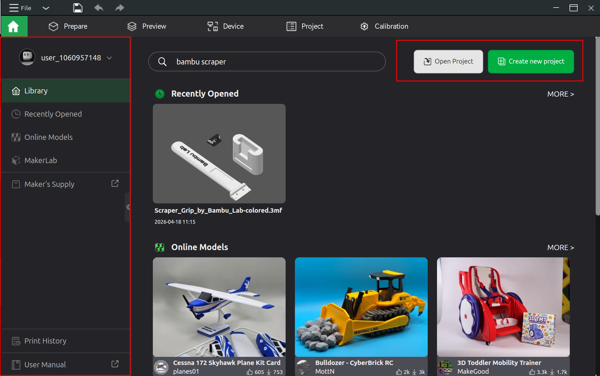

```{githubmd}
```

```{title}
3D Printing
```

```{toc}
```

# Operation

## Operational Placement

The H2S must be placed on a flat and stable surface. The operating space recommended is 80cm width x 102cm depth x 105cm !!height!!, which covers the space required in the back for the exhaust and an AMS 2 Pro to sit on top. `{ref} https://bambulab.com/en/support/academy/10/course/1031276070794240000/chapter/224`

## Operational Climate

The H2S is recommended to be operated in temperatures between between 15-30C (60-85F). If the temperature is ...

 * < 15C, there may be issues with adhesion to plate and / or weaken layer bonding
 * \> 30C, there filament may soften before reaching hotend, increasing risk of extruder or nozzle clogs.

The chamber has an assortment of fans and vents to circulate cool air / blow out hor air (e.g., chamber exhaust fan, auxiliary part cooling fan, and chamber intake vent), but in warmer climates that may not be enough. `{ref} https://bambulab.com/en/support/academy/10/course/1031276070794240000/chapter/224`

## Auto-calibration

H2S's auto-calibration attempts to adjust itself to account for the expected variances between manufactured H2S printers and variances caused by wear. Examples of calibrations include bed leveling (working around variances in the heatbed), motor noise cancellation, and vibration compensation.

Trigger auto-calibration manually by navigating to **[Wrench Icon]** → **Settings** → **Calibration**. Perform auto-calibrate whenever ...

 * there's a decrease in print quality.
 * after printer maintenance.
 * after firmware updates (recommended but not required). `{ref} https://bambulab.com/en/support/academy/10/course/1031276070794240000/chapter/224`

```{note}
There are optional modules to perform even tighter calibration. Specifically, the vision encoder.
```

## Filament Loading

Filament can be loaded through either an !!AMS!! unit (e.g., AMS 2 Pro or AMS HT) or the external spool holder. The external spool holder is used when ...

 * an !!AMS!! unit isn't attached to the H2S.
 * the spool is oversized for the !!AMS!! unit.
 * the spool is for a material the !!AMS!! unit doesn't !!support!! (but the H2S does).
 * the spool is from an !!unsupported!! third-party. `{ref} https://bambulab.com/en/support/academy/10/course/1031276070794240000/chapter/225`

```{note}
The source doesn't cite this, but I know for a fact that TPU is not !!supported!! by the AMS 2 Pro and must fed via the external spool holder (unless it's specifically branded as !!TPU for AMS!!, which Bambu Lab sells). 
```

To load filament using the AMS 2 Pro, ...

1. open the two tabs on the front edge and lift the cover.
1. stick the spool into one of the four slots, ensuring that it sits on the slot's roller and rotates freely.
1. push the slot's inlet release tab toward the spool and feed filament into that inlet - inlet will automatically grip and pull in filament.
1. close the cover and lock it in by closing the two tabs on the front edge.
1. select filament properties: 
   * For filament from Bambu Lab filament, filament color and  material should be automatically detected (using RFID).
   * For filament not from Bambu Lab, navigate to **[Spool Icon]** → **[Pencil Icon]** (for the slot spool was added to) and select filament brand, material, and color.

`{bm-disable-all}`


`{bm-enable-all}`

To load filament using the external spool holder, ...

1. place filament on external spool holder, where filament tip faces up.
1. push filament through PTFE tube until you feel resistance (should reach into printer's extruder).
1. load filament into extruder:
   1. navigate to **[Spool Icon]** and ensure extruder icon is green (confirms filament reaches extruder).
   1. tap the external spool, then select filament brand, material, and color, then tap **Confirm**.
   1. tap **Load** (pulls filament into extruder).
1. inspect as loading process performs a sample extrusion:
   * Tap **Filament Extruded, Continue** if extrusion is thin, even, and steady line free from gaps and sputtering.
   * Tap **Not Extruded Yet, Retry** and gently push filament further into PTFE tube (to help extruder grip it) if extrusion doesn't happen, happens in blobs, or extrusion curls instead of dropping freely.


`{ref} https://bambulab.com/en/support/academy/10/course/1031276070794240000/chapter/225`

## Filament Refill

Most Bambu Lab filaments come wound up on twist apart spools. Once the filament on the spool has been all used up, a refill may be purchased (refill means filament without a spool) and reinserted into the empty spool. Refills come pre-wound ready to be inserted directly on to the spool.

To refill a spool ...

1. twist apart the spool.
2. place pre-wound refill over interior cylinder of spool, aligning refill's notch against the tiny square extrusion.
3. place two sides of spool back together and twist until click.
4. remove plastic straps holding the refill's shape.
5. place sticker on outside of the spool.

Depending on the type of material, some filaments come wound up on cardboard spools. Only plastic Bambu Lab spools are refillable, not cardboard.

 `{ref} https://bambulab.com/en/support/academy/10/course/1031276070794240000/chapter/231`

## User Interface

The H2S's UI is exposed via a touch screen on the exterior of the front face, located on the top left.


Along left-side of the UI are 5 options, each represented by an icon:

1. **[Home]**: Primary functions and readings (e.g., triggering prints, sensor readings, WiFi status, and statistics).
2. **[Controls]**: Control panel for hardware settings (e.g., fan speed, nozzle and heatbed temperature, light, speed, and motion).
3. **[Filaments]**: Control panel for filament management (e.g., AMS 2 Pro functionality and manually selecting material and color).
4. **[Settings]**: Control panel for printer calibration as well as system and identity settings (e.g., account information, WiFi, firmware, and USB).
5. **[Health Monitoring System]**: Printer diagnostics. `{ref} https://bambulab.com/en/support/academy/10/course/1031276070794240000/chapter/226`

The subsections below provide instructions on how to navigate to important parts of the UI.

### Calibration

To calibrate the H2S, navigate to **[Settings]** → **Calibration** → **Print Calibration**, select the desired calibrations and hit **Start**. `{ref} https://bambulab.com/en/support/academy/10/course/1031276070794240000/chapter/226`

### Print

To print, navigate to **[Home]** → **Print Files** and select the drive and file to load. Two drives should be present:

 * **Internal**: Files preloaded onto the H2S's internal memory.
 * **USB**: Files on USB drive plugged into the H2S.

One a file is chosen, select the appropriate **Plate** and **Nozzle** (H2S comes with "Texture PEI" plate and "0.4mm Standard" nozzle - these should be selected as defaults). Then, hit **Next** select the filament to print with. Then, hit **Print** to begin printing. `{ref} https://bambulab.com/en/support/academy/10/course/1031276070794240000/chapter/226`

### Print Speed

To configure the printing speed, navigate to **[Controls]** → **Speed** and select either **Silent**, **Standard** (default), **Sport**, or **Ludicrous**. `{ref} https://bambulab.com/en/support/academy/10/course/1031276070794240000/chapter/226`

```{note}
An introductory YouTube video I watched mentioned that the faster the speed is, the lower quality the print will be. Some people are willing to accept lower quality prints in exchange for speed.
```

### Toolhead and Heatbed Movement

To perform movements of the toolhead (XZ axis) and heatbed (Y axis), navigate to **[Controls]** → **Motion** and tap the adjustment buttons as necessary. `{ref} https://bambulab.com/en/support/academy/10/course/1031276070794240000/chapter/226`

```{note}
This seems to only be for testing purposes and moving things to get at parts? I had to use this feature to get at a thin piece of plastic that popped off and fell on the bottom of the H2S. I moved the heatbed up so I could fit my hand in and reach it.
```

### Extruder Movement

To perform adhoc extrusion and retraction of filament, navigate to **[Controls]** → **Nozzle & Extruder** and use the up/down buttons under **Extruder**. `{ref} https://bambulab.com/en/support/academy/10/course/1031276070794240000/chapter/226`

```{note}
This seems to be for testing purposes. But also, does this have to be done when swapping between AMS 2 Pro and external spool holder?
```

### Nozzle Type

When nozzle has been swapped, navigate to **[Controls]** → **Nozzle & Extruder** and select the nozzle's type under **Nozzle**. `{ref} https://bambulab.com/en/support/academy/10/course/1031276070794240000/chapter/226`

### Nozzle Temperature

To set the nozzle's temperature, navigate to **[Controls]** → **Nozzle & Extruder** and select the nozzle's temperature under **Nozzle**. `{ref} https://bambulab.com/en/support/academy/10/course/1031276070794240000/chapter/226`

```{note}
This seems to only be for testing purposes and doesn't apply to any prints? AFAIK initiating a new print should unset this as the print needs specific temperatures based on the print and the filament used.
```

### Heatbed Temperature

To set the heatbed's temperature, navigate to **[Controls]** → **Heatbed** and select the temperature. `{ref} https://bambulab.com/en/support/academy/10/course/1031276070794240000/chapter/226`

```{note}
This seems to only be for testing purposes and doesn't apply to any prints? AFAIK initiating a new print should unset this as the print needs specific temperatures based on the print and the filament used.
```

### Chamber Temperature

To set the chamber's temperature, navigate to **[Controls]** → **Chamber** and select the temperature. `{ref} https://bambulab.com/en/support/academy/10/course/1031276070794240000/chapter/226`

```{note}
This seems to only be for testing purposes and doesn't apply to any prints? AFAIK initiating a new print should unset this as the print needs specific temperatures based on the print and the filament used.
```

### Chamber Light

To turn the chamber's light on/off, navigate to **[Controls]** and toggle the **Light** switch. `{ref} https://bambulab.com/en/support/academy/10/course/1031276070794240000/chapter/226`

### Heating and Cooling

To configure the H2S's internal climate, navigate to **[Controls]** → **Air Condition** and select either **Cooling** or **Heating**. Individual parts that control the climate (e.g., fans, heaters, and exhausts) are listed and can be individually controlled. `{ref} https://bambulab.com/en/support/academy/10/course/1031276070794240000/chapter/226`

When the mode is set to ...

 * cooling, the chamber heat circulation fan remains off and the filter switch flap is positioned down. Cooling mode should be used for filaments that have low heat resistance (e.g. PLA and TPU).
 * heating, the chamber heat circulation fan automatically turns on, the auxiliary part cooling fan remains off, and the filter switch flap is positioned up. Heating mode should be used for filaments with high heat resistance (e.g., ABS, ASA, PC, and PA). `{ref} https://wiki.bambulab.com/en/h2/manual/cooling-fan-system`

### Filament Type

To select which filaments are in the AMS 2 Pro and / or external spool holder, navigate to **[Filament]** and select the desired spool to input the type, color, and manufacturer of filament. Bambu Lab filaments come with RFID that allows the AMS 2 Pro to automatically identify material and color. `{ref} https://bambulab.com/en/support/academy/10/course/1031276070794240000/chapter/226`

### Filament Auto Refill

When a filament runs out, the H2S and attached AMS 2 Pro unit automatically swap to a second spool to continue printing, provided that second spool has the same brand, color, and material of the original spool being printed with. To enable auto refill, navigate to **[Settings]** → **!!AMS!! Options** and select **!!AMS!! Auto-Refill**. . Then, navigate to **[Filament]**, select the wrench icon, and select **Auto Refill** to view refill relationships. `{ref} https://wiki.bambulab.com/en/ams-2-pro/manual/setup-and-printting#ams-auto-refill`.

```{note}
On the H2D, there are 2 extruders (left and right) and apparently each of the H2D's AMS 2 Pro units is assigned to one of these heads (there may be multiple AMS 2 Pros per printer). The second spool must be in an AMS 2 Pro unit assigned to the same extruder for auto refill to use it.
```

### Filament Drying

To dry filament, ensure the spool is loaded into the AMS 2 Pro and navigate to **[Filament]** and find the water droplet icon. Below the icon should be a humidity sensor reading. Select the water droplet icon and either ...

 * manually enter a heat and duration
 * select the type of filament (loads in optimal heat and duration presets for the filament selected)
 
..., then select **Start**. `{ref} https://bambulab.com/en/support/academy/10/course/1031276070794240000/chapter/226`

```{note}
What happens when the filaments within hte AMS 2 Pro aren't all the same material? It seems there might be some guard rails preventing you from doing this with certain mixes of materials.

> When drying high-temperature filament, you need to take out the low-temperature filament. For example, when drying ABS, PLA filament cannot be placed in the !!AMS!!.

`{ref} https://wiki.bambulab.com/en/ams-2-pro/ams-2-pro-for-drying-in-x1-p1-series`
```

```{note}
Only some filament materials need an AMS HT for drying, not a AMS 2 Pro.
```

## Troubleshooting

 * is on flat and stable surface?
 * is room temperature of 15-30C (60-85F)?
 * requires auto-calibration? `{ref} https://bambulab.com/en/support/academy/10/course/1031276070794240000/chapter/224`
 * is filament dry? `{ref} ADD CITATION`
 * is filament tangled? `{ref} https://bambulab.com/en/support/academy/10/course/1031276070794240000/chapter/225`

# Filament Guide

The following table summarizes key characteristics of filaments !!supported!! by the H2S (as of time of writing). The column(s) ...

 * **Name** is the material's name. Each material may come in one of many modified forms: HF (High Flow) means the material has been modified for high speed printing `{ref} https://www.youtube.com/watch?v=1t_VpPj-9NY`, CF (Carbon Fiber) means the material has been fortified with carbon fiber. `{ref} https://bambulab.com/en/support/academy/10/course/1031276649528733696/chapter/215`, and GF (Glass Fiber) means the material has been fortified with glass fiber. `{ref} https://bambulab.com/en-us/filament/pla-cf`
 * **Stiffness** and **Impact Strength** givens a user-friendly for those specific properties.
 * **Heat Deflection Temperature** states the minimum temperature at which 0.45 MPa and 1.8 MPa of stress cause the material to bend by a small standardized amount (ISO 75 deflection threshold). It gives an idea of how much heat the material can withstand before deforming.
 * **Saturated Water Absorption Rate** states the percent increase in weight from absorbed moisture under a standardized climate. It gives an idea of how moisture resistant the material is.
 * **Nozzle temperature**, **Heatbed temperature**, and **Chamber temperature** collectively define the H2S's heating requirements to effectively print the material.
 * **Drying** states the temperature and time needed to dry out a material. Filaments must be dry prior to printing, and some materials require drying temperatures that neither the AMS 2 Pro nor the AMS HT can reach.
 * **Resistance** states the resistance properties of the material (e.g., flammability).

| Name | Stiffness | Impact Strength | Heat Deflection Temperature<br>(ISO 75) | Saturated Water Absorption Rate | Nozzle temperature | Heatbed temperature | Chamber temperature | Drying | Resistance |
|---|---|---|---|---|---|---|---|---|---|
| PLA `{ref} https://bambulab.com/en-us/filament/pla` | 1.5/5 | 2/5 | 1.8 MPa 54C<br>0.45 MPa 57C | 25C 55% RH 0.43% | 190-230C | 35-45C | 25-45C | 50C 8h | Acid: no<br>Alkali: no<br>Organic solvent: some no<br>Oil/grease: most yes<br>Flammable: yes |
| PLA-CF `{ref} https://bambulab.com/en-us/filament/pla-cf` | 2/5 | 1.5/5 | 1.8 MPa 54C<br>0.45 MPa 55C | 25C 55% RH 0.42% | 210-240C | 35-45C | | 55C 8h | Acid: no<br>Alkali: no<br>Organic solvent: some no<br>Oil/grease: most yes<br>Flammable: yes |
| PETG HF `{ref} https://bambulab.com/en-us/filament/petg-hf` | 1/5 | 2.5/5 | 1.8 MPa 62C<br>0.45 MPa 69C | 25C 55% RH 0.40% | | | | | Acid: no<br>Alkali: no<br>Organic solvent: some no<br>Oil/grease: most yes |
| PETG-CF `{ref} https://bambulab.com/en-us/filament/petg-cf` | 1.5/5 | 3/5 | 1.8 MPa 67C<br>0.45 MPa 74C | 25C 55% RH 0.30% | | | | | | |
| ABS `{ref} https://bambulab.com/en-us/filament/abs` | 1/5 | 3/5 | 1.8 MPa 84C<br>0.45 MPa 87C | 25C 55% RH 0.65% | 240-270C | 80-100C | 45-60C | 80C 8h | Acid: yes<br>Alkali: yes<br>Organic solvent: some no<br>Oil/grease: some no<br>Flammable: yes |
| ABS-GF `{ref} https://bambulab.com/en-us/filament/abs-gf` | 1.5/5 | 1/5 | 1.8 MPa 88C<br>0.45 MPa 99C | 25C 55% RH 0.53% | 260-280C | 90-100C | 60-70C | 80C 8h | Acid: yes<br>Alkali: yes<br>Organic solvent: some no<br>Oil/grease: some no<br>Flammable: yes |
| ASA `{ref} https://bambulab.com/en-us/filament/asa` | 1/5 | 3/5 | 1.8 MPa 92C<br>0.45 MPa 100C | 25C 55% RH 0.45% | 240-270C | 80-100C | 45-60C | 80C 8h | Acid: yes<br>Alkali: yes<br>Organic solvent: some no<br>Oil/grease: some no<br>Flammable: yes |
| ASA-CF `{ref} https://bambulab.com/en-us/filament/asa-cf` | 2/5 | 0.5/5 | 1.8 MPa 102C<br>0.45 MPa 110C | 25C 55% RH 0.33% | | | | | | |
| PC `{ref} https://bambulab.com/en-us/filament/pc` | 1.5/5 | 2.5/5 | 1.8 MPa 117C<br>0.45 MPa 112C | 25C 55% RH 0.25% | 260-280C | 90-100C | 45-60C | 80C 8h | Acid: no<br>Alkali: no<br>Organic solvent: some no<br>Oil/grease<br>Flammable: yes |
| PC FR `{ref} https://bambulab.com/en-us/filament/pc-fr` | 1/5 | 3.5/5 | 1.8 MPa 108C<br>0.45 MPa 113C | 25C 55% RH 0.12% | 260-280C | 90-100C | | 80C 8h | Flammable: retardant |
| TPU 95A HF `{ref} https://bambulab.com/en-us/filament/tpu-95a-hf` | 0.5/5 | 5/5 | N/A | 25C 55% RH 1.08% | | | | | | |
| TPU 90A `{ref} https://bambulab.com/en-us/filament/tpu-90a` | 0.5/5 | 5/5 | N/A | 25C 55% RH 0.61% | | | | | | |
| TPU 85A `{ref} https://bambulab.com/en-us/filament/tpu-85a` | 0.5/5 | 5/5 | N/A | 25C 55% RH 0.67% | | | | | | |
| TPU for !!AMS!! `{ref} https://bambulab.com/en-us/filament/tpu-for-ams` | 0.5/5 | 5/5 | N/A | 25C 55% RH 1.20% | 220-240C | 30-35C | | 70C 8h | Acid: no<br>Alkali: no<br>Organic solvent: some no<br>Oil/grease: most yes<br>Flammable: yes |
| PA6-CF `{ref} https://bambulab.com/en-us/filament/pa6-cf` | 3/5 | 3/5 | 1.8 MPa 164C<br>0.45 MPa 186C | 25C 55% RH 2.35% | | | | | | |
| PA6-GF `{ref} https://bambulab.com/en-us/filament/pa6-gf` | 2/5 | 2/5 | 1.8 MPa 158C<br>0.45 MPa 182C | 25C 55% RH 2.56% | | | | | | |
| PAHT-CF `{ref} https://bambulab.com/en-us/filament/paht-cf` | 2.5/5 | 3.5/5 | 1.8 MPa 170C<br>0.45 MPa 194C | 25C 55% RH 0.88% | | | | | | |
| PET-CF `{ref} https://bambulab.com/en-us/filament/pet-cf` | 3/5 | 2.5/5 | 1.8 MPa 182C<br>0.45 MPa 205C | 25C 55% RH 0.37% | 260-290C | 80-100C | 45-60C | 80C 8-12h | Acid: no<br>Alkali: no<br>Organic solvent: some no<br>Oil/grease: most yes<br>Flammable: yes |
| PPA-CF `{ref} https://bambulab.com/en-us/filament/ppa-cf` | 5/5 | 3/5 | 1.8 MPa 196C<br>0.45 MPa 227C | 25C 55% RH 1.30% | | | | | | |
| PPS-CF `{ref} https://bambulab.com/en-us/filament/pps-cf` | 4/5 | 1.5/5 | 1.8 MPa 235C<br>0.45 MPa 264C | 25C 55% RH 0.05% | 310-340C | 100-120C | 60-90C | 100-140C 8-12h | Acid: yes<br>Alkali: yes<br>Organic solvent: yes<br>Oil/grease: yes<br>Flammable: retardant<br>(self-extinguishing when away from fire) |

```{note}
Stiffness and impact strength columns come from the Bambu Lab product page for the specified filament. Remaining columns come from the Bambu Lab technical document sheet (TDS) for that product.
```

# Build Plate Guide

A plate that sits on the heatbed and serves as the print surface. There are different types of build plates, each with different properties targeting different filament materials (4 as of time of writing):

 * Cool Plate SuperTack Pro - Designed to reduce PLA and PETG print failures through better adhesion at lower heatbed temperatures.
 * Textured PEI Plate - Designed with a slightly rough surface enabling better first layer adhesion and allowing for the print to self-release (some filament materials only). 
 * Smooth PEI Plate - Designed with a smooth surface. Unlike the Texture PEI Plate, the smoothness of this plate contributes Z-axis precision (no roughness).
 * Engineering Plate - Designed as a universal build plate, compatible with all filament materials (but requires a layer of glue before printing).

The following table summarizes filament materials !!supported!! and material requirements for each build plate.

| Build Plate              | Material            | Heatbed Temperature | Glue Required? |
|--------------------------|---------------------|---------------------|----------------|
| Cool Plate SuperTack Pro | PLA                 | 40C                 | No             |
| Cool Plate SuperTack Pro | PETG                | 60C                 | No             |
| Textured PEI Plate       | PLA/PLA-CF/PLA-GF   | 45-60C              | No             |
| Textured PEI Plate       | ABS                 | 90-100C             | Stick          |
| Textured PEI Plate       | PETG/PETG-CF        | 60-80C              | No             |
| Textured PEI Plate       | PET-CF              | 80-100C             | No             |
| Textured PEI Plate       | TPU 85A/90A         | 35-45C              | No             |
| Textured PEI Plate       | TPU 95A for !!AMS!! | 35-45C              | Stick          |
| Textured PEI Plate       | ASA                 | 90-100C             | Stick          |
| Textured PEI Plate       | PVA                 | 45-60C              | No             |
| Textured PEI Plate       | PC/PC-CF            | 90-110C             | Stick          |
| Textured PEI Plate       | PA/PA-CF/PAHT-CF    | 90-110C             | Stick          |
| Smooth PEI Plate         | PLA/PLA-CF/PLA-GF   | 45-60C              | No             |
| Smooth PEI Plate         | PETG/PETG-CF        | 60-80C              | Stick/Liquid   |
| Smooth PEI Plate         | ABS                 | 90-100C             | Stick/Liquid   |
| Smooth PEI Plate         | ASA                 | 90-100C             | Stick/Liquid   |
| Smooth PEI Plate         | TPU                 | 35-45C              | Stick/Liquid   |
| Smooth PEI Plate         | PVA                 | 45-60C              | Stick/Liquid   |
| Smooth PEI Plate         | PC/PC-CF            | 90-110C             | Stick          |
| Smooth PEI Plate         | PA/PA-CF/PAHT-CF    | 90-110C             | Stick          |
| Smooth PEI Plate         | PET-CF              | 80-100C             | Stick/Liquid   |
| Engineering Plate        | PLA/PLA-CF/PLA-GF   | 45-60C              | Stick/Liquid   |
| Engineering Plate        | PETG/PETG-CF        | 60-80C              | Stick/Liquid   |
| Engineering Plate        | ABS                 | 90-100C             | Stick/Liquid   |
| Engineering Plate        | ASA                 | 90-100C             | Stick/Liquid   |
| Engineering Plate        | TPU                 | 35-45C              | Stick/Liquid   |
| Engineering Plate        | PVA                 | 45-60C              | Stick/Liquid   |
| Engineering Plate        | PC/PC-CF            | 90-110C             | Stick/Liquid   |
| Engineering Plate        | PA/PA-CF/PAHT-CF    | 90-110C             | Stick/Liquid   |
| Engineering Plate        | PET-CF              | 80-100C             | Stick/Liquid   |

Of the build plates listed, the ...

* Cool Plate SuperTack Pro targets PLA and PETG, allowing those filament materials to be printed at cooler temperatures.
* Textured PEI Plate primarily targets PLA, PETG, and TPU, but can also work with other filament materials. It has a rough surface to better bind against the first layer (some materials only - other materials may require glue). Prints can pop off of it by allowing the build plate to cool and slightly bending it (some materials only - other materials may bind too tightly to the plate to allow it to pop off, meaning you need to use glue and maybe a scraper).
* Smooth PEI Plate is similar to Textured PEI Plate but its surface is smooth, meaning the first layer isn't textured and the print's Z-axis is more precise. Unlike the Textured PEI Plate, the initial layer doesn't naturally grip to the build plate (glue required) and prints can't pop off of the build plate (scraper required).
* Engineering Plate primarily targets high temperature filament materials, but is resilient enough to be an all-purpose build plate (!!supporting!! any filament material).

```{note}
Textured PEI Plate only !!supports!! glue sticks, not liquid glue? The table just says "Yes" or "No" but doesn't explicitly mention either, but the header of that column says "Requires Glue Stick?" so I specifically put down stick.

Textured PEI Plate's buy page (where the Textured PEI portion of the table above comes from) also had an extra column about whether the cover should be removed, but that has nothing to do with the build plate? It's to prevent heat creep?
```

`{ref} https://us.store.bambulab.com/products/bambu-cool-plate-supertack-pro` `{ref} https://bambulab.com/en/support/academy/10/course/1031276649528733696/chapter/220` `{ref} https://us.store.bambulab.com/products/bambu-textured-pei-plate` `{ref} https://us.store.bambulab.com/products/bambu-smooth-pei-plate` `{ref} https://us.store.bambulab.com/products/bambu-engineering-plate`

# Bambu Studio

Bambu Studio is H2S's desktop software. It provides access to MakerWorld (a repository of printable object), processes 3D models for printing by slicing them, and controls and gets feedback from the H2S. `{ref} https://bambulab.com/en/support/academy/10/course/1031276070794240000/chapter/228` Bambu Studio works with many brands of 3D printers, not just Bambu Lab printers. `{ref} https://bambulab.com/en/support/academy/3/course/986946695195025408/chapter/31`.

```{note}
There's also a software product called Bambu Suite, but that's for cutting and engraving while Bambu Studio is for printing.
```

As of time of writing, Bambu Studio (v2.6.0.51) has 6 main screens (referred to as tabs), which can be navigated between using the top toolbar:

1. Home: Welcome screen, user manuals, opening model, print history.
2. Prepare: Model placement, orientation, and manipulation.
3. Preview: Print information and estimations.
4. Device: H2S interface and management.
5. Project: Informative fields describing project.
6. Calibration: H2S calibration.


Regardless of which screen you're on, the top toolbar should always be present. The subsections below document each screen.

## Home



Bambu Studio's Home screen is the screen presented on launch. It's partitioned into a content section and a left side-bar. The left side-bar flips between pages that open local and online models / projects (e.g., MakerWorld), access print history, link to user manuals, and link to Maker's Supply (sale of non-printable parts like RC bricks).

Bambu Studio projects are loaded and saved as 3MF files, although models stored in different file formats may be imported via the main menu: **File** → **Import 3MF/STL/STEP/SVG/OBJ/AMF ...**.

## Prepare

Bambu Studio's Prepare screen is for transforming models for print (e.g., orientation, scale, position, and color) as well as configuring print settings (e.g., layer height and infill density).

Prepare viewport controls:

| Action                     | Shortcut                                                                                                        |
|----------------------------|-----------------------------------------------------------------------------------------------------------------|
| Rotate camera              | 🖰 Left-drag<br>(ensure no object is selected)                                                                   |
| Pan camera                 | 🖰 Right-drag                                                                                                    |
| Zoom camera                | 🖰 Scroll wheel                                                                                                  |
| Select object              | 🖰 Left-click object                                                                                             |
| Select additional object   | Ctrl + 🖰 Left-click object                                                                                      |
| Select multiple objects    | Shift + 🖰 Right-drag green selection rectangle over objects                                                     |
| Deselect objects           | 🖰 Left-click area without object                                                                                |
| Select all objects         | Ctrl + A                                                                                                        |
| Arrange all objects        | A                                                                                                               |
| Move selected objects 10mm | Arrow key (←, ↑, →, or ↓)<br>(ensure object is selected)<br>(movement occurs relative to camera's view)         |
| Move selected objects 1mm  | Shift + Arrow key (←, ↑, →, or ↓)<br>(ensure object is selected)<br>(movement occurs relative to camera's view) |
| Undo                       | Ctrl + Z                                                                                                        |
| Redo                       | Ctrl + Y                                                                                                        |

## Preview

Bambu Studio's Preview screen is for exploring slices_SET. Each screen is partitioned into a 3D viewport and a left side-bar.

For both screens, the left side-bar has 3 sub-sections:

* **Printer**:
* **Project Filaments**:
* **Process**

Preview viewport controls:

| Action                     | Shortcut                                                                                                        |
|----------------------------|-----------------------------------------------------------------------------------------------------------------|
| Move vertical slider       | ↑ or ↓                                                                                                          |
| Move horizontal slider     | ← or →                                                                                                          |
| Toggle single layer view   | L                                                                                                               |
| Pan camera                 | 🖰 Right-drag                                                                                                    |
| Zoom camera                | 🖰 Scroll wheel                                                                                                  |
| Select multiple objects    | Shift + 🖰 Right-drag green selection rectangle over objects                                                     |
| Select additional object   | Ctrl + 🖰 Left-click object                                                                                      |
| Select all objects         | Ctrl + A                                                                                                        |
| Arrange all objects        | A                                                                                                               |
| Move selected objects 10mm | Arrow key (←, ↑, →, or ↓)<br>(ensure object is selected)<br>(movement occurs relative to camera's view)         |
| Move selected objects 1mm  | Shift + Arrow key (←, ↑, →, or ↓)<br>(ensure object is selected)<br>(movement occurs relative to camera's view) |
| Undo                       | Ctrl + Z                                                                                                        |
| Redo                       | Ctrl + Y                                                                                                        |

## Device

## Project

## Calibration

# Terminology

* `{bm} Automatic Material System 2 Pro (AMS 2 Pro)/(AMS 2 Pro)/` `{bm} /(Automatic Material System 2 Pro)/i` - Automatic Material System 2 Pro, an extension to the H2S that manages filament(s). The AMS 2 Pro ...
  
  * enables multi-color and multi-material prints by swapping between filament spools during printing.
  * automatically switches between filament spools if a filament spool runs out during printing.
  * automatically identifies the color and type of filament spools (only for official Bambu Lab filaments, using RFID). 
  * drying filament spools (up to 65 celsius).

  The AMS 2 Pro !!supports!! 4 spools per unit, and !!supports!! chaining up to 4 AMS 2 Pro units together to !!support!! up to 16 spools per print. Additionally, the 4 chained AMS 2 Pro units may be chained up even further by 8 AMS HT units, enabling up to 24 spools per print.  `{ref} https://bambulab.com/en/support/academy/10/course/1031276070794240000/chapter/232` `{ref} https://us.store.bambulab.com/products/ams-multicolor-printing`

* `{bm} Automatic Material System High Temperature (AMS HT)/(AMS HT)/` `{bm} /(Automatic Material System High Temperature)/i` - Automatic Material System High Temperature, an extension to the H2S that manages handling engineering-grade high-temperature filaments that are sensitive to moisture (e.g., PPS and PPA). It has better a better motor, filament drying (up to 85 celsius), and better humidity control than the AMS 2 Pro. However, it only seems to !!support!! 1 spool.

  `{bm-error} Did you mean AMS 2 Pro or AMS HT?/(AMS\s?Pro\s?2|AMS\s?2|AMS\s?Pro|AMS)/i`

  `{bm-error} Did you mean AMS 2 Pro or AMS HT?/(Automatic Material System\s?Pro\s?2|Automatic Material System\s?2|Automatic Material System\s?Pro|Automatic Material System)/i`

* `{bm} external spool holder` - A spool holder attached to the H2S's left face exterior, near the rear. The external spool holder is intended to be used when either an AMS 2 Pro isn't available or the filament material isn't !!supported!! by the AMS 2 Pro.

  

* `{bm} toolhead` - An assembly consisting of ...

  * a PTFE connector
  * a filament sensor.
  * an extruder.
  * a hotend with nozzle.
  * a part cooling fan.
  * a filament cutter.
  
  Filament enters the nozzle through the PTFE connector located at the top, where the extruder motor grabs it and pushes it into the hotend located at the bottom. The hotend's nozzle poking out of the enclosure is sandwiched between cooling ducts, where the part cooling fan directs air to rapidly cool filament as its printed.

  

  The bottom bottom right-side of the toolhead has a toolhead camera attached. The toolhead moves left-right on the X-Axis linear rail. The X-Axis linear rail itself moves forward and backward on the Y-Axis. These rails are how the toolhead positions itself for printing. `{ref} https://bambulab.com/en/support/academy/10/course/1031276070794240000/chapter/227`

  ```{note}
  It sounds like the camera and the part cooling fan (and the railing) are not a part of the toolhead itself? These are attachments.
  ```

  ```{note}
  The H2D's toolhead is different from the H2S's toolhead? It has two PTFE connectors and two nozzles?
  ```

* `{bm} filament sensor` - A sensor detecting the presence of filament in the toolhead, located where the filament is fed into the toolhead. The filament sensor prevents printing without filament, allowing prints to resume once new filament is available. `{ref} https://bambulab.com/en/support/academy/10/course/1031276649528733696/chapter/214`

* `{bm} toolhead camera` - A camera attached to the toolhead, used for calibrating motion accuracy and build plate recognition. `{ref} https://bambulab.com/en/support/academy/10/course/1031276070794240000/chapter/227`

* `{bm} extruder` - A motor within the toolhead that grips and moves filament between the PTFE connector to the hotend.

  An extruder is part of a toolhead. `{ref} https://bambulab.com/en/support/academy/10/course/1031276070794240000/chapter/227`

* `{bm} hotend/(hotend|nozzle|silicone sock|heat sink|cold end|silicone sock|heating assembly)/i` - An assembly responsible for melting filament for deposit on to a print. A hotend includes a ...

  * coldend - keeps filament at lower temperature.
  * nozzle - heated to melt the filament and deposit it onto a print.
  
  A silicone sock fits over nozzle, insulating it from the cooling from the part cooling fan.

  ```{note}
  In the documentation, the coldend is also referred to as a heat sink.
  ```

  

  On the H2S, the hotend is part of the toolhead. A heating assembly within the toolhead clamps on to and heats the hotend, and is responsible for heating and temperature regulation of the nozzle.
  
  Unlike the H2S, some other printers have a different structure: The coldend is separated from the hotend as its own distinct piece and the hotend comes with heating, temperature regulation, and other hardware pieces builtin. On the H2S, the combination of coldend and nozzle are referred to as the hotend. `{ref} https://bambulab.com/en/support/academy/10/course/1031276070794240000/chapter/227`

  `{bm-error} Did you mean silicone sock (e at end)?/(silicon sock)/i`
  `{bm-error} Did you mean heat sink (space between)?/(heatsink)/i`
  `{bm-error} Did you mean hotend (no space)?/(hot\s+end)/i`
  `{bm-error} Did you mean coldend (no space)?/(cold\s+end)/i`

* `{bm} part cooling fan` - A fan located at the base of the toolhead. The part cooling fan directs are to the cooling ducts that sandwich the tip of the hotend's nozzle, rapidly cooling printed filament. `{ref} https://bambulab.com/en/support/academy/10/course/1031276070794240000/chapter/227`

* `{bm} CoreXY/(CoreXY|A motor|B motor|A stepper motor|B stepper motor|X[\- ]axis linear rail|Y[\- ]axis linear rod|X[\- ]axis rail|Y[\- ]axis rod)/` - H2S's system for moving the toolhead front-back and left-right. The system is comprised of a pair of synchronized motors within the H2S responsible for moving the toolhead on the X and Y axes: A motor and B motor. The motors are located at the rear inside face of the H2S, near the top. The B motor is on the left and the A motor is on the top.

  The motors connect through the X-axis linear rail and the Y-axis linear rods via a pair of belts. The ...
  
  * X-axis linear rail is responsible for left-right toolhead movement.
  * Y-axis linear rods is responsible for forward-backward toolhead movement (it moves the X-axis linear rail forward-backward).
  
  Both motors work in tandem to coordinate movement in both directions (e.g., one motor isn't solely responsible on an axis).
  
   `{ref} https://bambulab.com/en/support/academy/10/course/1031276070794240000/chapter/227`

  ```{note}
  There's also Z-axis threaded and linear rods, responsible for moving the heatbed up-down. It's unclear if these rods are part of the CoreXY movement system. Their description is included under the CoreXY system but it feels separate as it's not controlling the toolhead's position but the heatbed's position. `{ref} https://bambulab.com/en/support/academy/10/course/1031276070794240000/chapter/227`
  ```

  `{bm-error} Did you mean CoreXY (no space or dash, properly capitalized)?/(Core[ \-]XY|Corexy|coreXY)/`
  `{bm-error} Did you mean X-axis linear rail?/(X[\- ]axis linear rod|X[\- ]axis rod)/`
  `{bm-error} Did you mean Y-axis linear rod?/(Y[\- ]axis linear rail|Y[\- ]axis rail)/`

* `{bm} Z-axis threaded and linear rods/(Z-axis threaded and linear rod|Z-axis linear rod|Z-axis threaded rod|Z-axis rod)/` - Two threaded rods located at the front inside face of the H2S, on the left and right. These rods move the heatbed up-down.

   `{ref} https://bambulab.com/en/support/academy/10/course/1031276070794240000/chapter/227`

* `{bm} heatbed` - A heat controlled surface within the H2S that magnetically secures the build plate. The heatbed moves up-down using the Z-axis linear rods, allowing the toolhead to print one layer after the other onto the attached build plate.

  Depending on the material being printed, the heatbed's controlled heating may be required or otherwise beneficial for print quality (e.g., adhesion and / or reducing printing artifacts).

   `{ref} https://bambulab.com/en/support/academy/10/course/1031276070794240000/chapter/227`

  `{bm-error} Did you mean heatbed (no space)?/(heat bed)/i`

* `{bm} status light` - A light bar just below the heatbed, facing forward and running side-to-side. The light bar changes color to show the operating status of the H2S:

  * White slow pulse (or off): Idle.
  * Orange scroll: Print job preparing.
  * White left-to-right fill: Print job progress.
  * Red double flash: Print error.
  * Green solid: Print successful. `{ref} https://bambulab.com/en/support/academy/10/course/1031276070794240000/chapter/227`

* `{bm} build plate` - A plate that sits on the heatbed and serves as the print surface. There are different types of build plates, each with different properties targeting different filament materials. `{ref} https://bambulab.com/en/support/academy/10/course/1031276070794240000/chapter/227` Build plates are intended to be consumable, meaning that in comparison to other major components they're intended to be replaced much sooner. `{ref} https://us.store.bambulab.com/products/bambu-textured-pei-plate` `{ref} https://us.store.bambulab.com/products/bambu-smooth-pei-plate` `{ref} https://us.store.bambulab.com/products/bambu-engineering-plate` `{ref} https://us.store.bambulab.com/products/bambu-cool-plate-supertack-pro`

  ```{note}
  To avoid contamination, do not touch the build plate other than the front edge. `{ref} https://bambulab.com/en/support/academy/10/course/1031276070794240000/chapter/227`

  Most build plates are cleaned similarly to washing a dish: Warm water, dish washing detergent, and either paper towel to dry or let it air dry.
  ```

* `{bm} Cool Plate SuperTack Pro` - A build plate designed to reduce PLA and PETG printing failures through better adhesion at lower heatbed temperatures. Unlike the Textured PEI Plate which also primarily targets PLA and PETG, there is no self-release mechanism for prints. `{ref} https://us.store.bambulab.com/products/bambu-cool-plate-supertack-pro`

  ```{note}
  There's the SuperTack and the SuperTack Pro. The above table only covers the SuperTack Pro.
  ```

* `{bm} Textured PEI Plate` - A build plate with a slightly rough surface, primarily targeting PLA. The texturing makes enables better first layer adhesion and allows for the print to self-release (some filament materials only). `{ref} https://bambulab.com/en/support/academy/10/course/1031276649528733696/chapter/220` `{ref} https://us.store.bambulab.com/products/bambu-textured-pei-plate`


* `{bm} Smooth PEI Plate` - A build plate with a smooth surface, compatible with various filament types (especially PLA). Unlike the Texture PEI Plate, the smoothness of this plate contributes Z-axis precision. `{ref} https://us.store.bambulab.com/products/bambu-smooth-pei-plate`

* `{bm} Engineering Plate` - A build plate compatible with all filament materials but requires a layer of glue before printing. Although compatible with all filament materials, the Engineering Plate targets high temperature filament materials. `{ref} https://us.store.bambulab.com/products/bambu-engineering-plate`

* `{bm} vision encoder` - A calibration tool used to compensate for natural and wear related variances, allowing for high accuracy prints that can tightly assembly. The vision encoder is a slab that sits on the heatbed, shaped similarly to a build plate. However, it's only used for calibration and not meant to be printed on (replace with build plate once calibrated). `{ref} https://us.store.bambulab.com/products/vision-encoder?id=601545719002021889`

* `{bm} chamber` - The enclosure of the H2S, encapsulating everything within (e.g., toolhead, motors, heatbed, CoreXY system, and fans).

* `{bm} chamber heat circulation fan/(chamber heat circulation fan|heat circulation fan)/i` - A heater located at the rear face of the H2S, used to increase the chamber's temperature. The increased temperature is required for some filament materials which warp or have other issues if cooled too rapidly.

   `{ref} https://bambulab.com/en/support/academy/10/course/1031276070794240000/chapter/227` `{ref} https://wiki.bambulab.com/en/h2s/manual/screen-operation#h-1-air-management`

* `{bm} chamber exhaust fan/(chamber exhaust fan filter|chamber exhaust fan|chamber filter|exhaust fan filter|exhaust fan)/i` - An exhaust fan located at the rear face of the H2S. The chamber exhaust fan may have a filter in front of it, referred to as the chamber filter, that partially filters air as it's exhausted out of the chamber.

   `{ref} https://bambulab.com/en/support/academy/10/course/1031276070794240000/chapter/227`

* `{bm} chamber intake vent/(chamber intake vent|intake vent)/i` - A flap opening located at the top face of the H2S, bordering the front. The chamber intake vent opens to allow outside air in when the exhaust fan is running.  `{ref} https://bambulab.com/en/support/academy/10/course/1031276070794240000/chapter/227`

   `{ref} https://bambulab.com/en/support/academy/10/course/1031276070794240000/chapter/227`

* `{bm} filament buffer` - A filament tension-control / slack-management device at the rear face of the H2S, sitting between filament passing from outside the chamber to the extruder. The filament buffer is an orange slider that slides forward and backward, storing a small buffer of filament as it slides forward.

  When an AMS 2 Pro unit is connected, the unit's motor pushes filament into the filament buffer thereby storing a small buffer of filament. When the extruder consumes the filament in the filament buffer, the filament buffer slides backward. A sensor in the filament buffer feeds back to the AMS 2 Pro unit's motor to control filament feeding speed.

  When the external spool holder is used, the buffer acts as an entanglement sensor. When the spool is tangled, the tension of the extruder pulling is detected by the filament buffer thereby cause the print to pause and the user to be prompted.

   `{ref} https://bambulab.com/en/support/academy/10/course/1031276070794240000/chapter/227`

  ```{note}
  If printing TPU, unless it's specifically branded as !!TPU for AMS!!, bypass the filament buffer via the TPU inlet. `{ref} https://bambulab.com/en/support/academy/10/course/1031276070794240000/chapter/`
  ```

* `{bm} TPU inlet` - An inlet that bypasses the filament buffer, specifically intended for TPU filament (that isn't branded as !!TPU for AMS!!). The inlet in positioned just to the right of the filament buffer, feeding the PTFE directly from the exterior into the chamber. The PTFE tube used for the TPU inlet may either be the same PTFE tube attaching the filament buffer to the toolhead (disconnecting it and reconnecting it to the TPU inlet) or a separate PTFE tube.

   `{ref} https://bambulab.com/en/support/academy/10/course/1031276070794240000/chapter/227`

  ```{note}
  The example image shown at the source shows the PTFE tube going straight through the inlet and reaching outside the chamber. Is the existing filament buffer to toolhead PTFE tube long enough to repurpose for the TPU inlet? It needs to go from the toolhead, through the inlet, to the external spool holder. It seems not long enough for that?
  ```

* `{bm} purge wiper/(purge wiper|purge chute|nozzle wiper)/i` - A block at the back left of the H2S responsible for cleaning the toolhead between prints / filament changes. The purge wiper consists of ...

  * a nozzle wiper, which is silicone waffle and strips.
  * a purge chute, which is a chute leading to outside the chamber.
  
  The toolhead knocks into the waffle / strips to clean off old stuck filament, sending it down the purge chute.

    `{ref} https://bambulab.com/en/support/academy/10/course/1031276070794240000/chapter/227` `{ref} https://wiki.bambulab.com/en/h2s/maintenance/replace-purge-wiper`

  ```{note}
  The nozzle wiper is different from the nozzle wiper sheet on the heatbed?
  ```
 
* `{bm} nozzle wiper sheet` - A sheet on the edge of the heatbed that the nozzle moves across to keep the tip smooth and free of debris. `{ref} https://bambulab.com/en/support/academy/10/course/1031276070794240000/chapter/227`

  ```{note}
  This is different from the nozzle wiper, which is used for scrubbing / flicking off purged filament.
  ```

* `{bm} calibration sticker` - A sticker on the edge of the heatbed, next to the nozzle wiper sheet, that the toolhead camera uses for calibration. `{ref} https://bambulab.com/en/support/academy/10/course/1031276070794240000/chapter/227`

* `{bm} filament cutter/(filament cutter stopper|filament cutter|cutter stopper)/i` - An upright arm on the toolhead's right face. The filament cutter gets pushed into the filament cutter stopper, which is an arm located on the right inside face near the rear (close to motor A just above the Y-axis linear rod), to push it into the filament thereby cutting it. The filament cutter stopper rotates out in position when cutting and rotates back to be stowed away afterwards.

    `{ref} https://bambulab.com/en/support/academy/10/course/1031276070794240000/chapter/227` `{ref} https://wiki.bambulab.com/en/h2s/maintenance/replace-cutter-lever`

* `{bm} auxiliary part cooling fan` - A fan on the left face of the H2S that provides additional cooling, supplementing the cooling from the part cooling fan. The auxiliary part cooling fan layers an airflow blanket over the freshly printed layer, !!supporting!! quick and even solidifying of the layer and thereby reducing the likelihood of deformations and / or poor layer adhesion.

 The auxiliary part cooling fan helps improve layer bonding and reduce deformations, especially when ...

 * printing at high speeds.
 * printing materials that have tight cooling requirements (e.g., PLA).
 * printing smaller objects or objects with intricate details.
 
  `{ref} https://bambulab.com/en/support/academy/10/course/1031276070794240000/chapter/227`

* `{bm} Bambu Studio` - H2S desktop software. Bambu studio provides access to MakerWorld (a repository of printable object), processes 3D models for printing by slicing them, and controls and gets feedback from the H2S. `{ref} https://bambulab.com/en/support/academy/10/course/1031276070794240000/chapter/228`

* `{bm} Bambu Handy` - H2S mobile software. Bambu Handy provides access to MakerWorld as well as controls and gets feedback from the H2S. `{ref} https://bambulab.com/en/support/academy/10/course/1031276070794240000/chapter/228`

* `{bm} filament spool/(filament spool|spool)/i` - A !!spool!! holding rolled up filament, which can be installed either in the AMS 2 Pro or the external spool holder. A filament spool can either be made of ...

  * plastic: Most filament materials are wound up on plastic filament spools. Bambu Lab branded plastic filament spools twist apart, allowing them to be refilled once all the existing filament is used up.
  * cardboard: High temperature filament materials are wound up on cardboard filament spools because those high temperatures may cause plastic filament spools to melt (e.g., PPS-CF). Cardboard filament spools are incompatible with the AMS 2 Pro. `{ref} https://bambulab.com/en/support/academy/10/course/1031276070794240000/chapter/231`

  ```{note}
  Reusing a Bambu Lab plastic filament spool? Make sure you buy filament marketed as refill. I don't believe it has the be the same color or even the same material.
  ```

* `{bm} Stereolithography (STL)/\b(STL)\b/` `{bm} /(stereolithography)/i` - File format for single 3D object's geometry, stored as triangles. It does not contain any other information such as color or texture. `{ref} https://bambulab.com/en/support/academy/10/course/1031276649528733696/chapter/214`

  ```{note}
  This is intended for the surface geometry of a single object? You can technically include internal geometry or disjointed geometry but if it doesn't form a closed "watertight" volume then it's "non-manifold" and invalid for 3D printing.
  ```

* `{bm} 3D Manufacturing Format (3MF)/\b(3MF)\b/` `{bm} /(3D manufacturing format)/i` - File format for 3D objects destined for 3D printing. 3MF !!supports!! color, text, and material properties. 3MF is preferred to STL because it can store multiple objects, print settings, and other metadata. `{ref} https://bambulab.com/en/support/academy/10/course/1031276649528733696/chapter/214`.

* `{bm} Wavefront OBJ (OBJ)/\b(OBJ)\b/` `{bm} /(wavefront obj)/i` - File format for 3D object. OBJ files can contain much more information than just geometry (e.g., groupings of objects, vertex normals, and material / texture assignments). `{ref} https://bambulab.com/en/support/academy/3/course/986946695195025408/chapter/33`

* `{bm} Standard for the Exchange of Product Model Data (STEP)/(STEP)/` `{bm} Standard for the Exchange of Product Model Data` - File format for 3D objects, in the context of Computer Aided Drafting (CAD). `{ref} https://bambulab.com/en/support/academy/3/course/986946695195025408/chapter/33`

* `{bm} Scalable Vector Graphics (SVG)/(SVG)/` `{bm} Scalable Vector Graphics` - File format for 2D vector drawings. `{ref} https://bambulab.com/en/support/academy/3/course/986946695195025408/chapter/33`

  ```{note}
  SVGs have no height_LAYER. It sounds like when SVGs are imported into Bambu Studio, they're given a tiny height_LAYER and then you can use the scale tool to make it taller.
  ```

* `{bm} Geometric code (G-code)/(G-code)/` `{bm} /(geometric code)/i` - File format for encoding the movement and actions of manufacturing devices such as 3D printers and CNC machines. G-code is structured as a list of instructions, controlling things like movement, speed, and depositing of material. `{ref} https://bambulab.com/en/support/academy/10/course/1031276649528733696/chapter/214`.

* `{bm} nozzle clog` - Filament stuck in a nozzle, blocking the flow of melted plastic. A nozzle clog may be due to ...

  * dust.
  * filament additive particles.
  * filament residue.
  * bad temperature settings.

  The typical sign of a nozzle clog is the toolhead's extruder "skipping", where filament doesn't come out when it should. `{ref} https://bambulab.com/en/support/academy/10/course/1031276649528733696/chapter/214`

  ```{note}
  I'm not sure if there's any audio or visual indication of a clog - clicking noises? toolhead's spinny logo jerking? something else? Documentation for other Bambu Lab printers mention this, but the  current H2S documentation mentions no symptoms other than under-extrusion.
  ```

* `{bm} bed leveling/(bed leveling|heatbed leveling)/i` - Probing of the heatbed to generate a surface map, used to dynamically adjust the nozzle's !!height!! during printing to compensate for heatbed unevenness. Bed leveling is typically performed as one of the initial steps of a new print job. `{ref} https://bambulab.com/en/support/academy/10/course/1031276649528733696/chapter/214`

  ```{note}
  The reference above seems to have incorrect information. It says that bed leveling adjusts the heatbed to be "perfectly parallel to the movement of the nozzle", implying that the heatbed's plane is being adjusted to be parallel to the toolhead's plane. That doesn't seem to be the case. The parallel-ness of the heatbed is adjusted manually using a process called bed tramming?

  Bed leveling is only probing the heatbed for unevenness and attempting to compensate?
  ```

* `{bm} slicer` - Software that performs slicing. Examples include Bambu Studio and Cura Slicer. `{ref} https://bambulab.com/en/support/academy/10/course/1031276649528733696/chapter/214`

* `{bm} slicing/(slicing|sliced)/i` `{bm} /(slices)_PROC/i` - Cutting a 3D model into thin horizontal layers and generating G-code to print those layers one by one. The G-code stacks the layers on top of each other to recreate the original object.

  The process of slicing includes controlling for layer height and print speed, as well as introducing infill. `{ref} https://bambulab.com/en/support/academy/10/course/1031276649528733696/chapter/214`

* `{bm} layer/(layer|slice)/i` `{bm} /(slices)_SET/i` - A !!layer!! within a sliced 3D model. `{ref} https://bambulab.com/en/support/academy/10/course/1031276649528733696/chapter/214`

  `{bm-error} Did you mean a set of slices (slices_SET) or the act of slicing (slices_PROC)?/(slices)/`

* `{bm} layer height` `{bm} /(height)_LAYER/i` `{bm} /(thickness|thickness)_LAYER/i` - The !!thickness!! of each individual layer within a sliced 3D model. `{ref} https://bambulab.com/en/support/academy/10/course/1031276649528733696/chapter/214`

  `{bm-error} Referencing slice height or thickness? use height_LAYER or thickness_LAYER or thick_LAYER or wrap in !!/(height|thickness|thick)/`

* `{bm} infill` - A pattern added to the interior of the 3D model being sliced, intended to strengthen/sturdiness of printed object. Infills are typically described using density and pattern type. The higher the density, the stronger the object. `{ref} https://bambulab.com/en/support/academy/10/course/1031276649528733696/chapter/214`

* `{bm} bridging/(bridging|bridge)/i` - Part of a 3D model where there is a mid-air horizontal gap between two or more sides, leaving that part with nothing underneath it to help hold it up. During printing, support_BOs are often added to bridging areas.

   `{ref} https://bambulab.com/en/support/academy/10/course/1031276649528733696/chapter/214`

* `{bm} overhang` - Part of a 3D model where there is a mid-air horizontal gap anchored to a single side, leaving that part "hanging over" with nothing underneath to help hold it up. During printing, support_BOs are often added to overhanging areas.

   `{ref} https://bambulab.com/en/support/academy/10/course/1031276649528733696/chapter/214`

* `{bm} support/(support)_BO/i` - Temporary area of the print added in during slicing to help keep overhangs and bridges from collapsing. Support_BOs are easily removable once the print completes. `{ref} https://bambulab.com/en/support/academy/10/course/1031276649528733696/chapter/214`

  `{bm-error} Did you mean to add _BO at the end? If not, wrap in !!?/(support)/`

* `{bm} stringing/(stringing|string)/i` - Thin unwanted stands of filament winding between different parts of a print. Stringing is a result of the nozzle moving around when either ...

   * the filament has absorbed too much moisture.
   * extruder's retraction settings are improper.
   * nozzle's temperature is excessive.
   * cooling is inadequate. `{ref} https://bambulab.com/en/support/academy/10/course/1031276649528733696/chapter/214`

* `{bm} warping/(warping|warp)/i` - Deformation in the printed object, likely caused by uneven cooling. Deformations often manifest as shrunken areas or corners / edges that lift away from the build plate. `{ref} https://bambulab.com/en/support/academy/10/course/1031276649528733696/chapter/214`

* `{bm} under-extrusion` - Extruder fails to deliver enough filament to the nozzle, resulting in gaps, weak layers, and / or incomplete sections in the object being printed. Under-extrusion may be caused by insufficient extruder pressure, clogged nozzle, bad temperature settings, or bad filament. `{ref} https://bambulab.com/en/support/academy/10/course/1031276649528733696/chapter/214`

* `{bm} over-extrusion` - Extruder push too much filament to the nozzle, resulting in blobs, stringing, and / or los of detail on the object being printed. Over-extrusion may be caused by improper extruder calibration or using filament that's too large for the nozzle. `{ref} https://bambulab.com/en/support/academy/10/course/1031276649528733696/chapter/214`

  ```{note}
  The source also mentions "overly high flow rate" as a cause, but I don't know what it's actually referring to so I've left it out.
  ```

* `{bm} Polylactic Acid (PLA)/\b(PLA)\b/` `{bm} /(Polylactic Acid)/i` - A filament material for non-functional prints. PLA is known for being forgiving to print with but isn't a fit for high stress or high-temperature applications. `{ref} https://bambulab.com/en/support/academy/10/course/1031276649528733696/chapter/215`

* `{bm} Polyethylene Terephthalate (PET)/\b(PET)\b/` `{bm} /(Polyethylene Terephthalate)/i` - A filament material for functional prints. `{ref} https://bambulab.com/en/support/academy/10/course/1031276649528733696/chapter/215`

* `{bm} Polyethylene Terephthalate Glycol (PETG)/\b(PETG)\b/` `{bm} /(Polyethylene Terephthalate Glycol)/i` - A filament material for functional prints. PETG is PET glycol-modified, intended to make it less brittle and easier to print. `{ref} https://bambulab.com/en/support/academy/10/course/1031276649528733696/chapter/215`

* `{bm} Thermoplastic Polyurethane (TPU)/\b(TPU)\b/` `{bm} /(Thermoplastic Polyurethane)/i` - A filament material know for its flexibility / elasticity. `{ref} https://bambulab.com/en/support/academy/10/course/1031276649528733696/chapter/215`

* `{bm} Acrylonitrile Butadiene Styrene (ABS)/\b(ABS)\b/` `{bm} /(Acrylonitrile Butadiene Styrene)/i` - A filament material for resilient functional prints. `{ref} https://bambulab.com/en/support/academy/10/course/1031276649528733696/chapter/215`

* `{bm} Acrylonitrile Styrene Acrylate (ASA)/\b(ASA)\b/` `{bm} /(Acrylonitrile Styrene Acrylate)/i` - A filament material for resilient functional prints. ASA is similar to ABS, but weather resistant, UV resistant, and chemical resistant. `{ref} https://bambulab.com/en/support/academy/10/course/1031276649528733696/chapter/215`

* `{bm} Polycarbonate (PC)/\b(PC)\b/` `{bm} /(Polycarbonate)/i` - A filament material for resilient functional prints. PC beats ABS ans ASA on mechanical strength and heat resistance. `{ref} https://bambulab.com/en/support/academy/10/course/1031276649528733696/chapter/215`

* `{bm} Polyamide \/ Nylon (PA)/\b(PA\d*|PAHT)\b/` `{bm} /(Polyamide|Nylon)/i` - A filament material know for being strong, flexible, and wear-resistant. `{ref} https://bambulab.com/en/support/academy/10/course/1031276649528733696/chapter/215`

* `{bm} Polyphthalamide/\b(PPA)\b/` `{bm} /(Polyphthalamide)/i` - A filament material that's a variant of nylon, but geared towards industrial-grade  and mechanical applications. `{ref} https://bambulab.com/en-us/filament/ppa-cf`

* `{bm} Polyphenylene Sulfide/\b(PPS)\b/` `{bm} /(Polyphenylene Sulfide)/i` - A filament material that's highly resilient, chosen for demanding and specialized engineering applications. `{ref} https://bambulab.com/en-us/filament/pps-cf`.
 
* `{bm} High Flow (HF)/\b(HF)\b/i` `{bm} /(high[\- ]flow)/i` - A filament material designation that means it's been modified for high speed printing. `{ref} https://www.youtube.com/watch?v=1t_VpPj-9NY`

* `{bm} Carbon Fiber (CF)/\b(CF)\b/i` `{bm} /(carbon[\- ]fiber)/i` - A filament material designation that means it's been fortified with !!carbon fiber!! strands to enhance stiffness and strength. `{ref} https://bambulab.com/en/support/academy/10/course/1031276649528733696/chapter/215`

* `{bm} Glass Fiber (GF)/\b(GF)\b/i` `{bm} /(glass[\- ]fiber)/i` - A filament material designation that means it's been fortified with !!glass fiber!! to enhance stiffness and strength. `{ref} https://bambulab.com/en-us/filament/pla-cf`

* `{bm} heat resistance` - FILL ME IN.

* `{bm} filter switch flap` - FILL ME IN.

`{bm-error} Did you mean Bambu Lab (not plural)?/(Bambu Labs)/`

`{bm-error} Don't use "the printer", use "the H2S" instead/(the printer)/`

`{bm-ignore} !!([\w\-'\s]+?)!!/i`

`{bm-error} Missing topic reference/(_TOPIC)/i`