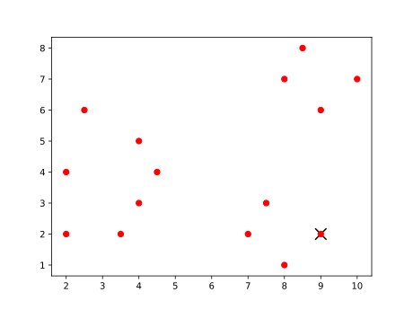
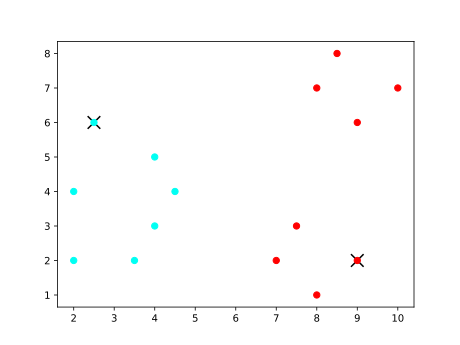
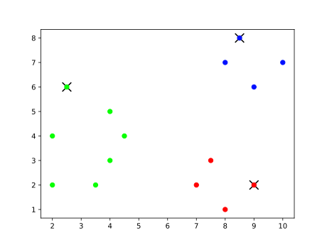

`{bm-disable-all}`

Given k=3 and vectors=[(2, 2), (2, 4), (2.5, 6), (3.5, 2), (4, 3), (4, 5), (4.5, 4), (7, 2), (7.5, 3), (8, 1), (9, 2), (8, 7), (8.5, 8), (9, 6), (10, 7)]...

The farthest first travel heuristic produced the clusters at each iteration ...

 * Iteration 0

    * cluster center (9, 2)=[(2, 2), (2, 4), (2.5, 6), (3.5, 2), (4, 3), (4, 5), (4.5, 4), (7, 2), (7.5, 3), (8, 1), (9, 2), (8, 7), (8.5, 8), (9, 6), (10, 7)]

   

 * Iteration 1

    * cluster center (9, 2)=[(7, 2), (7.5, 3), (8, 1), (9, 2), (8, 7), (8.5, 8), (9, 6), (10, 7)]
    * cluster center (2.5, 6)=[(2, 2), (2, 4), (2.5, 6), (3.5, 2), (4, 3), (4, 5), (4.5, 4)]

   

 * Iteration 2

    * cluster center (9, 2)=[(7, 2), (7.5, 3), (8, 1), (9, 2)]
    * cluster center (2.5, 6)=[(2, 2), (2, 4), (2.5, 6), (3.5, 2), (4, 3), (4, 5), (4.5, 4)]
    * cluster center (8.5, 8)=[(8, 7), (8.5, 8), (9, 6), (10, 7)]

   

`{bm-enable-all}`

