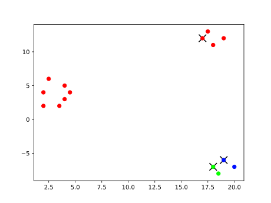
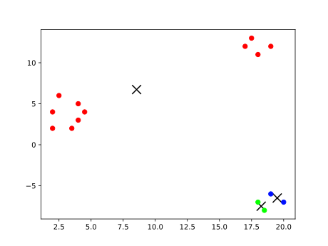

`{bm-disable-all}`

Given k=3 and vectors=[(2, 2), (2, 4), (2.5, 6), (3.5, 2), (4, 3), (4, 5), (4.5, 4), (17, 12), (17.5, 13), (18, 11), (19, 12), (18, -7), (18.5, -8), (19, -6), (20, -7)]...

The llyod's algorithm heuristic produced the clusters at each iteration ...

 * Iteration 0

    * cluster center (17, 12)=[(2, 2), (2, 4), (2.5, 6), (3.5, 2), (4, 3), (4, 5), (4.5, 4), (17, 12), (17.5, 13), (18, 11), (19, 12)]
    * cluster center (18, -7)=[(18, -7), (18.5, -8)]
    * cluster center (19, -6)=[(19, -6), (20, -7)]

   

 * Iteration 1

    * cluster center (8.545454545454545, 6.7272727272727275)=[(2, 2), (2, 4), (2.5, 6), (3.5, 2), (4, 3), (4, 5), (4.5, 4), (17, 12), (17.5, 13), (18, 11), (19, 12)]
    * cluster center (18.25, -7.5)=[(18, -7), (18.5, -8)]
    * cluster center (19.5, -6.5)=[(19, -6), (20, -7)]

   

`{bm-enable-all}`

