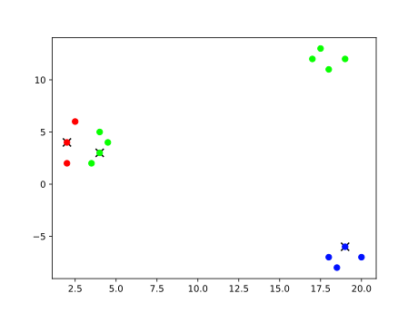
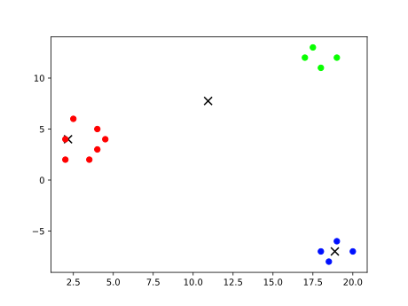
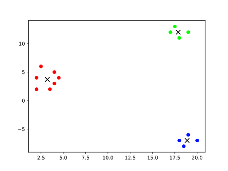

`{bm-disable-all}`

Given k=3 and vectors=[[2, 2], [2, 4], [2.5, 6], [3.5, 2], [4, 3], [4, 5], [4.5, 4], [17, 12], [17.5, 13], [18, 11], [19, 12], [18, -7], [18.5, -8], [19, -6], [20, -7]]...

The llyod's algorithm heuristic produced the clusters at each iteration ...

 * Iteration 0

    * cluster center (2, 4)=[[2, 2], [2, 4], [2.5, 6]]
    * cluster center (4, 3)=[[3.5, 2], [4, 3], [4, 5], [4.5, 4], [17, 12], [17.5, 13], [18, 11], [19, 12]]
    * cluster center (19, -6)=[[18, -7], [18.5, -8], [19, -6], [20, -7]]

   

 * Iteration 1

    * cluster center (2.1666666666666665, 4)=[[2, 2], [2, 4], [2.5, 6], [3.5, 2], [4, 3], [4, 5], [4.5, 4]]
    * cluster center (10.9375, 7.75)=[[17, 12], [17.5, 13], [18, 11], [19, 12]]
    * cluster center (18.875, -7)=[[18, -7], [18.5, -8], [19, -6], [20, -7]]

   

 * Iteration 2

    * cluster center (3.2142857142857144, 3.7142857142857144)=[[2, 2], [2, 4], [2.5, 6], [3.5, 2], [4, 3], [4, 5], [4.5, 4]]
    * cluster center (17.875, 12)=[[17, 12], [17.5, 13], [18, 11], [19, 12]]
    * cluster center (18.875, -7)=[[18, -7], [18.5, -8], [19, -6], [20, -7]]

   

`{bm-enable-all}`

