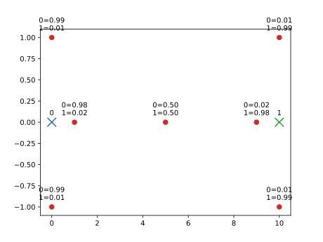

<div style="border:1px solid black;">

`{bm-disable-all}`


Given the following points and centers (and stiffness parameter)...

```
{
  points: [
    [1,0], [0,1], [0,-1],
    [9,0], [10,1], [10,-1],
    [5,0]
  ],
  centers: [[0, 0], [10, 0]],
  stiffness: 0.5
}

```

, ... e-step determined that the confidence of point...

 * (1, 0) being assigned to center (0, 0)=0.982  vs (10, 0)=0.018 
 * (0, 1) being assigned to center (0, 0)=0.989  vs (10, 0)=0.011 
 * (0, -1) being assigned to center (0, 0)=0.989  vs (10, 0)=0.011 
 * (9, 0) being assigned to center (0, 0)=0.018  vs (10, 0)=0.982 
 * (10, 1) being assigned to center (0, 0)=0.011  vs (10, 0)=0.989 
 * (10, -1) being assigned to center (0, 0)=0.011  vs (10, 0)=0.989 
 * (5, 0) being assigned to center (0, 0)=0.500  vs (10, 0)=0.500 




</div>

`{bm-enable-all}`

