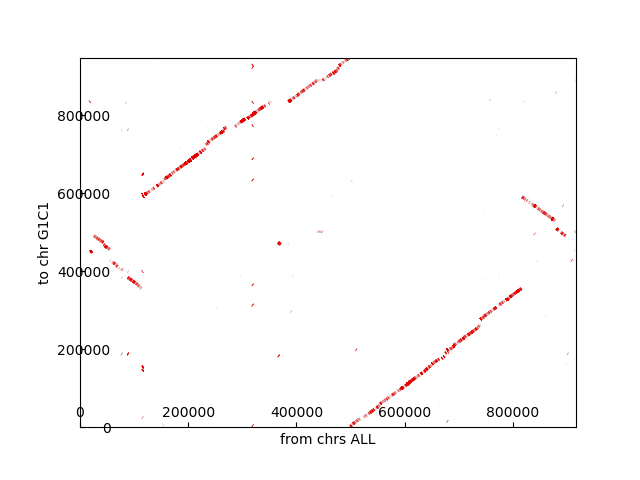
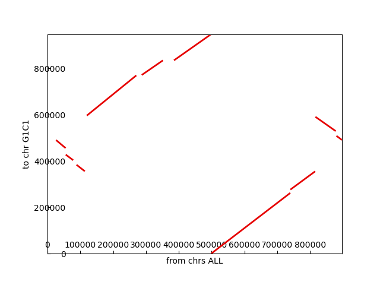

<div style="border:1px solid black;">

`{bm-disable-all}`

Solving a parsimonious reversal path for...

 * k=20
 * cyclic=True
 * show_graph=True
 * genome1 reference: [[G1C1, /input/ch6_code/src/Mycoplasma bovis - GCA_000696015.1_ASM69601v1_genomic.fna.xz]]
 * genome2 reference: [[G2C1, /input/ch6_code/src/Mycoplasma agalactiae 14628 - GCA_000266865.1_ASM26686v1_genomic.fna.xz]]

NOTE: Nucleotide codes that aren't ACGT get filtered out of the genomes.

Generating genomic dotplot...



Clustering genomic dotplot to snyteny graph...
 * Merging radius=25 angle_half_maw=90...
 * Merging radius=50 angle_half_maw=90...
 * Merging radius=100 angle_half_maw=90...
 * Merging radius=200 angle_half_maw=90...
 * Merging radius=400 angle_half_maw=90...
 * Merging radius=800 angle_half_maw=90...
 * Merging radius=1600 angle_half_maw=90...
 * Merging radius=3200 angle_half_maw=90...
 * Filtering max_filter_length=3200.0 max_merge_distance=20000.0...
 * Merging radius=6400 angle_half_maw=90...
 * Merging radius=12800 angle_half_maw=90...
 * Culling below length=10000.0...

Generating synteny graph...



Mapping synteny graph matches to IDs using x-axis genome...
 * G2C1_B0 = {'y': ('G1C1', 456122, 490875), 'x': ('G2C1', 26147, 55215), 'type': 'REVERSE_COMPLEMENT'}
 * G2C1_B1 = {'y': ('G1C1', 403833, 428051), 'x': ('G2C1', 55606, 78341), 'type': 'REVERSE_COMPLEMENT'}
 * G2C1_B2 = {'y': ('G1C1', 356150, 384124), 'x': ('G2C1', 88483, 113645), 'type': 'REVERSE_COMPLEMENT'}
 * G2C1_B3 = {'y': ('G1C1', 596687, 770257), 'x': ('G2C1', 119776, 270535), 'type': 'NORMAL'}
 * G2C1_B4 = {'y': ('G1C1', 772155, 835261), 'x': ('G2C1', 287183, 351652), 'type': 'NORMAL'}
 * G2C1_B5 = {'y': ('G1C1', 835398, 948473), 'x': ('G2C1', 385360, 498503), 'type': 'NORMAL'}
 * G2C1_B6 = {'y': ('G1C1', 90, 262351), 'x': ('G2C1', 498629, 739753), 'type': 'NORMAL'}
 * G2C1_B7 = {'y': ('G1C1', 276780, 355692), 'x': ('G2C1', 740077, 815603), 'type': 'NORMAL'}
 * G2C1_B8 = {'y': ('G1C1', 529629, 591336), 'x': ('G2C1', 816444, 878201), 'type': 'REVERSE_COMPLEMENT'}
 * G2C1_B9 = {'y': ('G1C1', 491197, 509162), 'x': ('G2C1', 880483, 897382), 'type': 'REVERSE_COMPLEMENT'}

Generating permutations for genomes...
 * genome1_permutations=[['+G2C1_B6', '+G2C1_B7', '-G2C1_B2', '-G2C1_B1', '-G2C1_B0', '-G2C1_B9', '-G2C1_B8', '+G2C1_B3', '+G2C1_B4', '+G2C1_B5']]
 * genome2_permutations=[['+G2C1_B0', '+G2C1_B1', '+G2C1_B2', '+G2C1_B3', '+G2C1_B4', '+G2C1_B5', '+G2C1_B6', '+G2C1_B7', '+G2C1_B8', '+G2C1_B9']]

Generating reversal path on genomes that are cyclic=True...
 * INITIAL red_p_list=[['+G2C1_B0', '+G2C1_B1', '+G2C1_B2', '-G2C1_B7', '-G2C1_B6', '-G2C1_B5', '-G2C1_B4', '-G2C1_B3', '+G2C1_B8', '+G2C1_B9']]

   ```{dot}
   graph G {
   layout=neato
   node [shape=plain];
   _G2C1_B6_t_ [pos="5.0,-1.2246467991473533e-15!"];
   _G2C1_B6_h_ [pos="4.755282581475767,-1.5450849718747384!"];
   _G2C1_B5_t_ [pos="4.045084971874736,-2.938926261462367!"];
   _G2C1_B5_h_ [pos="2.9389262614623646,-4.045084971874738!"];
   _G2C1_B4_t_ [pos="1.5450849718747361,-4.755282581475768!"];
   _G2C1_B4_h_ [pos="-9.184850993605148e-16,-5.0!"];
   _G2C1_B3_t_ [pos="-1.5450849718747377,-4.755282581475767!"];
   _G2C1_B3_h_ [pos="-2.9389262614623664,-4.045084971874736!"];
   _G2C1_B2_t_ [pos="-4.045084971874738,-2.938926261462365!"];
   _G2C1_B2_h_ [pos="-4.755282581475768,-1.5450849718747364!"];
   _G2C1_B1_t_ [pos="-5.0,6.123233995736766e-16!"];
   _G2C1_B1_h_ [pos="-4.755282581475767,1.5450849718747375!"];
   _G2C1_B0_t_ [pos="-4.045084971874736,2.9389262614623664!"];
   _G2C1_B0_h_ [pos="-2.938926261462365,4.045084971874737!"];
   _G2C1_B9_t_ [pos="-1.5450849718747368,4.755282581475768!"];
   _G2C1_B9_h_ [pos="3.061616997868383e-16,5.0!"];
   _G2C1_B8_t_ [pos="1.5450849718747373,4.755282581475767!"];
   _G2C1_B8_h_ [pos="2.938926261462366,4.045084971874737!"];
   _G2C1_B7_t_ [pos="4.045084971874737,2.938926261462366!"];
   _G2C1_B7_h_ [pos="4.755282581475767,1.545084971874737!"];
   _G2C1_B6_t_ -- _G2C1_B6_h_ [style=dashed, dir=back];
   _G2C1_B5_t_ -- _G2C1_B5_h_ [style=dashed, dir=back];
   _G2C1_B4_t_ -- _G2C1_B4_h_ [style=dashed, dir=back];
   _G2C1_B3_t_ -- _G2C1_B3_h_ [style=dashed, dir=back];
   _G2C1_B2_t_ -- _G2C1_B2_h_ [style=dashed, dir=back];
   _G2C1_B1_t_ -- _G2C1_B1_h_ [style=dashed, dir=back];
   _G2C1_B0_t_ -- _G2C1_B0_h_ [style=dashed, dir=back];
   _G2C1_B9_t_ -- _G2C1_B9_h_ [style=dashed, dir=back];
   _G2C1_B8_t_ -- _G2C1_B8_h_ [style=dashed, dir=back];
   _G2C1_B7_t_ -- _G2C1_B7_h_ [style=dashed, dir=back];
   _G2C1_B6_t_ -- _G2C1_B7_h_ [color=blue];
   _G2C1_B0_t_ -- _G2C1_B1_h_ [color=blue];
   _G2C1_B8_t_ -- _G2C1_B9_h_ [color=blue];
   _G2C1_B1_t_ -- _G2C1_B2_h_ [color=blue];
   _G2C1_B5_t_ -- _G2C1_B6_h_ [color=blue];
   _G2C1_B7_t_ -- _G2C1_B8_h_ [color=blue];
   _G2C1_B4_t_ -- _G2C1_B5_h_ [color=blue];
   _G2C1_B0_h_ -- _G2C1_B9_t_ [color=blue];
   _G2C1_B2_t_ -- _G2C1_B3_h_ [color=blue];
   _G2C1_B3_t_ -- _G2C1_B4_h_ [color=blue];
   _G2C1_B6_t_ -- _G2C1_B7_h_ [color=red];
   _G2C1_B0_t_ -- _G2C1_B1_h_ [color=red];
   _G2C1_B3_h_ -- _G2C1_B8_h_ [color=red];
   _G2C1_B8_t_ -- _G2C1_B9_h_ [color=red];
   _G2C1_B1_t_ -- _G2C1_B2_h_ [color=red];
   _G2C1_B2_t_ -- _G2C1_B7_t_ [color=red];
   _G2C1_B0_h_ -- _G2C1_B9_t_ [color=red];
   _G2C1_B5_t_ -- _G2C1_B6_h_ [color=red];
   _G2C1_B4_t_ -- _G2C1_B5_h_ [color=red];
   _G2C1_B3_t_ -- _G2C1_B4_h_ [color=red];
   }
   ```
 * red_p_list=[['+G2C1_B0', '+G2C1_B1', '+G2C1_B2', '+G2C1_B3', '+G2C1_B4', '+G2C1_B5', '+G2C1_B6', '+G2C1_B7', '+G2C1_B8', '+G2C1_B9']]

   ```{dot}
   graph G {
   layout=neato
   node [shape=plain];
   _G2C1_B6_t_ [pos="5.0,-1.2246467991473533e-15!"];
   _G2C1_B6_h_ [pos="4.755282581475767,-1.5450849718747384!"];
   _G2C1_B5_t_ [pos="4.045084971874736,-2.938926261462367!"];
   _G2C1_B5_h_ [pos="2.9389262614623646,-4.045084971874738!"];
   _G2C1_B4_t_ [pos="1.5450849718747361,-4.755282581475768!"];
   _G2C1_B4_h_ [pos="-9.184850993605148e-16,-5.0!"];
   _G2C1_B3_t_ [pos="-1.5450849718747377,-4.755282581475767!"];
   _G2C1_B3_h_ [pos="-2.9389262614623664,-4.045084971874736!"];
   _G2C1_B2_t_ [pos="-4.045084971874738,-2.938926261462365!"];
   _G2C1_B2_h_ [pos="-4.755282581475768,-1.5450849718747364!"];
   _G2C1_B1_t_ [pos="-5.0,6.123233995736766e-16!"];
   _G2C1_B1_h_ [pos="-4.755282581475767,1.5450849718747375!"];
   _G2C1_B0_t_ [pos="-4.045084971874736,2.9389262614623664!"];
   _G2C1_B0_h_ [pos="-2.938926261462365,4.045084971874737!"];
   _G2C1_B9_t_ [pos="-1.5450849718747368,4.755282581475768!"];
   _G2C1_B9_h_ [pos="3.061616997868383e-16,5.0!"];
   _G2C1_B8_t_ [pos="1.5450849718747373,4.755282581475767!"];
   _G2C1_B8_h_ [pos="2.938926261462366,4.045084971874737!"];
   _G2C1_B7_t_ [pos="4.045084971874737,2.938926261462366!"];
   _G2C1_B7_h_ [pos="4.755282581475767,1.545084971874737!"];
   _G2C1_B6_t_ -- _G2C1_B6_h_ [style=dashed, dir=back];
   _G2C1_B5_t_ -- _G2C1_B5_h_ [style=dashed, dir=back];
   _G2C1_B4_t_ -- _G2C1_B4_h_ [style=dashed, dir=back];
   _G2C1_B3_t_ -- _G2C1_B3_h_ [style=dashed, dir=back];
   _G2C1_B2_t_ -- _G2C1_B2_h_ [style=dashed, dir=back];
   _G2C1_B1_t_ -- _G2C1_B1_h_ [style=dashed, dir=back];
   _G2C1_B0_t_ -- _G2C1_B0_h_ [style=dashed, dir=back];
   _G2C1_B9_t_ -- _G2C1_B9_h_ [style=dashed, dir=back];
   _G2C1_B8_t_ -- _G2C1_B8_h_ [style=dashed, dir=back];
   _G2C1_B7_t_ -- _G2C1_B7_h_ [style=dashed, dir=back];
   _G2C1_B6_t_ -- _G2C1_B7_h_ [color=blue];
   _G2C1_B0_t_ -- _G2C1_B1_h_ [color=blue];
   _G2C1_B8_t_ -- _G2C1_B9_h_ [color=blue];
   _G2C1_B1_t_ -- _G2C1_B2_h_ [color=blue];
   _G2C1_B5_t_ -- _G2C1_B6_h_ [color=blue];
   _G2C1_B7_t_ -- _G2C1_B8_h_ [color=blue];
   _G2C1_B4_t_ -- _G2C1_B5_h_ [color=blue];
   _G2C1_B0_h_ -- _G2C1_B9_t_ [color=blue];
   _G2C1_B2_t_ -- _G2C1_B3_h_ [color=blue];
   _G2C1_B3_t_ -- _G2C1_B4_h_ [color=blue];
   _G2C1_B6_t_ -- _G2C1_B7_h_ [color=red];
   _G2C1_B0_t_ -- _G2C1_B1_h_ [color=red];
   _G2C1_B8_t_ -- _G2C1_B9_h_ [color=red];
   _G2C1_B1_t_ -- _G2C1_B2_h_ [color=red];
   _G2C1_B0_h_ -- _G2C1_B9_t_ [color=red];
   _G2C1_B5_t_ -- _G2C1_B6_h_ [color=red];
   _G2C1_B4_t_ -- _G2C1_B5_h_ [color=red];
   _G2C1_B7_t_ -- _G2C1_B8_h_ [color=red];
   _G2C1_B2_t_ -- _G2C1_B3_h_ [color=red];
   _G2C1_B3_t_ -- _G2C1_B4_h_ [color=red];
   }
   ```
</div>

`{bm-enable-all}`

