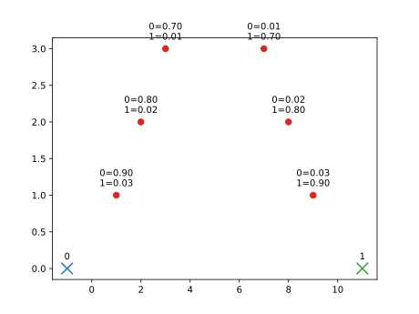

<div style="border:1px solid black;">

`{bm-disable-all}`


Given the following membership confidences (center -> (point, confidence))...

```
{
  membership_confidences: [
    [   # center followed by (point, confidence) pairs
        [-1, 0],
        [[1,1], 0.9],  [[2,2], 0.8],  [[3,3], 0.7],
        [[9,1], 0.03], [[8,2], 0.02], [[7,3], 0.01],
    ],
    [   # center followed by (point, confidence) pairs
        [11, 0],
        [[1,1], 0.03], [[2,2], 0.02], [[3,3], 0.01],
        [[9,1], 0.9],  [[8,2], 0.8],  [[7,3], 0.7],
    ]
  ]
}

```





, ... m-step determined that the new centers should be ...

 * (2.07, 1.91)
 * (7.93, 1.91)

</div>

`{bm-enable-all}`

