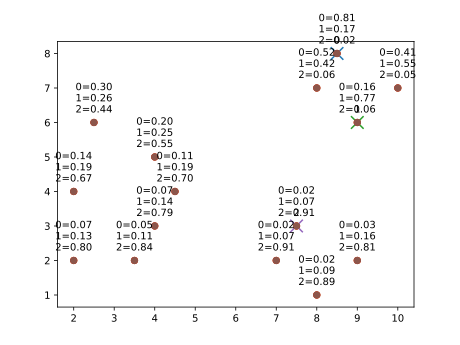
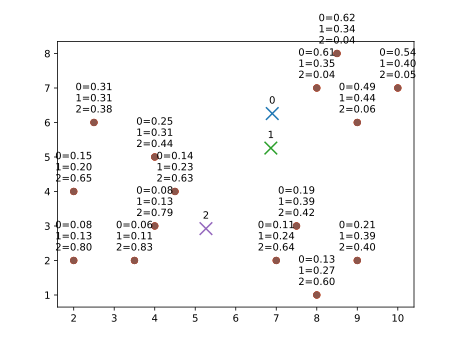
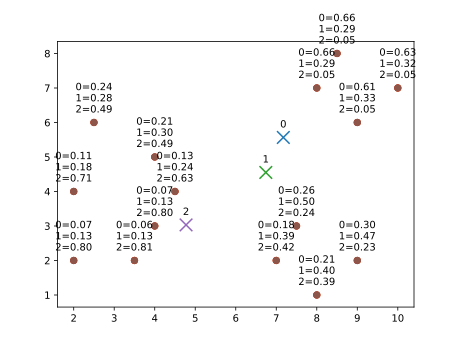
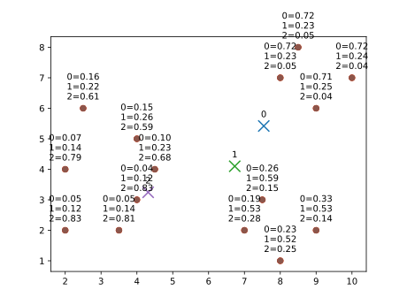
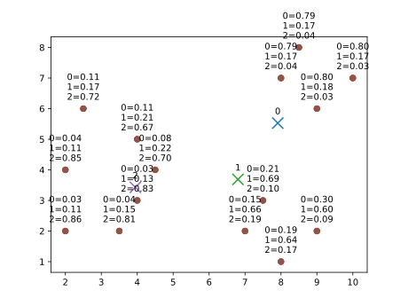
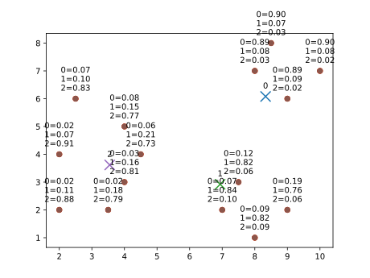
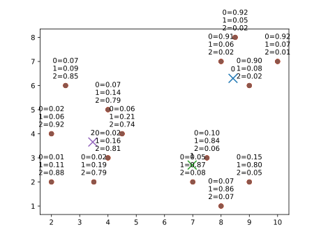

<div style="border:1px solid black;">

`{bm-disable-all}`


Executing soft llyod's algorithm heuristic using the following settings...

```
{
  k: 3,
  points: [
    [2,2], [2,4], [2.5,6], [3.5,2], [4,3], [4,5], [4.5,4],
    [7,2], [7.5,3], [8,1], [9,2],
    [8,7], [8.5,8], [9,6], [10,7]
  ],
  centers: [[8.5, 8], [9, 6], [7.5, 3]], # remove to assign centers using k-means++ initializer
  stiffness: 0.75,                       # stiffness parameter for partition function
  show_every: 1,
  stop_instructions: {
    min_center_step_distance: 0.3,
    max_iterations: 50
  }
}

```

 * Iteration 0

    * cluster center (8.5, 8)={(2, 2): 0.07, (2, 4): 0.14, (2.5, 6): 0.30, (3.5, 2): 0.05, (4, 3): 0.07, (4, 5): 0.20, (4.5, 4): 0.11, (7, 2): 0.02, (7.5, 3): 0.02, (8, 1): 0.02, (9, 2): 0.03, (8, 7): 0.52, (8.5, 8): 0.81, (9, 6): 0.16, (10, 7): 0.41}
    * cluster center (9, 6)={(2, 2): 0.13, (2, 4): 0.19, (2.5, 6): 0.26, (3.5, 2): 0.11, (4, 3): 0.14, (4, 5): 0.25, (4.5, 4): 0.19, (7, 2): 0.07, (7.5, 3): 0.07, (8, 1): 0.09, (9, 2): 0.16, (8, 7): 0.42, (8.5, 8): 0.17, (9, 6): 0.77, (10, 7): 0.55}
    * cluster center (7.5, 3)={(2, 2): 0.80, (2, 4): 0.67, (2.5, 6): 0.44, (3.5, 2): 0.84, (4, 3): 0.79, (4, 5): 0.55, (4.5, 4): 0.70, (7, 2): 0.91, (7.5, 3): 0.91, (8, 1): 0.89, (9, 2): 0.81, (8, 7): 0.06, (8.5, 8): 0.02, (9, 6): 0.06, (10, 7): 0.05}

    

 * Iteration 1

    * cluster center (6.900764834949414, 6.2583805733336195)={(2, 2): 0.08, (2, 4): 0.15, (2.5, 6): 0.31, (3.5, 2): 0.06, (4, 3): 0.08, (4, 5): 0.25, (4.5, 4): 0.14, (7, 2): 0.11, (7.5, 3): 0.19, (8, 1): 0.13, (9, 2): 0.21, (8, 7): 0.61, (8.5, 8): 0.62, (9, 6): 0.49, (10, 7): 0.54}
    * cluster center (6.8663318021726365, 5.257945568356075)={(2, 2): 0.13, (2, 4): 0.20, (2.5, 6): 0.31, (3.5, 2): 0.11, (4, 3): 0.13, (4, 5): 0.31, (4.5, 4): 0.23, (7, 2): 0.24, (7.5, 3): 0.39, (8, 1): 0.27, (9, 2): 0.39, (8, 7): 0.35, (8.5, 8): 0.34, (9, 6): 0.44, (10, 7): 0.40}
    * cluster center (5.264471661631823, 2.923413768720758)={(2, 2): 0.80, (2, 4): 0.65, (2.5, 6): 0.38, (3.5, 2): 0.83, (4, 3): 0.79, (4, 5): 0.44, (4.5, 4): 0.63, (7, 2): 0.64, (7.5, 3): 0.42, (8, 1): 0.60, (9, 2): 0.40, (8, 7): 0.04, (8.5, 8): 0.04, (9, 6): 0.06, (10, 7): 0.05}

    

 * Iteration 2

    * cluster center (7.174288702650358, 5.5657853425728945)={(2, 2): 0.07, (2, 4): 0.11, (2.5, 6): 0.24, (3.5, 2): 0.06, (4, 3): 0.07, (4, 5): 0.21, (4.5, 4): 0.13, (7, 2): 0.18, (7.5, 3): 0.26, (8, 1): 0.21, (9, 2): 0.30, (8, 7): 0.66, (8.5, 8): 0.66, (9, 6): 0.61, (10, 7): 0.63}
    * cluster center (6.741608864023925, 4.551421603185921)={(2, 2): 0.13, (2, 4): 0.18, (2.5, 6): 0.28, (3.5, 2): 0.13, (4, 3): 0.13, (4, 5): 0.30, (4.5, 4): 0.24, (7, 2): 0.39, (7.5, 3): 0.50, (8, 1): 0.40, (9, 2): 0.47, (8, 7): 0.29, (8.5, 8): 0.29, (9, 6): 0.33, (10, 7): 0.32}
    * cluster center (4.773471699369535, 3.030734436505203)={(2, 2): 0.80, (2, 4): 0.71, (2.5, 6): 0.49, (3.5, 2): 0.81, (4, 3): 0.80, (4, 5): 0.49, (4.5, 4): 0.63, (7, 2): 0.42, (7.5, 3): 0.24, (8, 1): 0.39, (9, 2): 0.23, (8, 7): 0.05, (8.5, 8): 0.05, (9, 6): 0.05, (10, 7): 0.05}

    

 * Iteration 3

    * cluster center (7.539399344861868, 5.419288635400964)={(2, 2): 0.05, (2, 4): 0.07, (2.5, 6): 0.16, (3.5, 2): 0.05, (4, 3): 0.04, (4, 5): 0.15, (4.5, 4): 0.10, (7, 2): 0.19, (7.5, 3): 0.26, (8, 1): 0.23, (9, 2): 0.33, (8, 7): 0.72, (8.5, 8): 0.72, (9, 6): 0.71, (10, 7): 0.72}
    * cluster center (6.729274262743777, 4.099448158350826)={(2, 2): 0.12, (2, 4): 0.14, (2.5, 6): 0.22, (3.5, 2): 0.14, (4, 3): 0.12, (4, 5): 0.26, (4.5, 4): 0.23, (7, 2): 0.53, (7.5, 3): 0.59, (8, 1): 0.52, (9, 2): 0.53, (8, 7): 0.23, (8.5, 8): 0.23, (9, 6): 0.25, (10, 7): 0.24}
    * cluster center (4.313755045634259, 3.2452822439819693)={(2, 2): 0.83, (2, 4): 0.79, (2.5, 6): 0.61, (3.5, 2): 0.81, (4, 3): 0.83, (4, 5): 0.59, (4.5, 4): 0.68, (7, 2): 0.28, (7.5, 3): 0.15, (8, 1): 0.25, (9, 2): 0.14, (8, 7): 0.05, (8.5, 8): 0.05, (9, 6): 0.04, (10, 7): 0.04}

    

 * Iteration 4

    * cluster center (7.91057889322005, 5.52737116596979)={(2, 2): 0.03, (2, 4): 0.04, (2.5, 6): 0.11, (3.5, 2): 0.04, (4, 3): 0.03, (4, 5): 0.11, (4.5, 4): 0.08, (7, 2): 0.15, (7.5, 3): 0.21, (8, 1): 0.19, (9, 2): 0.30, (8, 7): 0.79, (8.5, 8): 0.79, (9, 6): 0.80, (10, 7): 0.80}
    * cluster center (6.803089239304466, 3.687644371627943)={(2, 2): 0.11, (2, 4): 0.11, (2.5, 6): 0.17, (3.5, 2): 0.15, (4, 3): 0.13, (4, 5): 0.21, (4.5, 4): 0.22, (7, 2): 0.66, (7.5, 3): 0.69, (8, 1): 0.64, (9, 2): 0.60, (8, 7): 0.17, (8.5, 8): 0.17, (9, 6): 0.18, (10, 7): 0.17}
    * cluster center (3.9471447451182877, 3.426611200033247)={(2, 2): 0.86, (2, 4): 0.85, (2.5, 6): 0.72, (3.5, 2): 0.81, (4, 3): 0.83, (4, 5): 0.67, (4.5, 4): 0.70, (7, 2): 0.19, (7.5, 3): 0.10, (8, 1): 0.17, (9, 2): 0.09, (8, 7): 0.04, (8.5, 8): 0.04, (9, 6): 0.03, (10, 7): 0.03}

    

 * Iteration 5

    * cluster center (8.172308532206864, 5.783651262108903)={(2, 2): 0.02, (2, 4): 0.03, (2.5, 6): 0.09, (3.5, 2): 0.03, (4, 3): 0.03, (4, 5): 0.09, (4.5, 4): 0.07, (7, 2): 0.10, (7.5, 3): 0.15, (8, 1): 0.14, (9, 2): 0.24, (8, 7): 0.85, (8.5, 8): 0.86, (9, 6): 0.86, (10, 7): 0.86}
    * cluster center (6.881645528580001, 3.2695060621654113)={(2, 2): 0.11, (2, 4): 0.08, (2.5, 6): 0.13, (3.5, 2): 0.17, (4, 3): 0.15, (4, 5): 0.18, (4.5, 4): 0.22, (7, 2): 0.77, (7.5, 3): 0.78, (8, 1): 0.75, (9, 2): 0.69, (8, 7): 0.12, (8.5, 8): 0.11, (9, 6): 0.12, (10, 7): 0.12}
    * cluster center (3.6995743512272283, 3.54538379313345)={(2, 2): 0.87, (2, 4): 0.89, (2.5, 6): 0.79, (3.5, 2): 0.80, (4, 3): 0.82, (4, 5): 0.73, (4.5, 4): 0.71, (7, 2): 0.13, (7.5, 3): 0.07, (8, 1): 0.12, (9, 2): 0.07, (8, 7): 0.03, (8.5, 8): 0.03, (9, 6): 0.02, (10, 7): 0.02}

    

 * Iteration 6

    * cluster center (8.330901503847649, 6.079429665818303)={(2, 2): 0.02, (2, 4): 0.02, (2.5, 6): 0.07, (3.5, 2): 0.02, (4, 3): 0.03, (4, 5): 0.08, (4.5, 4): 0.06, (7, 2): 0.07, (7.5, 3): 0.12, (8, 1): 0.09, (9, 2): 0.19, (8, 7): 0.89, (8.5, 8): 0.90, (9, 6): 0.89, (10, 7): 0.90}
    * cluster center (6.936559803808235, 2.9208106871604094)={(2, 2): 0.11, (2, 4): 0.07, (2.5, 6): 0.10, (3.5, 2): 0.18, (4, 3): 0.16, (4, 5): 0.15, (4.5, 4): 0.21, (7, 2): 0.84, (7.5, 3): 0.82, (8, 1): 0.82, (9, 2): 0.76, (8, 7): 0.08, (8.5, 8): 0.07, (9, 6): 0.09, (10, 7): 0.08}
    * cluster center (3.5470929502708515, 3.6171959293531435)={(2, 2): 0.88, (2, 4): 0.91, (2.5, 6): 0.83, (3.5, 2): 0.79, (4, 3): 0.81, (4, 5): 0.77, (4.5, 4): 0.73, (7, 2): 0.10, (7.5, 3): 0.06, (8, 1): 0.09, (9, 2): 0.06, (8, 7): 0.03, (8.5, 8): 0.03, (9, 6): 0.02, (10, 7): 0.02}

    

 * Iteration 7

    * cluster center (8.423207791938323, 6.298168190959322)={(2, 2): 0.01, (2, 4): 0.02, (2.5, 6): 0.07, (3.5, 2): 0.02, (4, 3): 0.02, (4, 5): 0.07, (4.5, 4): 0.06, (7, 2): 0.05, (7.5, 3): 0.10, (8, 1): 0.07, (9, 2): 0.15, (8, 7): 0.91, (8.5, 8): 0.92, (9, 6): 0.90, (10, 7): 0.92}
    * cluster center (6.9781999785084095, 2.701391185190995)={(2, 2): 0.11, (2, 4): 0.06, (2.5, 6): 0.09, (3.5, 2): 0.19, (4, 3): 0.16, (4, 5): 0.14, (4.5, 4): 0.21, (7, 2): 0.87, (7.5, 3): 0.84, (8, 1): 0.86, (9, 2): 0.80, (8, 7): 0.06, (8.5, 8): 0.05, (9, 6): 0.08, (10, 7): 0.07}
    * cluster center (3.4625169810561793, 3.6573047295613943)={(2, 2): 0.88, (2, 4): 0.92, (2.5, 6): 0.85, (3.5, 2): 0.79, (4, 3): 0.81, (4, 5): 0.79, (4.5, 4): 0.74, (7, 2): 0.08, (7.5, 3): 0.06, (8, 1): 0.07, (9, 2): 0.05, (8, 7): 0.02, (8.5, 8): 0.02, (9, 6): 0.02, (10, 7): 0.01}

    

Stopping -- center convergence step distance below threshold (largest_center_step_distance=0.23741733972468515)

 * FINAL RESULT:

    * cluster center (8.423207791938323, 6.298168190959322)={(2, 2): 0.01, (2, 4): 0.02, (2.5, 6): 0.07, (3.5, 2): 0.02, (4, 3): 0.02, (4, 5): 0.07, (4.5, 4): 0.06, (7, 2): 0.05, (7.5, 3): 0.10, (8, 1): 0.07, (9, 2): 0.15, (8, 7): 0.91, (8.5, 8): 0.92, (9, 6): 0.90, (10, 7): 0.92}
    * cluster center (6.9781999785084095, 2.701391185190995)={(2, 2): 0.11, (2, 4): 0.06, (2.5, 6): 0.09, (3.5, 2): 0.19, (4, 3): 0.16, (4, 5): 0.14, (4.5, 4): 0.21, (7, 2): 0.87, (7.5, 3): 0.84, (8, 1): 0.86, (9, 2): 0.80, (8, 7): 0.06, (8.5, 8): 0.05, (9, 6): 0.08, (10, 7): 0.07}
    * cluster center (3.4625169810561793, 3.6573047295613943)={(2, 2): 0.88, (2, 4): 0.92, (2.5, 6): 0.85, (3.5, 2): 0.79, (4, 3): 0.81, (4, 5): 0.79, (4.5, 4): 0.74, (7, 2): 0.08, (7.5, 3): 0.06, (8, 1): 0.07, (9, 2): 0.05, (8, 7): 0.02, (8.5, 8): 0.02, (9, 6): 0.02, (10, 7): 0.01}

    

</div>

`{bm-enable-all}`

