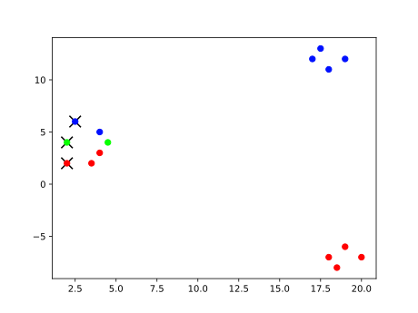
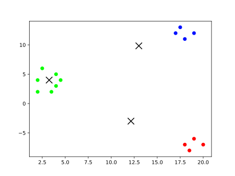
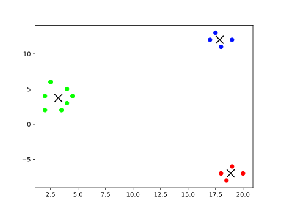

`{bm-disable-all}`

Given k=3 and vectors=[(2, 2), (2, 4), (2.5, 6), (3.5, 2), (4, 3), (4, 5), (4.5, 4), (17, 12), (17.5, 13), (18, 11), (19, 12), (18, -7), (18.5, -8), (19, -6), (20, -7)]...

The llyod's algorithm heuristic produced the clusters at each iteration ...

 * Iteration 0

    * cluster center (2, 2)=[(2, 2), (3.5, 2), (4, 3), (18, -7), (18.5, -8), (19, -6), (20, -7)]
    * cluster center (2, 4)=[(2, 4), (4.5, 4)]
    * cluster center (2.5, 6)=[(2.5, 6), (4, 5), (17, 12), (17.5, 13), (18, 11), (19, 12)]

   

 * Iteration 1

    * cluster center (12.142857142857142, -3)=[(18, -7), (18.5, -8), (19, -6), (20, -7)]
    * cluster center (3.25, 4)=[(2, 2), (2, 4), (2.5, 6), (3.5, 2), (4, 3), (4, 5), (4.5, 4)]
    * cluster center (13.0, 9.833333333333334)=[(17, 12), (17.5, 13), (18, 11), (19, 12)]

   

 * Iteration 2

    * cluster center (18.875, -7)=[(18, -7), (18.5, -8), (19, -6), (20, -7)]
    * cluster center (3.2142857142857144, 3.7142857142857144)=[(2, 2), (2, 4), (2.5, 6), (3.5, 2), (4, 3), (4, 5), (4.5, 4)]
    * cluster center (17.875, 12)=[(17, 12), (17.5, 13), (18, 11), (19, 12)]

   

`{bm-enable-all}`

