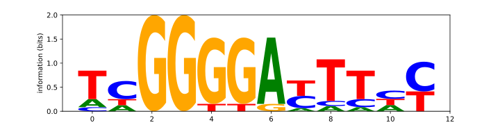

`{bm-disable-all}`

Generating logo for the following motif matrix...

TCGGGGGTTTTT CCGGTGACTTAC ACGGGGATTTTC TTGGGGACTTTT AAGGGGACTTCC TTGGGGACTTCC TCGGGGATTCAT TCGGGGATTCCT TAGGGGAACTAC TCGGGTATAACC

Result...

`{bm-enable-all}`

