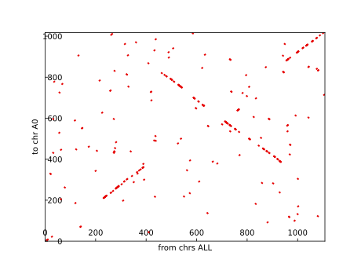
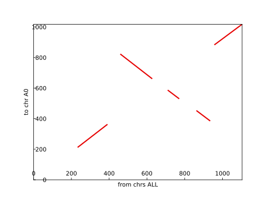

`{bm-disable-all}`

Generating synteny graph for...

 * k=7
 * cyclic=False
 * genome1={'A0': 'GGATGGTGTCCTCATCTAATGATGTCGGTAAAGAGTCTACCCCGAATGATTATCTGAGTCTCCCATGAACCAAGTCCGTGGTATAGTCCATACTCTGAACCAAAACAGATAAACCAGCAAGATACATTGCAGAAGCTTGCCACCTTAGCAGGTTGTCAGATATCCGTTTCTGGAACTCCCGGGAGGACGATCGGAAGTTGAGCACAGGTACAAACACTTCAGGAATGATCTACTAAACTTTAGGGTCCGTACCTTTTATAATCCTTGCTAGCATCATGTTGAAGGTTAGAGGATTCCGAAACCAGAAGTGGCGATCTCGCTAAAGCAGGTCACCACGGTCAGCGGGTGGCCATTTACTCGTGAAAACCATAGTCCGTGAAAGCTGGGCAACTTTAGTTGGGACCCTTAAGGCGACTGAGGGAAGCAACTATCGGAAGTATCGTACAGGTCGTAAAGTACCAGTACGGAAGAAGCAGGGAGTTATAATATTCACTACCACAATTACCCGAGTTCACTTGTTTCAATCGCCCTCCCTTGACAGAACGTGCGTTACGTAGGAGTGCTTGACATACGGCGGCCGTCTGAGCTAGGACTATCGGAGCGTAATAATGGGATTTCAAATTTACCAGTTCCAGGTTGTCCAAGGGCTTGGCGGTGAGTCGACATGGAAAGATAAATTCCTCAGGTGCTGGCGCTCCCGTGGGGCCGCAGACACTACCTATTGGAGGGTGCTTAAACTATACAGCGCGCTAATTGTTAACTACTCCTTTGTGTCATAAGGGAGGGGAAACACGCGAGGACCGCCTTTGATCTGGTTCAAACGCCTAGAAGTATCTCCATTCTGTCCATTACGCCACCGCCCCGTCGAATGGTACCGGTATCGCTTGACATCTGCTTCTATACTAGAACAACTAATGCCGGCTTCTGGAGTGAAGGCACCATCCCACCAGAGCATTGAAGATTCGCTCGTTGGATTGATAGGAGTGAATATTCTGTCATCTCCTAACTTTTTGGGCACAGCTAG'}
 * genome2={'B0': 'CGGCATGGTGTCCTTCATGTGACCTGATGTCCGATAAGGGGGTTCTACGAAGGGCCCTCCACAGGTCCTTTGCCTAAGGATTGTTGGGTCGCATTCAACTGTTACGGAGACGTTACTAGGACGACCTAATAGAACACAACCAAGTTACGTACGCTATATCCTGTCCTGACCCAGTACCCTCTGGGTCTATATAAGTAAGCGGGTACGATTCGAGAGGGGAGCAACCAGTTACAAACACTTCAGGAATCGATCTTACTTAAACTTTTGGGTCCGATACTTTATAATCCTTGCTAGCCTACGATGTTGAGTTGAGGATTCGCGAACCAGAACAATTGCCGATACTCGCTATTAGAGGTCTCCAACGGTCACCGGGTGGGCCATTGACTCGTGAAACCAATAACCGGTGCCATTCGGACAGGGTGCTGTGGCTAGTGAAGTGAATGGCAGATTACGTCTACTGCGTTTGCAACCCAGATCCAAAGGCGTGGCTTCTACGCGTGTTTCCCATCCCTTATCACACAAGAGGGAGTAGTTAACAATTAGCGTGCTGAAGTAGTAAGCCACCCCAATGTTTAGTTCTGCGTGCCCACGGGAGCCAAGCCATCCTGAGGATTTTATGTGTCCATGTCGACAACTACACGGCAAGCACTTAGACAAGCCTGGCAACTGCGTAGAATTATGAAAGCCCACTTATTGCTCCGTATGGTCCGAGCTCAGACGGCCGCCGCTATGTCAAGCACCCCTACGGTTAACGCACGTGTTGTCCAAGGGAAGAGCGGATTGGAGACAAACGTGATCTGCGGGTTAATTGTGGTTAGTGACTATTATTAACCTCCCGTCTTCCTTCCGTCACGGGTAACCTTTACGACCTCATTACGATACTCTCCGATAGGTTGCCTTACCTTCAGTCGCCTAACGGGTCCCAATAAAGTTGCCCGCGTTCTAGGCGAATCATCGCTTGACATCTTGCTTCTTATATACAACCAACCAAATCCCGGCTTCTGGAGCTGAGGCACGCATCCCACCCAGAGGCATTGAAGATTACGCCTCGTTCGGATTGATAGTAGTGCGATATTCTGTATCTCCCTAACTATTTTCGGGCACACTACG'}

Original genomic dot plot...

Merging radius=10 angle_half_maw=45...

Merging radius=15 angle_half_maw=45...

Merging radius=25 angle_half_maw=45...

Merging radius=35 angle_half_maw=45...

Filtering max_filter_length=35.0 max_merge_distance=35.0...

Merging radius=100 angle_half_maw=45...

Filtering max_filter_length=65.0 max_merge_distance=65.0...

Culling below length=15.0...

Final synteny graph...

 * {'y': ('A0', 883, 1018), 'x': ('B0', 957, 1104), 'type': 'NORMAL'}
 * {'y': ('A0', 385, 453), 'x': ('B0', 862, 935), 'type': 'REVERSE_COMPLEMENT'}
 * {'y': ('A0', 661, 823), 'x': ('B0', 459, 628), 'type': 'REVERSE_COMPLEMENT'}
 * {'y': ('A0', 530, 587), 'x': ('B0', 710, 771), 'type': 'REVERSE_COMPLEMENT'}
 * {'y': ('A0', 212, 363), 'x': ('B0', 233, 391), 'type': 'NORMAL'}

`{bm-enable-all}`

