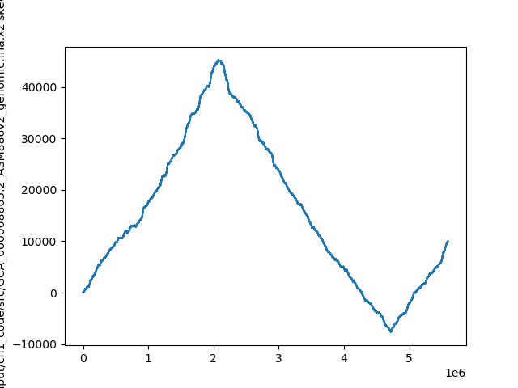

`{bm-disable-all}`

Calculating skew for: ...

Result: [0, 0, 1, 0,...

Ori vicinity (min pos): 4719166

In the ori vicinity, found clusters of k=9 (at least 3 occurrences in window of 500) in ... at...
 * KmerCluster(kmer='CGGTGCTGG', start_index=9, occurrence_count=3)
 * KmerCluster(kmer='CCGCGCTGG', start_index=9, occurrence_count=3)
 * KmerCluster(kmer='TCGGCGGTA', start_index=52, occurrence_count=3)
 * KmerCluster(kmer='CTCGGCGGT', start_index=53, occurrence_count=3)
 * KmerCluster(kmer='CTGAAGATC', start_index=98, occurrence_count=3)
 * KmerCluster(kmer='AGGCGGTTC', start_index=160, occurrence_count=3)
 * KmerCluster(kmer='CAGGCGGCT', start_index=161, occurrence_count=3)
 * KmerCluster(kmer='CAGGCGGGT', start_index=161, occurrence_count=3)
 * KmerCluster(kmer='CAGGCGGAT', start_index=161, occurrence_count=3)
 * KmerCluster(kmer='CAGGCGGTT', start_index=161, occurrence_count=4)
 * KmerCluster(kmer='TCAGGCGGT', start_index=162, occurrence_count=4)
 * KmerCluster(kmer='ATCAGGCGG', start_index=163, occurrence_count=4)
 * KmerCluster(kmer='CATCAGGCG', start_index=164, occurrence_count=3)
 * KmerCluster(kmer='CCATCAGGC', start_index=165, occurrence_count=3)
 * KmerCluster(kmer='CGGCGATGG', start_index=199, occurrence_count=3)
 * KmerCluster(kmer='GGCGGTATG', start_index=210, occurrence_count=3)
 * KmerCluster(kmer='GGCGGTTCG', start_index=210, occurrence_count=3)
 * KmerCluster(kmer='GGCAGTACG', start_index=210, occurrence_count=3)
 * KmerCluster(kmer='CAGGCGGTT', start_index=212, occurrence_count=3)
 * KmerCluster(kmer='TCAGGCGGA', start_index=213, occurrence_count=3)
 * KmerCluster(kmer='TCAGGCGGG', start_index=213, occurrence_count=3)
 * KmerCluster(kmer='TCAGGCGGC', start_index=213, occurrence_count=3)
 * KmerCluster(kmer='TCAGGCGGT', start_index=213, occurrence_count=3)
 * KmerCluster(kmer='TTCAGGCGG', start_index=214, occurrence_count=3)
 * KmerCluster(kmer='ATCAGGCGG', start_index=214, occurrence_count=3)
 * KmerCluster(kmer='CTCAGGCGG', start_index=214, occurrence_count=3)
 * KmerCluster(kmer='GTCAGGCGG', start_index=214, occurrence_count=3)
 * KmerCluster(kmer='GGTCAGGCG', start_index=215, occurrence_count=3)
 * KmerCluster(kmer='CGGATCCTG', start_index=232, occurrence_count=3)
 * KmerCluster(kmer='CGGATCGTT', start_index=232, occurrence_count=3)
 * KmerCluster(kmer='GCGGATCCT', start_index=233, occurrence_count=3)
 * KmerCluster(kmer='CCGGATCGT', start_index=233, occurrence_count=3)
 * KmerCluster(kmer='AGCCGGATC', start_index=235, occurrence_count=3)
 * KmerCluster(kmer='GATCCTAAA', start_index=282, occurrence_count=3)
 * KmerCluster(kmer='TTTTGATAC', start_index=427, occurrence_count=3)
 * KmerCluster(kmer='TTCTTTTGA', start_index=430, occurrence_count=3)
 * KmerCluster(kmer='TGGCTGGGG', start_index=460, occurrence_count=3)
 * KmerCluster(kmer='ATCACCATT', start_index=500, occurrence_count=3)
 * KmerCluster(kmer='TCCTTTTTA', start_index=513, occurrence_count=3)
 * KmerCluster(kmer='ATCCTTTTT', start_index=514, occurrence_count=3)
 * KmerCluster(kmer='GATCCTTTT', start_index=515, occurrence_count=3)
 * KmerCluster(kmer='GATCCTTAT', start_index=515, occurrence_count=3)
 * KmerCluster(kmer='GGATCCTTT', start_index=516, occurrence_count=3)
 * KmerCluster(kmer='CGGATCATT', start_index=517, occurrence_count=3)
 * KmerCluster(kmer='CCGATCCTT', start_index=517, occurrence_count=3)
 * KmerCluster(kmer='AGGATCCTT', start_index=517, occurrence_count=3)
 * KmerCluster(kmer='CTGATCCTT', start_index=517, occurrence_count=3)
 * KmerCluster(kmer='CCGGATCCC', start_index=518, occurrence_count=3)
 * KmerCluster(kmer='CAGGATCCT', start_index=518, occurrence_count=3)
 * KmerCluster(kmer='CCCGGATCC', start_index=519, occurrence_count=3)
 * KmerCluster(kmer='TTATCCAGA', start_index=522, occurrence_count=3)
 * KmerCluster(kmer='CCAGGTTTT', start_index=529, occurrence_count=3)
 * KmerCluster(kmer='TCATTCTCA', start_index=611, occurrence_count=3)
 * KmerCluster(kmer='TCCCAGGTT', start_index=618, occurrence_count=3)
 * KmerCluster(kmer='ACAGATCTT', start_index=644, occurrence_count=3)
 * KmerCluster(kmer='AAACAGATC', start_index=646, occurrence_count=3)
 * KmerCluster(kmer='TCCAAATAA', start_index=653, occurrence_count=3)
 * KmerCluster(kmer='TTATTGATC', start_index=730, occurrence_count=3)
 * KmerCluster(kmer='GTTGTTGAG', start_index=731, occurrence_count=3)
 * KmerCluster(kmer='AGGATCAAC', start_index=769, occurrence_count=3)
 * KmerCluster(kmer='AGATCAACC', start_index=836, occurrence_count=3)

`{bm-enable-all}`

