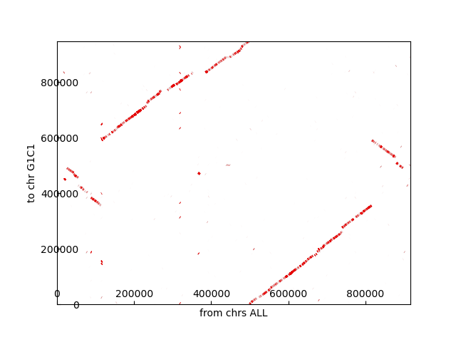
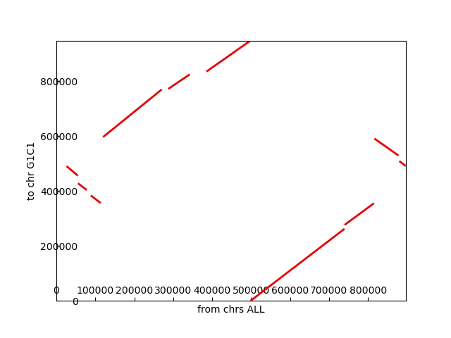

`{bm-disable-all}`

Finding synteny blocks for...

 * k=20
 * cyclic=True
 * show_graph=True
 * genome1 reference: [[G1C1, /input/ch6_code/src/Mycoplasma bovis - GCA_000696015.1_ASM69601v1_genomic.fna.xz]]
 * genome2 reference: [[G2C1, /input/ch6_code/src/Mycoplasma agalactiae 14628 - GCA_000266865.1_ASM26686v1_genomic.fna.xz]]

NOTE: Nucleotide codes that aren't ACGT get filtered out of the genomes.

Generating genomic dotplot...

Clustering genomic dotplot to snyteny graph...
 * Merging radius=25 angle_half_maw=90...
 * Merging radius=50 angle_half_maw=90...
 * Merging radius=100 angle_half_maw=90...
 * Merging radius=200 angle_half_maw=90...
 * Merging radius=400 angle_half_maw=90...
 * Merging radius=800 angle_half_maw=90...
 * Merging radius=1600 angle_half_maw=90...
 * Merging radius=3200 angle_half_maw=90...
 * Filtering max_filter_length=3200.0 max_merge_distance=20000.0...
 * Merging radius=6400 angle_half_maw=90...
 * Merging radius=12800 angle_half_maw=90...
 * Culling below length=10000.0...

Generating synteny graph...

Mapping synteny graph matches to IDs using x-axis genome...
 * G2C1_B0 = {'y': ('G1C1', 456122, 490876), 'x': ('G2C1', 26146, 55215), 'type': 'REVERSE_COMPLEMENT'}
 * G2C1_B1 = {'y': ('G1C1', 403834, 428046), 'x': ('G2C1', 55611, 78340), 'type': 'REVERSE_COMPLEMENT'}
 * G2C1_B2 = {'y': ('G1C1', 356151, 384123), 'x': ('G2C1', 88484, 113644), 'type': 'REVERSE_COMPLEMENT'}
 * G2C1_B3 = {'y': ('G1C1', 596687, 770257), 'x': ('G2C1', 119776, 270535), 'type': 'NORMAL'}
 * G2C1_B4 = {'y': ('G1C1', 772154, 825262), 'x': ('G2C1', 287182, 342448), 'type': 'NORMAL'}
 * G2C1_B5 = {'y': ('G1C1', 835398, 948473), 'x': ('G2C1', 385360, 498503), 'type': 'NORMAL'}
 * G2C1_B6 = {'y': ('G1C1', 90, 262351), 'x': ('G2C1', 498629, 739753), 'type': 'NORMAL'}
 * G2C1_B7 = {'y': ('G1C1', 276780, 355692), 'x': ('G2C1', 740077, 815603), 'type': 'NORMAL'}
 * G2C1_B8 = {'y': ('G1C1', 529629, 591336), 'x': ('G2C1', 816444, 878201), 'type': 'REVERSE_COMPLEMENT'}
 * G2C1_B9 = {'y': ('G1C1', 491197, 509162), 'x': ('G2C1', 880483, 897382), 'type': 'REVERSE_COMPLEMENT'}

`{bm-enable-all}`

