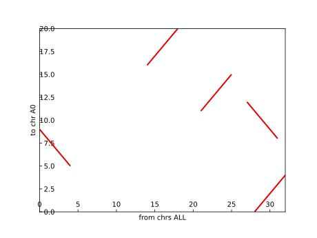

`{bm-disable-all}`

Generating genomic dot plot for...

 * k=5
 * cyclic=False
 * genome1={'A0': 'GGGGGAAACCCCATGCACTGG'}
 * genome2={'B0': 'GGTTTAGGTGACTTACTGGAACATGCTTGGGGG'}

Result...

 * {'y': ('A0', 11, 15), 'x': ('B0', 21, 25), 'type': 'NORMAL'}
 * {'y': ('A0', 16, 20), 'x': ('B0', 14, 18), 'type': 'NORMAL'}
 * {'y': ('A0', 0, 4), 'x': ('B0', 28, 32), 'type': 'NORMAL'}
 * {'y': ('A0', 5, 9), 'x': ('B0', 0, 4), 'type': 'REVERSE_COMPLEMENT'}
 * {'y': ('A0', 8, 12), 'x': ('B0', 27, 31), 'type': 'REVERSE_COMPLEMENT'}

`{bm-enable-all}`

