```{githubmd}
```

```{title}
FreeCAD
```

```{toc}
```

# Introduction

`{bm} /(Introduction)_TOPIC/i`

FreeCAD is a parametric 3D computer-aided design / modeling tool. It contains different segments of functionality, referred to as workbenches_FC. Each workbench_FC targets a different aspect of the overall design workflow (e.g., sketching_FC, turning sketches_FC into 3D objects, and assembling 3D objects together).

The following subsections give a basic overview and usage reference for the subset of workbenches_FC related to 3D printing.

```{note}
This section assumes you have past experience with some 3D editors.
```

# User Interface Layout

`{bm} /(User Interface Layout)_TOPIC/i`

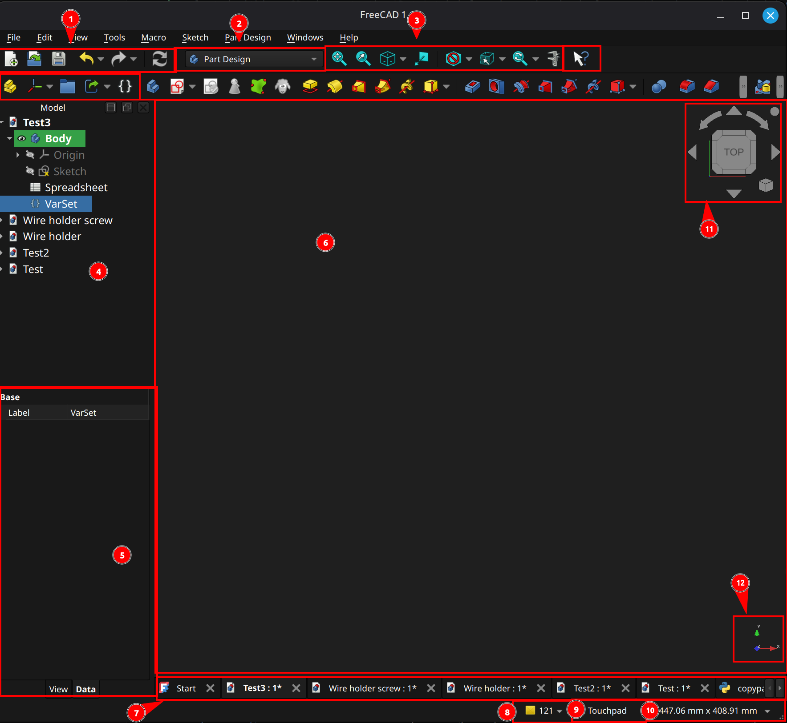

Regardless of which workbench_FC you're in, FreeCAD's UI will likely have the sections highlighted in the screenshot above. Almost everything in the toolbar can also be accessed via the main menu and triggered via a keyboard shortcut.

```{note}
When in doubt, click the button immediately to the right of 3 (pointer with a question mark) and select something to learn more about it.
```

```{note}
If something is missing from your toolbar, navigate to **View** → **Toolbars** and enable as needed.
```

**Viewport**

 * (6) Viewport: The space in which work in performed. The viewport typically renders and allows control of geometry (e.g., 3D primitives, 2D sketches_FC, and technical drawings). For some workbenches_FC, the viewport displays something different than geometry (e.g., spreadsheet_FC).

 * (11) Navigation cube: When working in 3D, there will be a navigation cube (located in the viewport's top right in the example) that reduces the burden rotating and reorienting viewing angles, as well as changing perspectives. Clicking the various faces of the cube as well as the surrounding icons reorient the camera and change perspective.

 * (12) Axis orientation: When working in 3D, the basis axes will be displayed from the current camera's orientation (located in the viewport's button right in the example).

 * (10) 3D viewport boundaries / spatial unit selection: When the viewport is viewing geometry, this dropdown can be used to change the units of measurement used (e.g., metric to imperial). It also displays the bounds of the viewport in those units of measurement.

 * (9) 3D viewport mouse controls: When working in 3D, the mouse controls can be changed to different presets using this dropdown (e.g., Blender style mouse controls vs mouse controls optimized for a trackpad).

   Hovering over the dropdown displays how mouse controls for the currently selected configuration (e.g., what right-click does).

 * (3) 3D viewport helpers: When working in 3D, these toolbar buttons provide quick tools to adjust and reorient the view. From left-to-right, ...

   * zoom viewport in to all geometry.
   * zoom viewport in to selected geometry.
   * drop-down to reorient viewing angle and change perspective (e.g., orthographic vs perspective), providing similar to the navigation cube in the viewport.
   * reorient camera to point facing the selection (e.g., point towards face using face's normal vector).
   * drop-down to change how viewport shades models.
   * drop-down to filter mouse selections to only target specific types of 3D entity (e.g., point vs edge vs face)
   * drop-down providing access to various selection helpers (e.g., change how panels synchronize when something's selected)
   * launch measurement tool (e.g., measure area of selected faces or measure distance between two points).

**Document hierarchy / operations**

 * (4) Model pane: List of open documents, as well as the hierarchy of each open document. In the example, the document Test3 has a part design_FC body_FC with a sketch_FC in it. 

 * (5) Properties pane: For the selected items, this pane lists the properties for those items. If the item is selected within a 3D viewport, the *Data* tab below shows the physical properties (e.g., what it is) while the *View* tab below shows the visual properties (e.g., how its rendered).

   Note that properties are not limited to what's selected in the viewport. When an item in the model pane is selected, it has its properties show up.

 * (7) Workspace tabs: Tabs to switch between workspaces.

**Basic operations**

 * (1) Basic commands: These toolbar buttons give quick access to common operations. From left-to-right, ...

   * new document.
   * open document.
   * save document.
   * undo drop-down, which lists and allows going back to previous state.
   * redo drop-down, which lists and allows going forward to subsequent state after an undo.
   * recompute, which recomputes calculations for the current selection or the active document if nothing is selected within it.

 * (2) Workbench_FC switcher: Drop-down that switches between workbenches_FC.

 * (8) Diagnostic messages: Pop-out that displays log messages. The number displayed is the number of unread diagnostics messages.

`{ref} self`

# Spreadsheet Workbench

`{bm} /(Spreadsheet Workbench)_TOPIC/i`

FreeCAD has a built-in spreadsheet_FC and expression engine, accessible through the spreadsheet workbench_FC. A spreadsheet_FC is typically used to store parameters and run formulas, which then go on to be used as the parameters of geometry and other properties of an object. It can also go the other way, pulling data out of a model into a spreadsheet_FC.

```{note}
The entire section assumes the reader has prior experience with other spreadsheet_FC engines (e.g., Excel).
```

## User Interface

`{bm} /(Spreadsheet Workbench\/User Interface)_TOPIC/i`

```{prereq}
User Interface Layout_TOPIC
```

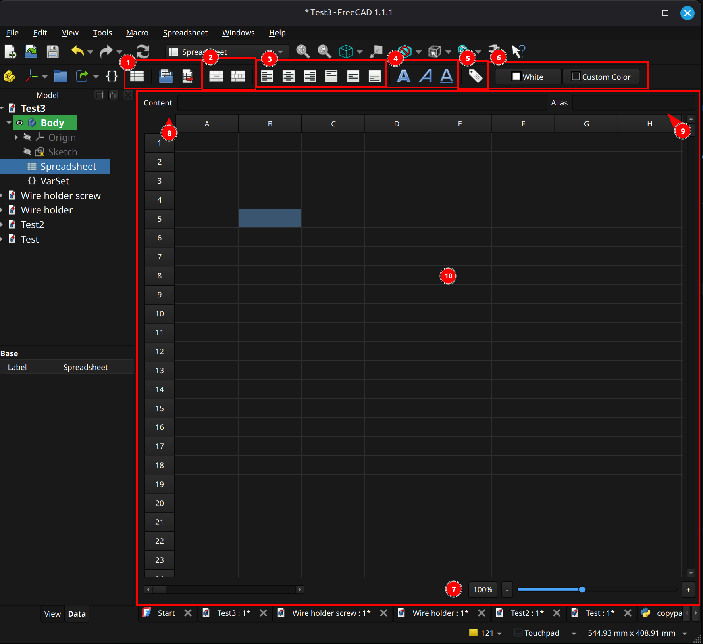

**Basic operations**

 * (1) Basic commands: These toolbar buttons give quick access to common operations. From left-to-right, ...

   * new spreadsheet_FC.
   * import CSV as new spreadsheet_FC.
   * export spreadsheet_FC to CSV.

**Viewport**

 * (10) Spreadsheet_FC: A matrix of cells, identified by column letter and row number (e.g., C3).

    Type while a cell is selected to set that cell's contents. Right click on a row/column to add or remove rows/columns.

 * (9) Cell alias textfield: This field shows and sets the alias for the selected cell, similar to pressing the cell alias button in the toolbar. When referencing a cell, the alias can be used as a friendly name.

 * (8) Cell content: This field shows and sets the content of the cell, which may be a formula or a literal.

 * (7) Zoom slider: This slider and accompanying drop-down are used to zoom in / out of the spreadsheet_FC.

**Cell operations and properties**

 * (2) Cell merge/split: These toolbar buttons merge and split cells. From left-to-right, ...

   * merge selected cells into a single cell.
   * split a merged cell back out to its original individual cells.

 * (3) Text alignment: These toolbar buttons align text in a cell. From left-to-right, ...

   * align left.
   * align horizontal center.
   * align right.
   * align top.
   * align vertical center.
   * align bottom.

 * (4) Text style: These toolbar buttons stylize the text in a cell. From left-to-right, ...

   * bold.
   * italic.
   * underline.

 * (6) Cell colors: These toolbar buttons set the colors within a cell. From left-to-right, ...

   * text color.
   * background color.

 * (5) Cell alias button: This toolbar option launches a dialog to set an alias for the selected cell. When referencing a cell, the alias can be used as a friendly name.

`{ref} https://wiki.freecad.org/Spreadsheet_Workbench`

## Cell Types

`{bm} /(Spreadsheet Workbench\/Cell Types)_TOPIC/i`

```{prereq}
Spreadsheet Workbench/User Interface_TOPIC
```

A cell's contents may be ...

* a numeric literal: Identified when the cell contains nothing but a fractional
* a text literal: Identified by an apostrophe as the first character.
* an expression (formula): Identified by an equal sign as the first character.

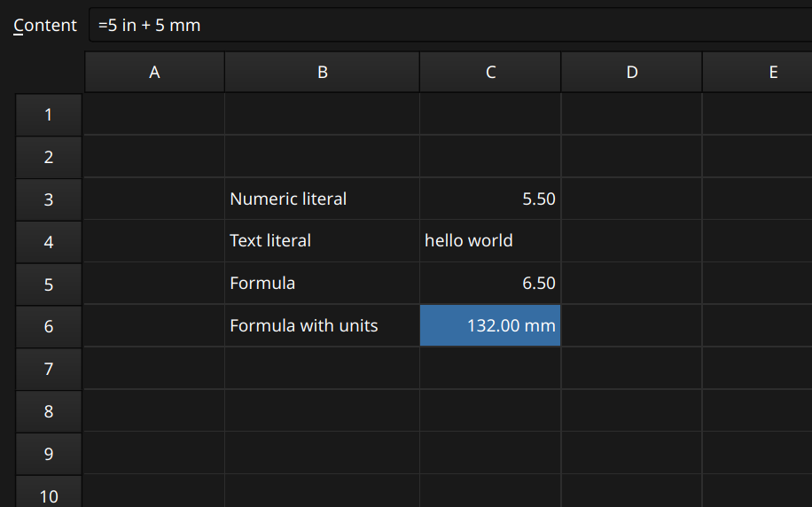

As shown in the example above, formulas are unit-aware (e.g., a formula can add two angles together or two distances together). The cell displays the results in the user's desired unit system (e.g., imperial vs metric).

```{seealso}
Spreadsheet Workbench/Expressions/Units_TOPIC
```

`{ref} https://wiki.freecad.org/Spreadsheet_Workbench`

## Expressions

`{bm} /(Spreadsheet Workbench\/Expressions)_TOPIC/i`

In addition to being set to literals, spreadsheet_FC cells and other properties may also be set to expressions. An expression executes some piece of logic using basic operators, functions, constants, conditionals, and references to other properties (e.g., other cells or data within a model). Operators and functions are unit-aware, requiring a valid combinations of units if supplied. For example, `2mm + 4mm` is valid while `2mm + 4` is not. This also applies to references to properties that have units (e.g., Pad001.Length + 1 isn't valid because it adds a pure number to a property containing a length - it requires Pad001.Length + 1mm). 

### Units

`{bm} /(Spreadsheet Workbench\/Expressions\/Units)_TOPIC/i`

Numbers in an expression may optional have a unit. The following tables contain the unit designations recognized by FreeCAD when inserting a unit (e.g., 5 mm). The following tables were pulled directly from source.

**Angle**

| Unit | Description                                                                          |
| ---- | ------------------------------------------------------------------------------------ |
| °    | Degree; alternative to the unit `deg`                                                |
| deg  | Degree; alternative to the unit `°`                                                  |
| rad  | Radian                                                                               |
| gon  | Gradian                                                                              |
| M    | Minute of arc; alternative to the unit `′`                                           |
| ′    | Minute of arc; this is the prime symbol (U+2032); alternative to the unit `M`        |
| S    | Second of arc; DOES NOT WORK; alternative to the unit `″`                            |
| ″    | Second of arc; this is the double prime symbol (U+2033); alternative to the unit `S` |

**Length**

| Unit | Description                                         |
| ---- | --------------------------------------------------- |
| nm   | Nanometer                                           |
| um   | Micrometer; alternative to the unit µm              |
| µm   | Micrometer; alternative to the unit um              |
| mm   | Millimeter                                          |
| cm   | Centimeter                                          |
| dm   | Decimeter                                           |
| m    | Meter                                               |
| km   | Kilometer                                           |
| mil  | Thousandth of an inch; alternative to the unit thou |
| thou | Thousandth of an inch; alternative to the unit mil  |
| in   | Inch; alternative to the unit `"`                   |
| `"`  | Inch; alternative to the unit in                    |
| ft   | Foot; alternative to the unit `'`                   |
| `'`  | Foot; alternative to the unit ft                    |
| yd   | Yard                                                |
| mi   | Mile                                                |

`{ref} https://wiki.freecad.org/Expressions`

### Property Access

`{bm} /(Spreadsheet Workbench\/Expressions\/Property Access)_TOPIC/i`

```{prereq}
Spreadsheet Workbench/Expressions/Units_TOPIC
```

An expression can reference properties of other objects by referencing the path hierarchy. For example, if there's a diameter named (diameter constraint_FC) lower_initial_diam within a sketch_FC ...

* with the label !!my_sketch!!, it's accessible within the spreadsheet_FC as `=<<!!my_sketch!!>>.!!Constraints!!.lower_initial_diam`.
* with the ID !!Sketch!!, it's accessible within the spreadsheet_FC as `=!!Sketch!!.!!Constraints!!.lower_initial_diam`.

```{note}
To see the ID of objects, right click in the Model pane and navigate to **Tree Settings** → **Show Internal Name**.
```

```{note}
If using labels, the label must be unique.
```

```{note}
To reference a object (such as !!Sketch!! / !!my_sketch!! in the example), you must use the _self property. For example, `!!Sketch!!._self`.
```

`{ref} https://wiki.freecad.org/Expressions`

### Index Access

`{bm} /(Spreadsheet Workbench\/Expressions\/Index Access)_TOPIC/i`

```{prereq}
Spreadsheet Workbench/Expressions/Property Access_TOPIC
```

To reference an item in a list or tuple, use the `[]` operator. For example, `!!Sketch!!.!!Constraints!![0]` will pull the first constraint_FC within the sketch_FC object.

To reference an enumeration option's text, use the `[]` operator in addition to referencing the enumeration option itself. For example, `Pad.Type.Enum[Pad.Type]` will pull out the text for `Pad.Type`, while `Pad.Type` itself will only return it's index within the enumeration.

`{ref} https://wiki.freecad.org/Expressions`

### Conditionals

`{bm} /(Spreadsheet Workbench\/Expressions\/Conditionals)_TOPIC/i`

Conditional expressions use C++ style ternary operator syntax: `condition ? resultTrue : resultFalse`. The condition is defined as an expression that evaluates to either 0 (false) or non-zero (true).

```{note}
Any value is evaluated as zero if abs(value) < 1e-7, else it is evaluated as non-zero. 
```

```{note}
In FreeCAD 1.1, you can test a boolean directly (e.g., `VarSet.MyBool ? 10 : 15`) where as in older versions of FreeCAD need a relational operator (e.g., `VarSet.MyBool == 1 ? 10 : 15`).
```

`{ref} https://wiki.freecad.org/Expressions`

### Operators

`{bm} /(Spreadsheet Workbench\/Expressions\/Operators)_TOPIC/i`

Table pulled directly from source.

| Operator | Description              |
| -------- | ------------------------ |
| +        | Addition                 |
| -        | Subtraction              |
| *        | Multiplication           |
| /        | Floating point Division  |
| %        | Remainder                |
| ^        | Exponentiation           |
| ==       | Equal                    |
| !=       | Not equal                |
| >        | Greater than             |
| >=       | Greater than or equal to |
| <        | Less than                |
| <=       | Less than or equal to    |

```{note}
From the source:

> Some unit related errors can seem unintuitive, with expressions either being rejected or producing results that do not match the units of the property being set. Here are some examples:
>
> 1/2mm is not interpreted as half a millimeter but as 1/(2mm), resulting in: 0.5 mm^-1.
>
> sqrt(2)mm is not valid because the function call is not a number. This has to be entered as sqrt(2) * 1mm.
```

`{ref} https://wiki.freecad.org/Expressions`

### Constants

`{bm} /(Spreadsheet Workbench\/Expressions\/Constants)_TOPIC/i`

| Constant | Description    |
| -------- | -------------- |
| e        | Euler's number |
| pi       | Pi             |

`{ref} https://wiki.freecad.org/Expressions`

### Functions

`{bm} /(Spreadsheet Workbench\/Expressions\/Functions)_TOPIC/i`

FreeCAD expressions !!support!! several built-in functions. The following sections each contain a subset of useful functions pulled directly from the source documentation.

```{note}
From the source:

> Some unit related errors can seem unintuitive, with expressions either being rejected or producing results that do not match the units of the property being set. Here are some examples:
>
> 1/2mm is not interpreted as half a millimeter but as 1/(2mm), resulting in: 0.5 mm^-1.
>
> sqrt(2)mm is not valid because the function call is not a number. This has to be entered as sqrt(2) * 1mm.
```

`{ref} https://wiki.freecad.org/Expressions`

#### Trigonometry

`{bm} /(Spreadsheet Workbench\/Expressions\/Functions\/Trigonometry)_TOPIC/i`

Table pulled directly from source.

| Function      | Description                                                                                     | Input range                                    |
| ------------- | ----------------------------------------------------------------------------------------------- | ---------------------------------------------- |
| `acos(x)`     | Arc cosine                                                                                      | `-1 <= x <= 1`                                 |
| `asin(x)`     | Arc sine                                                                                        | `-1 <= x <= 1`                                 |
| `atan(x)`     | Arc tangent, return value in the range `-90° < value < 90°`                                     | all                                            |
| `atan2(y; x)` | Arc tangent of `y/x` accounting for quadrant, return value in the range `-180° < value <= 180°` | all, the invalid input `x = y = 0` returns `0` |
| `cos(x)`      | Cosine                                                                                          | all                                            |
| `cosh(x)`     | Hyperbolic cosine                                                                               | all                                            |
| `sin(x)`      | Sine                                                                                            | all                                            |
| `sinh(x)`     | Hyperbolic sine                                                                                 | all                                            |
| `tan(x)`      | Tangent                                                                                         | all, except `x = n*90` with `n = odd integer`  |
| `tanh(x)`     | Hyperbolic tangent                                                                              | all                                            |
| `hypot(x; y)` | Pythagorean addition (hypotenuse), e.g. `hypot(4; 3) = 5`                                       | `x` and `y >= 0`                               |
| `cath(x; y)`  | Given hypotenuse, and one side, returns other side of triangle, e.g. `cath(5; 3) = 4`           | `x >= y >= 0`                                  |

`{ref} https://wiki.freecad.org/Expressions`

#### Rounding

`{bm} /(Spreadsheet Workbench\/Expressions\/Functions\/Rounding)_TOPIC/i`

Table pulled directly from source.

| Function    | Description                                                             | Input range       |
| ----------- | ----------------------------------------------------------------------- | ----------------- |
| `abs(x)`    | Absolute value                                                          | all               |
| `ceil(x)`   | Ceiling function, smallest integer value greater than or equal to x     | all               |
| `floor(x)`  | Floor function, largest integer value less than or equal to x           | all               |
| `mod(x; y)` | Remainder after dividing x by y, sign of result is that of the dividend | all, except y = 0 |
| `round(x)`  | Rounding to the nearest integer                                         | all               |
| `trunc(x)`  | Truncation to the nearest integer in the direction of zero              | all               |

`{ref} https://wiki.freecad.org/Expressions`

#### Boolean Logic

`{bm} /(Spreadsheet Workbench\/Functions\/Expressions\/Boolean Logic)_TOPIC/i`

Table pulled directly from source.

| Function            | Description                                                             | Input range |
| ------------------- | ----------------------------------------------------------------------- | ----------- |
| `and(a; b; c; ...)` | AND: 1 if abs of all arguments is greater than or equal to 1e-7, else 0 | all         |
| `or(a; b; c; ...)`  | OR: 0 if abs of all arguments is less than 1e-7, else 1                 | all         |
| `not(a)`            | Negation: 1 if abs(a) is less than 1e-7 else 0                          | all         |

`{ref} https://wiki.freecad.org/Expressions`

#### Statistics Operations

`{bm} /(Spreadsheet Workbench\/Expressions\/Functions\/Statistics Operations)_TOPIC/i`

Table pulled directly from source.

| Function              | Description                                                                     | Input range |
| --------------------- | ------------------------------------------------------------------------------- | ----------- |
| average(a; b; c; ...) | Average value of the arguments, same as sum(a; b; c; ...) / count(a; b; c; ...) | all         |
| count(a; b; c; ...)   | Count of the arguments, typically used for cell ranges                          | all         |
| max(a; b; c; ...)     | Maximum value of the arguments                                                  | all         |
| min(a; b; c; ...)     | Minimum value of the arguments                                                  | all         |
| stddev(a; b; c; ...)  | Standard deviation of the values of the arguments                               | all         |
| sum(a; b; c; ...)     | Sum of the values of the arguments, typically used for cell ranges              | all         |

`{ref} https://wiki.freecad.org/Expressions`

#### Object Creation

`{bm} /(Spreadsheet Workbench\/Expressions\/Functions\/Object Creation)_TOPIC/i`

Table pulled directly from source.

<table>
<tbody><tr><th>Type</th><th>Function</th><th>Description</th></tr>
<tr>
<td><code>Tuple</code>
</td>
<td><code>tuple(a; b; ...)</code>
</td>
<td>Example: <code>tuple(2; 1; 2)</code>
</td></tr>
<tr>
<td><code>List</code>
</td>
<td><code>list(a; b; ...)</code>
</td>
<td>Example: <code>list(2; 1; 2)</code>
</td></tr>
<tr>
<td rowspan="2"><a href="/Vector_API" title="Vector API"><code>Vector</code></a>
</td>
<td><code>vector(x; y; z)</code>
</td>
<td rowspan="2">Create a vector using three unit-less or <code>Length</code> unit values.
<p>Example: <code>vector(2; 1; 3)</code>
</p>
</td></tr>
<tr>
<td><code>create(&lt;&lt;vector&gt;&gt;; x; y; z)</code>
</td></tr>
<tr>
<td rowspan="2"><a href="/Matrix_API" title="Matrix API"><code>Matrix</code></a>
</td>
<td>
<pre>matrix(
  a<sub>11</sub>; a<sub>12</sub>; a<sub>13</sub>; a<sub>14</sub>;
  a<sub>21</sub>; a<sub>22</sub>; a<sub>23</sub>; a<sub>24</sub>;
  a<sub>31</sub>; a<sub>32</sub>; a<sub>33</sub>; a<sub>34</sub>;
  a<sub>41</sub>; a<sub>42</sub>; a<sub>43</sub>; a<sub>44</sub>
)
</pre>
</td>
<td rowspan="2">Create a 4x4 matrix in <a rel="nofollow" class="external text" href="https://en.wikipedia.org/wiki/Row-_and_column-major_order">row-major order</a>:
<p><math class="mwe-math-element" xmlns="http://www.w3.org/1998/Math/MathML"><mrow data-mjx-texclass="ORD"><mstyle displaystyle="true" scriptlevel="0"><mrow data-mjx-texclass="ORD"><mo data-mjx-texclass="OPEN">[</mo><mtable columnspacing="1em" rowspacing="4pt"><mtr><mtd><msub><mi>a</mi><mrow data-mjx-texclass="ORD"><mrow data-mjx-texclass="ORD"><mn>1</mn><mn>1</mn></mrow></mrow></msub></mtd><mtd><msub><mi>a</mi><mrow data-mjx-texclass="ORD"><mrow data-mjx-texclass="ORD"><mn>1</mn><mn>2</mn></mrow></mrow></msub></mtd><mtd><msub><mi>a</mi><mrow data-mjx-texclass="ORD"><mrow data-mjx-texclass="ORD"><mn>1</mn><mn>3</mn></mrow></mrow></msub></mtd><mtd><msub><mi>a</mi><mrow data-mjx-texclass="ORD"><mrow data-mjx-texclass="ORD"><mn>1</mn><mn>4</mn></mrow></mrow></msub></mtd></mtr><mtr><mtd><msub><mi>a</mi><mrow data-mjx-texclass="ORD"><mrow data-mjx-texclass="ORD"><mn>2</mn><mn>1</mn></mrow></mrow></msub></mtd><mtd><msub><mi>a</mi><mrow data-mjx-texclass="ORD"><mrow data-mjx-texclass="ORD"><mn>2</mn><mn>2</mn></mrow></mrow></msub></mtd><mtd><msub><mi>a</mi><mrow data-mjx-texclass="ORD"><mrow data-mjx-texclass="ORD"><mn>2</mn><mn>3</mn></mrow></mrow></msub></mtd><mtd><msub><mi>a</mi><mrow data-mjx-texclass="ORD"><mrow data-mjx-texclass="ORD"><mn>2</mn><mn>4</mn></mrow></mrow></msub></mtd></mtr><mtr><mtd><msub><mi>a</mi><mrow data-mjx-texclass="ORD"><mrow data-mjx-texclass="ORD"><mn>3</mn><mn>1</mn></mrow></mrow></msub></mtd><mtd><msub><mi>a</mi><mrow data-mjx-texclass="ORD"><mrow data-mjx-texclass="ORD"><mn>3</mn><mn>2</mn></mrow></mrow></msub></mtd><mtd><msub><mi>a</mi><mrow data-mjx-texclass="ORD"><mrow data-mjx-texclass="ORD"><mn>3</mn><mn>3</mn></mrow></mrow></msub></mtd><mtd><msub><mi>a</mi><mrow data-mjx-texclass="ORD"><mrow data-mjx-texclass="ORD"><mn>3</mn><mn>4</mn></mrow></mrow></msub></mtd></mtr><mtr><mtd><msub><mi>a</mi><mrow data-mjx-texclass="ORD"><mrow data-mjx-texclass="ORD"><mn>4</mn><mn>1</mn></mrow></mrow></msub></mtd><mtd><msub><mi>a</mi><mrow data-mjx-texclass="ORD"><mrow data-mjx-texclass="ORD"><mn>4</mn><mn>2</mn></mrow></mrow></msub></mtd><mtd><msub><mi>a</mi><mrow data-mjx-texclass="ORD"><mrow data-mjx-texclass="ORD"><mn>4</mn><mn>3</mn></mrow></mrow></msub></mtd><mtd><msub><mi>a</mi><mrow data-mjx-texclass="ORD"><mrow data-mjx-texclass="ORD"><mn>4</mn><mn>4</mn></mrow></mrow></msub></mtd></mtr><mtr><mtd></mtd></mtr></mtable><mo fence="true" stretchy="true" symmetric="true" data-mjx-texclass="CLOSE">]</mo></mrow></mstyle></mrow></math>
</p><p>A minimum of 1 argument can be supplied such as <code>matrix(1)</code> which creates an identity matrix.
</p><p>Example: <code>matrix(1; 2; 3; 4; 5; 6; 7; 8; 9; 10; 11; 12; 13; 14; 15; 16)</code>
</p>
</td></tr>
<tr>
<td><code>create(&lt;&lt;matrix&gt;&gt;; a<sub>11</sub>; a<sub>12</sub>; ...; a<sub>44</sub>)</code>
</td></tr>
<tr>
<td rowspan="4"><code>Rotation</code>
</td>
<td><code>rotation(axis; angle)</code>
</td>
<td rowspan="4">Create a <code>Rotation</code> by specifying its <code>axis</code> (<code>Vector</code>) and <code>angle</code> (<code>Angle</code> unit or unit-less), or three Euler angles <code>α</code>, <code>β</code>, <code>γ</code>.
<p>Examples:
</p>
<ul><li><code>rotation(vector(0; 1; 0); 45)</code></li>
<li><code>create(&lt;&lt;rotation&gt;&gt;; 30; 30; 30)</code></li></ul>
</td></tr>
<tr>
<td><code>rotation(α; β; γ)</code>
</td></tr>
<tr>
<td><code>create(&lt;&lt;rotation&gt;&gt;; axis; angle)</code>
</td></tr>
<tr>
<td><code>create(&lt;&lt;rotation&gt;&gt;; α; β; γ)</code>
</td></tr>
<tr>
<td rowspan="5"><a href="/Placement_API" title="Placement API"><code>Placement</code></a>
</td>
<td><code>placement(base; rotation)</code>
</td>
<td rowspan="5">Create a <code>Placement</code> with various parameters, including:
<ul><li><code>base</code>: base location (<code>Vector</code>)</li>
<li><code>center</code>: center location (<code>Vector</code>)</li>
<li><code>rotation</code>: <code>Rotation</code></li>
<li><code>axis</code>: Rotation axis (<code>Vector</code>)</li>
<li><code>angle</code>: Rotation angle (unit-less or <code>Angle</code> unit value)</li>
<li><code>matrix</code>: <code>Matrix</code></li></ul>
<p>Examples:
</p>
<ul><li><code>placement(vector(2; 1; 3); rotation(vector(0; 0; 1); 45))</code></li>
<li><code>create(&lt;&lt;placement&gt;&gt;; create(&lt;&lt;vector&gt;&gt;; 2; 1; 2); create(&lt;&lt;rotation&gt;&gt;; create(&lt;&lt;vector&gt;&gt;; 0; 1; 0); 45))</code></li></ul>
</td></tr>
<tr>
<td><code>placement(base; rotation; center)</code>
</td></tr>
<tr>
<td><code>placement(base; axis; angle)</code>
</td></tr>
<tr>
<td><code>placement(matrix)</code>
</td></tr>
<tr>
<td><code>create(&lt;&lt;placement&gt;&gt;; ...)</code>
</td></tr></tbody></table>

`{ref} https://wiki.freecad.org/Expressions`

#### String Operations

`{bm} /(Spreadsheet Workbench\/Expressions\/Functions\/String Operations)_TOPIC/i`

| Function / Operator | Description                           |
| ------------------- | ------------------------------------- |
| a+b                 | Concatenate strings a and b together. |
| str(a)              | Convert a into a string.              |
| <<my text>>         | Generate a string literal.            |

Strings can also be created via string interpolation using the old [Python % syntax for string formatting](https://docs.python.org/3/library/stdtypes.html#printf-style-string-formatting). For example, `<<Cube length is %s and width is %s>> % tuple(Box.Length; Box.Width)`.

`{ref} https://wiki.freecad.org/Expressions`

#### Vector Operations

`{bm} /(Spreadsheet Workbench\/Expressions\/Functions\/Vector Operations)_TOPIC/i`

| Function / Operator        | Description                                                                                                    |
| -------------------------- | -------------------------------------------------------------------------------------------------------------- |
| `vector(x; y; z)`          | Create vector vectors.                                                                                               |
| `v1 + v2`                  | Add two vectors.                                                                                               |
| `v1 - v2`                  | Subtract two vectors.                                                                                          |
| `v * s`                    | Uniformly scale a vector by `s`.                                                                               |
| `vangle(v1; v2)`           | Angle between two vectors in degrees.                                                                          |
| `vcross(v1; v2)`           | Cross product of two vectors `v1×v2`.                                                                          |
| `v1 * v2`                  | Dot product of two vectors `v1⋅v2`.                                                                            |
| `vdot(v1; v2)`             | Dot product of two vectors `v1⋅v2`.                                                                            |
| `vlinedist(v1; v2; v3)`    | Distance between vector `v1` and a line through `v2` in direction `v3`.                                        |
| `vlinesegdist(v1; v2; v3)` | Distance between vector `v1` and the closest point on a line segment from `v2` to `v3`.                        |
| `vlineproj(v1; v2; v3)`    | Project vector `v1` on a line through `v2` in direction `v3`.                                                  |
| `vnormalize(v)`            | Normalize a vector to a unit vector.                                                                           |
| `vplanedist(v1)`           | Distance between vector `v1` and a plane defined by a point `v2` and a normal `v3`.                            |
| `vplaneproj(v1)`           | Project vector `v1` on a plane defined by a point `v2` and a normal `v3`.                                      |
| `vscale(v; sx; sy; sz)`    | Non-uniformly scale a vector by `sx` in the X direction, `sy` in the Y direction, and `sz` in the Z direction. |
| `vscalex(v; sx)`           | Scale a vector by `sx` in the X direction.                                                                     |
| `vscaley(v; sy)`           | Scale a vector by `sy` in the Y direction.                                                                     |
| `vscalez(v; sz)`           | Scale a vector by `sz` in the Z direction.                                                                     |

#### Matrix Operations

`{bm} /(Spreadsheet Workbench\/Expressions\/Functions\/Matrix Operations)_TOPIC/i`

Rotation and Placement can each be represented by a `Matrix`. The following functions all take in a `Matrix`, `Rotation`, or `Placement` as their first parameter denoted in the table below by `m`. The type of the returned object is the same as the object supplied in the first argument except when using `mtranslate` on a Rotation, in which case a Placement will be returned. 

| Function                                                                            | Description                                                                                                          |
| ----------------------------------------------------------------------------------- | -------------------------------------------------------------------------------------------------------------------- |
| `matrix(` <br> `  a11; a12; a13; a14;` <br> `  a21; a22; a23; a24;` <br> `  a31; a32; a33; a34;` <br> `  a41; a42; a43; a44` <br> `)`                                                                        | Create matrix.                                                                                        |
| `minvert(m)`                                                                        | Calculate the inverse matrix.                                                                                        |
| `mrotate(m; rotation)`<br>`mrotate(m; axis; angle)`<br>`mrotate(m; α; β; γ)`        | Rotate by either a Rotation, an axis (Vector) and an angle (Angle unit or unit-less), or three Euler angles α, β, γ. |
| `mrotatex(m; angle)`                                                                | Rotate around the X axis.                                                                                            |
| `mrotatey(m; angle)`                                                                | Rotate around the Y axis.                                                                                            |
| `mrotatez(m; angle)`                                                                | Rotate around the Z axis.                                                                                            |
| `mtranslate(m; vector)`<br>`mtranslate(m; x; y; z)`                                 | Translate by a vector (Vector) or X, Y, Z values. If a Rotation is translated, the returned object is a Placement.   |
| `mscale(m; vector)`<br>`mscale(m; x; y; z)`                                         | Scale by a vector (Vector) or X, Y, Z values.                                                                        |
| `vlinedist(v1; v2; v3)`                                                             | Distance between vector v1 and a line through v2 in direction v3.                                                    |
| `vlinesegdist(v1; v2; v3)`                                                          | Distance between vector v1 and the closest point on a line segment from v2 to v3.                                    |
| `vlineproj(v1; v2; v3)`                                                             | Project vector v1 on a line through v2 in direction v3.                                                              |
| `vnormalize(v)`                                                                     | Normalize a vector to a unit vector.                                                                                 |
| `vplanedist(v1)`                                                                    | Distance between vector v1 and a plane defined by a point v2 and a normal v3.                                        |
| `vplaneproj(v1)`                                                                    | Project vector v1 on a plane defined by a point v2 and a normal v3.                                                  |
| `vscale(v; sx; sy; sz)`<br>`vscalex(v; sx)`<br>`vscaley(v; sy)`<br>`vscalez(v; sz)` | Non-uniformly scale a vector by sx in the X direction, sy in the Y direction, and sz in the Z direction.             |

# Sketcher Workbench

`{bm} /(Sketcher Workbench)_TOPIC/i`

Sketcher workbench_FC allows creating 2D sketches_FC. These 2D sketches_FC typically go on to by used by other workbenches_FC (e.g., they define the outline of some 3D feature_FC in the creation of models via the part design workbench_FC).

Sketcher workbench_FC has the following core primitives:

 * Element_FC: 2D geometric primitive (e.g., point, line, arc, and spline)
 * Constraint_FC: Definition of an element_FC's measurement, either directly (e.g., 5mm radius for an arc) or as a relationship (e.g., line 1's slope must be perpendicular to line 2's slope).

In the screenshot below, the red geometry are visualizations of constraints_FC (e.g., angle and radius), while the white lines are the geometric primitives those red lines apply to (e.g., arc).

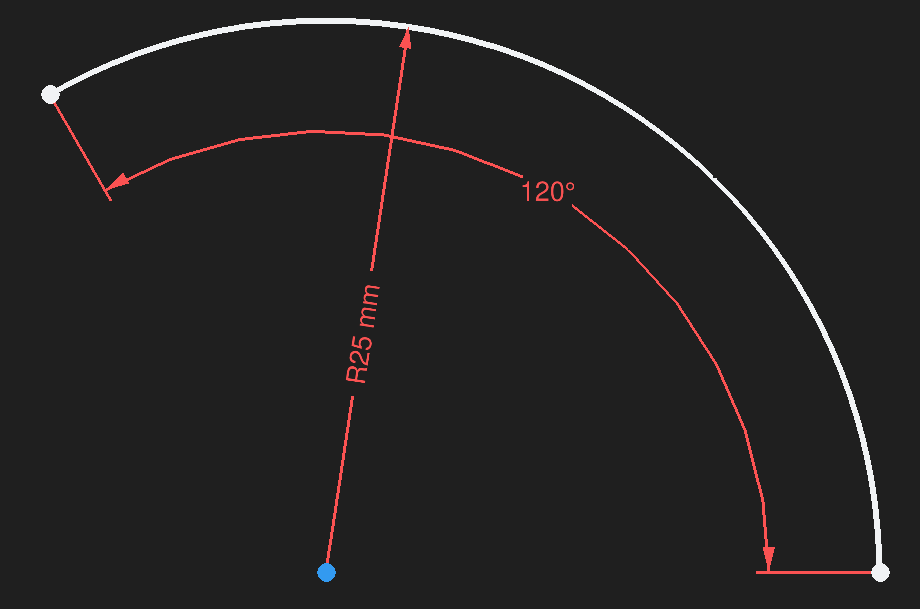

There are different element_FC types (e.g., construction geometry_FC, projection geometry_FC) and different constraint_FC types (e.g., reference constraints_FC, driving constraints_FC). These are documented in the subsections below.

## User Interface

`{bm} /(Sketcher Workbench\/User Interface)_TOPIC/i`

```{prereq}
User Interface Layout_TOPIC
```

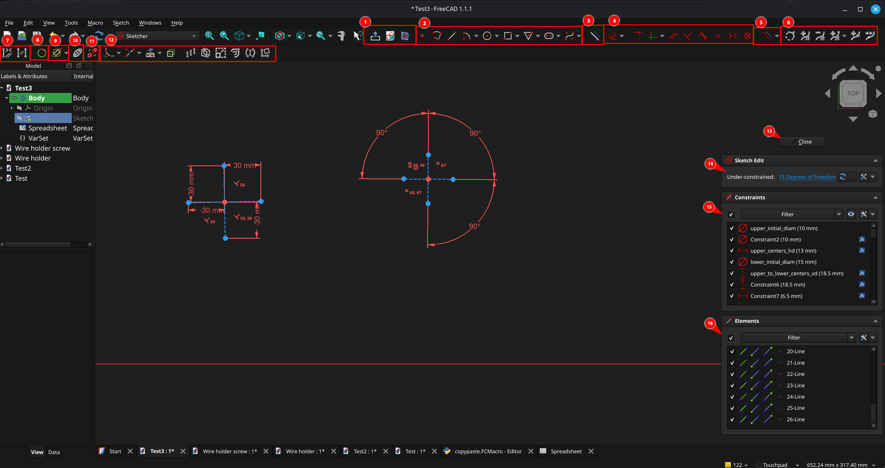

The Sketcher workbench_FC has two modes: Editing a sketch_FC or viewing a sketch_FC. The toolbar buttons change depending on the mode. The UI layout shown in the screenshot above is when editing a sketch_FC, which is the mode that users will spend most of their time in.

```{note}
The behavior of many of the UI controls highlighted above / documented below changes !!based!! on the state of the application. For example, ...

* if there are elements_FC selected when the construction geometry_FC button (3) is clicked, it'll turn those element_FC into construction geometry_FC.
* if there aren't element_FC selected when the construction geometry_FC button (3) is clicked, all newly created elements_FC (any button in 2) will be construction geometry_FC until the construction geometry_FC button is clicked again.

These nuances aren't captured here, but in sections later on. This is just a basic accounting of the UI controls.
```

**General Commands**

 * (1) General commands: These toolbar buttons give quick access to common operations. When not editing a sketch_FC, the general commands are as follows:

   

   From left-to-right, ...

   * new sketch_FC: Creates a new sketch_FC object in the model pane.
   * edit sketch_FC: Enters the currently select sketch_FC object in the model pane.
   * attach sketch_FC: Attach sketch_FC to an piece of 3D geometry (e.g., face on a model).
   * reorient sketch_FC: Attach sketch_FC to an origin plane (e.g., XY plane).
   * validate sketch_FC: Opens a pane to validate different aspects of the sketch_FC (e.g., invalid constraints_FC).
   * merge sketches_FC: Merge the sketches_FC selected in the model pane.
   * mirror sketch_FC: Mirror the sketch_FC selected in the model pane.

   When editing a sketch_FC, the general commands are as follows:

   
 
   From left-to-right, ...

   * leave sketch_FC: Stop editing sketch_FC.
   * align view to sketch_FC: Reorients camera such that it faces towards the sketch_FC.
   * toggle section view: Temporarily cut through and hide geometry that occludes a sketch_FC (e.g., when the camera is aligned to the sketch_FC, it may be occluded by currently visible 3D objects).

 * (13) Leave sketch_FC.

**Elements_FC and Constraints_FC**

 * (3) Construction geometry_FC toggle.

 * (2) Create elements_FC: These toolbar buttons give quick access to create elements_FC. From left-to-right, ...

   * create point.
   * create polyline.
   * create line.
   * create arcs of varying types and parameterizations (e.g., circular arc defined via 3 points, and circular arc defined via radius and angle, and elliptical arc).
   * create circle / ellipse using varying parameterizations (e.g., defined via 3 points, and defined via radius and angle)
   * create rectangles of varying types and parameterizations (e.g., rectangle defined via center and dimensions, e.g., rectangle define via top-left and bottom-right, and rounded rectangle).
   * create polygon with varying number of sides.
   * create slot of varying types.
   * create b-spline of varying types and parameterizations.

 * (5) Constraints_FC toggle: These toolbar buttons disable constraints_FC or keep them enabled but render them unenforced (referred to as reference constraints_FC).

 * (4) Create constraints_FC: These toolbar buttons give quick access to create constraints_FC. From left-to-right, ...

   * create dimensional constraints_FC of varying types (e.g., distance, radius, and angle)
   * create coincident constraint_FC.
   * create parallel to basis axis constraint_FC (e.g., force line to be horizontal or vertical).
   * create parallel constraint_FC (e.g., lines 1 and 2 must be parallel).
   * create perpendicular constraint_FC (e.g., lines 1 and 2 must be perpendicular).
   * create tangent constraint_FC (e.g., line and endpoint of arc must be tangent).
   * create distance equality constraint_FC (e.g., line 1 and 2 must be the same distance).
   * create symmetry constraint_FC (e.g., points 1 and 2 must be symmetrical across line 1).
   * create block constraint_FC.

 * (7) Selection helpers: These toolbar buttons give quick access to select elements_FC / constraints_FC associated with the current selection. From left-to-right, ...

   * select constraints_FC associated with selection.
   * select elements_FC associated with selection.

 * (8) Arc circular helper toggle: Toggles the visibility of the underlying circle / ellipse for circular arcs.

 * (10) Internal geometry toggle: Toggles the visibility of the internal geometry for certain element_FC types (e.g., ellipse arc). 

 * (11) Switch virtual space.

**B-Splines**

 * (6) B-spline tools: These toolbar buttons give quick access to b-spline helpers and tools. From left-to-right, ...

   * geometry to b-spline.
   * increase b-spline degree.
   * decrease b-spline degree.
   * increase knot multiplicity.
   * decrease knot multiplicity.
   * insert knot.
   * join b-spline curves.

 * (9) B-spline informational toggles: These toolbar buttons give quick access to toggle on/off information displayed for b-splines. From left-to-right, ...

   * b-spline degree visibility toggle.
   * b-spline control polygon visibility toggle.
   * b-spline curvature comb visibility toggle.
   * b-spline knot multiplicity visibility toggle.
   * b-splint control point weight visibility toggle.

**Tools**

 * (12) Tools: These toolbar buttons give quick access to various sketching_FC tools. From left-to-right, ...

   * fillet_FC / chamfer_FC.
   * trim, split, or extend edges.
   * project from external geometry (e.g., pull in an edge from an external model into the sketch_FC) or project intersected external geometry (e.g., pull in an edge from a model face that intersects the sketch_FC plane).

**Panels**

 * (13) Constraints_FC pane: This pane lists, allows selection, and allows configuration of constraints_FC, mirroring whatever is selected in the viewport.

 * (14) Elements_FC pane: This pane lists, allows selection, and allows configuration of elements_FC, mirroring whatever is selected in the viewport.

`{ref} https://wiki.freecad.org/Sketcher_Workbench`

## Sketching

`{bm} /(Sketcher Workbench\/Sketching)_TOPIC/i`

```{prereq}
Sketcher Workbench/User Interface_TOPIC
```

Sketching_FC involves creating elements_FC, constraining_FC them, and deleting them. The sketch_FC below is a non-trivial set of elements_FC chained together using constraints_FC.

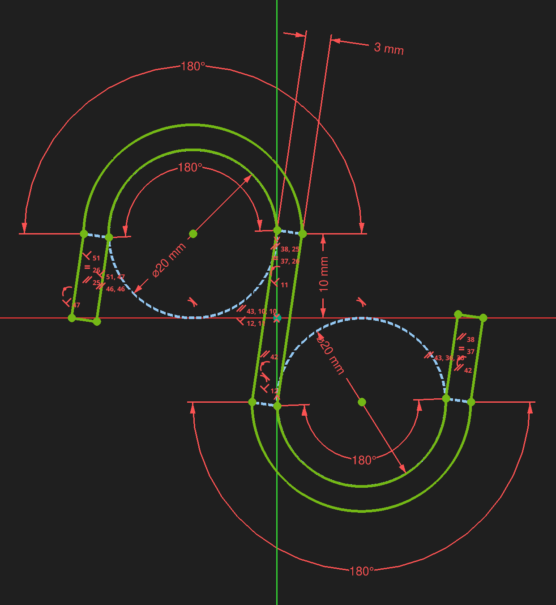

The subsections below document these basic concepts.

`{ref} https://wiki.freecad.org/Sketcher_Workbench`

### Creation

`{bm} /(Sketcher Workbench\/Sketching\/Creation)_TOPIC/i`

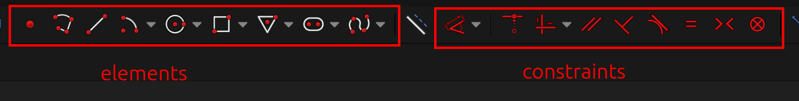

To create an element_FC, select the element_FC from the toolbar (or the main menu, or use the element_FC's shortcut key) and click on the viewport multiple times. For most elements_FC, on the first click the viewport should show that the item is being created, and the movement of the mouse button and subsequent clicks further constructs the element_FC. For example, to add a line, select the line in the toolbar, click in the viewport, and slightly move the mouse. The line's preview will display.

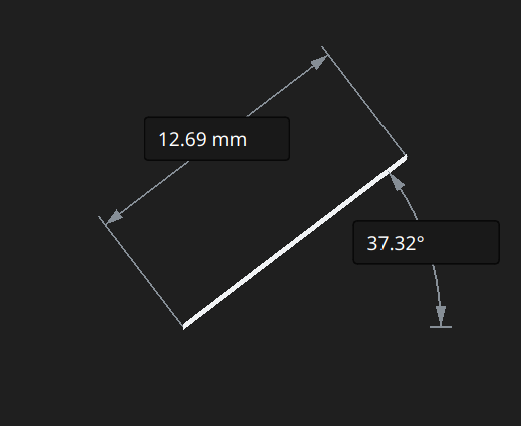

A subsequent click will be complete adding the line.


In the preview, there are two textboxes, one that specifies a distance and one that specifies an angle. These are referred to as On-View-Parameters_FC, and they're available for certain elements_FC, When in preview, pressing Tab will cycle into these textboxes, where a value may be entered followed by pressing Enter. Using them adds constraints_FC to line. For example, if used for the line above, a constraint_FC is added for the line's length and another constraint_FC is added for the line's angle from the horizontal axis.

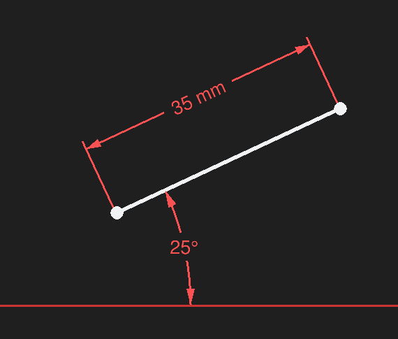

Alternatively, an element_FC can have constraints_FC added to it by selecting the relevant portions of an element_FC and clicking an applicable constraint_FC. For example, the line can have the exact same constraints_FC applied by ...

 * selecting the line, then selecting distance dimension constraint_FC in the toolbar.
 * selecting the line and the horizontal access, then selecting the angle dimension constraint_FC in the toolbar.

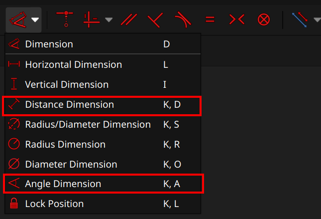

```{seealso}
Sketcher Workbench/Sketching/Selection_TOPIC
```

```{note}
There are multiple ways to apply constraints_FC, discussed in each constraint_FC's source. For example, instead of first selecting the line and then choosing the distance dimension constraint_FC, you can first make sure nothing is selected, then click the distance dimension constraint_FC, then click the line.
```

`{ref} https://wiki.freecad.org/Sketcher_Workbench`

#### Continue Mode

`{bm} /(Sketcher Workbench\/Sketching\/Creation\/Continue Mode)_TOPIC/i`

Continue mode_FC allows element_FC / constraint_FC creation to continue after an element_FC / constraint_FC is created, allowing multiple such elements_FC / constraints_FC to be created many times over. The creation tool remains active until the user hits Esc or selects some other tool from the toolbar. For example, after selecting the line element_FC from the toolbar and creating a line on the sketch_FC, more lines can be created on the sketch_FC without having to click the line element_FC again in the toolbar.

```{note}
Pressing Esc if no tool is active will exit sketch_FC edit mode. This can be turned off in preferences if inadvertently pressing Esc too many times.
```

Continue mode_FC can be turned off in preferences (on by default).

`{ref} https://wiki.freecad.org/Sketcher_Workbench`

#### On-View-Parameters

`{bm} /(Sketcher Workbench\/Sketching\/Creation\/On-View-Parameters)_TOPIC/i`

For certain element_FC creation tools, On-View-Parameters_FC allows explicitly adding constraints_FC during the creation process by presenting input fields alongside the element_FC's preview. For example, dropping a line will show a textbox for length constraint_FC and a textbox for angle constraint_FC. Pressing tab cycles through these textboxes, while pressing enter adds the constraints_FC.

Continue mode_FC can be turned off and configured in preferences (on by default).

`{ref} https://wiki.freecad.org/Sketcher_Workbench`

#### Auto Constraints

`{bm} /(Sketcher Workbench\/Sketching\/Creation\/Auto Constraints)_TOPIC/i`

When creating an element_FC, if the placement of some part of that element_FC ends on an existing element_FC, an auto constraint_FC may be applied. An auto constraint_FC is a constraint_FC that's automatically added by virtue of how the elements_FC end up together. For example, if the end of a line ends up on the start of a line, auto constraint_FC will add a constraint_FC known as coincident constraint_FC which bounds those two points together.

When an auto constraint_FC is to be applied, the icon of the constraint_FC is shown on the lower right of the icon of the element_FC being created.

```{note}
I can't do a screenshot of this because flameshot won't capture the mouse cursor, but just imagine that you're creating a line. The mouse cursor will have the icon of the line creation icon (same as the toolbar) next to it. As you're putting down the line, when you get close to the existing line's point, a second smaller icon showing the constraint_FC to be added show up to the right of the line creation icon. That second smaller icon is the coincident constraint_FC icon.
```

Auto constraints_FC is enabled/disabled per sketch_FC, not globally. To change, update in the constraints_FC pane or the sketch_FC's view Autoconstraints_FC property.

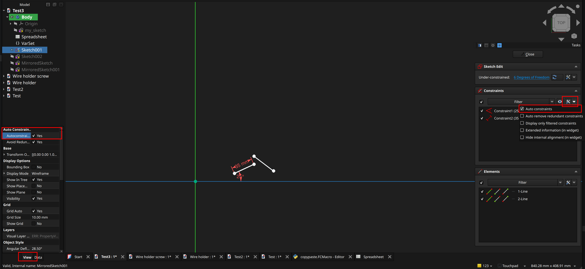

`{ref} https://wiki.freecad.org/Sketcher_Workbench`

### Selection

`{bm} /(Sketcher Workbench\/Sketching\/Selection)_TOPIC/i`

```{prereq}
Sketcher Workbench/Sketching/Creation_TOPIC
```

Elements_FC and constraints_FC can be selected in any of the following ways:

* **Single selection**: Left-clicking an element_FC or constraint_FC toggles whether its selected.

  Previously selected elements_FC are not discarded on single select. While it isn't necessary to hold Ctrl while selecting multiple elements_FC, it is beneficial in that a mis-click into empty space won't deselect everything.

* **Box selection**: Left-clicking an empty area and dragging draws a selection rectangle, selecting elements_FC within the rectangle (not constraints_FC, only selections). Depending on the direction of the drag, the selection behavior changes. If the box dragging is from ...

  * left to right, elements_FC that lie completely inside the rectangle are selected.
  * right to left, elements_FC that touch or cross the rectangle are selected.

  Previously selected elements_FC are not discarded on box select.

* **Connection selection**: Double-clicking an edge selects all edges directly and indirectly connected to it via endpoints. Endpoints only need to have the same coordinates (no need endpoints to be connected via constraints_FC - e.g.,coincident constraints_FC).

  Previously selected elements_FC are not discarded on connection select.

* **Element_FC / Constraints_FC pane**: Constraints_FC and the individual sub-elements_FC of each element_FC (e.g., a line elements_FC's endpoint and actual line) are selectable via the constraints_FC pane and elements_FC pane, respectively. The elements_FC pane lists the individual elements_FC as well as the sub-elements_FC for those elements_FC, which can be individually clicked (e.g., select 2-Line's first endpoint).
  
  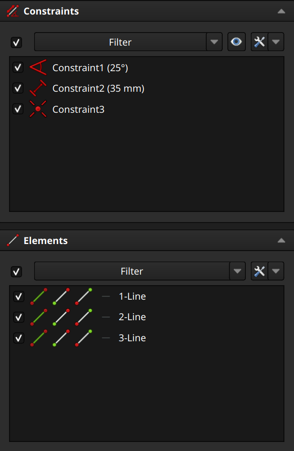

  Previously selected elements_FC *are* discarded on connection select.

* **Select all**: To select everything within a sketch_FC, use Ctrl+A or navigate to **Edit** → **Select All**. 

`{ref} https://wiki.freecad.org/Sketcher_Workbench`

### Deletion

`{bm} /(Sketcher Workbench\/Sketching\/Deletion)_TOPIC/i`

```{prereq}
Sketcher Workbench/Sketching/Selection_TOPIC
```

To delete an element_FC or constraint_FC, select it and hit the Delete key. If an element_FC is deleted, its related constraints_FC are automatically deleted as well, even if they were left unselected when the Delete key was hit.

`{ref} self`

### Constraint Expressions

`{bm} /(Sketcher Workbench\/Sketching\/Constraint Expressions)_TOPIC/i`

```{prereq}
Sketcher Workbench/Sketching/Creation_TOPIC
Sketcher Workbench/Sketching/Selection_TOPIC
Sketcher Workbench/Sketching/Deletion_TOPIC
Spreadsheet Workbench/Expressions_TOPIC
```

Constraints_FC can be named by either ...

* right-clicking on them in the Constraints_FC pane and selecting Rename (shortcut key F2).
* double-clicking the constraint_FC in the viewport and assigning a name, but this only works if the constraint_FC accepts a value.

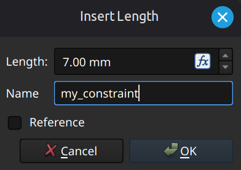

Constraints_FC can also reference and calculate their values via expressions. The formula button (inside the value textbox, to its right) opens an Expression Editor window that allows entering an expression instead of a constant, similar to inserting a formula in a cell for a spreadsheet_FC.

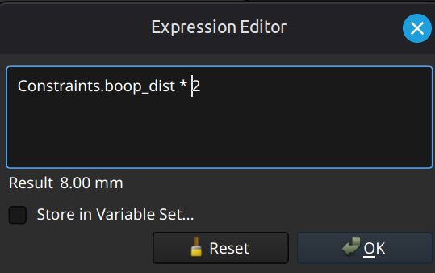

The expression can access data in the sketch_FC (e.g., other constraints_FC) as well as outside the sketch_FC (e.g., alias in a spreadsheet_FC or field in a VarSet). In the example, the constraint_FC is copying the value of another constraint_FC and multiplying it by 2.

`{ref} self`

### Projection Geometry

`{bm} /(Sketcher Workbench\/Sketching\/Projection Geometry)_TOPIC/i`

```{prereq}
Sketcher Workbench/Sketching/Creation_TOPIC
Sketcher Workbench/Sketching/Selection_TOPIC
Sketcher Workbench/Sketching/Deletion_TOPIC
```

An element_FC is deemed projection geometry_FC if that element_FC was pulled in from a 3D object visible from the sketch_FC. Projection geometry_FC is linked to the 3D object it came from.

```{note}
Although not discussed yet, 3D objects can come from a variety of different places. For example, a sketch_FC may be turned into 3D objects / 3D features_FC on an existing 3D object via the part design workbench_FC, and subsequent sketches_FC may project geometry from that object.
```

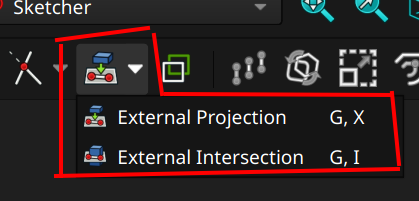

To project, select the External Projection toolbar button (keyboard shortcut G, X) and select until the all desired elements_FC have been projected (Esc or select another tool to exit). In some cases, it may be difficult to select the desired external geometry (e.g., it may be on the opposite side of the object, hidden from view). Recall that the camera can be rotated while sketching_FC. If rotated, the camera's rotation can be brought back inline with the sketch_FC by clicking the Align View to Sketch_FC toolbar button (keyboard shortcut Q, P): .

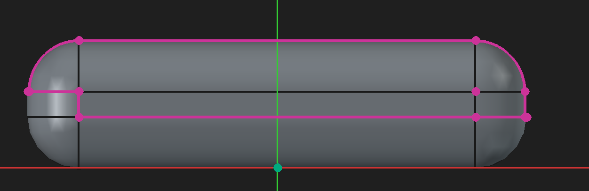

To project intersections with the sketching_FC plane, select the External Intersection toolbar button (keyboard shortcut G, I) and select until all desired elements_FC have been projected (Esc or select another tool to exist). In most cases, it's difficult to select the desired intersections because they're likely blocked from view. Recall that the Toggle Section View toolbar button (keyboard shortcut Q, S) will temporarily cut from view anything that extends past the sketch_FC plane towards the camera: .

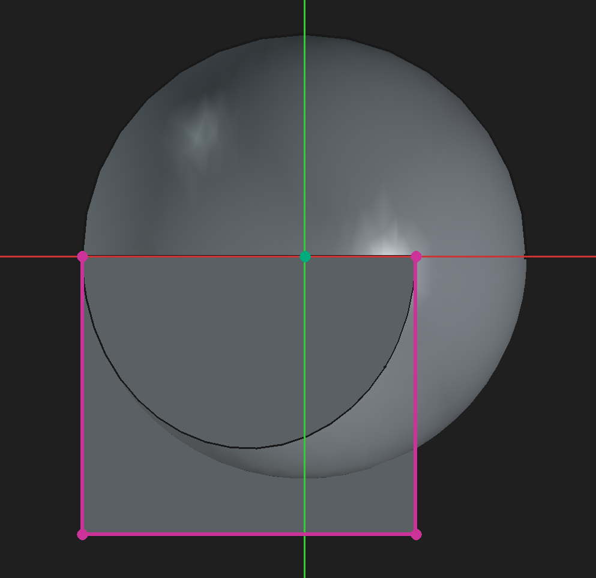

```{note}
When experimenting, I found pulling in intersections to be finicky. Certain curvatures won't get pulled in, or will get pulled in as only a single point off the curvature. It might be that not all conics are !!supported!!? Or maybe the feature_FC is just buggy.
```

```{note}
Projected geometry_FC may also be construction geometry_FC, discussed in sections further one.
```

```{seealso}
Sketcher Workbench/Sketching/Construction Geometry_TOPIC
```

The color and line style changes !!based!! on the type of projected element_FC and the state of the overall sketch_FC. The screenshot below shows the default colors used by FreeCAD for the various types and states.

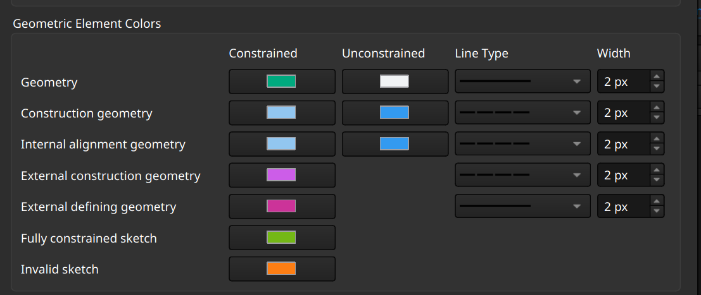

`{ref} https://wiki.freecad.org/Sketcher_Tutorial` `{ref} https://wiki.freecad.org/Sketcher_Workbench` `{ref} https://wiki.freecad.org/Sketcher_Projection` `{ref} self`

### Construction Geometry

`{bm} /(Sketcher Workbench\/Sketching\/Construction Geometry)_TOPIC/i`

```{prereq}
Sketcher Workbench/Sketching/Creation_TOPIC
Sketcher Workbench/Sketching/Selection_TOPIC
Sketcher Workbench/Sketching/Deletion_TOPIC
Sketcher Workbench/Sketching/Projection Geometry_TOPIC
```

An element_FC is deemed as construction geometry_FC if it isn't exposed to consumers of the sketch_FC (it's internal to the sketch_FC, hidden once the sketch_FC is closed). Construction geometry_FC is used within the sketch_FC to assist in constraining_FC other geometry.

Construction geometry_FC comes in different forms:

* Construction geometry_FC: A normal element_FC in the sketch_FC is construction geometry_FC.

  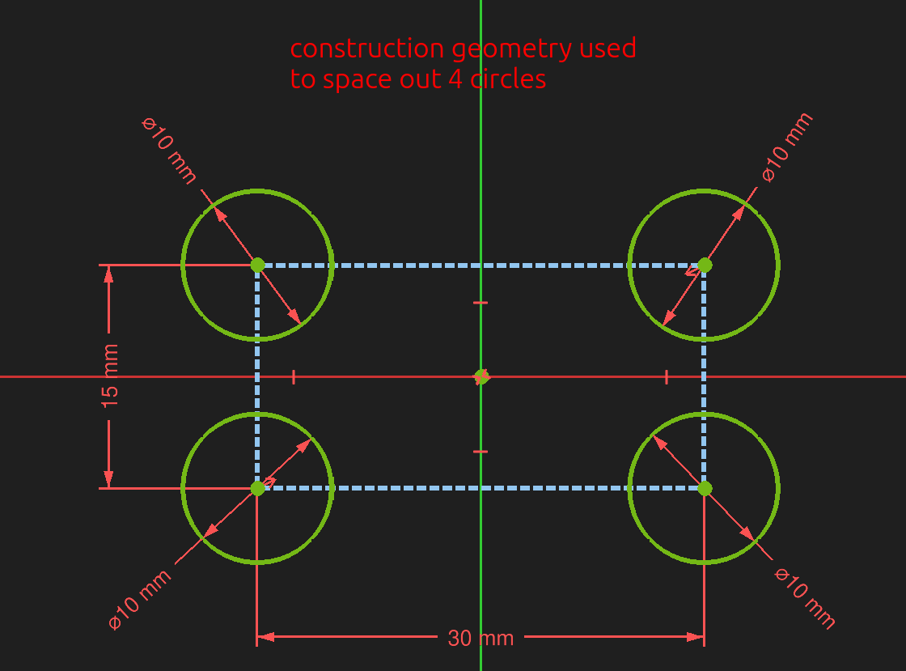

* Projected geometry_FC that's also construction geometry_FC: A projected element_FC in the sketch_FC is construction geometry_FC.

  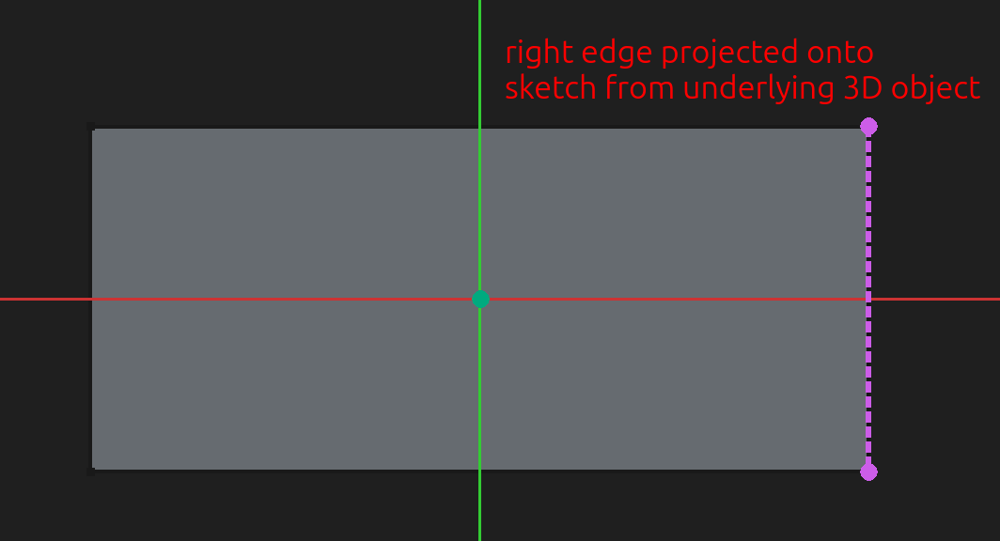

* Internal alignment geometry_FC: Construction geometry_FC added by and tied to a complex element_FC, used to control that element_FC (e.g., ellipse control arms).

  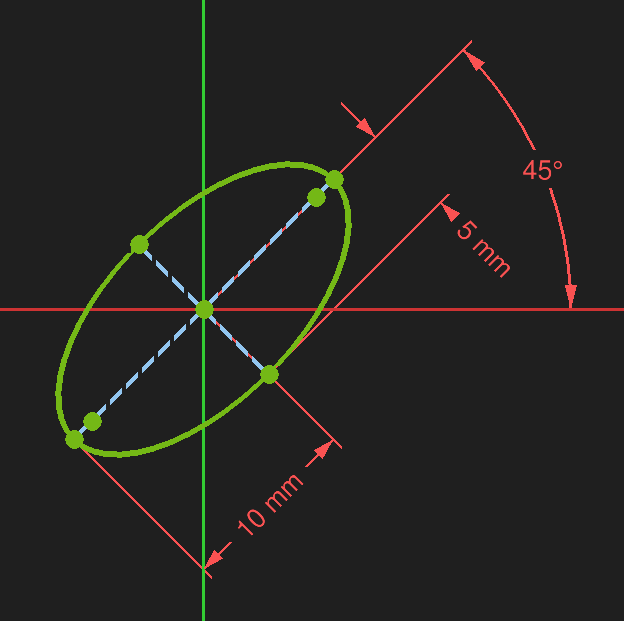

To toggle one or more elements_FC to / from construction geometry_FC, select the elements_FC and click the toggle construction geometry_FC button (keyboard shortcut G,N): 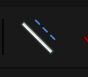

To toggle element_FC creation from / to construction geometry_FC, ensure nothing is selected and click te toggle construction geometry_FC button. Toolbar buttons to create elements_FC will change color to indicate that elements_FC being created are construction geometry_FC.


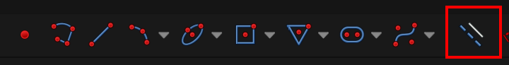

The color and line style changes !!based!! on the type of construction element_FC and the state of the overall sketch_FC. The screenshot below shows the default colors used by FreeCAD for the various types and states.


`{ref} https://wiki.freecad.org/Sketcher_Workbench` `{ref} https://wiki.freecad.org/Sketcher_Tutorial` `{ref} https://wiki.freecad.org/Sketcher_ToggleConstruction` `{ref} https://forum.freecad.org/viewtopic.php?t=55061` `{ref} https://www.reddit.com/r/FreeCAD/comments/1m77d13/what_are_construction_geometries/` `{ref} self`

### Degrees of Freedom

`{bm} /(Sketcher Workbench\/Sketching\/Degrees of Freedom)_TOPIC/i`

```{prereq}
Sketcher Workbench/Sketching/Creation_TOPIC
Sketcher Workbench/Sketching/Selection_TOPIC
Sketcher Workbench/Sketching/Deletion_TOPIC
```

If an element_FC ...

* isn't constrained_FC to the point where it's locked into a specific parameterization (e.g., location, rotation, angle, and whatever other parameters it may have), it's said to have n degrees of freedom_FC, where n >= 1.
* is constrained_FC to the point where it's locked into a specific parameterization, it's said to be fully constrained_FC (0 degrees of freedom_FC).

A degree of freedom_FC is a parameterization that hasn't been set. For example, ...

* a point has 2 degrees of freedom_FC:

  1. X position.
  2. Y position.
  
  The example below fully constrains a point by setting its position in relation to the origin of the sketch_FC.

  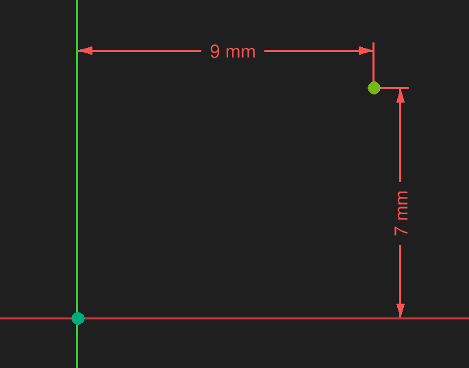

* a line has 4 degrees of freedom_FC:

  1. Start point's X position.
  2. Start point's Y position.
  3. End point's X position.
  4. End point's Y position.

  The example below fully constrains a line by setting the position of its first point to the origin, and then giving it and angle and a length. The position of the second point is derived from the combination of angle and length.

  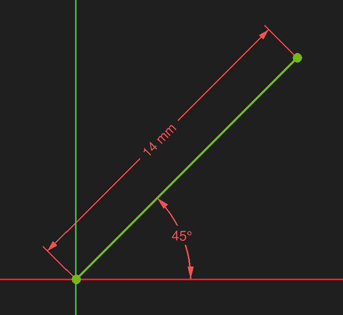

* an arc has 5 degrees of freedom_FC:

  1. Center point's X position.
  2. Center point's Y position.
  3. Radius/diameter of arc's underlying circle.
  4. Angle between the two points comprising the arc.
  5. What segment of the underlying circle the arc sits on.

  The example below fully constrains an arc by setting its center point to the origin of the sketch_FC, setting the radius to 14mm, setting the angle of the arc to 45 degrees, and positioning the arc on the underlying circle by stating that the lower point sits 7mm above the X axis. 

  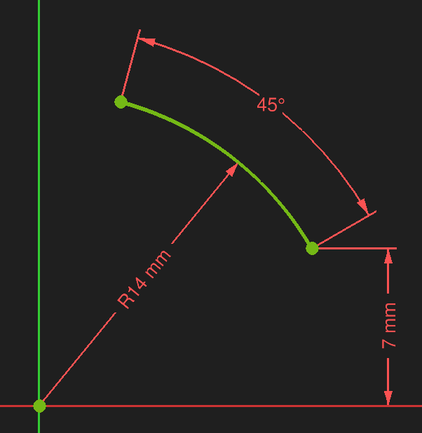

The overall constraint_FC state for all elements_FC in the sketch_FC is shown in the Sketch_FC Edit pane.

* **Under-constrained_FC** / **Fully constrained_FC**: When there's 1 or more degrees of freedom_FC, the Sketch_FC Edit pane will report that the sketch_FC is under-constrained_FC. When there's exactly 0 degrees of freedom_FC, the Sketch_FC Edit pane will report that the sketch_FC is fully constrained_FC. In the example below, the two lines each have a point with a coincident constraint_FC to the origin while the other endpoint is unconstrained_FC (4 degrees of freedom_FC). Clicking the degrees of freedom_FC text in the Sketch_FC Edit pane will will select the two unconstrained_FC endpoints.

  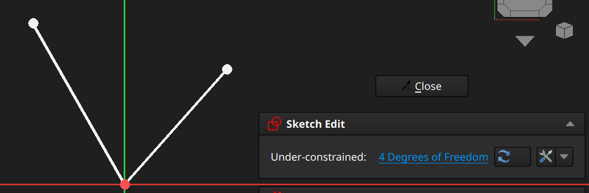

* **Redundant constraints_FC** / **Partially redundant_FC**: If a sketch_FC has constraints_FC that deduce to the same thing, the Sketch_FC Edit pane will report that the sketch_FC has redundant constraints_FC. In the example below, the line's start point has a coincident constraint_FC to the origin and ...

  * the end point has a horizontal distance constraint_FC and vertical distance constraint_FC, both set to 1mm.
  * the line itself has a an angle constraint_FC set to 45 degrees from the X axis.

  This reports a redundant constraint_FC because the end point of (1mm, 1mm) implies a 45 degree angle from the X axis. Clicking the redundant constraints_FC text in the Sketch_FC Edit pane selects the redundant constraints_FC.

  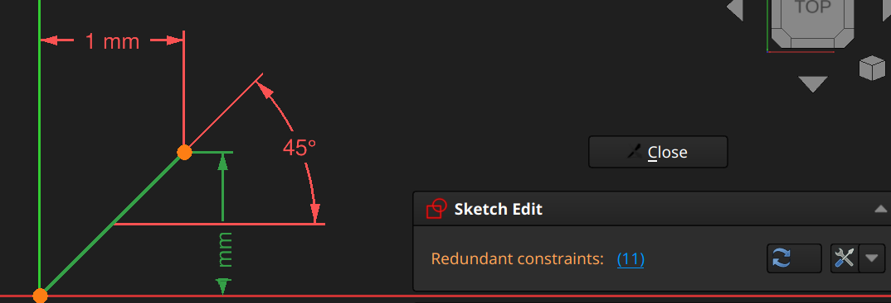

* **Over-constrained_FC**: If a sketch_FC has conflicting constraints_FC (they both can't be satisfied because they're opposed to each other), the Sketch_FC Edit pane will report that the sketch_FC has over-constrained_FC. In the example below, the triangle in this sketch_FC is constrained_FC to be an equilateral triangle, but it also has a coincident constraint_FC that says two of the triangle's vertices should be at the same point, making it an impossible to satisfy all constraints_FC. Clicking the over-constrained_FC text in the Sketch_FC Edit pane selects the conflicting constraints_FC.

  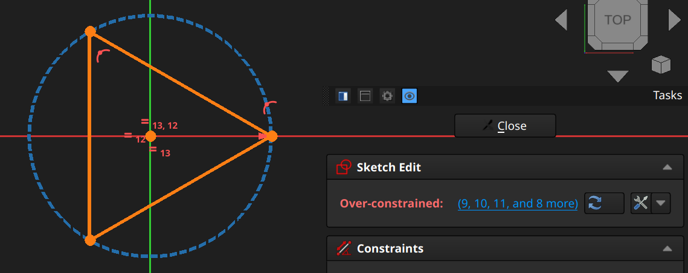
  
  Typically, once a conflicting constraint_FC is added, the number of conflicting constraints_FC reported becomes much more than 2. That's usually because the 1 added constraint_FC goes is invalid against many existing constraints_FC. The Sketch_FC Edit pane doesn't group conflicting constraints_FC together (e.g., 1,3,5 are valid together vs 2,4 are valid together, but all together they conflict) or give any reasoning as to why the constraints_FC conflict (e.g., deduced angle is 30 degrees but angle constraint_FC is attempting to set to 45 degrees).

```{note}
There are other messages, but they usually mean something critical has gone wrong (e.g., Malformed constraints_FC, Solver failed to converge).
```

It is important that a completed sketch_FC always be fully constrained_FC, otherwise the solver (software responsible for applying constraints_FC) may shift and reorient the elements_FC on that sketch_FC !!based!! on the what is and isn't constrained_FC. Even if a sketch_FC is fully constrained_FC, it may still be subject to sketch flipping_FC, a phenomenon where the sketch_FC changes because even when fully constrained_FC there is more than 1 possible outcome for the constraints_FC. In the example below, both arcs have the exact same constraints_FC (both fully constrained_FC), but there are two possible solutions.

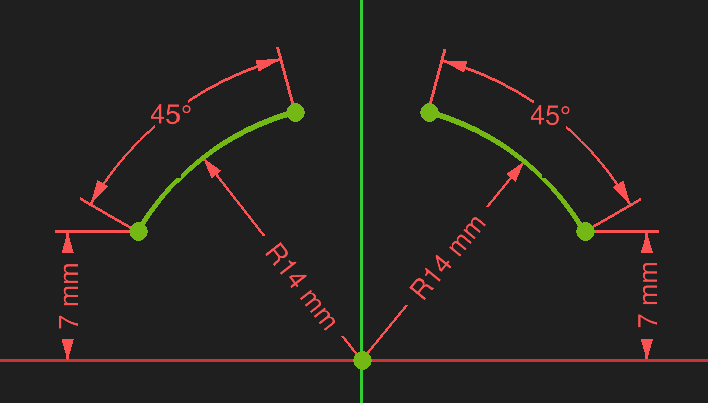

```{seealso}
Sketcher Workbench/Sketching/Sketch Flipping_TOPIC
```

`{ref} https://wiki.freecad.org/Sketcher_Workbench` `{ref} https://wiki.freecad.org/Sketcher_Tutorial` `{ref} https://wiki.freecad.org/Sketcher_Dialog` `{ref} https://www.reddit.com/r/FreeCAD/comments/1m24jo0/what_is_over_constraining/` `{ref} https://forum.freecad.org/viewtopic.php?p=732972#p732972` `{ref} https://www.reddit.com/r/FreeCAD/comments/1ivu9lm/newbie_question_on_underconstrained/` `{ref} self`

### Sketch Flipping

`{bm} /(Sketcher Workbench\/Sketching\/Sketch Flipping)_TOPIC/i`

```{prereq}
Sketcher Workbench/Sketching/Degrees of Freedom_TOPIC
Sketcher Workbench/Constraints/Vertical Dimension_TOPIC
Sketcher Workbench/Constraints/Horizontal Dimension_TOPIC
Sketcher Workbench/Constraints/Angle Dimension_TOPIC
Sketcher Workbench/Constraints/Distance Dimension_TOPIC
```

Even if a sketch_FC is fully constrained_FC, it may still be subject to sketch flipping_FC, a phenomenon where the sketch_FC reshapes because even when fully constrained_FC there is more than 1 possible outcome for the constraints_FC.

* **Example 1**

  In the example below, both arcs have the exact same constraints_FC (both fully constrained_FC), but there are two possible solutions.

  

  Sketch flipping_FC happens because, in certain cases, directionality may not exist. There's no constraint_FC that ties the arc as to which side of the X axis it's on.
  
  This can be fixed by adding a constraint_FC to force directionality. For example, adding a horizontal constraint_FC between the end of the arc and the origin adds directionality. A horizontal constraint_FC / vertical constraint_FC is signed, meaning that a value of 12mm goes in one direction while -12mm goes in the opposite direction.

  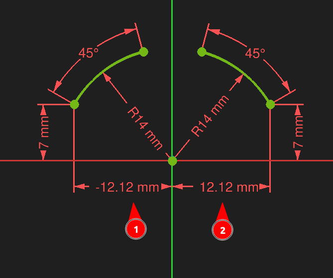

* **Example 2**

  In the example below, both shapes have the exact same constraints_FC (both fully constrained_FC) except that the second version is 50mm away from the Y axis instead of 16mm. Note that the sketch_FC changed shape even though all other constraints_FC are equivalent.

  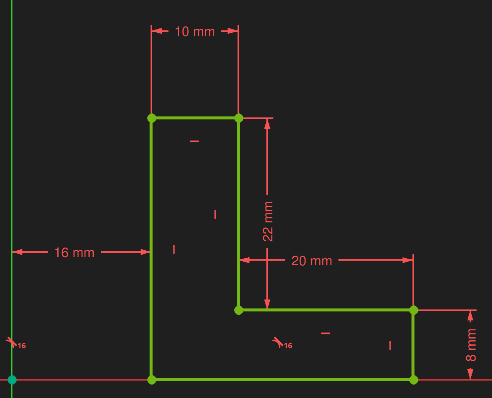 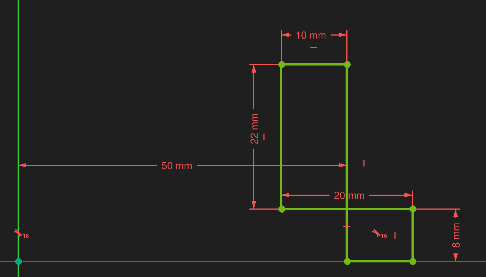

  As with the previous example, there is a lack of directionality that causes sketch flipping_FC. The top horizontal line has a distance constraint_FC of 10mm, but there's nothing constraining_FC the order of the points (which of its two points is closer to the Y axis). The solver is free to swap the points as it sees fit, so long as the distance is still 10mm.

  Again, this can be fixed by adding a constraint_FC to force directionality. For example, instead of using a distance constraint_FC of 10mm, using a horizontal constraint_FC of 10mm will. A horizontal constraint_FC with a value of 10mm will fix the sketch_FC into one orientation, while -10mm will fix it into the other orientation.

  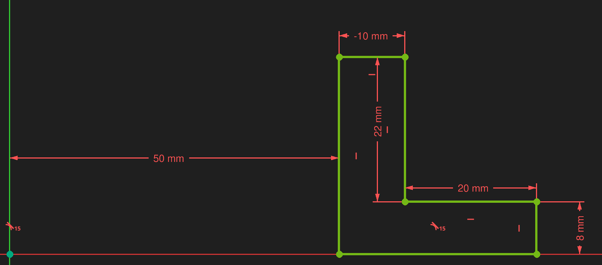

* **Example 3**

  The example below is similar to the previous example, except more complex. There's double flipping_FC occurring:
  
  1. The box and triangle are flipping_FC across the symmetry line
  2. The box has flipped_FC such that the vertical line closer to the symmetry line has become the one farther from the symmetry line.

  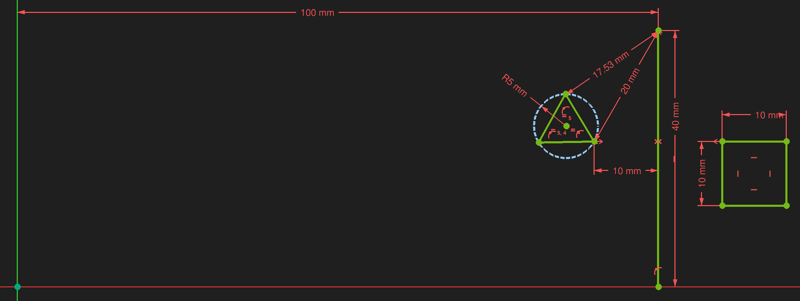 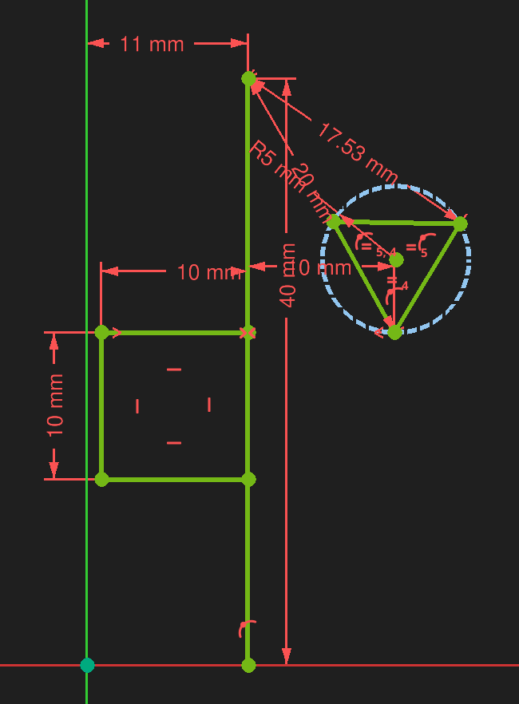

  Again, this can be fixed by adding one or more constraints_FC to force directionality:
  
  * Add a horizontal constraint_FC to the box to ensure its points don't flip_FC.
  * Add a horizontal constraint_FC between the symmetry line's point and either a point on the box or a point on the triangle, to ensure they stay on the correct side of the symmetry line.

  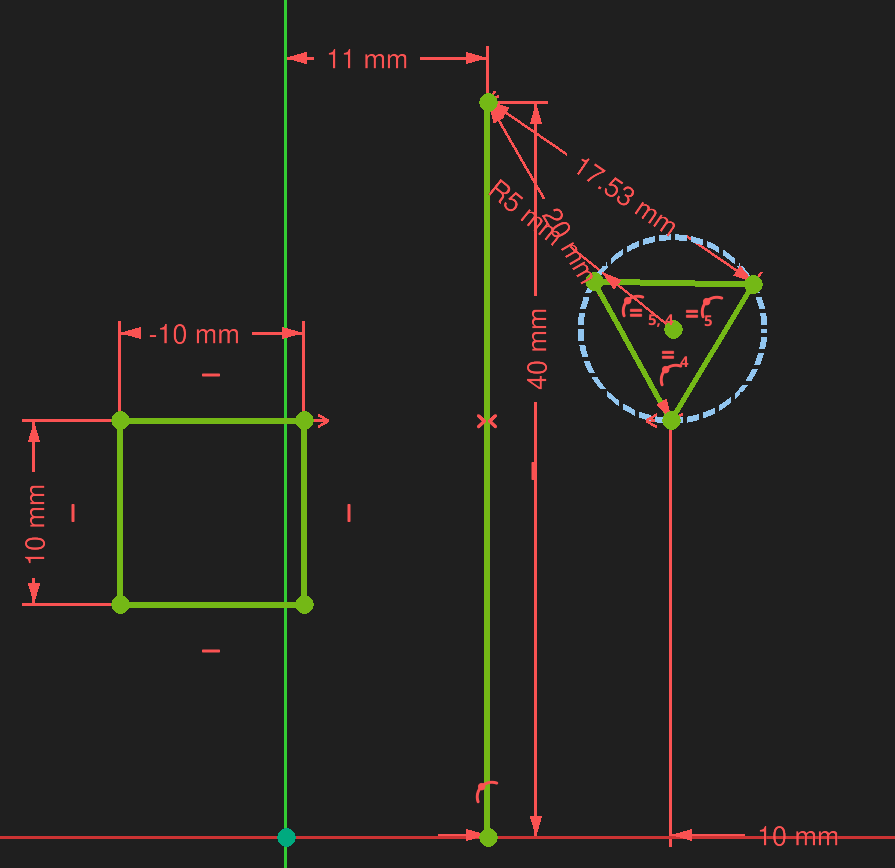

To prevent flipping_FC, it's important to anchor the sketch_FC using constraints_FC that !!support!! directionality. In general ...

* horizontal constraints_FC are signed, so they can specify directionality.
* vertical constraints_FC are signed, so they can specify directionality.
* angle constraints_FC are signed, so they can specify directionality, but that only works if the angle is anchored to something fixed (e.g., angle from x-axis and not the angle for an arc).
* block constraints_FC force an exact position, similar to adding a horizontal constraint_FC and vertical constraint_FC against the origin.

`{ref} https://wiki.freecad.org/Sketcher_Workbench#Flipping` `{ref} https://forum.freecad.org/viewtopic.php?t=10872` `{ref} self`

### 3D Feature Validity

`{bm} /(Sketcher Workbench\/Sketching\/3D Feature Validity)_TOPIC/i`

```{prereq}
Sketcher Workbench/Sketching/Creation_TOPIC
Sketcher Workbench/Sketching/Selection_TOPIC
Sketcher Workbench/Sketching/Deletion_TOPIC
Sketcher Workbench/Sketching/Construction Geometry_TOPIC
Sketcher Workbench/Sketching/Projection Geometry_TOPIC
Sketcher Workbench/Sketching/Degrees of Freedom_TOPIC
Sketcher Workbench/Sketching/Sketch Flipping_TOPIC
```

```{note}
The word !!contour!! here just means the outline of a shape that you draw in the sketcher_FC. It doesn't have the same special meaning as the contours_BS vs holes_BS meaning in Bambu Studio.
```

For a sketch_FC to be valid for use as a 3D feature_FC (e.g., as a profile that extrudes into a 3D addition or punches into a 3D face), it must conform to several expectations:

* **No open !!contours!!**: A !!contours!! must be closed, meaning gaps between endpoints of that !!contour!! aren't allowed (no matter how small).

  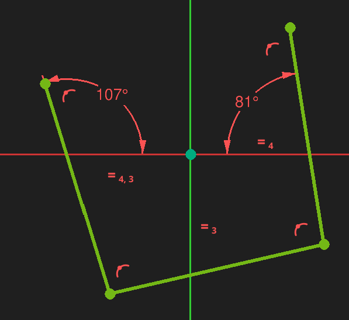

* **No intersection**: A !!contour!! must not intersect with other !!contours!! or self-intersect.

  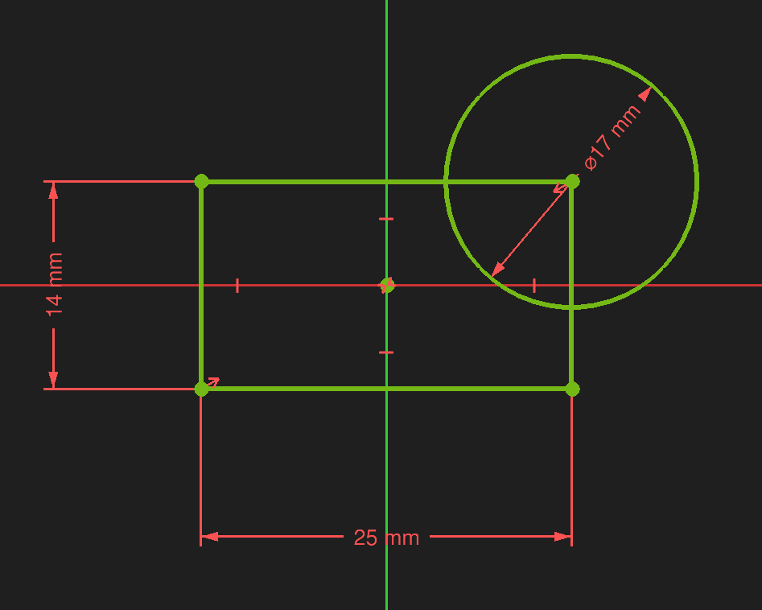

  ```{note}
  While it !!contours!! can't intersect, one !!contour!! is allowed to be wholly contained in the. See further down for more information.
  ```

* **No shared edges between !!contours!!**: Two !!contours!! must not share an edge. 

  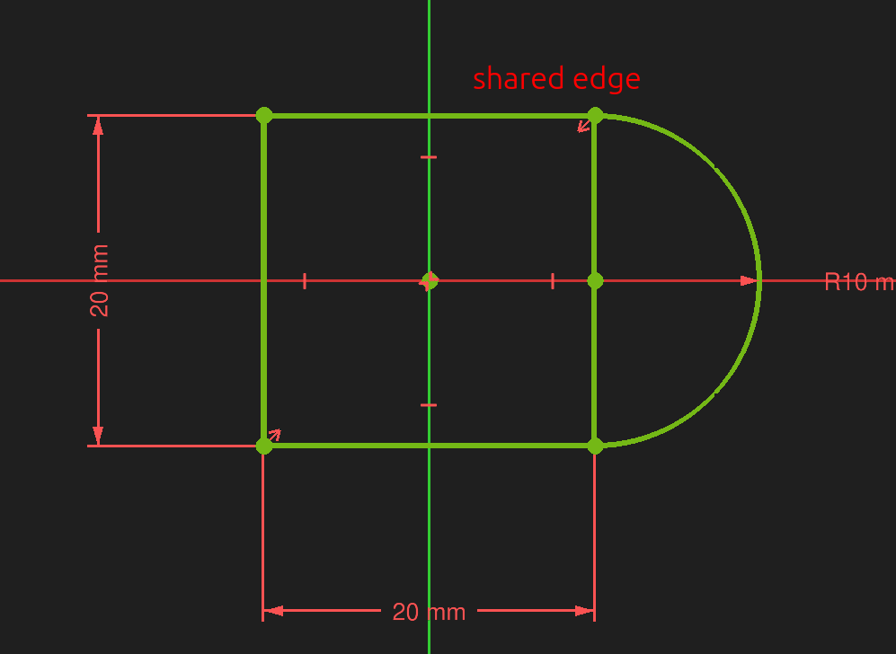 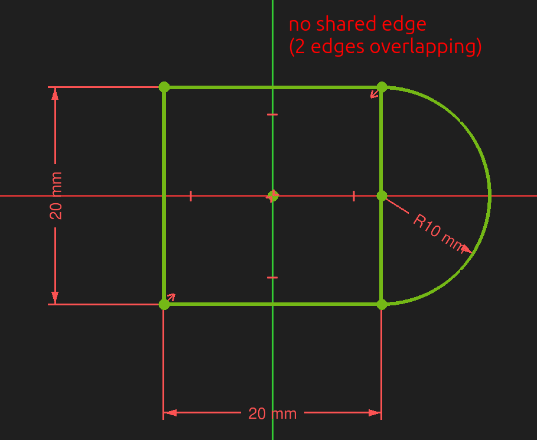

* **No T-connections**: A !!contour!! must not have two edges sharing a common point / point touching an edge.

  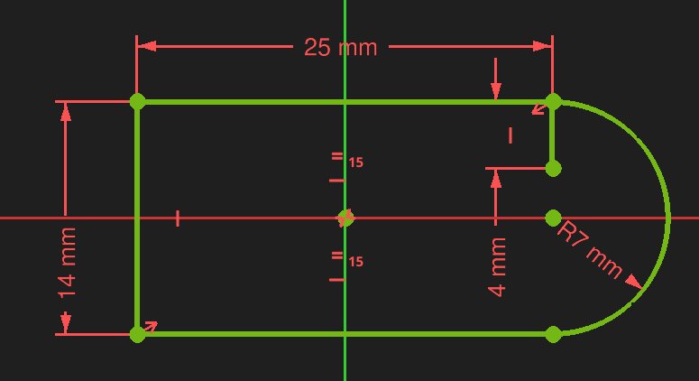

!!Contours!! are allowed to be nested (but not intersecting). Nesting alternates between creating voids in the 3D feature_FC.

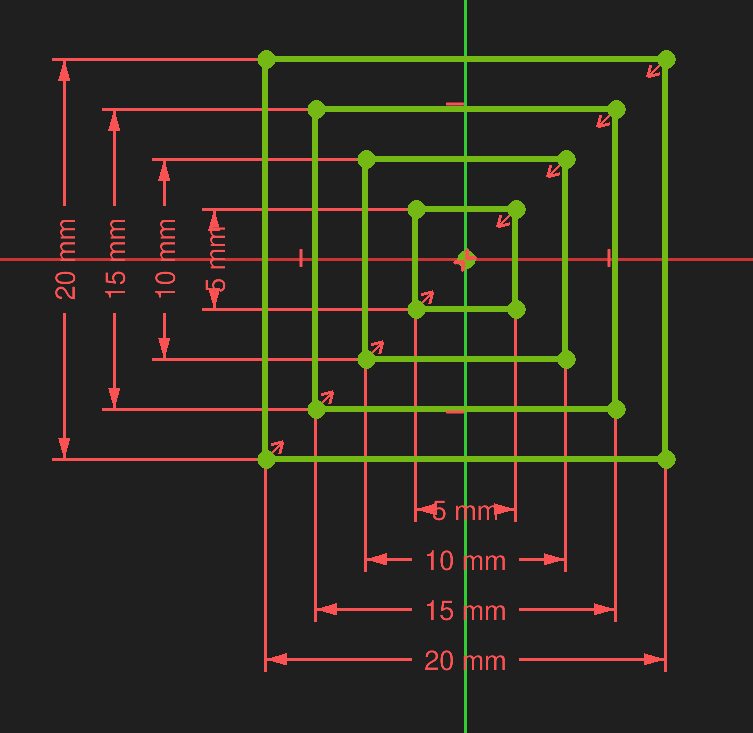 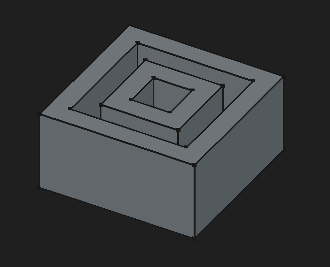

```{note}
These rules don't apply to construction geometry_FC because construction geometry_FC doesn't appear outside of editing a sketch_FC.
```

`{ref} https://wiki.freecad.org/Sketcher_Workbench#Profile_sketches`

## Elements

`{bm} /(Sketcher Workbench\/Elements)_TOPIC/i`

```{prereq}
Sketcher Workbench/Sketching/Creation_TOPIC
Sketcher Workbench/Sketching/Selection_TOPIC
Sketcher Workbench/Sketching/Deletion_TOPIC
```

An element_FC is a 2D geometric primitive (e.g., point, line, arc, and spline). The element_FC itself defines a primitive, while the parameterization of the primitive are defined by constraints_FC applied to the element_FC (constraints_FC are discussed in later sections).

```{seealso}
Sketcher Workbench/Constraints_TOPIC
```

The subsections below detail the various elements_FC available.

`{ref} https://wiki.freecad.org/Basic_Sketcher_Tutorial`

### Point

`{bm} /(Sketcher Workbench\/Elements\/Point)_TOPIC/i`

```{prereq}
Sketcher Workbench/Sketching/Creation_TOPIC
```


To create a point, use toolbar button 1 (keyboard shortcut G,Y) and click within the 3D viewport to place the point.

`{ref} https://wiki.freecad.org/Sketcher_CreatePoint`

### Line

`{bm} /(Sketcher Workbench\/Elements\/Line)_TOPIC/i`

```{prereq}
Sketcher Workbench/Sketching/Creation_TOPIC
```


To create a line, use toolbar button 3 (keyboard shortcut G,L). Once the tool is active, select the mode in which the line should be created (cycle keyboard shortcut M). The mode defines the constraints_FC presented by On-View-Parameters_FC when the line is being created:

* **Point, length, angle**
* **Point, !!width!!, !!height!!**
* **2 points** (no constraints_FC presented)

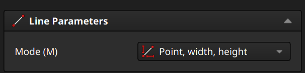

Click within the 3D viewport to place the element_FC and either fill out the On-View-Parameters_FC or click again to place the second point.

```{note}
A line is made up of 2 points.
```

`{ref} https://wiki.freecad.org/Sketcher_CreateLine`

### Rectangle

`{bm} /(Sketcher Workbench\/Elements\/Rectangle)_TOPIC/i`

```{prereq}
Sketcher Workbench/Sketching/Creation_TOPIC
```


To create a rectangle, use toolbar button 6 to present a drop-down and either select ...

* Rectangle (keyboard shortcut G,R)
* Centered Rectangle (keyboard shortcut G,V)
* Rounded Rectangle (keyboard shortcut G,O)

The selection activates the tool with specific Rectangle Parameters preset. Those parameters can continue to be set once the tool is active:

* **Mode**: The mode in which the rectangle should be created (cycle keyboard shortcut M). Mode defines the constraints_FC presented by On-View-Parameters_FC when the rectangle is being created.
* **Rounded corners**: Whether the rectangle should have rounded corners (keyboard shortcut U). Rounded corners defines extra elements_FC and constraints_FC to be presented by On-View-Parameters_FC when the rectangle is being created.
* **!!Frame!!**: Whether the rectangle should be a !!frame!! (keyboard shortcut J), as in have an inner and outer border. !!Frame!! defines extra elements_FC and constraints_FC to be presented by On-View-Parameters_FC when the rectangle is being created.

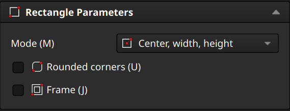

Click within the 3D viewport to place the element_FC and either fill out the On-View-Parameters_FC or click until placement is complete.

```{note}
A rectangle is made up of at least 4 lines. 4 more added if it's !!framed!!. 4 arcs added if it's rounded.
```

`{ref} https://wiki.freecad.org/Sketcher_CreateRectangle` 
`{ref} https://wiki.freecad.org/Sketcher_CreateRectangle_Center`
`{ref} https://wiki.freecad.org/Sketcher_CreateOblong`

### Polygon

`{bm} /(Sketcher Workbench\/Elements\/Polygon)_TOPIC/i`

```{prereq}
Sketcher Workbench/Sketching/Creation_TOPIC
```


To create a polygon, use toolbar button 7 to present a drop-down and either select ...

* Triangle (keyboard shortcut G,P,3).
* Square (keyboard shortcut G,P,4).
* Pentagon (keyboard shortcut G,P,5).
* Hexagon (keyboard shortcut G,P,6).
* Heptagon (keyboard shortcut G,P,7).
* Octagon (keyboard shortcut G,P,8).
* Polygon (keyboard shortcut G,P,R).

```{note}
Triangle is an equilateral triangle.
```

Except for Polygon, the selection activates the tool with specific Polygon Parameters preset. Those parameters can continue to be set once the tool is active:

* **Mode**: Select the number of sides for the polygon (keyboard shortcut U to increase, keyboard shortcut J to decrease).

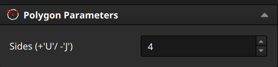

Click within the 3D viewport to place the element_FC and either fill out the On-View-Parameters_FC or click until placement is complete.

```{note}
A polygon is made up of n lines and a circle (construction geometry_FC).
```

`{ref} https://wiki.freecad.org/Sketcher_CreateTriangle`
`{ref} https://wiki.freecad.org/Sketcher_CreateSquare`
`{ref} https://wiki.freecad.org/Sketcher_CreatePentagon`
`{ref} https://wiki.freecad.org/Sketcher_CreateHexagon`
`{ref} https://wiki.freecad.org/Sketcher_CreateHeptagon`
`{ref} https://wiki.freecad.org/Sketcher_CreateOctagon`
`{ref} https://wiki.freecad.org/Sketcher_CreateRegularPolygon`

### Circle Ellipse

`{bm} /(Sketcher Workbench\/Elements\/Circle Ellipse)_TOPIC/i`

```{prereq}
Sketcher Workbench/Sketching/Creation_TOPIC
```


To create an ellipse or circle, use toolbar button 5 to present a drop-down and either select ...

* Circle from Center (keyboard shortcut G,C).
* Circle from 3 Points (keyboard shortcut G,3,C).
* Ellipse from Center (keyboard shortcut G,E,E).
* Ellipse from 3 Points (keyboard shortcut G,3,E).

Once the tool is active, select the mode in which the line should be created (cycle keyboard shortcut M). The mode defines the constraints_FC presented by On-View-Parameters_FC when the line is being created:

* **Center**: Create circle/ellipse from a center point.
* **3 rim points** / **Axis endpoints**: Create circle/ellipse from 3 points on the rim.


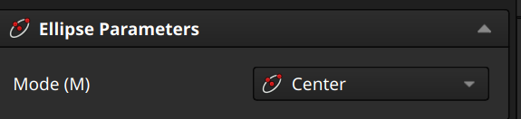

Click within the 3D viewport to place the element_FC and either fill out the On-View-Parameters_FC or click until placement is complete.

`{ref} https://wiki.freecad.org/Sketcher_CreateCircle`
`{ref} https://wiki.freecad.org/Sketcher_Create3PointCircle`
`{ref} https://wiki.freecad.org/Sketcher_CreateEllipseByCenter`
`{ref} https://wiki.freecad.org/Sketcher_CreateEllipseBy3Points`

### Arc

`{bm} /(Sketcher Workbench\/Elements\/Arc)_TOPIC/i`

```{prereq}
Sketcher Workbench/Sketching/Creation_TOPIC
```


To create an arc, use toolbar button 4 to present a drop-down and either select ...

* Arc from Center (keyboard shortcut G,A).
* Arc from 3 Points (keyboard shortcut G,3,A).
* Elliptical Arc (keyboard shortcut G,E,A).
* Hyperbolic Arc (keyboard shortcut G,H).
* Parabolic Arc (keyboard shortcut G,J).

Of the options, ...

* for the first two (circular arcs), once the tool is active select the mode in which the line should be created (cycle keyboard shortcut M):

  * **Center**: Create circle/ellipse from a center point.
  * **3 rim points** / **Axis endpoints**: Create circle/ellipse from 3 points on the rim.

  The only mode that defines constraints_FC presented by On-View-Parameters_FC when being created is **Center**.

  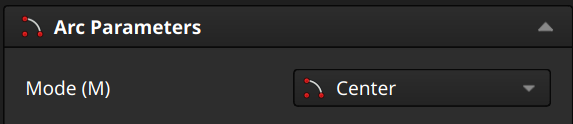

* for the remainder, there are no options and On-View-Params_FC aren't enabled.

Click within the 3D viewport to place the element_FC and either fill out the On-View-Parameters_FC or click until placement is complete.

`{ref} https://wiki.freecad.org/Sketcher_CreateArc`
`{ref} https://wiki.freecad.org/Sketcher_Create3PointArc`
`{ref} https://wiki.freecad.org/Sketcher_CreateArcOfEllipse`
`{ref} https://wiki.freecad.org/Sketcher_CreateArcOfHyperbola`
`{ref} https://wiki.freecad.org/Sketcher_CreateArcOfParabola`

### Polyline

`{bm} /(Sketcher Workbench\/Elements\/Polyline)_TOPIC/i`

```{prereq}
Sketcher Workbench/Sketching/Creation_TOPIC
```


A polyline is a helper that chains together lines and arcs into a path. To create a polyline use toolbar button 2 (keyboard shortcut G,M). Then, either select where to drop the first point or click an existing endpoint. Continue clicking to place new segments in a chain, hitting M to cycle through the line and arc options:

* Line connected to the previous segment.
* Line perpendicular to the previous segment.
* Line tangential to the previous segment.
* Arc tangential to the previous segment (hold Ctrl to snap arc to increments of 45 degree relative to the previous segment).
* Arc perpendicular (left) to the previous segment (hold Ctrl to snap arc to increments of 45 degree relative to the previous segment).
* Arc perpendicular (right) to the previous segment (hold Ctrl to snap arc to increments of 45 degree relative to the previous segment).

Click within the 3D viewport to place the element_FC and continue clicking to draw. Hit Esc to end.

There must be a previous segment for M to cycle through line and arc options (there will be if you dropped on an existing endpoint). For the initial segment, the mode is always hardcoded to a line (M won't cycle).

`{ref} https://wiki.freecad.org/Sketcher_CreatePolyline`

### Slot

`{bm} /(Sketcher Workbench\/Elements\/Slot)_TOPIC/i`

```{prereq}
Sketcher Workbench/Sketching/Creation_TOPIC
```


To create a slot, use toolbar button 8 to present a drop-down and either select ...

* Slot (keyboard shortcut G,S)
* Arc Slot (keyboard shortcut G,S,S)

Slot and Arc Slot are different tools. When ...

* Slot is activated, there are no parameters.

* Arc Slot is activate, there are parameters:

  * **Mode**: The mode in which the rectangle should be created (cycle keyboard shortcut M). Mode defines the ends of the arc slot (flat vs round).

  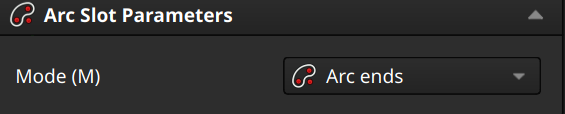

Click within the 3D viewport to place the element_FC and either fill out the On-View-Parameters_FC or click until placement is complete.


`{ref} https://wiki.freecad.org/Sketcher_CreateSlot`
`{ref} https://wiki.freecad.org/Sketcher_CreateArcSlot`

### B-Spline

`{bm} /(Sketcher Workbench\/Elements\/B-Spline)_TOPIC/i`

```{prereq}
Sketcher Workbench/Sketching/Creation_TOPIC
```


To create a b-spline, use toolbar button 9 to present a drop-down and either select ...

* B-Spline (keyboard shortcut G,B,B).
* Periodic B-Spline (keyboard shortcut G,B,P).
* B-Spline from Knots (keyboard shortcut G,B,I).
* Periodic B-Spline from Knots (keyboard shortcut G,B,O).

The selection activates the tool with specific Rectangle Parameters preset. Those parameters can continue to be set once the tool is active:

* **Mode**: The mode in which the b-spline should be created (cycle keyboard shortcut M). Mode defines whether the clicks in the 3D viewport are for the b-spline's control points or knots.
* **Periodic**: Whether the b-spline curve loops seamlessly into itself (keyboard shortcut R).

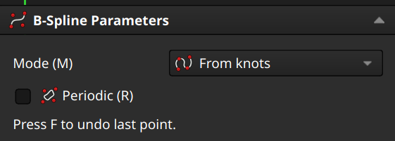

Click within the 3D viewport to place the element_FC and either fill out the On-View-Parameters_FC or click until placement is complete. Hit Esc to end.

There are various b-spline modifiers / helpers:


* Geometry to B-Spline
* Increase B-Spline Degree
* Decrease B-Spline Degree
* Increase Knot Multiplicity
* Decrease Knot Multiplicity
* Insert Knot
* Join Curves

There are various visual helpers for b-splines that can be enabled / disabled:

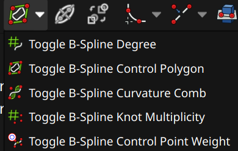

`{ref} https://wiki.freecad.org/Sketcher_CreateBSpline`
`{ref} https://wiki.freecad.org/Sketcher_CreatePeriodicBSpline`
`{ref} https://wiki.freecad.org/Sketcher_CreateBSplineByInterpolation`
`{ref} https://wiki.freecad.org/Sketcher_CreatePeriodicBSplineByInterpolation`

## Constraints

`{bm} /(Sketcher Workbench\/Constraints)_TOPIC/i`

```{prereq}
Sketcher Workbench/Sketching/Creation_TOPIC
Sketcher Workbench/Sketching/Selection_TOPIC
Sketcher Workbench/Sketching/Deletion_TOPIC
Sketcher Workbench/Elements_TOPIC
```

A constraint_FC limits the possible values for an element_FC's parameters. For example, a line may have an endpoint constrained_FC onto the X-axis, in which case the position of that endpoint must always have a Y position of 0.

```{seealso}
Sketcher Workbench/Constraints_TOPIC
```

The subsections below detail the various constraints_FC available.

`{ref} https://wiki.freecad.org/Basic_Sketcher_Tutorial`

### Distance Dimension

`{bm} /(Sketcher Workbench\/Constraints\/Distance Dimension)_TOPIC/i`

A Distance Dimension constraint_FC sets the distance.


To create a Distance Dimension constraint_FC, select either ...

* an element_FC (e.g., line)
* a pair of items, where each item can be either an element_FC or a sub-element_FC (e.g., line and arc, point and a line, point and a point).

Then, use toolbar button 1 to present a drop-down and select Distance Dimension (keyboard shortcut K,D). A pop-up will ask for the length value. Once the constraint_FC has been created, press Esc to exit.

Distance Dimension works on the elements_FC most users expect (e.g., distance between two points, distance of a line). It also works on other elements_FC. For example, Distance Dimension can be applied to point and a line, an arc, two circles / arcs, a line and a circle / arc,

```{note}
You can select the constraint_FC first and then pick the two things to create a constraint_FC between, but that breaks down in certain cases. For example, ...

* you can set the distance on a line by selecting Distance Dimension and then clicking on the line.
* you can set the distance on a arc by selecting Distance Dimension and then clicking on the arc.
* you CANNOT set the distance between a line and an arc by selecting Distance Dimension, then clicking the line, then clicking the arc.

For the last point, as soon as you click the line, the constraint_FC will get triggered on the line.

To work around this, click the line and arc first, then select Distance Dimension.
```

By definition, a distance must be a non-negative value. Imagine two points on a horizontal line A and B. The distance between (A,B) is the same as the distance between (B,A). For example, if A=5 and B=4, ...

* the distance from A to B is abs(5-4)=1
* the distance from B to A is abs(4-5)=1.

Given this, it's important to remember that distance does not encode a direction (e.g., if it did, the abs would go away, meaning the distance from B to A would have been -1 instead of 1). This lack of direction means that the sketcher_FC's solver can decide to flip_FC sketches_FC even if the sketch_FC is fully constrained_FC (unless it's somehow further constrained_FC to define a direction). For example below, the rectangle below has two distance constraints_FC, ...

* one on the vertical side (15mm).
* one on the horizontal side (20mm).

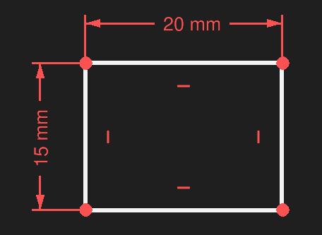

Because distance doesn't encode direction, the sketcher_FC can decide to flip_FC the horizontal edges or the vertical edges at any time. Imagine taking the lower-right corner of this rectangle and using a coincident constraint_FC to tie it to the origin. Because the edges can flip_FC, at any time the lower-right corner can become the upper-right corner, upper-left corner, or lower-left corner.

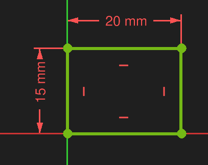
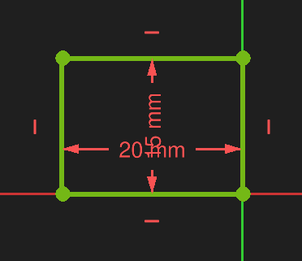

```{note}
To avoid sketch flipping_FC, you need to add additional constraints_FC that !!support!! directionality.
```

```{seealso}
Sketcher Workbench/Sketching/Sketch Flipping_TOPIC
Sketcher Workbench/Constraints/Horizontal Dimension_TOPIC
Sketcher Workbench/Constraints/Vertical Dimension_TOPIC
```

`{ref} https://wiki.freecad.org/Sketcher_ConstrainDistance` `{ref} self`

### Horizontal Dimension

`{bm} /(Sketcher Workbench\/Constraints\/Horizontal Dimension)_TOPIC/i`

```{prereq}
Sketcher Workbench/Constraints/Distance Dimension_TOPIC
```

A Horizontal Dimension constraint_FC sets the how far apart two elements_FC are, horizontally. Unlike the Distance Dimension constraint_FC, it allows direction via positive and negative values.


To create a Horizontal Dimension constraint_FC, select either ...

* an element_FC (e.g., line)
* a pair of items, where each item can be either an element_FC or a sub-element_FC (e.g., two points on different lines).

Then, use toolbar button 1 to present a drop-down and select Horizontal Dimension (keyboard shortcut L). A pop-up will ask for the length value. Once the constraint_FC has been created, press Esc to exit.

```{note}
You can select the constraint_FC first and then pick the two things to create a constraint_FC between, but that breaks down in certain cases. For example, you can't apply to just a single point.
```

If the selection is ...

* one point, the constraint_FC will be relative from the origin:

  * Positive value places point to the right of Y axis.
  * Negative value places point to the left of Y axis.

* two points, the constraint_FC will be relative from the first selected point:

  * Positive value places second point to the right of the first point.
  * Negative value places second point to the left of the first point.

* one line, the constraints_FC will be applied as if the line's two points were selected. The line's first dropped point during creating is treated as the first point, and the second dropped point is treated as the second point.

`{ref} https://wiki.freecad.org/Sketcher_ConstrainDistanceX` `{ref} self`

### Vertical Dimension

`{bm} /(Sketcher Workbench\/Constraints\/Vertical Dimension)_TOPIC/i`

```{prereq}
Sketcher Workbench/Constraints/Distance Dimension_TOPIC
```

A Vertical Dimension constraint_FC sets the how far apart two elements_FC are, vertically. Unlike the Distance Dimension constraint_FC, it allows direction via positive and negative values.


To create a Vertical Dimension constraint_FC, select either ...

* an element_FC (e.g., line)
* a pair of items, where each item can be either an element_FC or a sub-element_FC (e.g., two points on different lines).

Then, use toolbar button 1 to present a drop-down and select Vertical Dimension (keyboard shortcut I). A pop-up will ask for the length value. Once the constraint_FC has been created, press Esc to exit.

```{note}
You can select the constraint_FC first and then pick the two things to create a constraint_FC between, but that breaks down in certain cases. For example, you can't apply to just a single point.
```

If the selection is ...

* one point, the constraint_FC will be relative from the origin:

  * Positive value places point to the above of X axis.
  * Negative value places point to the below of X axis.

* two points, the constraint_FC will be relative from the first selected point:

  * Positive value places second point above the first point.
  * Negative value places second point below the first point.

* one line, the constraints_FC will be applied as if the line's two points were selected. The line's first dropped point during creating is treated as the first point, and the second dropped point is treated as the second point.

`{ref} https://wiki.freecad.org/Sketcher_ConstrainDistanceY` `{ref} self`

### Lock Position

`{bm} /(Sketcher Workbench\/Constraints\/Lock Position)_TOPIC/i`

```{prereq}
Sketcher Workbench/Constraints/Horizontal Dimension_TOPIC
Sketcher Workbench/Constraints/Vertical Dimension_TOPIC
```

Lock Position is not a constraint_FC, but a helper that applies both a Vertical Dimension constraint_FC and a Horizontal Dimension constraint_FC to the selection, effectively locking the selection in place.


To apply Lock Position, select the element_FC, use toolbar button 1 to present a drop-down, and select Lock Position (keyboard shortcut K,L). Once the constraint_FC has been created, press Esc to exit.

```{note}
You can select the constraint_FC first and then pick the two things to create a constraint_FC between, but that breaks down in certain cases. For example, you can't apply to just a single point.
```

If the selection is ...

* one point, the constraints_FC will be relative from the origin.
* two points, the constraints_FC will be relative from the the opposing points.
* one line, the constraints_FC will be applied as if the line's two points were selected.

`{ref} https://wiki.freecad.org/Sketcher_ConstrainLock`

### Radius Dimension

`{bm} /(Sketcher Workbench\/Constraints\/Radius Dimension)_TOPIC/i`

A Radius Dimension constraint_FC sets the radius of circles, arcs, and B-spline weight circles.

```{note}
From the source:

> After a B-spline is created, it is possible to define the weight of the control points by changing the radii of the weight circles. The equality constraints_FC on the circles need to be deleted first. The radius constraint_FC is arbitrary, the weight of the control points will be defined by the relative radii of the circles. It works similar to gravity: the bigger a circle is in relation to the others, the more the curve will be attracted to that control point.
```


To create a Radius Dimension constraint_FC, select an element_FC (e.g., arc), use toolbar button 1 to present a drop-down, and select Radius Dimension (keyboard shortcut K,R). A pop-up will ask for the radius value. Once the constraint_FC has been created, press Esc to exit.

```{note}
You can select the constraint_FC first and then pick the two things to create a constraint_FC between, but that may breaks down in certain cases where more than 1 selection is required.
```

`{ref} https://wiki.freecad.org/Sketcher_ConstrainRadius`

### Diameter Dimension

`{bm} /(Sketcher Workbench\/Constraints\/Diameter Dimension)_TOPIC/i`

A Diameter Dimension constraint_FC sets the diameter of circles, and arcs.

```{note}
Unlike Radius Dimension, Diameter Dimension cannot be used for B-splines. From the source:

> It cannot be used for B-spline weight circles.
```


To create a Diameter Dimension constraint_FC, select the element_FC (e.g., circle), use toolbar button 1 to present a drop-down, and select Diameter Dimension (keyboard shortcut K,O). A pop-up will ask for the diameter value. Once the constraint_FC has been created, press Esc to exit.

```{note}
You can select the constraint_FC first and then pick the two things to create a constraint_FC between, but that may breaks down in certain cases where more than 1 selection is required.
```

`{ref} https://wiki.freecad.org/Sketcher_ConstrainDiameter`

### Angle Dimension

`{bm} /(Sketcher Workbench\/Constraints\/Angle Dimension)_TOPIC/i`

An Angle Dimension sets the angle between two edges, a line an an axis of the sketch_FC, or the aperture angle of a circular arc.


To create a Angle Dimension constraint_FC, select either ...

* an element_FC (e.g., line)
* a pair of items, where each item can be either an element_FC or a sub-element_FC (e.g., two lines).

Then, use toolbar button 1 to present a drop-down and select Angle Dimension (keyboard shortcut K,A). A pop-up will ask for the angle value. Once the constraint_FC has been created, press Esc to exit.

```{note}
You can select the constraint_FC first and then pick the two things to create a constraint_FC between, but that may breaks down in certain cases where more than 1 selection is required.
```

If the selection is ...

* one line, the constraint_FC will be the angle relative to the horizontal axis.
* one arc, the constraints_FC will be the angle defining how far the arc's endpoints are from each other.
* two lines, the constraints_FC will be an angle between the two lines, where the center is the intersection point of the lines.
* two lines and a point, the constraints_FC will be an angle between the two lines, where the center is the point.

`{ref} https://wiki.freecad.org/Sketcher_ConstrainAngle`

### Radius-Diameter Dimension

`{bm} /(Sketcher Workbench\/Constraints\/Radius-Diameter Dimension)_TOPIC/i`

```{prereq}
Sketcher Workbench/Constraints/Radius Dimension_TOPIC
Sketcher Workbench/Constraints/Diameter Dimension_TOPIC
```

Radius-Diameter Dimension is not a constraint_FC, but a helper that applies either a Radius Dimension constraint_FC or a Diameter Dimension constraint_FC to the selection, depending on the type of element_FC it is.


To apply Radius-Diameter Dimension, select the element_FC (e.g., arc), use toolbar button 1 to present a drop-down, and select Radius-Diameter Dimension (keyboard shortcut K,S). A pop-up will ask for the diameter/radius value. Once the constraint_FC has been created, press Esc to exit.

```{note}
You can select the constraint_FC first and then pick the two things to create a constraint_FC between, but that breaks down in certain cases. For example, you can't apply to just a single point.
```

If the selection is ...

* an arc or b-spline weight circle, the constraints_FC will be a Radius Dimension.
* a circle, the constraint_FC will be a Diameter Dimension.

`{ref} https://wiki.freecad.org/Sketcher_ConstrainRadiam`

### Dimension

`{bm} /(Sketcher Workbench\/Constraints\/Dimension)_TOPIC/i`

```{prereq}
Sketcher Workbench/Constraints/Distance Dimension_TOPIC
Sketcher Workbench/Constraints/Horizontal Dimension_TOPIC
Sketcher Workbench/Constraints/Vertical Dimension_TOPIC
Sketcher Workbench/Constraints/Radius Dimension_TOPIC
Sketcher Workbench/Constraints/Diameter Dimension_TOPIC
Sketcher Workbench/Constraints/Angle Dimension_TOPIC
Sketcher Workbench/Constraints/Coincident_TOPIC
Sketcher Workbench/Constraints/Horizontal_TOPIC
Sketcher Workbench/Constraints/Vertical_TOPIC
Sketcher Workbench/Constraints/Parallel_TOPIC
Sketcher Workbench/Constraints/Perpendicular_TOPIC
Sketcher Workbench/Constraints/Tangent-Colinear_TOPIC
Sketcher Workbench/Constraints/Equal_TOPIC
Sketcher Workbench/Constraints/Symmetric_TOPIC
```

Dimension is not a constraint_FC, but a helper that allows cycling through most possible constraints_FC for the element_FC selection.


To apply Dimension, select either ...

* an element_FC (e.g., line)
* a pair of items, where each item can be either an element_FC or a sub-element_FC (e.g., two points on different lines).

Then, use toolbar button 1 to present a drop-down and select Dimension (keyboard shortcut D). Continue to hit M until the desired constraint_FC appears and click to apply. A pop-up may appear asking for a value (e.g., angle if the constraint_FC is Angle Dimension constraint_FC). Once the constraint_FC has been created, press Esc to exit.

For example, if the selection is two lines, the possible constraints_FC that can be cycled through may include Angle Dimension and Parallel.

```{note}
You can select the constraint_FC first and then pick the two things to create a constraint_FC between, but that breaks down in certain cases. For example, you can't apply to just a single point.
```

```{note}
Will selecting 3 items work? Select 2 points and a line - does it default to a symmetry constraint_FC?
```

`{ref} https://wiki.freecad.org/Sketcher_Dimension`

### Coincident

`{bm} /(Sketcher Workbench\/Constraints\/Coincident)_TOPIC/i`

A Coincident constraint_FC sets a point to lie on another point, edge (e.g., line, rim of an arc, rim of a circle, b-spline), or basis axis.


To create a Coincident constraint_FC, select either ...

* an element_FC (e.g., line)
* a pair of items, where each item can be either an element_FC or a sub-element_FC (e.g., a point and a line).

Then, use toolbar button 2 (keyboard shortcut C). A pop-up will ask for the angle value. Once the constraint_FC has been created, press Esc to exit.

```{note}
You can select the constraint_FC first and then pick the two things to create a constraint_FC between, but that may breaks down in certain cases where more than 1 selection is required.
```

If the selection is ...

* two points, the constraint_FC will place the points on top of each other.
* a point and an edge, the constraints_FC will place the point along the edge.
* a point and a basis axis, the constraints_FC will place the point along the basis axis.

```{note}
Apparently there use to be 2 separate constraints_FC for Coincident? This is two separate constraints_FC unified into one: The old Coincident constraint_FC and the old Point-on-Object constraint_FC.
```

`{ref} https://wiki.freecad.org/Sketcher_ConstrainCoincidentUnified`

### Horizontal

`{bm} /(Sketcher Workbench\/Constraints\/Horizontal)_TOPIC/i`

A Horizontal constraint_FC sets a pair of points or a line to be horizontal.


To create a Horizontal constraint_FC, select either ...

* an element_FC (e.g., line)
* a pair of items, where each item can be either an element_FC or a sub-element_FC (e.g., two points).

Then, use toolbar button 3 to present a drop-down and select Horizontal (keyboard shortcut H). Once the constraint_FC has been created, press Esc to exit.

```{note}
You can select the constraint_FC first and then pick the two things to create a constraint_FC between, but that may breaks down in certain cases where more than 1 selection is required.
```

`{ref} https://wiki.freecad.org/Sketcher_ConstrainHorizontal`

### Vertical

`{bm} /(Sketcher Workbench\/Constraints\/Vertical)_TOPIC/i`

A Vertical constraint_FC sets a pair of points or a line to be vertical.


To create a Vertical constraint_FC, select either ...

* an element_FC (e.g., line)
* a pair of items, where each item can be either an element_FC or a sub-element_FC (e.g., two points).

Then, use toolbar button 3 to present a drop-down and select Vertical (keyboard shortcut V). Once the constraint_FC has been created, press Esc to exit.

```{note}
You can select the constraint_FC first and then pick the two things to create a constraint_FC between, but that may breaks down in certain cases where more than 1 selection is required.
```

`{ref} https://wiki.freecad.org/Sketcher_ConstrainVertical`

### Horizontal-Vertical

`{bm} /(Sketcher Workbench\/Constraints\/Horizontal-Vertical)_TOPIC/i`

```{prereq}
Sketcher Workbench/Constraints/Radius Dimension_TOPIC
Sketcher Workbench/Constraints/Diameter Dimension_TOPIC
```

Horizontal-Vertical is not a constraint_FC, but a helper that applies either a Horizontal constraint_FC or a Vertical constraint_FC to the selection.


To apply Horizontal-Vertical, select either ...

* an element_FC (e.g., line)
* a pair of items, where each item can be either an element_FC or a sub-element_FC (e.g., two points).

Then, use toolbar button 3 to present a drop-down and select Horizontal-Vertical (keyboard shortcut A). Once the constraint_FC has been created, press Esc to exit.

```{note}
You can select the constraint_FC first and then pick the two things to create a constraint_FC between, but that breaks down in certain cases. For example, you can't apply to just a single point.
```

If the selection is ...

* closer to being horizontal, a Horizontal constraint_FC will be applied.
* closer to being horizontal, a Vertical constraint_FC will be applied.

`{ref} https://wiki.freecad.org/Sketcher_ConstrainHorVer`

### Parallel

`{bm} /(Sketcher Workbench\/Constraints\/Parallel)_TOPIC/i`

A Parallel constraint_FC sets a pair of lines to be parallel.


To create a Parallel constraint_FC, select the elements_FC (e.g., two lines) and use toolbar button 4 (keyboard shortcut P). Once the constraint_FC has been created, press Esc to exit.

```{note}
You can select the constraint_FC first and then pick the two things to create a constraint_FC between, but that may breaks down in certain cases where more than 1 selection is required.
```

`{ref} https://wiki.freecad.org/Sketcher_ConstrainParallel`

### Perpendicular

`{bm} /(Sketcher Workbench\/Constraints\/Perpendicular)_TOPIC/i`

A Perpendicular constraint_FC sets a pair of lines to be perpendicular.


To create a Perpendicular constraint_FC, select the elements_FC (e.g., two lines) and use toolbar button 5 (keyboard shortcut N). Once the constraint_FC has been created, press Esc to exit.

```{note}
You can select the constraint_FC first and then pick the two things to create a constraint_FC between, but that may breaks down in certain cases where more than 1 selection is required.
```

`{ref} https://wiki.freecad.org/Sketcher_ConstrainPerpendicular`

### Tangent-Colinear

`{bm} /(Sketcher Workbench\/Constraints\/Tangent-Colinear)_TOPIC/i`

A Tangent-Colinear constraint_FC sets two edges (e.g., line, rim of an arc, rim of a circle, b-spline), or an edge and an basis axis, to be tangent. The constraint_FC treats edges as if they're unbounded (e.g., lines are virtually extend out to infinity and open curves are virtually extended, for the purpose of tangency).


To create a Tangent-Colinear constraint_FC, select the elements_FC (e.g., two lines) and use toolbar button 6 (keyboard shortcut T). Once the constraint_FC has been created, press Esc to exit.

```{note}
You can select the constraint_FC first and then pick the two things to create a constraint_FC between, but that may breaks down in certain cases where more than 1 selection is required.
```

`{ref} https://wiki.freecad.org/Sketcher_ConstrainTangent`

### Equal Constraint

`{bm} /(Sketcher Workbench\/Constraints\/Equal)_TOPIC/i`

An Equal constraint_FC sets two edges (e.g., line, rim of an arc, rim of a circle, b-spline) to have the same length.


To create an Equal constraint_FC, select the element_FC (e.g., two lines) and use toolbar button 7 (keyboard shortcut E). Once the constraint_FC has been created, press Esc to exit.

```{note}
You can select the constraint_FC first and then pick the two things to create a constraint_FC between, but that may breaks down in certain cases where more than 1 selection is required.
```

`{ref} https://wiki.freecad.org/Sketcher_ConstrainEqual`

### Symmetric

`{bm} /(Sketcher Workbench\/Constraints\/Symmetric)_TOPIC/i`

A Symmetric constraint_FC sets two points to mirror each other symmetrically over a line, a basis axis, or around a point.


To create a Symmetric constraint_FC, select the element_FC or element_FC !!component!! (e.g., two lines). Then, use toolbar button 8 (keyboard shortcut S). Once the constraint_FC has been created, press Esc to exit.

```{note}
You can select the constraint_FC first and then pick the two things to create a constraint_FC between, but that may breaks down in certain cases where more than 1 selection is required.
```

`{ref} https://wiki.freecad.org/Sketcher_ConstrainSymmetric`

### Block

`{bm} /(Sketcher Workbench\/Constraints\/Block)_TOPIC/i`

A Block constraint_FC fixes an edge (e.g., line, rim of an arc, rim of a circle, b-spline) in place. It's mainly intended for b-splines, which can be difficult to fully constrain otherwise. 


To create a Block constraint_FC, select the element_FC (e.g., line) and use toolbar button 9 (keyboard shortcut K, B). Once the constraint_FC has been created, press Esc to exit.

```{note}
You can select the constraint_FC first and then pick the two things to create a constraint_FC between, but that may breaks down in certain cases where more than 1 selection is required.
```

`{ref} https://wiki.freecad.org/Sketcher_ConstrainBlock`

# Part Design Workbench

`{bm} /(Part Design Workbench)_TOPIC/i`

```{prereq}
User Interface Layout_TOPIC
Spreadsheet Workbench_TOPIC
Sketcher Workbench_TOPIC
```

Part Design workbench_FC allows building a contiguous 3D object, mostly by transforming 2D sketches_FC into 3D features_FC in a linear chain. For example, a sketch_FC of a square that's 5mm by 5mm can be padded by 5mm to create a cube. Then, a sketch_FC of a circle with a 3.5mm diameter can be placed on a face of that cube and pocketed to create a cylindrical !!hole!! through that cube.

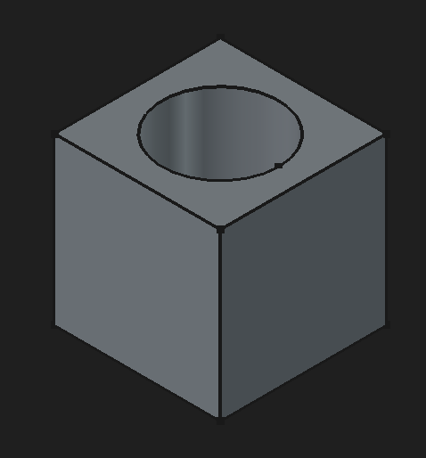

Features_FC are built out using a non-destructive workflow. That means, as features_FC build on top of other features_FC, it's possible to modify earlier features_FC and have the change cascade down to later features_FC. For example, with cylinder-through-box example above, it's possible to go up and change box's dimensions and fillet_FC its corners. The cylinder cut-out feature_FC will still apply.

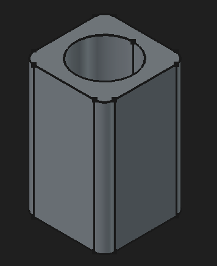

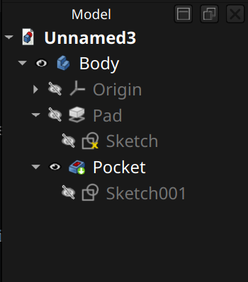

The core !!components!! of the Part Design workbench_FC are bodies_FC and sketches_FC. A body_FC is a model built mostly by transforming 2D sketches_FC into 3D features_FC.

```{plantuml}
@startuml

hide circle

Body ||--|{ NonSketchFeature : "built using"
Body ||--|{ SketchFeature : "built using"

@enduml
```

`{ref} https://wiki.freecad.org/PartDesign_Workbench` `{ref} https://wiki.freecad.org/Basic_Part_Design_Tutorial`

## User Interface

`{bm} /(Part Design Workbench\/User Interface)_TOPIC/i`

```{prereq}
User Interface Layout_TOPIC
```

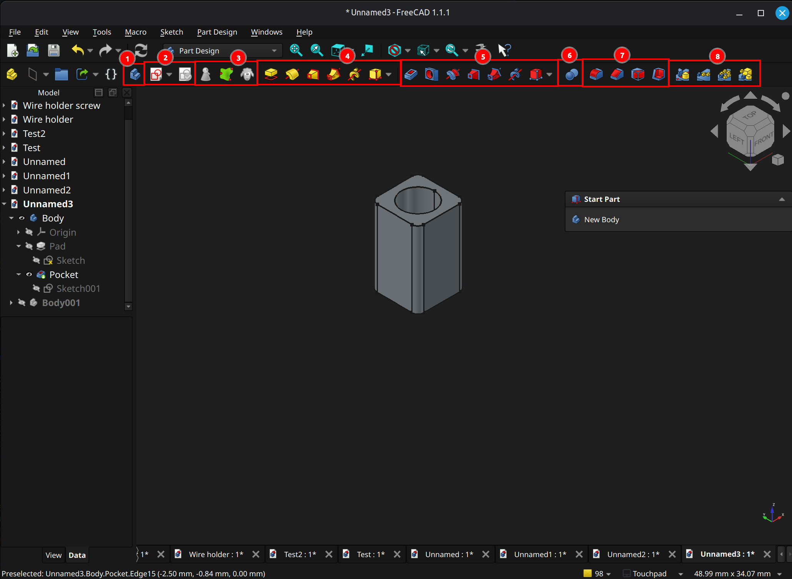

**Body_FC**

 * (1) Create new body_FC.

**Sketch_FC**

 * (2) Sketch_FC operations: These toolbar buttons give quick access to sketch_FC functionality. A body_FC can contain multiple sketches_FC, where those sketches_FC are attached on to a plane or an existing face of the model. Those sketches_FC are selectable in the Model pane's tree, and each acts (in whole or partially) as the !!base!! for a 3D feature_FC (e.g., pad sketch_FC into 3D).
 
   From left-to-right, ...

   * drop-down to either ...
     * create a sketch_FC (either on plane or face).
     * attach an existing sketch_FC to a face.
     * edit an existing sketch_FC.
   * validate a sketch_FC.

**Helpers**

 * (3) Helpers: These toolbar buttons provide access to helpful tools. From left-to-right, ...

   * analyze selected geometry for errors.
   * create a sub-shape binder, which pulls in geometry from another body_FC / object by referencing it.
   * clone selected into a new body_FC (linked, not copied).

**Modeling Features_FC**

 * (4) Additive features_FC: These toolbar buttons provide access to !!sketch-to-3D!! features_FC that add to an object. From left-to-right, ...

   * create a solid by padding a sketch_FC.
   * create a solid by revolving a sketch_FC around an axis.
   * create a solid by creating transitions between two or more sketches_FC (sketches_FC are cross-sections of the solid).
   * create a solid by !!sweeping!! a sketch_FC around a helix_FC.
   * create a primitive solid (e.g., box, cylinder, sphere).

 * (5) Subtractive features_FC: These toolbar buttons provide access to !!sketch-to-3D!! features_FC that remove from an object. From left-to-right, ...

   * cut-out from a solid by sinking a sketch_FC.
   * cut-out from a solid by cutting fastener !!holes!! (sketch_FC must contain one or more circles).
   * cut-out from a solid by revolving a sketch_FC around an axis.
   * cut-out from a solid by creating transitions between two or more sketches_FC (sketches_FC are cross-sections of the solid).
   * cut-out from a solid by !!sweeping!! a sketch_FC around a helix_FC
   * cut-out from a solid by cutting out a primitive solid (e.g., box, cylinder, sphere)

 * (6) Import bodies_FC and apply a boolean operation (e.g., intersection).

 * (7) Dress-up: These toolbar buttons provide access to some basic non-sketch_FC !!based!! features_FC. From left-to-right, ...

   * round selected edges / vertexes.
   * chamfer_FC selected edges / vertexes.
   * angle selected face.
   * convert body_FC to a shell, leaving selected faces open.

**Transformation Features_FC**

 * (8) Transformations: These toolbar buttons pattern on or more features_FC. From left-to-right, ...

   * mirror one or more features_FC.
   * create a linear pattern of one or more features_FC.
   * create a polar pattern of one or more features_FC.
   * create a pattern by combining the transformations mentioned above, as well as scale.

`{ref} https://wiki.freecad.org/PartDesign_Workbench`

## Organization

`{bm} /(Part Design Workbench\/Organization)_TOPIC/i`

```{prereq}
Part Design Workbench\/User Interface_TOPIC
```

The core !!components!! of the Part Design workbench_FC are bodies_FC and sketches_FC. Each body_FC typically compounds several sketches_FC into 3D geometry.

```{plantuml}
@startuml

hide circle

StdPart ||--|{ Body : "contains"
Body ||--|{ NonSketchFeature : "built using"
Body ||--|{ SketchFeature : "built using"

@enduml
```

`{ref} https://wiki.freecad.org/PartDesign_Workbench` `{ref} https://wiki.freecad.org/PartDesign_Body` `{ref} https://wiki.freecad.org/Body` `{ref} https://wiki.freecad.org/PartDesign_NewSketch`

### Body

`{bm} /(Part Design Workbench\/Organization\/Body)_TOPIC/i`

```{prereq}
Datum Geometry/Local Coordinate System_TOPIC
```

A body_FC is a single contiguous 3D model, mostly built by compounding several sketches_FC into 3D geometry in a chain. Each item in the chain is referred to as a feature_FC, which is a distinct and editable step in the building of the model.

The list of features_FC nested under a body_FC comprise a non-destructive workflow. For example, a sketch_FC of a square that's 5mm by 5mm can be padded by 10mm to create a rectangular prism. Then, a sketch_FC of a circle with a 3.5mm diameter can be placed on a face of that prism and pocketed to create a cylindrical !!hole!! through that cube.


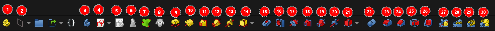

**Create**

Use toolbar button 3 to create a body_FC. For certain operations, if there is no body_FC, one is implicitly created when the operation runs (e.g., creating a new sketch_FC from the Part Design workbench_FC).

**Clone**

Use toolbar button 8 to clone the current body_FC selected in the Model pane into a new body_FC. A clone is linked, not copied. That means changing the original changes the clone.

**Local Coordinate System_FC**

Each body_FC has its own local coordinate system_FC that features_FC nested within it are relative to. The properties of a body_FC define its position and rotation within its parent container. In most cases, that parent container is a standard part_FC, but a body_FC can also live outside of a standard part_FC.

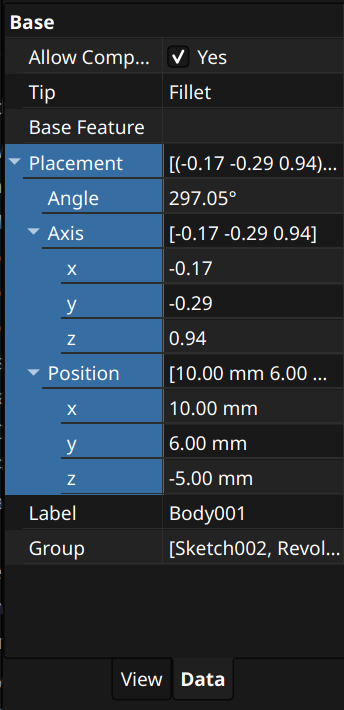

```{note}
Axis and angle define rotation - axis defines a vector and angle rotates around that vector.
```

```{note}
An easier way to set the orientation is, in the Model pane, right-click and choose **Transform**. It sets the same properties highlighted in the above screenshot, but it also provides gizmos in the viewport and a popup pane with more friendly ways to set.
```

`{ref} https://wiki.freecad.org/PartDesign_Body` `{ref} https://wiki.freecad.org/Body`

### Sketch

`{bm} /(Part Design Workbench\/Organization\/Sketch)_TOPIC/i`

```{prereq}
Part Design Workbench/Organization/Body_TOPIC
Sketcher Workbench_TOPIC
```

Sketches_FC are core to building out a body_FC. As such, the Part Design workbench_FC provides quick access to sketching_FC functionality.


**Creation**

To create a sketch_FC, use toolbar button 4 and select New Sketch_FC. If the 3D viewport has ...

* a face selected, the sketch_FC will be placed on the face's plane.
* nothing is selected, the 3D viewport will present the standard basis axis planes (e.g., XY plane, XZ plane). Selecting one of those planes will place the sketch_FC will be placed on that plane.

```{note}
Sketches_FC cannot be attached to curved faces. The only workaround is to attach a datum plane_FC on that face and center it somehow. That'll allow sketching_FC onto the datum plane_FC and cutting into the face / padding from the face (but you'll need to pad both ways because there'll be gaps between the datum plane_FC and the curved face).

The other option is to use the curves workbench_FC, which allows projecting a sketch_FC onto a curved face.
```

Once created, the sketch_FC will be entered in Edit mode (Sketcher Workbench_FC will activate). Clicking the Leave Sketch_FC button in the toolbar / clicking the Leave button above the Sketch_FC Edit pane will pop out of the sketch_FC and back into Part Design_FC.

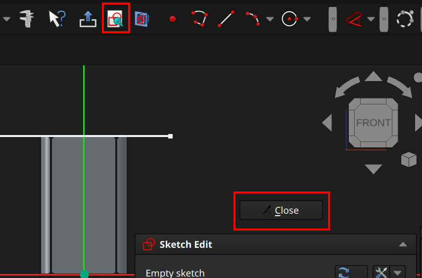

**Edit**

To edit an existing sketch_FC, select the sketch_FC in the Model pane or 3D viewport, then use toolbar button 4 and select Edit Sketch_FC.

**Attach**

To attach an existing sketch_FC to something else (e.g., another face), select the thing to attach, then use toolbar button 4 and select Attach Sketch_FC. A dialog will pop-up asking for which sketch_FC to attach, then a subsequent dialog will pop-up asking for the method of attachment (should be Plane face most of the time.)

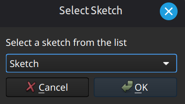 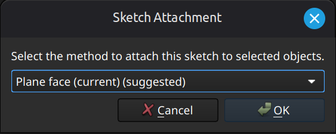

**Validate**

To validate an existing sketch_FC, select the sketch_FC in the Model pane or 3D viewport, then use toolbar button 5. A Sketch_FC Validation pane should appear wit buttons to test for specific issues.

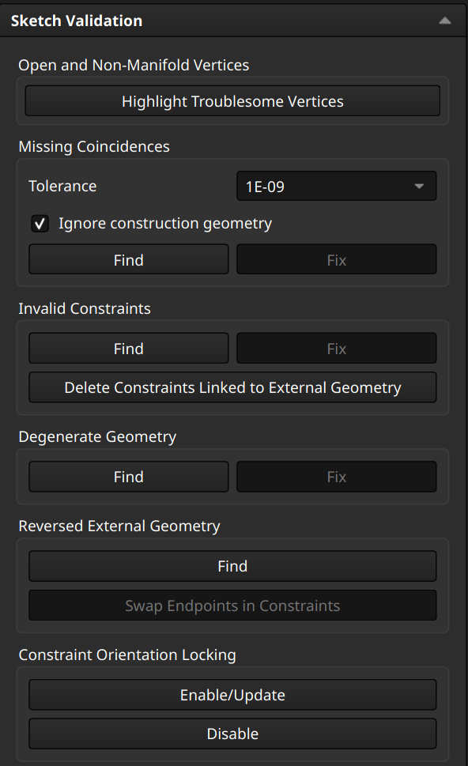

```{note}
It's too much work to go through what all these are. At a high-level, it should mostly be self explanatory / you should be able to get it with a quick Google search.
```

```{seealso}
Sketcher Workbench/Sketching/3D Feature Validity_TOPIC
Sketcher Workbench/Sketching/Sketch Flipping_TOPIC
```

`{ref} https://wiki.freecad.org/Sketcher_ValidateSketch` `{ref} https://wiki.freecad.org/Sketcher_MapSketch` `{ref} https://wiki.freecad.org/Sketcher_EditSketch` `{ref} https://wiki.freecad.org/PartDesign_NewSketch`

## Binding Geometry

`{bm} /(Part Design Workbench\/Binding Geometry)_TOPIC/i`

In certain cases, a piece of outside geometry may need to be pulled into the body_FC for further manipulation (e.g., a model created using Part workbench_FC - not Part Design workbench_FC - always lives outside of the body_FC). To import that outside geometry into the body_FC, a subshape binder is required:

1. Ensure the body_FC is active.
2. Select the outside geometry.
3. Click subshape binder in the toolbar (green blob with 3 dots) to create a subshape binder object in the body_FC.

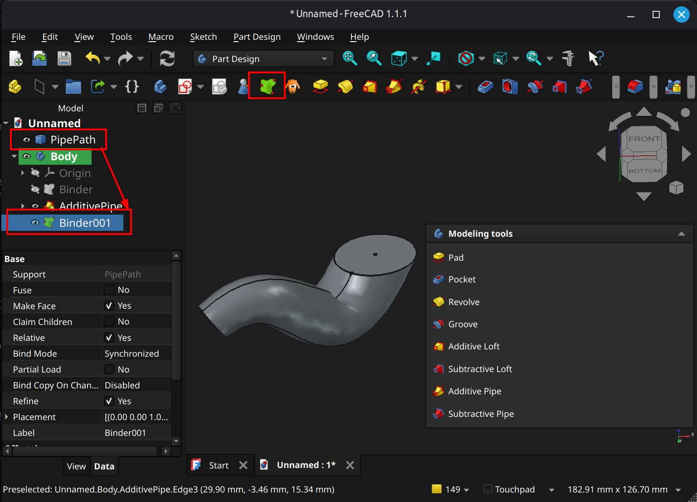

The subshape binders **Bind Mode** property defines if it copies the original geometry or just links to it:

* **Synchronized**: Live reference. Updates when source changes.
* **Frozen**: Keeps link, but shape is frozen until refreshed/changed.
* **Detached**: Copy/snapshot. Breaks live dependency, keeps current shape.

In addition to subshape binder, geometry may be imported into the body_FC as a !!base feature!! object if it's the first step of a body_FC (body_FC is empty). Dragging-and-dropping the object into the empty body_FC within the Model pane results in the !!base feature!! object being added.

A !!base feature!! object is always a live reference. Changes to the source object are automatically applied to the body_FC.

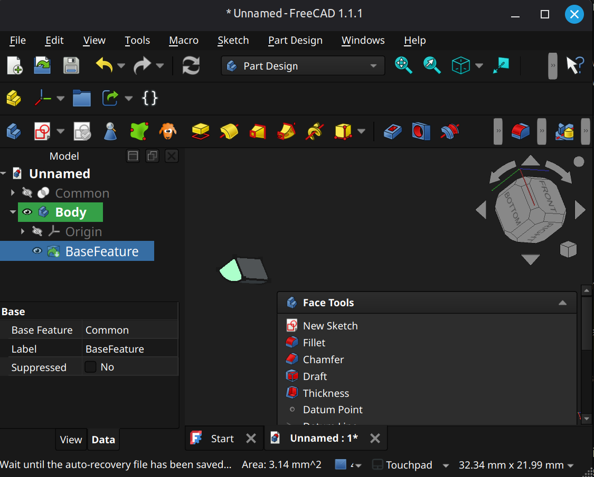

`{ref} https://wiki.freecad.org/PartDesign_SubShapeBinder` `{ref} self`

## Features

`{bm} /(Part Design Workbench\/Features)_TOPIC/i`

The subsections below detail feature_FC types !!supported!! by the Part Design workbench_FC. Most features_FC present a Preview pane during creation.

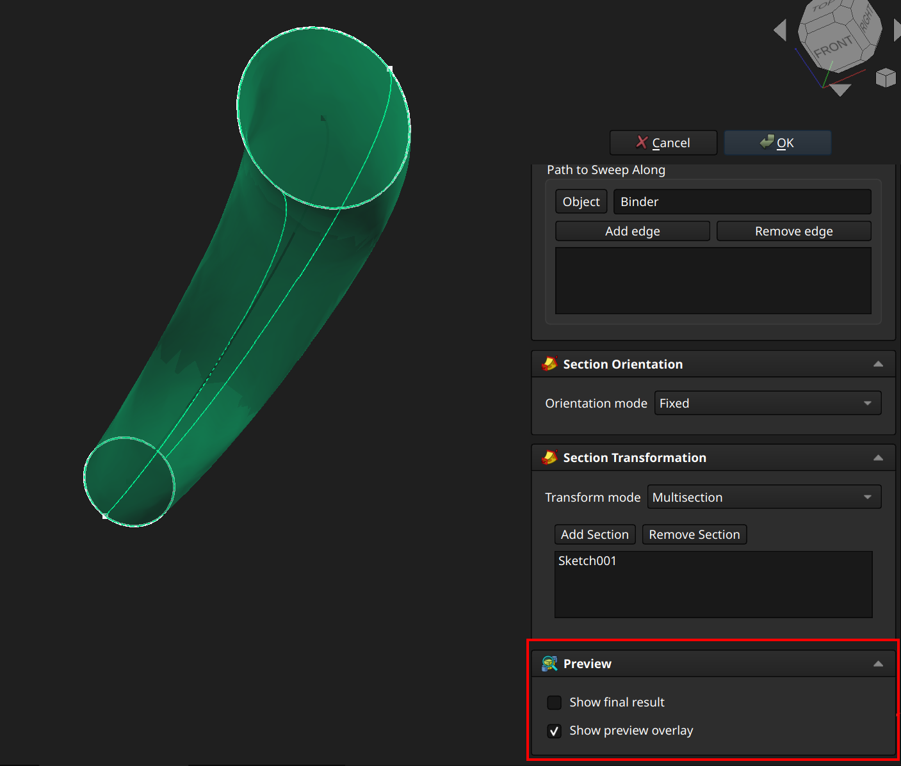

* **Show preview overlay**: Presents a see-through overlay of what the feature_FC looks like as parameters are being manipulated.
* **Show final result**: Presents what the feature_FC looks like as parameters are being manipulated.

Creation may also insert gizmos during creation that mirror parameters of whatever is being created. The example below has a arrow gizmo to control the depth parameter.

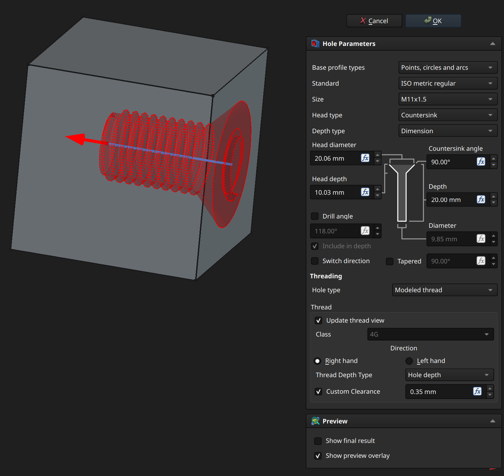

```{note}
I suspect this is likely to change in newer versions past 1.1, so I'm leaving this as a note:

For features_FC that are additive (add to the model), the overlay typically shows as green. For features_FC that are subtractive (intersections cut out from the model), the overlay typically shows as red. Some feature_FC overlays, such as chamfers_FC and fillets_FC, the overlay typically shows up as purple.
```

### Pad / Pocket

`{bm} /(Part Design Workbench\/Features\/Pad \/ Pocket)_TOPIC/i`

```{prereq}
Part Design Workbench/User Interface_TOPIC
Part Design Workbench/Organization_TOPIC
```

A pad operation and a pocket operation are effectively the same thing, except that ...

* pad is additive (creates a solid and merges it with existing geometry it collides with).
* pocket is subtractive (creates a solid and cuts out it from existing geometry it collides with).


To pad / pocket, select a sketch_FC and use either toolbar button 9 (pad) or toolbar button 15 (pocket). Once selected, gizmos appear in the 3D viewport and a parameter pane opens.

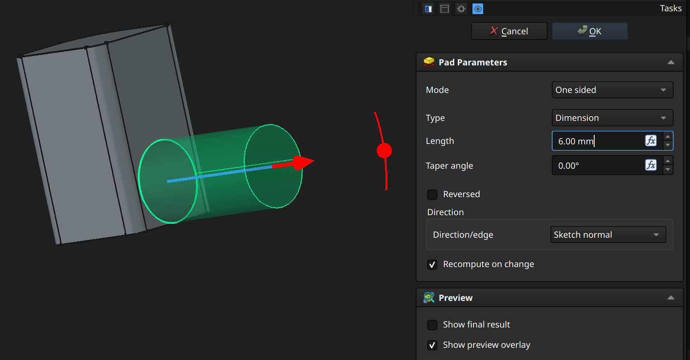

The **Mode** parameter defines which directions the sketch_FC is extruded in:

* **One sided**: Extrude in one direction.
* **Two sided**: Extrude in one direction as well as the opposite direction, where each direction has its own set of parameters (e.g., each direction has its own length).
* **Symmetric**: Extrude symmetrically in one direction as well as the opposite direction (e.g., one length applied to both directions).

**One sided** and **Two sided** both enable the **Reversed** parameter, which reverses direction / directions of extrusion.

The **Type** parameter defines the stopping point of the extrusion:

* **Dimension**: Manually define extrusion length and taper angle. When selected, multiple gizmos appear in the 3D viewport. The arrow gizmo controls the **Length** parameter, while the arc gizmo controls the **Taper** parameter.
* **To last**: Extrude until the last intersecting face.
* **To first**: Extrude until the first intersecting face.
* **To face**: Extrude until a specific face.
* **To shape**: Extrude until a specific shape, or a face on a specific shape.

```{note}
It isn't clearly explained what qualifies as a shape.
```

The **Direction** parameter defines the direction of the sketch_FC's extrusion:

* **!!Sketch!! normal**: Normal vector of the sketch_FC.
* **Select reference...**: Direction of an edge / datum line_FC.
* **Custom direction**: Manually define a vector.

`{ref} https://wiki.freecad.org/PartDesign_Pad` `{ref} https://wiki.freecad.org/PartDesign_Pocket`

### Hole

`{bm} /(Part Design Workbench\/Features\/Hole)_TOPIC/i`

```{prereq}
Part Design Workbench/User Interface_TOPIC
Part Design Workbench/Organization_TOPIC
```

A !!hole!! operation cuts out a standardized fastener !!hole!! from existing geometry it collides with (e.g., !!hole!! for a screw or nail).


To create a !!hole!!, create a sketch_FC with one or more circles, arcs, and/or points (other entities are ignored). Then, select the sketch_FC and use toolbar button 16. Once selected, gizmos may appear in the 3D viewport and a parameter pane opens.


The **Base profile types** parameter defines which sketch_FC element_FC types to make into !!holes!!:

* **Points, circles and arcs**: Position !!holes!! at points as well as the centers of circles and arcs.
* **Circles and arcs**: Position !!holes!! the centers of circles and arcs.
* **Points**: Position !!holes!! at points.

The **Standard** and **Size** parameters define the [thread standard](https://en.wikipedia.org/wiki/List_of_thread_standards) to target. For example setting **Standard** to **ISO metric regular** and **Size** to **M2x0.4** sets all !!holes!! to have a diameter of 2mm and a thread pitch of 0.4mm between peaks.

The **Head type** parameters defines what type / standard of screw head to model the !!hole!! for:

* **Countersink** introduces properties **Head diameter**, **Head depth**, and **Countersink angle**.
* **Counterbore** introduces properties **Head diameter** and **Head depth**.
* **Counterdrill** introduces properties **Head diameter**, **Head depth**, and **Countersink angle**.

```{note}
There are other head types !!based!! on standards. As of time of writing, I don't know enough about threading or head standards to fully understand a lot of what's going on here. The documentation also explains almost nothing / it's for an old version of the !!hole!! tool.
```

The **Depth type** parameter defines where the !!hole!! stops:

* **Through all**: The !!hole!! goes through everything (**Depth** parameter disabled).
* **Dimension**: The !!hole!! stops at a certain depth.

Below **Depth type** is a picture that shows the general type of fastener to expect !!based!! on the properties chosen (e.g., the type of head, if its got a pointy head). The picture highlights several attributes of the fastener, where those attributes are linked to fields that configure those attributes. For example, in the example screenshot linked to several fields, the ...

* depth of the fastener is defined by **Depth** (**Depth** is disabled if **Depth type** is set to **Through all**).
* !!width!! of the fastener is is defined by **Diameter** (**Diameter** is hardcoded if a **Standard** and **Size** were set other than **None**).
* sharpness of the fastener's tip is defined by **Drill angle**, and **Include in depth** defines if the tip is additional to the **Depth** field's value or added on top of it.

The **Switch direction** parameter reverses the direction of the !!hole!! cut-outs.

The **Tapered** parameter tapers the !!hole!!.

The **Hole type** parameter defines how !!holes!! should treat threads:

* **Clearance / Passthrough** makes the !!hole!! big enough for the fastener with threads, such that the fastener goes through the !!hole!! and threads into something else (e.g., a nut on the other end). Selecting this enables the field **Clearance**, which controls how loose / tight the !!hole!! should be for the fastener.

  ```{note}
  Clearance isn't documented anywhere, but when you change it you can see the !!hole!! slightly expand / contract.
  ```

* **Tap drill** makes the !!hole!! a big enough for the fastener without the threads, such that the threads can cut into the !!hole!! (e.g., imagine making a pilot !!hole!! in a block of wood and then putting a screw in that !!hole!!). Selecting this enables the **Thread** subsection:

  * **Class**: Thread tolerance / fit class for a threaded !!hole!!. Available values depend on **Standard**.
  * **Right hand** vs **Left hand**: Whether the threads tighten clockwise (the standard - righty-tighty vs lefty-loosey) or counterclockwise.
  * **Thread Depth Type**: When the thread stops (e.g., !!hole!! may be 10mm but threads may stop at 5mm). A value of **Hole depth** threads the entire !!hole!!, **Dimension** allows a custom depth, and **Tapped (DIN76)** eaves a standard unthreaded relief/runout at the bottom.

  ```{note}
  It doesn't look like these parameters do anything for this option? They only seem to do something for the **Modeled thread** option.
  ```

* **Modeled thread** makes the !!hole!! include threads, such that the fastener goes in cleanly. Selecting this enables the **Thread** subsection:

  * **Update thread view**: Show the threads in the !!hole!! as opposed to just storing metadata about the threads.
  * **Class**: Thread tolerance / fit class for a threaded !!hole!!. Available values depend on **Standard**.
  * **Right hand** vs **Left hand**: Whether the threads tighten clockwise (the standard - righty-tighty vs lefty-loosey) or counterclockwise.
  * **Thread Depth Type**: When the thread stops (e.g., !!hole!! may be 10mm but threads may stop at 5mm). A value of **Hole depth** threads the entire !!hole!!, **Dimension** allows a custom depth, and **Tapped (DIN76)** eaves a standard unthreaded relief/runout at the bottom.
  * **Custom Clearance**: Widens the !!hole!! by some amount (e.g., compensate for 3D printing inaccuracies and line width).

  ```{note}
  **Update thread view** physically inserts the threads into the model, but this lags / slows FreeCAD incredibly. It may be a good idea to leave this disabled until the very end. I suspect you need this enabled when exporting to STL or else the threads won't show up. Documentation doesn't talk about this at all.

  **Class** seems to add some small amount of clearance for ISO types when the class is G. For UTS, I didn't see any value add any clearance. Documentation doesn't talk about this at all.
  ```

```{note}
There are other head types !!based!! on standards. As of time of writing, I don't know enough about threading or head standards to fully understand a lot of what's going on here. The documentation also explains almost nothing / it's for an old version of the !!hole!! tool.
```

`{ref} https://wiki.freecad.org/PartDesign_Hole` `{ref} self`

### Revolution / Groove

`{bm} /(Part Design Workbench\/Features\/Revolution \/ Groove)_TOPIC/i`

```{prereq}
Part Design Workbench/User Interface_TOPIC
Part Design Workbench/Organization_TOPIC
```

A revolution operation and a groove operation are effectively the same thing, except that ...

* revolution is additive (creates a solid and merges it with existing geometry it collides with).
* groove is subtractive (creates a solid and cuts out it from existing geometry it collides with).


To revolve / groove, select a sketch_FC and use either toolbar button 10 (revolution) or toolbar button 17 (groove). Once selected, gizmos appear in the 3D viewport and a parameter pane opens.

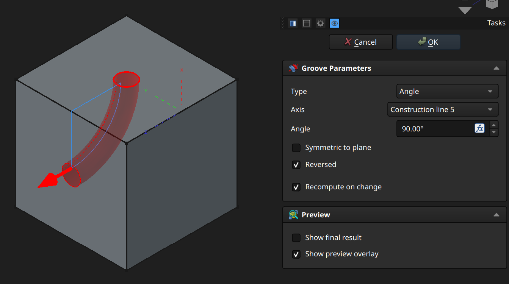

The **Type** parameter defines which directions the sketch_FC is extruded in:

* **Angle**: Extrude in one direction.
* **Two angle**: Extrude in one direction as well as the opposite direction, where each direction has its own set of parameters (e.g., each direction has its own length).
* **Through all**: Extrude through everything (e.g., 360 angle).
* **To first**: Extrude until the first intersecting face.
* **To face**: Extrude until a specific face.

**Angle** and **Two angle** both enable the **Reversed** parameter, which reverses direction / directions of extrusion.

**Angle** and **Through all** both enable the **Symmetric to plane** parameter, which defines if the plane should be in the middle of the extrusion (extrude half-way outward from the sketch_FC and extrude half-way inward from the sketch_FC). This parameter is only available for **Type** of **Angle**.

```{note}
**Symmetric to plane** doesn't make any sense for **Through all**. Isn't this just the same as a full rotation (360 degrees)?
```

**Axis** defines the axis from which the rotation happens:

* **Vertical sketch_FC axis** / **Horizontal sketch_FC axis**: The rotation happens using sketch_FC's vertical / horizontal axis as the rotation axis.
* **Construction line n**: The rotation happens using construction geometry_FC line in the sketch_FC. Each line that is also construction geometry_FC is listed.
* **Base X-axis** / **Base Y-axis** / **Base Z-axis**: The rotation happens using a basis axis as the rotation axis.
* **Select reference**: The rotation happens around a edge or datum line_FC, which must be selected.

```{note}
In most cases, you should pick planes/faces and sketch_FC such that the horizontal / vertical axis of the sketch_FC is the intended axis to rotate around.
```

```{note}
In a sketch_FC, the elements_FC can't be named. As such, when you select a construction line, it's impossible to know which construction line you're setting. I complained about this [here](https://github.com/FreeCAD/FreeCAD/issues/30298).
```

`{ref} https://wiki.freecad.org/PartDesign_Revolution` `{ref} https://wiki.freecad.org/PartDesign_Groove`

### Loft

`{bm} /(Part Design Workbench\/Features\/Loft)_TOPIC/i`

```{prereq}
Part Design Workbench/User Interface_TOPIC
Part Design Workbench/Organization_TOPIC
```

An additive loft_FC operation and a subtractive loft_FC operation are the same thing, except that ...

* additive creates a solid and merges it with existing geometry it collides with.
* subtractive creates a solid and cuts out it from existing geometry it collides with.


A loft_FC creates a solid by transitioning through sketches_FC that act as !!slices!! within the solid. To loft_FC a set of sketches_FC, either ...

* use either toolbar button 11 (additive loft_FC) or toolbar button 18 (subtractive loft_FC), then ...
  1. select the loft_FC's initial sketch_FC in the Select Attachment pane that pops up and click **OK**,
  2. add the loft_FC's subsequent sketches_FC via the Add Segment button in the subsequent Loft_FC Parameters pane that pops up (order of added sketches_FC matter).
* select the sketches_FC to loft_FC and use either toolbar button 11 (additive loft_FC) or toolbar button 18 (subtractive loft_FC). The selection order of the sketches_FC matters (e.g., first selected will become loft_FC's initial sketch_FC, second selected becomes the first transition sketch_FC).

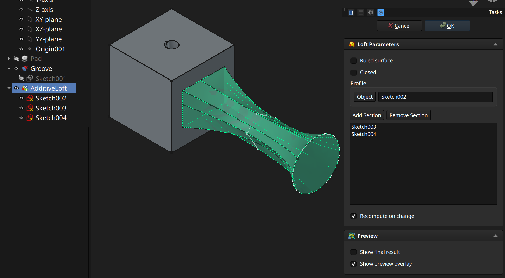

```{note}
It's totally unclear / undocumented how loft_FC makes its transitions between sketches_FC. For example, ...

* there's nothing saying which vertexes line up with which vertexes between sketches_FC,
* there's nothing saying what happens when there's more vertexes in one sketch_FC vs the next,
* there's nothing saying what algorithm is used to bridge the gap between sketches_FC:
  * edges between sketches_FC turned into planar faces vs curved surfaces - if curved, what defines the curvature?
  * sketch_FC 1 is a square, sketch_FC 2 is the same square rotated 45 degrees - loft_FC bends 45 degrees, but why not 180+45 degrees or 360+45 degrees?

All ChatGPT says is that it delegates to OpenCASCADE.

Notes from source:

* To better control the shape of the loft_FC, it is recommended that all cross-sections have the same number of segments. For example, for a loft_FC between a rectangle and a circle, the circle should be broken down into 4 connected arcs.
* You can loft_FC from or toward a single vertex from a sketch_FC or the body_FC.
* Vertices can only be either the start or end of a loft_FC. Otherwise the loft_FC body_FC would consist of two solids connected at a single point. This would violate the CAD kernel's definition of a 3D object.
* A cross-section cannot lie on the same plane as the one immediately preceding it.
* If the sketch_FC has inner geometry, then the order in which the sketch_FC geometry is created should be the same for all sections. Either start all sections with the inner geometry, or start them all with the outer. Otherwise an invalid loft_FC will be created where inner and outer walls cross.
* It is not possible to loft_FC !!disjoint!! or crossing loops.
* Some failure modes will turn the part black.
```

A loft_FC's sketches_FC must be spaced out. It's typically for all of a loft_FC's sketches_FC to be attached to the same face / plane, but each offset such there's gaps between them. A sketch_FC can be offset and rotated relative to whatever surface it's attached to using its AttachmentOffset properties.

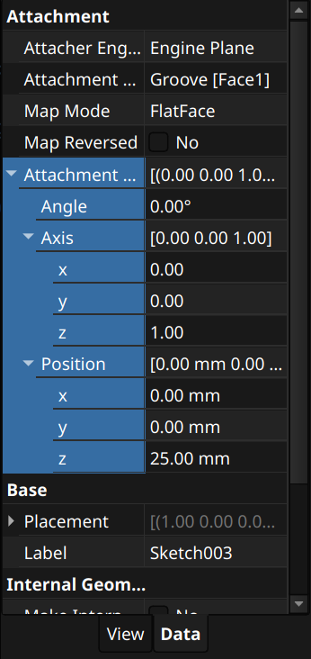

The **Ruled surface** parameter defines whether transitions between sketches_FC are smooth or straight (straight if checked).

```{note}
Documentation says this won't apply to a loft_FC if it only has 2 sketches_FC. I'm not sure why this is.
```

The **Closed** parameter makes a transition from the last sketch_FC to the initial sketch_FC, creating a loop.

`{ref} https://wiki.freecad.org/PartDesign_AdditiveLoft` `{ref} https://wiki.freecad.org/PartDesign_SubtractiveLoft`

### Pipe

`{bm} /(Part Design Workbench\/Features\/Pipe)_TOPIC/i`

```{prereq}
Part Design Workbench/User Interface_TOPIC
Part Design Workbench/Organization_TOPIC
Part Design Workbench/Features/Loft_TOPIC
Part Design Workbench/Binding Geometry_TOPIC
Part Design Workbench/Organization/Sketch_TOPIC
```

An additive pipe_FC operation and a subtractive pipe_FC operation are the same thing, except that ...

* additive creates a solid and merges it with existing geometry it collides with.
* subtractive creates a solid and cuts out it from existing geometry it collides with.


A pipe_FC creates a solid by transitioning through sketches_FC in addition to following a chain of one or more paths (e.g., edge, arc, b-spline). To pipe_FC a path and a set of sketches_FC, either ...

* use either toolbar button 12 (additive pipe_FC) or toolbar button 19 (subtractive pipe_FC), then ...

  1. select the pipe_FC's initial sketch_FC in the Select Attachment pane that pops up and click **OK**,
  2. select the pipe_FC's initial path in the Pipe_FC Parameters by clicking the **Object** button within **Path to !!Sweep!! Along** and clicking the segment.

* select the initial sketch_FC to pipe_FC and the segment to follow, then use either toolbar button 11 (additive pipe_FC) or toolbar button 18 (subtractive pipe_FC). The selection order matters (e.g., first selected the sketch_FC then select the segment).

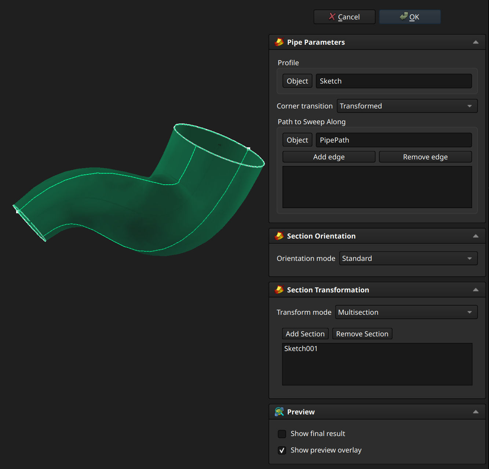

The pipe_FC can transition through multiple paths and many sketches_FC:

* Add subsequent paths by clicking **Add Edge** and selecting the segment (order of edges matter).
* Add subsequent sketches_FC by clicking **Add Section** and selecting the sketch_FC (order of added sketches_FC matter). **Transform Mode** must be **Multisection** for this to be enabled.

A pipe_FC's sketches_FC must be spaced out along the segments that make up the path, and the segments (lines, b-splines, etc..) that make up the path must be connected back-to-back. A common way to structure a pipe_FC is to place sketches_FC along a single b-spline. The b-spline can be created via the Part workbench_FC or programmatically:

```python
import FreeCAD as App
import Part

pts = [
    App.Vector(0,0,0),
    App.Vector(20,0,10),
    App.Vector(40,20,20),
    App.Vector(60,10,40),
]

curve = Part.BSplineCurve()
curve.interpolate(pts)

edge = curve.toShape()
wire = Part.Wire([edge])

obj = App.ActiveDocument.addObject("Part::Feature", "PipePath")
obj.Shape = wire
App.ActiveDocument.recompute()
```

Since the b-spline belongs to the Part workbench_FC rather than the Part Design workbench_FC, it lives outside of the Part Design_FC body_FC where the sketches_FC live. It needs to be imported into that Part Design_FC body_FC using a subshape binder:

1. Ensure the body_FC is active.
2. Select the b-spline.
3. Click subshape binder in the toolbar (green blob with 3 dots) to create a subshape binder object in the body_FC.

Sketches_FC can then be attached to the b-spline by attaching them to that subshape binder. Each attached sketch_FC can be placed somewhere along the b-spline by setting the sketch_FC's **Map Path Parameter** property (0.0 places at start, 1.0 places at end). The sketch_FC's normal will follow the b-spline's trajectory at the position its at, but can also be further manipulated using the sketch_FC's **Attachment Offset** property. 

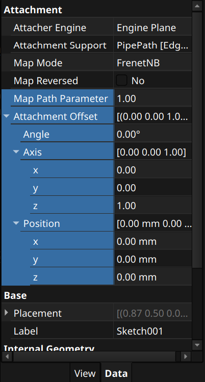

```{seealso}
Part Design Workbench/Binding Geometry_TOPIC
Part Design Workbench/Organization/Sketch_TOPIC
```

```{note}
Much like loft_FC, it's totally unclear / undocumented how pipe_FC makes its transitions between sketches_FC (e.g., which vertexes line up with which vertexes between sketches_FC, what happens when there's more vertexes in one sketch_FC vs the next).

Notes from source:

* To better control the shape of the pipe_FC, it is recommended that all cross-sections have the same number of segments. For example, for a pipe_FC between a rectangle and a circle, the circle should be broken down into 4 connected arcs.
* You can pipe_FC from or toward a single vertex from a sketch_FC or the body_FC.
* When you select a vertex as section, it must be the last section of the pipe_FC. Otherwise the pipe_FC body_FC would consist of two solids connected at a single point. This would violates the CAD kernel's definition of a 3D object. You can change the order of the sections by dragging them in the list.
* The path can only be from a single sketch_FC, feature_FC or ShapeBinder. In case you want to !!sweep!! along several edges from different sketches_FC, use a SubShapeBinder.
* The path must not contain branches or T-junctions etc. Loops are allowed.
* It can lead to issues if the cross-section is not perpendicular to the path in 3D.
* A cross-section cannot lie on the same plane as the one immediately preceding it.
* The cross-sections must not contain !!disjoint!! or crossing loops.
* If the sketch_FC has inner geometry, then the order in which the sketch_FC geometry is created should be the same for all sections. Either start all sections with the inner geometry, or start them all with the outer. Otherwise an invalid pipe_FC will be created where inner and outer walls cross.
```


The **Corner transition** parameter defines how the path handles hard corners in the path:

* **Transformed**: Hard corners are automatically dealt with, potentially resulting in skewing, warping, and/or rotation.
* **Right corner**: Hard corners are not rounded (e.g., when the path goes from down to right at 90 degrees, it will abruptly change the profile, producing a hard cornered L shape).
* **Rounded corner**: Hard corners are rounded (e.g., when the path goes from down to right at 90 degrees, it will hold the inner in place and !!sweep!! the other end to produce a rounded shape).

The **Orientation mode** parameter defines how the profile rotates as it !!sweeps!! along the path:

* **Standard**: Orientation stays normal to path (normal vector).
* **Fixed**: Orientation keeps initial sketch_FC's orientation. Cross-section shape will not rotate along with the path.
* **Frenet**: Orientation minimizes twisting.
* **Auxiliary**: Orientation is specified by a secondary path. For each point P along the path, there should be a point Q in the secondary path. As the profile is swept, the PQ line will be the normal of the swept path.
* **Binormal**: Orientation set to constant direction/vector as the orientation reference.

```{note}
Documentation for the above two properties are sparse.

Documentation says for Fixed, make a circular path so see what it means (it likely means the profile doesn't reorient !!based!! on the path and it just sticks with whatever orientation the initial profile sketch_FC had).
```

`{ref} https://wiki.freecad.org/PartDesign_AdditivePipe` `{ref} https://wiki.freecad.org/PartDesign_SubtractivePipe` `{ref} https://www.youtube.com/watch?v=AqzJ58bM2rs`

### Helix

`{bm} /(Part Design Workbench\/Features\/Helix)_TOPIC/i`

```{prereq}
Part Design Workbench/User Interface_TOPIC
Part Design Workbench/Organization_TOPIC
```

An additive helix_FC operation and a subtractive helix_FC operation are the same thing, except that ...

* additive creates a solid and merges it with existing geometry it collides with.
* subtractive creates a solid and cuts out it from existing geometry it collides with.


A helix_FC creates a solid by taking a sketch_FC and rotating it up / down some axis, similar to the threads of a screw. To helix_FC a sketch_FC, either ...

* use either toolbar button 13 (additive helix_FC) or toolbar button 20 (subtractive helix_FC), then select the helix_FC's initial sketch_FC in the Select Attachment pane that pops up and click **OK**.
* select the sketch_FC to helix_FC, then use either toolbar button 13 (additive helix_FC) or toolbar button 20 (subtractive helix_FC).

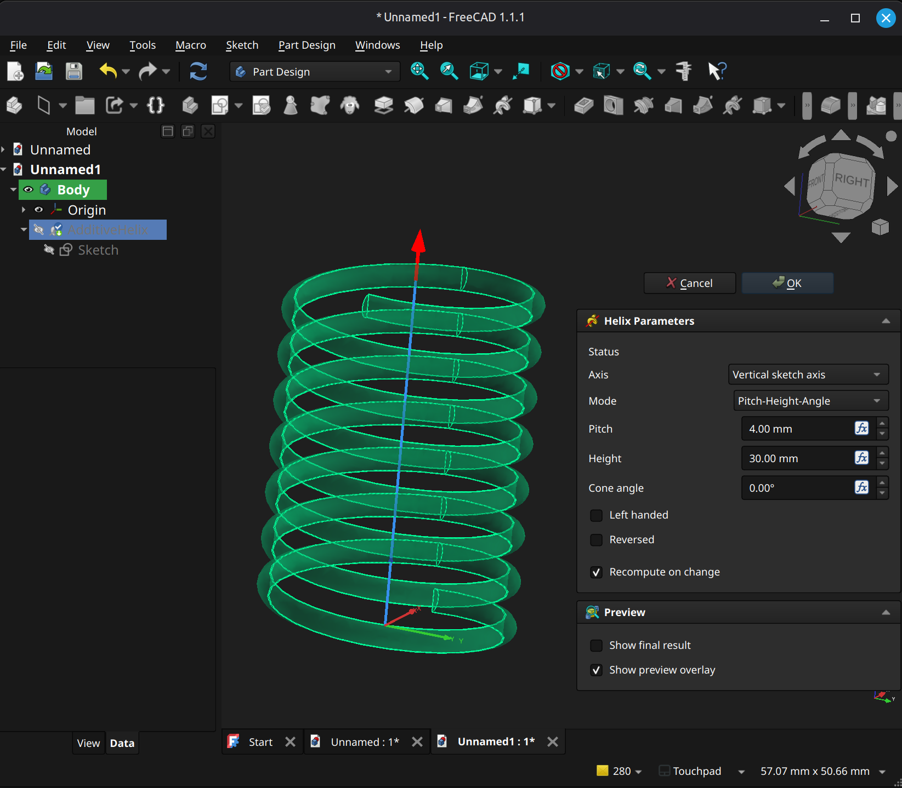 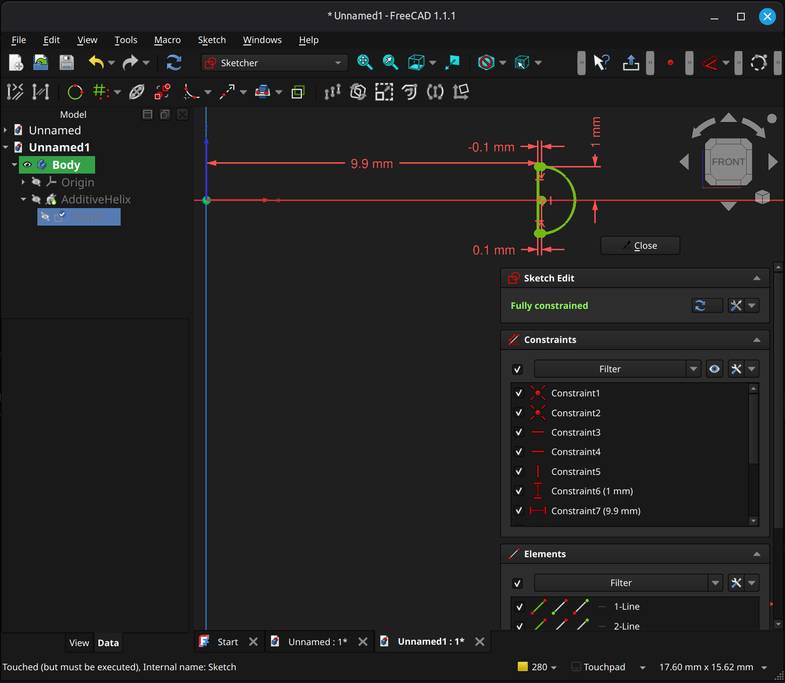

The **Axis** parameter controls which axis to rotate around.

The **Left handed** parameter rotates in the opposite direction (to the left rather than the right).

The **Reversed** parameter flips_FC the ascension in the opposite direction (descends the helix_FC instead).

The **Mode** parameter defines how the ascension and rotation are configured. The values control which configuration fields show up:

* **!!Pitch-Height-Angle!!**

  * **Pitch** controls how far apart a full turn is (e.g., if the thread was 2mm wide and the pitch was 2mm there would be no space between threads vs if the thread was 2mm wide and the pitch was 4mm there would be 1 thread's worth of a gap between threads).
  * **!!Height!!** controls how far the helix_FC ascends.
  * **Angle** controls tapering of the helix_FC (negative degrees tapers inward vs positive degrees taper outwards).

  Some other options have a **Turns** parameter (number of full rotations). **Turns** is implicitly defined by **Pitch** and **!!Height!!** (e.g., pitch of 4mm at 8mm high is 2 turns).

* **Pitch-Turns-Angle**

  * **Pitch** controls how far apart a full turn is (e.g., if the thread was 2mm wide and the pitch was 2mm there would be no space between threads vs if the thread was 2mm wide and the pitch was 4mm there would be 1 thread's worth of a gap between threads).
  * **Turns** controls the number of full rotations.
  * **Angle** controls tapering of the helix_FC (negative degrees tapers inward vs positive degrees taper outwards).

  There is no **!!Height!!** parameter here. **!!Height!!** is implicitly defined by **Pitch** and **Turns** (e.g., pitch of 4mm at 2 turns is 8mm high).

* **!!Height-Turns-Angle!!**:

  * **!!Height!!** controls how far the helix_FC ascends.
  * **Turns** controls the number of full rotations.
  * **Angle** controls tapering of the helix_FC (negative degrees tapers inward vs positive degrees taper outwards).

  There is no **Pitch** parameter here. **Pitch** is implicitly defined by **!!Height!!** and **Turns** (e.g., !!height!! of 8mm at 2 turns implies a pitch of 4mm).

* **!!Height-Turns-Growth!!**:

  * **!!Height!!** controls how far the helix_FC ascends.
  * **Turns** controls the number of full rotations.
  * **Growth** controls how much the helix_FC widens at the end of each turn.

  There is no **Pitch** parameter here. **Pitch** is implicitly defined by **!!Height!!** and **Turns** (e.g., !!height!! of 8mm at 2 turns implies a pitch of 4mm).

  There is no **Angle** parameter here. **Angle** is implicitly defined by **Growth** (translates the widening per turn to an angle).

```{note}
In the screenshot example, the sketch_FC defines the helix_FC's thread as well as the rotational cylinder's radius. Note how the sketch_FC is 9.9mm out from the center and **Axis** is set to **Vertical sketch_FC axis**, meaning the radius of the helix_FC is 9.9mm.

If your helix_FC follows a similar setup, unless you already have a face to attach to or want the helix_FC at the origin, it may be a good idea to place a datum plane_FC in the desired location and use it to sketch_FC out a helix_FC.

To place a datum plane_FC matching the face's orientation but with a specific origin:

1. Place a sketch_FC on the face with ...

   * a point for the center of the helix_FC rotation axis.
   * a horizontal line from the point.
   * a vertical line from the point.

2. Create a new datum plane_FC and use the center point as reference 1, the horizontal line as reference 2, and the vertical line as reference 3
3. Set **Attachment mode** to **Align O-X-Y**.
4. Place a sketch_FC to new datum plane_FC. The origin will be the center point.
```

```{seealso}
Datum Geometry/Datum Plane_TOPIC
```

```{note}
To place a datum plane_FC normal to the face's orientation, same steps as above but **Attachment mode** should be either **Align O-N-Y** or **Align O-Y-N**.
```

`{ref} https://wiki.freecad.org/PartDesign_AdditiveHelix` `{ref} https://wiki.freecad.org/PartDesign_SubtractiveHelix`

### Primitives

`{bm} /(Part Design Workbench\/Features\/Primitives)_TOPIC/i`

```{prereq}
Part Design Workbench/User Interface_TOPIC
Part Design Workbench/Organization_TOPIC
```

An additive primitive and a subtractive primitive operation are the same thing, except that ...

* additive creates a solid and merges it with existing geometry it collides with.
* subtractive creates a solid and cuts out it from existing geometry it collides with.


A primitive is a primitive piece of 3D geometry (e.g., cube, sphere, torus). To create a primitive, use either toolbar button 14 (additive primitive) or toolbar button 21 (subtractive primitive) to show a drop-down of primitive types and select. Once selected, a **Primitive Parameters** pane will appear that defines the shape as well as a **Select Attachment** pane that defines how and what it attaches to. For full details, see sources.

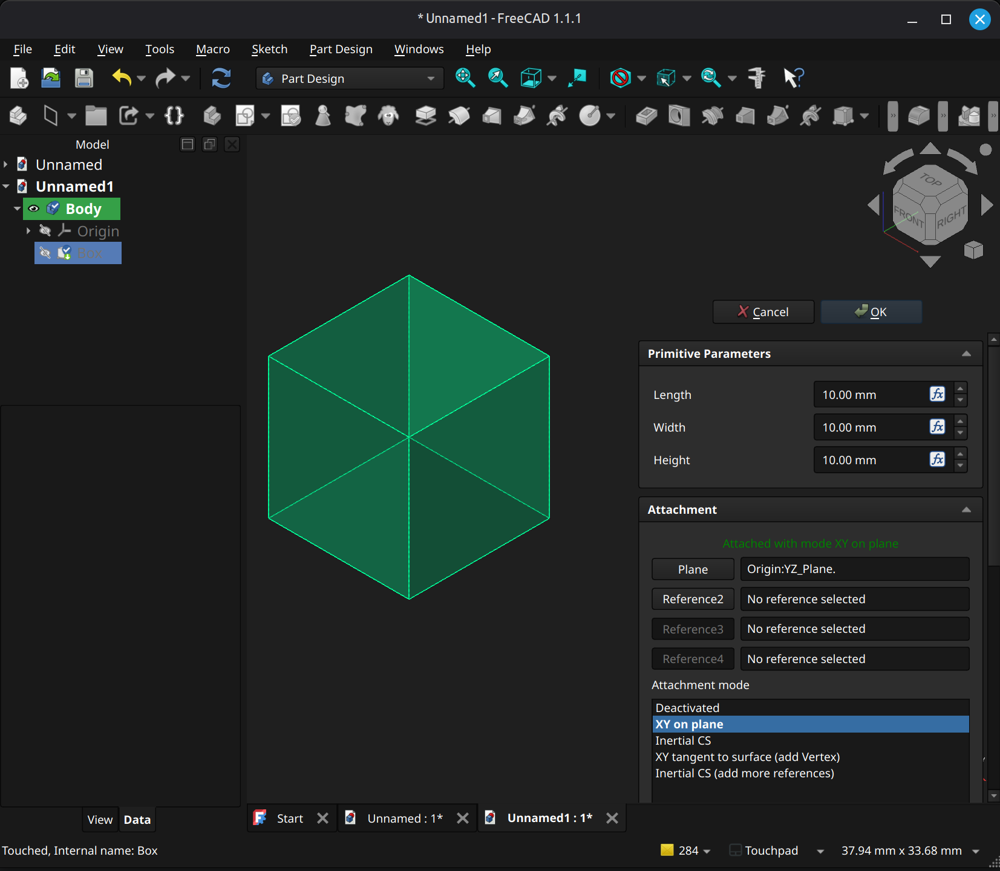

`{ref} https://wiki.freecad.org/PartDesign_AdditiveBox` `{ref} https://wiki.freecad.org/PartDesign_SubtractiveBox`
`{ref} https://wiki.freecad.org/PartDesign_AdditiveCylinder` `{ref} https://wiki.freecad.org/PartDesign_SubtractiveCylinder`
`{ref} https://wiki.freecad.org/PartDesign_AdditiveSphere` `{ref} https://wiki.freecad.org/PartDesign_SubtractiveSphere`
`{ref} https://wiki.freecad.org/PartDesign_AdditiveCone` `{ref} https://wiki.freecad.org/PartDesign_SubtractiveCone`
`{ref} https://wiki.freecad.org/PartDesign_AdditiveEllipsoid` `{ref} https://wiki.freecad.org/PartDesign_SubtractiveEllipsoid`
`{ref} https://wiki.freecad.org/PartDesign_AdditiveTorus` `{ref} https://wiki.freecad.org/PartDesign_SubtractiveTorus`
`{ref} https://wiki.freecad.org/PartDesign_AdditivePrism` `{ref} https://wiki.freecad.org/PartDesign_SubtractivePrism`
`{ref} https://wiki.freecad.org/PartDesign_AdditiveWedge` `{ref} https://wiki.freecad.org/PartDesign_SubtractiveWedge`

### Fillet / Chamfer

`{bm} /(Part Design Workbench\/Features\/Fillet \/ Chamfer)_TOPIC/i`

```{prereq}
Part Design Workbench/User Interface_TOPIC
Part Design Workbench/Organization_TOPIC
```

Fillet_FC / chamfer_FC cuts into a edge. A fillet_FC's cut is rounded while a chamfer_FC's cut is straight.


To apply fillet_FC/chamfer_FC, select relevant faces and edges and use either toolbar button 23 (fillet_FC) or toolbar button 24 (chamfer_FC).

```{note}
Fillets_FC and chamfers_FC are notoriously brittle for non-destructive workflows. For example, if you add a fillet_FC/chamfer_FC but then make a modification in a previous step of the non-destructive workflow, the fillet_FC/chamfer_FC will fail. The edges will have changed and fillet_FC/chamfer_FC typically isn't able to automatically guess what the new edges are. 

For this reason, I've seen only that they recommend leaving fillet_FC/chamfer_FC operations until the very end.

Tested on FreeCAD 1.1.1.
```

A **Fillet_FC Parameters** / **Chamfer_FC Parameters** pane will pop open. To add edges/faces, click **Select**, select the edges/face, and then click **Confirm Selection**. To remove edges/faces, click on the edge/face in the list and press Del.

For fillet_FC, use the **Radius** field or the gizmos to set the radius of the curve.


For chamfer_FC, use the **Type** or the gizmos to define how steep the the cut is:

* **Equal distance** sets the cut point equally away from both ends of the edge, defined by **Size**.
* **Two distance** sets the cut point for each edge, defined by **Size** and **Size 2**.
* **Distance and angle** sets the cut point for one side of the edge and uses an angle to determine the cut point of the other side of the edge, defined by **Size** and **Angle**.

```{note}
When sides aren't equal, unsure how it picks which side is which.
```

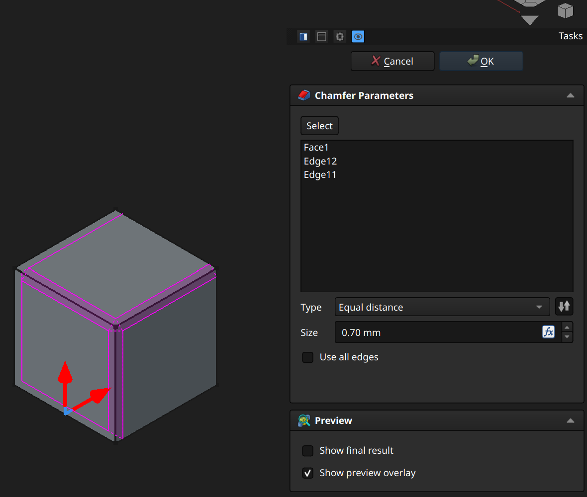

`{ref} https://wiki.freecad.org/PartDesign_Fillet` `{ref} https://wiki.freecad.org/PartDesign_Chamfer`

### Draft

`{bm} /(Part Design Workbench\/Features\/Draft)_TOPIC/i`

```{prereq}
Part Design Workbench/User Interface_TOPIC
Part Design Workbench/Organization_TOPIC
```

```{note}
Draft looks to be broken for custom curves outsides of shapes derived from conics (e.g., spheres, half spheres, cylinders). Anything that involves a custom curved face won't work.
```

Draft adds an angle to one or more faces.


To apply draft, select relevant faces and use either toolbar button 25.

A **Draft Parameters** pane will pop open. To add faces, click **Select**, select the face, and then click **Confirm Selection**. To remove faces, click on the face in the list and press Del.

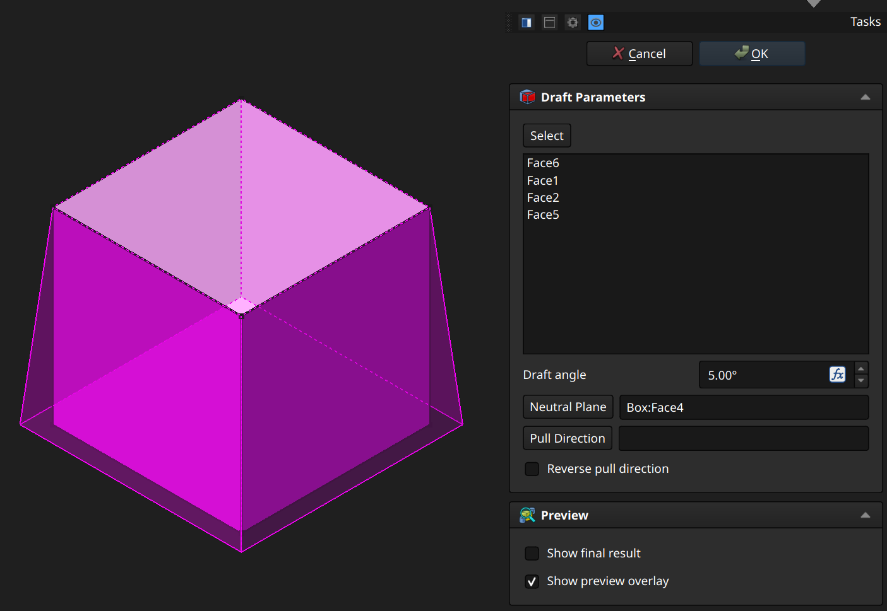

The **Draft angle** field sets the angle to offset the faces (can be negative).

The **Neutral Plane** field sets the plane in which the edge must be anchored (won't lift or sink). To set, click the button and select a face. In the example above, the neural plane is the top face. The 4 sides which have draft applied fan out toward the bottom because the top edges are locked in place.

The **Pull Direction** field sets the direction in which the angle is applied. To set, click the button and select an edge (or something edge-like, like a datum line_FC?).

```{note}
I think **Pull Direction** is the normal of the face by default. Here's what the source says:

> Set the the pull direction by pressing the Pull direction button, then select an edge. Pull Direction is only effective if the Neutral Plane has been set. Results can be unpredictable.
```

`{ref} https://wiki.freecad.org/PartDesign_Draft`

### Thickness

`{bm} /(Part Design Workbench\/Features\/Thickness)_TOPIC/i`

```{prereq}
Part Design Workbench/User Interface_TOPIC
Part Design Workbench/Organization_TOPIC
Part Design Workbench/Features/Loft_TOPIC
```

```{note}
Thickness_FC looks to be broken for custom curves outsides of shapes derived from conics (e.g., spheres, half spheres, cylinders). Anything that involves a custom curved face won't work.

One thing I've tried doing that may work in some cases where thickness_FC fails is a subtractive loft_FC. You take profile sketches_FC and punch through the solid. You may need to do multiple such subtractive lofts_FC to get what you're hoping for.
```

Thickness_FC removes one or more faces and cuts out the inside of the object, giving it a bowl-like / shell-like effect.


To apply thickness_FC, select relevant faces and use toolbar button 26.

A **Thickness_FC Parameters** pane will pop open. To add faces, click **Select**, select the face, and then click **Confirm Selection**. To remove faces, click on the face in the list and press Del.

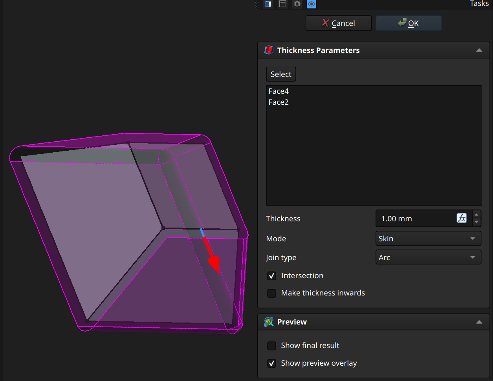

The **Thickness_FC** field sets the !!thick!! the shell is. If **Make thickness_FC inwards** is clicked, the original outline is kept but hollowed out vs padding the original outline to generate the shell.

The **Mode** field must be set to **Skin**.

```{note}
According to the source, the only option implemented for **Mode** is **Skin** and you shouldn't be selecting anything else. See source for more information.
```

The **Join type** field defines how non-tangential faces of the shell are joined together:

* **Arc**: Faces that do not intersect are joined by a fillet_FC with a radius equal to **Thickness_FC** value.
* **Intersection**: Faces that do not intersect are extended to meet at their virtual intersection.

The **Intersection** checkbox avoids self-intersection in some models. 

```{note}
According to the source, it's recommended to leave the **Intersection** checkbox unchecked because it relies on some unimplemented methods in a dependent library. See source for more information.
```

`{ref} https://wiki.freecad.org/PartDesign_Thickness`

### Boolean

`{bm} /(Part Design Workbench\/Features\/Boolean)_TOPIC/i`

```{prereq}
Part Design Workbench/User Interface_TOPIC
Part Design Workbench/Organization_TOPIC
```

Boolean moves one or more outside bodies_FC into the active body_FC and performs a boolean/set operation (union, intersection. subtraction).


To apply boolean, select relevant faces and use toolbar button 22. A **Boolean Parameters** pane will pop open.

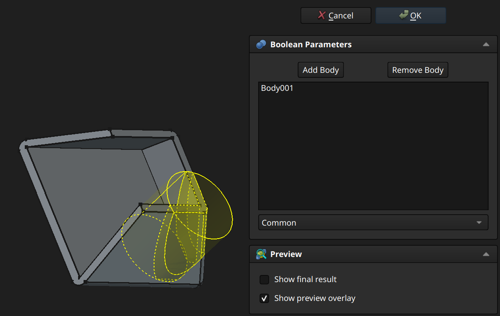

To move a body_FC into the active body_FC, click **Add Body_FC** and select the body_FC. To move an added body_FC back out, click **Remove Body_FC** and select the body_FC in Model pane.

The drop-down below the list of added bodies_FC is the operation to perform:

* **Common** is intersection.
* **Fuse** is union.
* **Cut** is subtraction - the added bodies_FC are subtracted from the active body_FC.

```{note}
You almost always will need to move and reorient the body_FC when you're doing boolean operations like this.
```

```{seealso}
Part Design Workbench/Organization/Body_TOPIC
```

`{ref} https://wiki.freecad.org/PartDesign_Boolean`

### Mirror

`{bm} /(Part Design Workbench\/Features\/Mirror)_TOPIC/i`

```{prereq}
Part Design Workbench/User Interface_TOPIC
Part Design Workbench/Organization_TOPIC
```

Mirror copies either the entire body_FC or specific features_FC across a plane.


To apply mirror, use toolbar button 27. A **Mirror Parameters** pane will pop open.

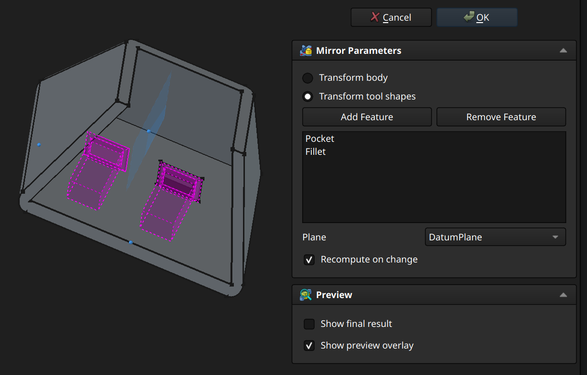

Select **Transform body_FC** for mirroring of the full model or **Transform tool shapes** to mirror specific features_FC. If **Transform tool shapes** is selected, for each feature_FC to mirror, click **Add Feature_FC** and select the feature_FC in the Model pane. Likewise, remove a feature_FC being mirror by clicking **Remove Feature_FC** and selecting the feature_FC in the Model pane.

```{note}
Does order of the selected features_FC matter? A safe bet is likely to add features_FC in the same order.
```

The **Plane** field selects the plane across which mirroring happens:

* Base planes (e.g., XY plane).
* Datum planes_FC.
* Sketch_FC axes and construction lines from any feature_FC that's !!based!! off a sketch_FC.

```{seealso}
Datum Geometry/Datum Plane_TOPIC
```

```{note}
It looks like the safest bet is to build your own datum plane_FC. To place a datum plane_FC perpendicular to some face's orientation, ...

1. create a sketch_FC on the face and insert 3 points in an L shape.
2. exit the sketch_FC and reference those points to create a datum plane_FC.
3. set the datum plane_FC's **Attachment mode** to either **Align O-N-Y** or **Align O-Y-N**.

Instead of a sketch_FC with points, you can also try placing 3 datum points_FC on the face's edges, moving those datum points_FC using the **Map Path Property** (it's hidden in the properties tab - you need to right click and show hidden properties). 
```

`{ref} https://wiki.freecad.org/PartDesign_Mirrored`

### Polar Pattern

`{bm} /(Part Design Workbench\/Features\/Polar Pattern)_TOPIC/i`

```{prereq}
Part Design Workbench/User Interface_TOPIC
Part Design Workbench/Organization_TOPIC
```

Polar pattern copies either the entire body_FC or specific features_FC, multiple times around an axis.


To apply polar pattern, use toolbar button 29. A **Polar Pattern Parameters** pane will pop open.

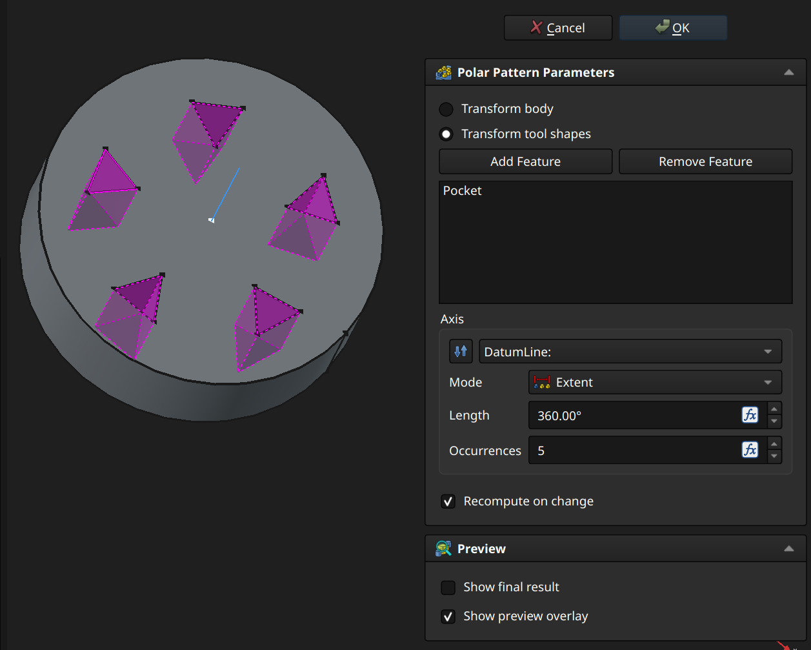

Select **Transform body_FC** for patterning of the full model or **Transform tool shapes** to pattern specific features_FC. If **Transform tool shapes** is selected, for each feature_FC to mirror, click **Add Feature_FC** and select the feature_FC in the Model pane. Likewise, remove a feature_FC being mirror by clicking **Remove Feature_FC** and selecting the feature_FC in the Model pane.

```{note}
Does order of the selected features_FC matter? A safe bet is likely to add features_FC in the same order.
```

The **Axis** field selects the axis across which copying happens:

* Basis (e.g., X axis).
* Datum lines_FC.
* Sketch_FC axes and construction lines from any feature_FC that's !!based!! off a sketch_FC.

```{note}
It may be best to use a datum line_FC here. Create a sketch_FC on the face, put the point that the datum line_FC should pass through (make sure to fully constrain it by locking it into place or using projected construction geometry_FC), exit the sketch_FC, and insert a datum line_FC referencing the point and the face using attachment mode "Normal to surface".
```

```{seealso}
Datum Geometry/Datum Line_TOPIC
```

When **Mode** is ...

* **Extent**, the **Length** field controls how much to rotate around the axis (e.g., 180 degrees, 360 degrees, 720 degrees) and **Occurrences** field controls the number of copies (evenly spaced out around the rotation).
* **Spacing**, the **Spacing** field controls how much space there is between copies (e.g., 60 degrees between copies) and **Occurrences** field controls the number of copies.

`{ref} https://wiki.freecad.org/PartDesign_PolarPattern`

### Linear Pattern

`{bm} /(Part Design Workbench\/Features\/Linear Pattern)_TOPIC/i`

```{prereq}
Part Design Workbench/User Interface_TOPIC
Part Design Workbench/Organization_TOPIC
```

Linear pattern copies either the entire body_FC or specific features_FC, multiple times in a straight line.


To apply linear pattern, use toolbar button 28. A **Linear Pattern Parameters** pane will pop open.

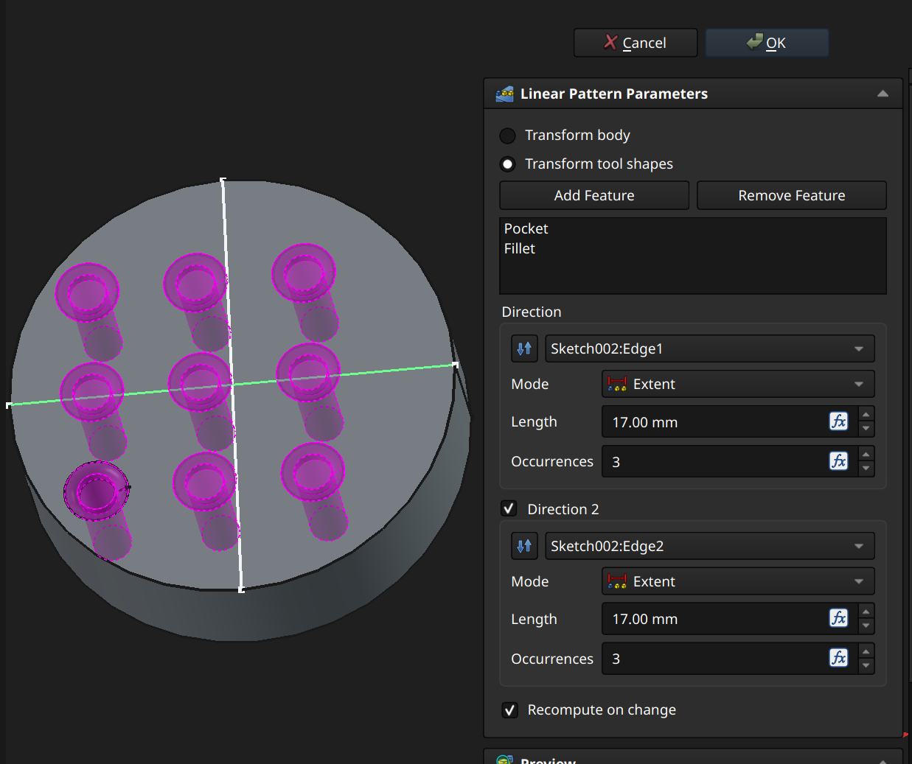

Select **Transform body_FC** for patterning of the full model or **Transform tool shapes** to pattern specific features_FC. If **Transform tool shapes** is selected, for each feature_FC to mirror, click **Add Feature_FC** and select the feature_FC in the Model pane. Likewise, remove a feature_FC being mirror by clicking **Remove Feature_FC** and selecting the feature_FC in the Model pane.

```{note}
Does order of the selected features_FC matter? A safe bet is likely to add features_FC in the same order.
```

The **Direction** area selects the line across which copying happens:

* Basis (e.g., X axis).
* Datum lines_FC.
* Sketch_FC axes and construction lines from any feature_FC that's !!based!! off a sketch_FC.

```{note}
It may be best to use a datum line_FC here. Create a sketch_FC on the face with a line (make sure to fully constrain it by locking it into place or using projected construction geometry_FC).
```

When **Mode** is ...

* **Extent**, the **Length** field controls the total amount of distance and **Occurrences** field controls the number of copies (evenly spaced out across that distance).
* **Spacing**, the **Spacing** field controls how much space there is between copies (e.g., 10mm between copies) and **Occurrences** field controls the number of copies.

The **Direction 2** checkbox displays a second **Direction** area, which is used to copy the copies from the first direction area. In the example screenshot, the first direction area produces 3 !!holes!! upward, while the second direction area places 3 copies of those 3 !!holes!! across, totalling 9 !!holes!!.

`{ref} https://wiki.freecad.org/PartDesign_LinearPattern`

### Multi-Transform

`{bm} /(Part Design Workbench\/Features\/Multi-Transform)_TOPIC/i`

```{prereq}
Part Design Workbench/User Interface_TOPIC
Part Design Workbench/Organization_TOPIC
Part Design Workbench/Features/Mirror_TOPIC
Part Design Workbench/Features/Polar Pattern_TOPIC
Part Design Workbench/Features/Linear Pattern_TOPIC
```

Multi-transform is a container that can apply a chain of linear pattern, polar pattern, and mirror features_FC. In addition, it can apply scaling to copies produced by these features_FC.


To apply multi-transform, either ...

* use toolbar button 30.
* select existing linear pattern, polar pattern, and / or mirror features_FC in the Model pane and use toolbar 30. The selected features_FC will be imported into the multi-transform.

```{note}
If you're importing: I suspect the selection has to be made in order to be added? Also each selection must to target the exact same set of features_FC added in the exact same order?
```

A **Multi-Transform Parameters** pane will pop open.

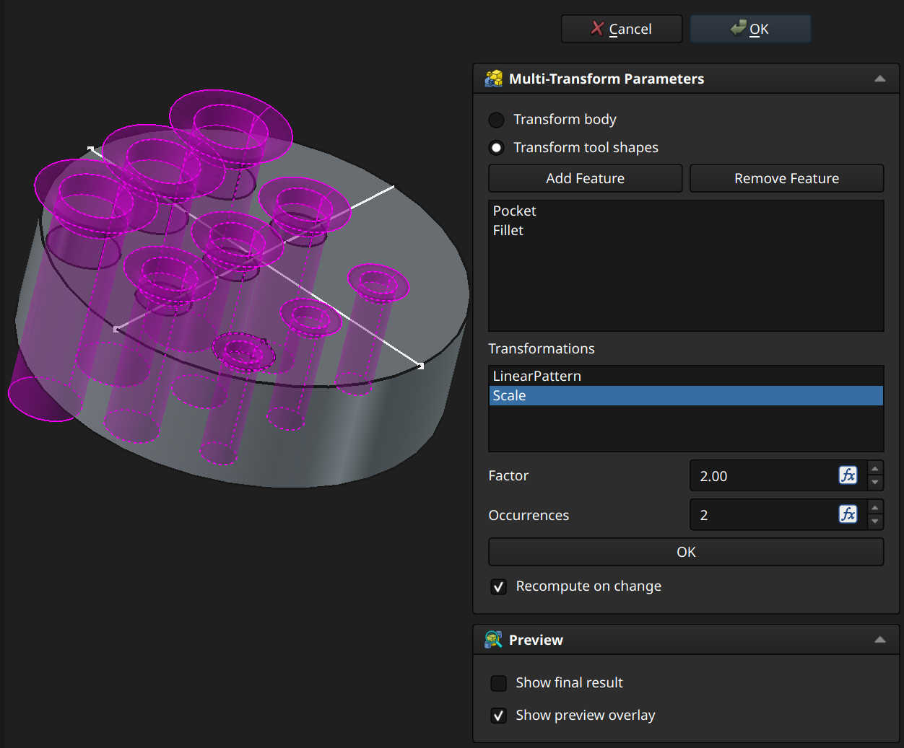

Select **Transform body_FC** for patterning of the full model or **Transform tool shapes** to pattern specific features_FC. If **Transform tool shapes** is selected, for each feature_FC to mirror, click **Add Feature_FC** and select the feature_FC in the Model pane. Likewise, remove a feature_FC being mirror by clicking **Remove Feature_FC** and selecting the feature_FC in the Model pane.

```{note}
Does order of the selected features_FC matter? A safe bet is likely to add features_FC in the same order.
```

Right-click inside the **Transformations** list to add, delete, edit, and reorder transformations. The **Scale** transformation takes copies made in the previous transformation and applies compound scaling (e.g., first copy is 2x scaled, second copy, 3x scaled, etc..), as shown in the example. For copies of the body_FC, this may work as intended. For copies of features_FC, this may not work as intended (e.g., in the example screenshot, notice that the pockets don't seat on the face as they scale).

`{ref} https://wiki.freecad.org/PartDesign_MultiTransform` `{ref} https://wiki.freecad.org/PartDesign_Scaled`

# Part Workbench

`{bm} /(Part Workbench)_TOPIC/i`

```{prereq}
User Interface Layout_TOPIC
Spreadsheet Workbench_TOPIC
Sketcher Workbench_TOPIC
Part Design Workbench_TOPIC
```

Part workbench_FC allows building a 3D object through a hierarchy of transformations. In contrast to the part design workbench_FC, the part workbench_FC ....

* can produce both contiguous 3D objects and non-contiguous 3D objects (e.g., the 3D object can be comprised of multiple separated pieces, but it'll still be treated as a single 3D object).
* produces a 3D object through a hierarchy of transformations as opposed to a linear chain of 2D sketch_FC to 3D feature_FC.
* produces a 3D object outside of a container, meaning the operations / transformations don't need to nest in a container similar to part design_FC's body_FC.

The core !!components!! of the part workbench_FC are geometry objects and compounds (compounds are a grouping of geometry objects, treated as a single piece of geometry). The workflow is to build out more complex pieces of geometry through transformations: Multiple pieces of existing geometry into one or more pieces of new geometry (e.g., boolean intersection, converting two 2D lines to a ruled surface, sweeping_FC over profiles).

```{plantuml}
@startuml

hide circle

Compound ||--o{ GeometryObject : "contains"

@enduml
```

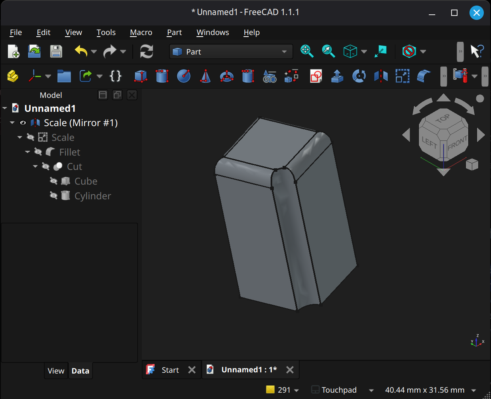

## User Interface

`{bm} /(Part Workbench\/User Interface)_TOPIC/i`

```{prereq}
User Interface Layout_TOPIC
```

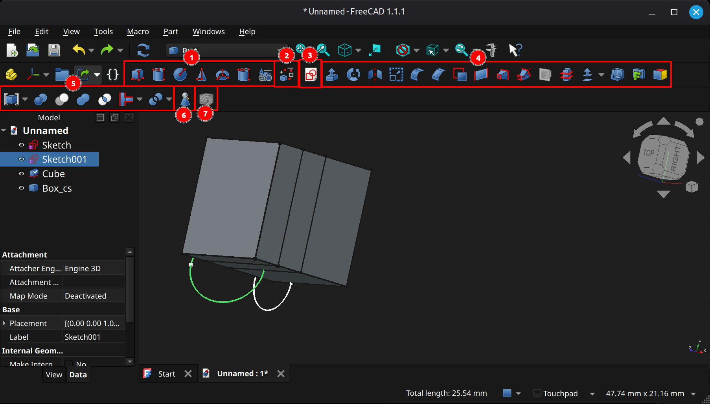

**Geometry Creation**

* (1) Geometry creation: These toolbar buttons create standard geometry out of nothing other than user parameters. Geometry may be solids, surfaces, of profiles (e.g., 2D coplanar geometry). From left-to-right, ...

  * create a cube.
  * create a cylinder.
  * create a sphere.
  * create a cone.
  * create a torus.
  * create a tube.
  * create a one of many types of standard shapes / geometric primitives (e..g, cube, prism, plane, circle, line, vertex).

* (3) Create a sketch_FC (either on plane or face).

**Geometry Transformation**

* (2) Shape Builder: Creates complex shapes from geometric primitives.

* (4) Basic transformations: These toolbar buttons create manipulate and transform geometry. From left-to-right, ...

  * extrude a profile.
  * revolve a profile.
  * mirror geometry.
  * scale geometry.
  * fillet_FC edges.
  * chamfer_FC edges.
  * create face from wires (e.g., from a sketch_FC).
  * create a ruled surface between two wires.
  * loft_FC through a set of profiles.
  * sweep_FC through a set of profiles.
  * boolean intersection two objects, as wire geometry.
  * create !!wireframe!! cross sections from an exist 3D object.
  * drop-down to either ...
    * fatten a 3D object.
    * fatten a profile.
  * convert a 3D object to a shell, leaving selected faces open.
  * project edges/wires/faces of one object onto another.
  * change appearance of a face.

* (5) Boolean operations: These toolbar buttons transform multiple pieces of geometry. From left-to-right, ...

  * drop-down to either ...
    * group together (compound) several pieces of geometry (not a boolean union, restrictions apply).
    * break apart a compound back to its individual parts.
    * break out some geometry in a compound, using filters.
  * boolean operation between two 3D objects (e.g., union, intersection, difference).
  * boolean difference a 3D object from another.
  * boolean union two 3D objects.
  * boolean intersect two 3D objects.
  * drop-down to either ...
    * boolean union two walled / hollowed 3D objects, preserving voids.
    * boolean union two walled / hollowed 3D objects, preserving voids on one of the objects.
    * boolean difference two walled / hollowed 3D objects, making sure to remove the void as well.
  * drop-down to either ...
    * splits two 3D objects into it's boolean differences (both A-B and B-A) and boolean intersection, under a compound. The compound of differences and intersection together form the boolean union.
    * splits a 3D object using another 3D object as a "cutter", resulting in its boolean difference (A-B only) and boolean intersection. The split pieces are placed as individual 3D objects, not under a compound.
    * splits a 3D object using another 3D object as a "cutter", resulting in its boolean difference (A-B only) and boolean intersection. The split pieces under a compound.
    * boolean XOR two 3D objects, effectively removing the boolean intersection (\[A-B\]∪\[B-A\])

* (7) !!Defeaturing!!: Removes certain !!features!! of a 3D object (e.g. !!holes!!, chamfers_FC, edges_FC), to fix defects and simplify.

**Helpers**

* (6) Check geometry: analyze selected geometry for errors.

`{ref} https://wiki.freecad.org/Part_Workbench`

## Organization

`{bm} /(Part Workbench\/Organization)_TOPIC/i`

```{prereq}
Part Workbench\/User Interface_TOPIC
```

The core !!components!! of the Part workbench_FC are geometry and compounds. A compound object is a grouping of a geometry objects, treated as a single geometry object.

```{plantuml}
@startuml

hide circle

Geometry <|-- Compound : "is a"
Compound ||--o{ Geometry : "contains"

@enduml
```

A geometry object could be ...

* a primitive (e.g., cube, line, cone, vertex).
* the result of some transformation (e.g., boolean intersection of two objects, filleting_FC an edge).
* the combination of geometry objects (e.g., compound object).
* a body_FC.

```{seealso}
Part Workbench/Part Design Interoperability_TOPIC
```

`{ref} self`

### Geometry

`{bm} /(Part Workbench\/Organization\/Geometry)_TOPIC/i`

```{prereq}
Datum Geometry/Local Coordinate System_TOPIC
```

A geometry object contains some geometry and has a local coordinate system_FC to place and orient it in relation to the parent's coordinate system.

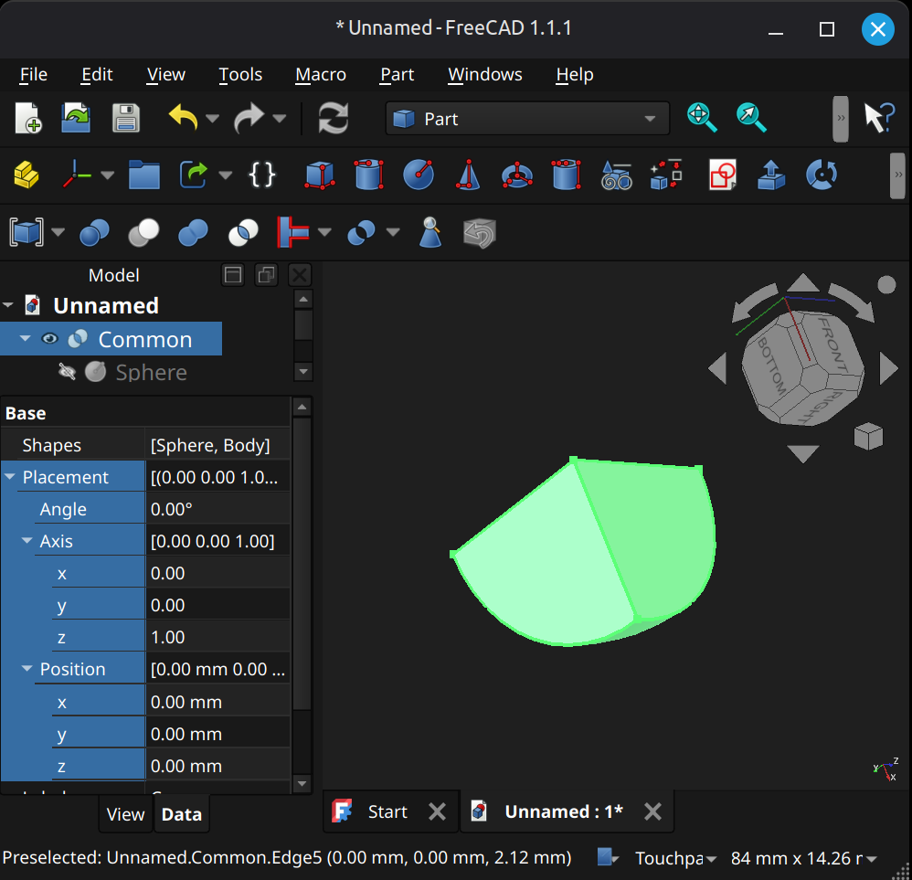


`{ref} self`

### Compound

`{bm} /(Part Design Workbench\/Organization\/Compound)_TOPIC/i`

```{prereq}
Part Workbench/Organization/Geometry_TOPIC
Sketcher Workbench_TOPIC
Standard Part_TOPIC
```

A compound object is a set of geometry objects brought together under a single container, where that container itself is a geometry object. This is not a boolean union - objects aren't merged in together.

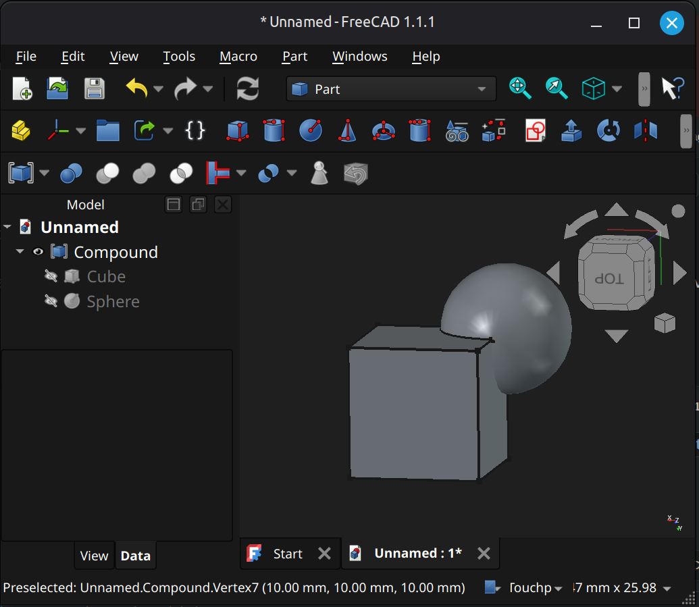

```{plantuml}
@startuml

hide circle

Geometry <|-- Compound : "is a"
Compound ||--o{ Geometry : "contains"

@enduml
```

```{note}
How is this different from a standard part_FC? Standard part_FC is a container that holds multiple geometry objects but itself isn't geometry, while compound is? The source mentions that the compound has a "topological shape".
```

```{note}
The source says compounds can't include meshes?
```

`{ref} https://wiki.freecad.org/Part_Compound`


### Profile

`{bm} /(Part Design Workbench\/Organization\/Profile)_TOPIC/i`

```{prereq}
Part Workbench/Organization/Geometry_TOPIC
Sketcher Workbench_TOPIC
```

A profile is a set of geometry that's 2D and coplanar: Sketches_FC, 2D primitive shapes (e.g., circle, square, ellipse), a set of connected coplanar edges/wires that may or may not be closed (e.g., 3 wires forming a U shape is not closed). Profiles often go on to be to generate faces, and surfaces, and 3D objects (e.g., 2 edges can generate a ruled surface, a loft_FC can generate a 3D object or curved surface).

```{note}
A profile isn't a container / distinct type of object, but it's referred to multiple times throughout the wiki and is required by several operations, and so I thought it'd be good to add it in the organization.
```

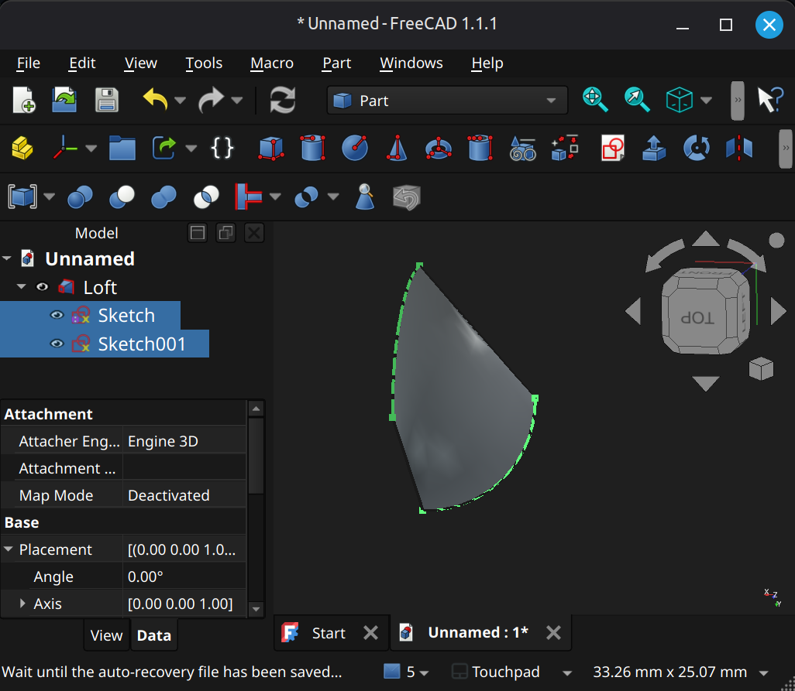

`{ref} self`

## Part Design Interoperability

`{bm} /(Part Workbench\/Part Design Interoperability)_TOPIC/i`

```{prereq}
Part Workbench/Organization_TOPIC
Part Design Workbench/Organization/Body_TOPIC
Part Design Workbench/Binding Geometry_TOPIC
```

**Part Design Workbench_FC to Part Workbench_FC**

A part design_FC body_FC can naturally be operated on by the part workbench_FC. For example, the part workbench_FC can boolean union a body_FC with a cube generated from within the part workbench_FC.

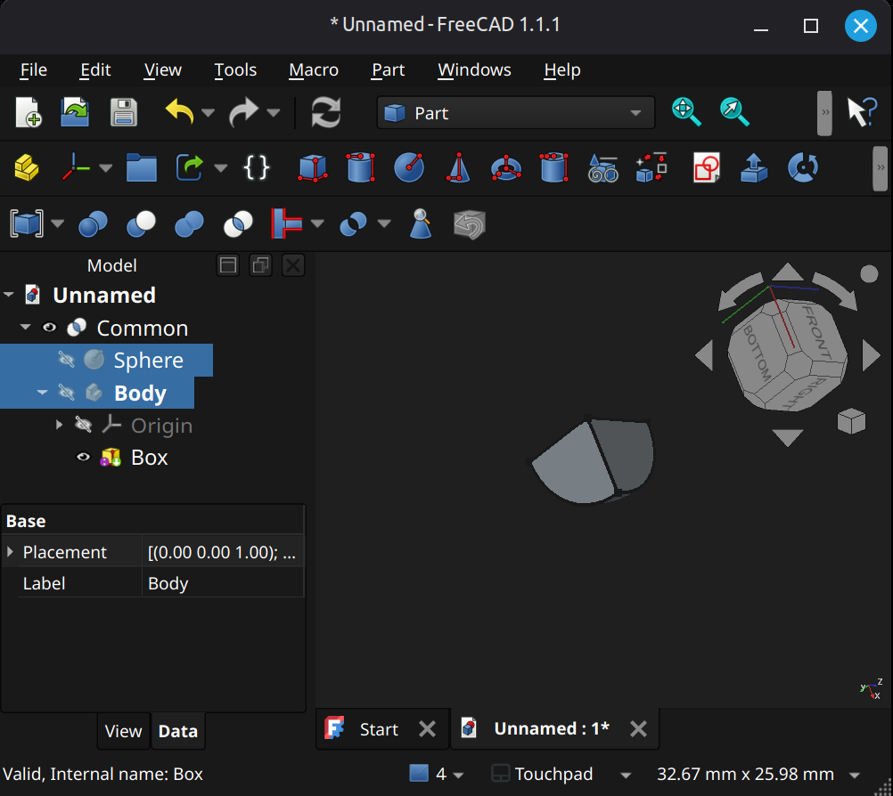

```{note}
Does a body_FC qualify as a geometry object similar to other part workbench_FC objects? Is that why?
```

**Part Workbench_FC to Part Design Workbench_FC**

A part workbench_FC object cannot naturally be operated on by the part design workbench_FC. The object must be pulled into the body_FC either using a subshape binder or as a !!base feature!!.


```{note}
The source seems to discourage swapping between workbenches_FC, but sometimes it's unavoidable? Should be fine.
```

`{ref} https://forum.freecad.org/viewtopic.php?t=31064` `{ref} self`


## Primitive

Include anything that builds solids

## Ruled Surface

## Face from Wires

## Shape Builder

## Profile Transformations

Mirror, revolve, pad

## Chamfer / Fillet

## Boolean Operations

## Profile Operations

## Fattening Operations

!!Thickness!! / 2D offset / 3D offset

# Assembly Workbench

`{bm} /(Assembly Workbench)_TOPIC/i`

```{prereq}
User Interface Layout_TOPIC
Spreadsheet Workbench_TOPIC
Sketcher Workbench_TOPIC
Part Design Workbench_TOPIC
Part Workbench_TOPIC
```

Assembly workbench_FC allows linking individual models by specifying how they fit and move together. For example, a piston and its enclosure can be linked together such that piston moves up and down its enclosure.

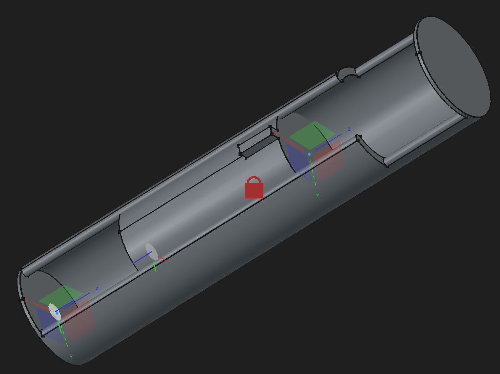

The core !!component!! of the assembly workbench_FC is the joint_FC. A joint_FC positions and restricts the degrees of freedom_FC a model has in relation to some other model.

```{plantuml}
@startuml

hide circle

Assembly ||--o{ Joint : "contains"
Assembly ||--o{ Component : "contains"
Joint }|--o{ Component : "constrains movement of"

@enduml
```

`{ref} https://wiki.freecad.org/Assembly_Workbench` `{ref} https://blog.freecad.org/2024/09/30/tutorial-getting-started-with-the-assembly-workbench/`

## User Interface

`{bm} /(Assembly Workbench\/User Interface)_TOPIC/i`

```{prereq}
User Interface Layout_TOPIC
Spreadsheet Workbench_TOPIC
Sketcher Workbench_TOPIC
Part Design Workbench_TOPIC
Standard Part_TOPIC
```

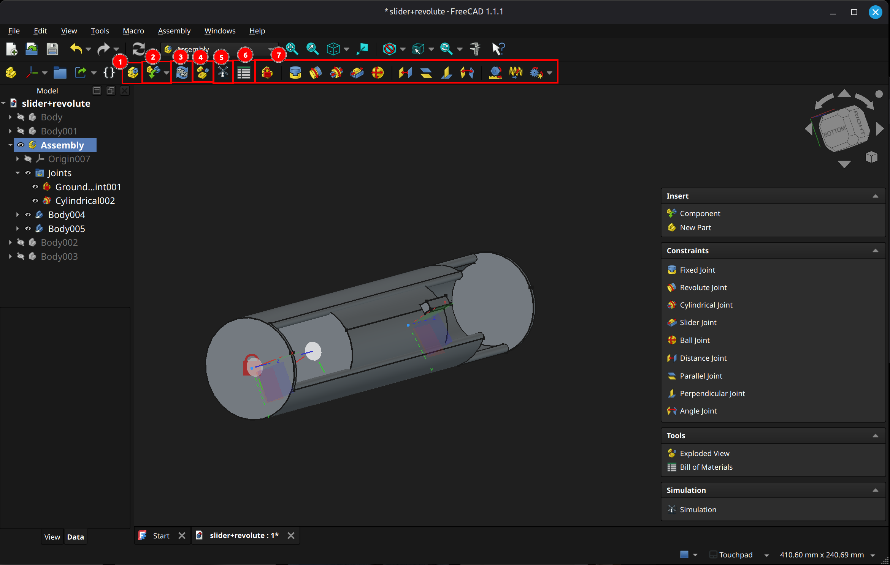

**Assembly_FC**

 * (1) Create new assembly_FC.
 * (2) Add component_FC (may be a model or a standard part_FC).
 * (3) Solve assembly_FC.
 * (4) Explode view of assembly_FC.
 * (5) Simulation_FC of assembly_FC.
 * (6) Bill of materials_FC.

**Joints_FC**

 * (7) Joint_FC types: These toolbar buttons give quick access to joints_FC functionality. From left-to-right, ...

   * create grounded joint_FC, locking a component_FC into place.
   * create fixed joint_FC, locking a component_FC relative to another component_FC.
   * create revolute joint_FC, locking a component_FC's movement such it only revolves around some axis.
   * create cylindrical joint_FC, locking a component_FC's movement such it only revolves and slides along some axis (combination of slider joint_FC and revolute joint_FC).
   * create slider joint_FC, locking a component_FC's movement such that it only slides along some axis.
   * create ball joint_FC, locking a component_FC_FC's movement to a specific point, allowing unrestricted movement so long as it touches that point.
   * create distance joint_FC, locking the movement of two components_FC to be a specific distance from each other.
   * create parallel joint_FC, locking the movement of two components_FC such that their z-axis are parallel.
   * create perpendicular joint_FC, locking the movement of two components_FC such that their z-axis are perpendicular.
   * create angle joint_FC, locking the movement of two components_FC such that their z-axis are fixed at a specific angle.
   * create rack and pinion joint_FC, locking a component_FC with a sliding joint_FC around a component_FC with a revolute joint_FC.
   * create screw joint_FC, locking a component_FC with a sliding joint_FC around a component_FC with a revolute joint_FC.
   * drop-down to either ...
     * create gear joint_FC, locking two components_FC with revolute joints_FC together, with opposite rotating direction.
     * belt joint_FC locks_FC, locking two rotating components_FC with revolute joints_FC together, with same rotation direction.

`{ref} https://wiki.freecad.org/Assembly_Workbench` `{ref} https://blog.freecad.org/2024/09/30/tutorial-getting-started-with-the-assembly-workbench/`

## Organization

`{bm} /(Assembly Workbench\/Organization)_TOPIC/i`

```{prereq}
Assembly Workbench\/User Interface_TOPIC
App Link_TOPIC
```

The core pieces of the assembly workbench_FC are components_FC and joints_FC. A component_FC is an app link_FC to either a model or a standard part_FC containing a group of models. A joint_FC is a linkage between components_FC that restricts its positioning, orientation, and / or movement (e.g., restricts its degrees of freedom_FC). For example, a slider joint_FC locks one component_FC to another, restricting its movement such that it can only slide along some axis on that / derived from that component_FC.

* A joint_FC constrains the movement of one or more components_FC, often relative to each other.
* A component_FC can be !!constrained!! by by zero or more joints_FC.

```{plantuml}
@startuml

hide circle

Assembly ||--o{ Joint : "contains"
Assembly ||--o{ Component : "contains"
Joint }|--o{ Component : "constrains movement of"

@enduml
```

`{ref} https://wiki.freecad.org/Assembly_Workbench` `{ref} https://blog.freecad.org/2024/09/30/tutorial-getting-started-with-the-assembly-workbench/`

### Assembly

`{bm} /(Assembly Workbench\/Organization\/Assembly)_TOPIC/i`

```{prereq}
Standard Part_TOPIC
```

An assembly_FC is a container of that ties together models (e.g., bodies_FC, standard parts_FC containing bodies_FC) with joints_FC, defining how those models move in relation to each other. An assembly_FC can also contain sub-assemblies_FC. A sub-assembly_FC is an assembly_FC that's nested within another assembly_FC.


To create an assembly_FC, use toolbar button 1 (keyboard shortcut A). Assemblies_FC can be created at the top-level, within an existing assembly_FC (in which case it's referred to as a sub-assembly_FC), or even within a standard part_FC.

`{ref} https://blog.freecad.org/2024/09/30/tutorial-getting-started-with-the-assembly-workbench/` `{ref} https://wiki.freecad.org/Assembly_CreateAssembly` `{ref} self`

### Component

`{bm} /(Assembly Workbench\/Organization\/Component)_TOPIC/i`

```{prereq}
Assembly Workbench/Organization/Assembly_TOPIC
Standard Part_TOPIC
```

A component_FC is a non-joint_FC object within an assembly_FC (e.g., body_FC, standard part_FC, sub-assemblies_FC).


To insert a component_FC, use toolbar button 2 and select Component_FC (keyboard shortcut I). An Insert pane should appear with options to insert one or more components_FC or sub-assemblies_FC.

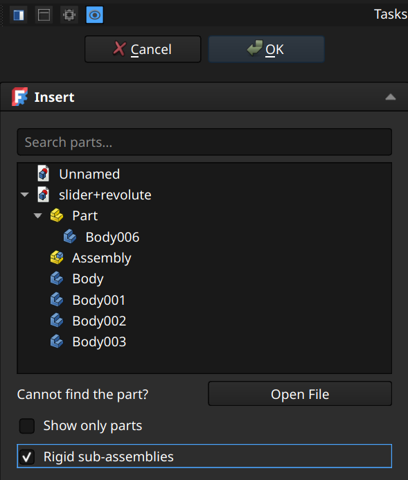

Clicking objects in the drop-down imports them into the assembly_FC. Importable objects include models, standard parts_FC, and assemblies_FC (become sub-assemblies_FC in the assembly_FC being imported into). Each object imported is imported as a reference as opposed to a copy, meaning changes in the source will reflect in the assembly_FC.

Above the list is a text field that filters items in the list.

Below the field is ...

* the button **Open File**, which opens a file to introduce new objects.
* the checkbox **Show only parts**, which filters the list of objects to standard parts_FC and assemblies_FC.
* the checkbox **Rigid sub-assemblies_FC**, which imports assemblies_FC without joint_FC movements enabled.

```{note}
Rigidness of sub-assemblies_FC can be toggled in the Properties pane, under **General** → **Rigid**.
```

If the object being imported is the first object, a prompt will show up asking if the object should be locked into place with a grounded joint_FC. An assembly_FC needs at least one grounded joint_FC on which other joints_FC and objects are anchored.


A component_FC can be moved by left mouse button dragging in the 3D viewport. If movement is !!constrained!! by joints_FC, only allowed movements are applied during dragging.

If a component_FC is not !!constrained!! by joints_FC, selecting it presents a gizmo that can be used to move it around. A sub-assembly_FC that's rigid is always moved as a whole, while a sub-assembly_FC that isn't rigid can have its individual components_FC separated and moved.

```{note}
It looks like the individual components_FC of a non-rigid sub-assembly_FC seem to snap back into place once a grounded joint_FC is applied?
```

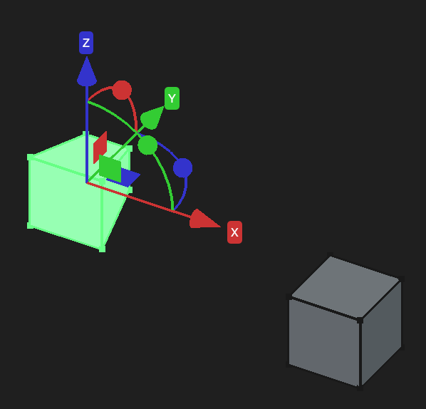

`{ref} https://blog.freecad.org/2024/09/30/tutorial-getting-started-with-the-assembly-workbench/` `{ref} https://wiki.freecad.org/Assembly_Workbench` `{ref} https://wiki.freecad.org/Assembly_InsertLink` `{ref} self`

### Joint

`{bm} /(Assembly Workbench\/Organization\/Joint)_TOPIC/i`

```{prereq}
Assembly Workbench/Organization/Assembly_TOPIC
Assembly Workbench/Organization/Component_TOPIC
```

A joint_FC constrains the movement of one or more components_FC, often relative to each other.


There are many types of joints_FC, starting from toolbar button 7 onward. An assembly_FC needs at least one grounded joint_FC on which other joints_FC and objects are anchored.

Each individual joint_FC type is documented in further detail in sections further down.

```{note}
A core mistake people often make with joints_FC is thinking that they can be compounded. A joint_FC removes all but some options for movement. That's why if you try to place a sliding joint_FC and a revolute joint_FC on the same pair of objects, they cancel each other out.

* The sliding joint_FC cancels out all motion except moving up and down an axis.
* The revolute joint_FC cancels out all motion except revolving around an axis.

The sliding joint_FC won't let the revolute joint_FC revolve, and the revolute joint_FC won't let the sliding joint_FC slide. See [here](https://forum.freecad.org/viewtopic.php?t=105828).
```

`{ref} https://blog.freecad.org/2024/09/30/tutorial-getting-started-with-the-assembly-workbench/` `{ref} https://wiki.freecad.org/Assembly_Workbench` `{ref} self`

### Frame

`{bm} /(Assembly Workbench\/Organization\/Frame)_TOPIC/i`

```{prereq}
Assembly Workbench/Organization/Component_TOPIC
Assembly Workbench/Organization/Joint_TOPIC
```

A frame_FC binds a component_FC's element_FC (e.g., face, plane, vertex) to a joint_FC, providing that element_FC with its own local coordinate system_FC. A joint_FC restrict the movement of its frames_FC (and thereby the component_FCs those frames_FC are attached to) !!based!! on that joint_FC's type and parameters.

```{plantuml}
@startuml

hide circle
left to right direction

Joint ||--o{ Frame : "has"
Component ||--|{ Component_Element : "has"
Frame ||--|| Component_Element : "binds to"

@enduml
```

A frame_FC is visualized in the viewport as a white transparent disc:

* The white disc represents a frame_FC's XY plane.
* The red line to the side of the white disc represents that frame_FC's X-axis.
* The green line to the side of the white disc represents that frame_FC's Y-axis.
* The blue line coming out from the white disc's center represents that frame_FC's z-axis / plane normal.

The joint_FC in the example below is a sliding joint_FC. A sliding joint_FC has two frames_FC, restricted such that the frames_FC are parallel to each other and the only movement/rotation change allowed is sliding up-and-down the z-axis.

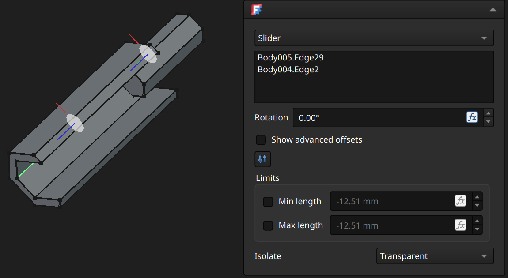

```{note}
A frame_FC isn't something you explicitly add. It's there wherever a joint_FC is paired to a component_FC element_FC.
```

## Joints

`{bm} /(Assembly Workbench\/Joints)_TOPIC/i`

```{prereq}
Assembly Workbench/User Interface_TOPIC
Assembly Workbench/Organization_TOPIC
Datum Geometry/Local Coordinate System_TOPIC
```

The subsections below detail joint_FC types !!supported!! by the assembly workbench_FC. Most joints_FC present a configuration pane during creation with a constant subset of options.

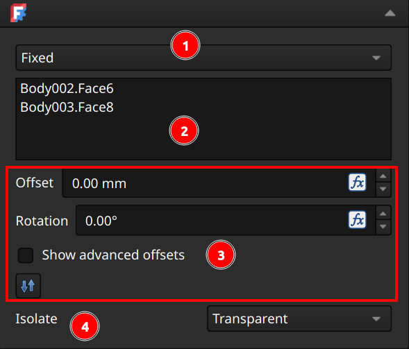

* (1) **Joint_FC type**: Joint_FC being applied. The joint_FC type can be changed by using this drop-down. Some joints_FC types may not be available (e.g., grounded joint_FC).

  ```{note}
  Sometimes, changing this value doesn't work. The joint_FC will show up as the selected type but it won't be applied.

  Noted in v1.1.1.
  ```

* (2) **Model elements_FC**: Model elements_FC (e.g., faces, edges, vertices) which the joint_FC applies to. 

* (3) **Configuration**: Configuration options for the select joint_FC type. Options differ per joint_FC type.

* (4) **Isolate**: Controls how unrelated components_FC appear when the joint_FC is selected:

  * **Transparent** views unrelated components_FC partially transparent.
  * **!!Wireframe!!** views unrelated components_FC as !!wireframe!!.
  * **Hidden** removes unrelated components_FC from view.
  * **Disabled** keeps unrelated components_FC in view as-is.

  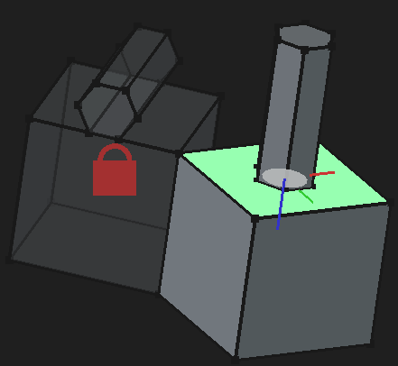 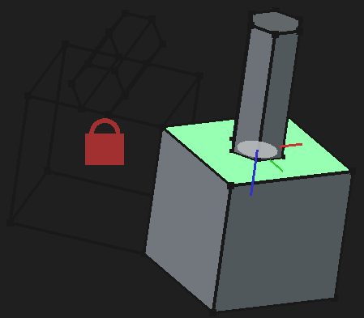

When offset and rotation parameters don't specify a relation (as in the example above), many joint_FC types apply it to the z-axis of one of their frame_FC's local coordinate system_FCs. In the example above, the offset parameter of 7mm is applied to the second frame_FC's local coordinate system_FC's z-axis.

Often times, it's possible to offset and rotate in more directions by selecting **Show advanced offsets** (or some equivalent checkbox / button). In the example above, selecting **Show advanced offsets** replaces the **Offset** and **Rotation** fields with **Offset1** and **Offset2**. These new fields directly control the offset and rotation for their respective frames_FC's local coordinate system_FC.

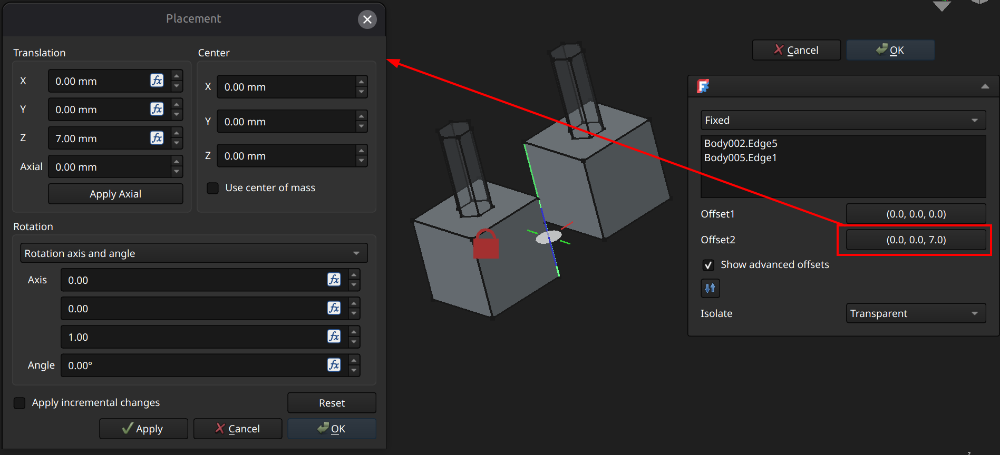

```{note}
It sounds like what's happening here is that when you go to create a joint_FC, it attaches to a frame_FC to each of the component_FC elements_FC you've selected (it centers them?).

* The first frame_FC is attached to component_FC 1's element_FC and has its own LCS_FC.
* The second frame_FC is attached to component_FC 2's element_FC and has its own LCS_FC.

The translation/rotation adjustments move the component_FC relative to the frame_FC it's attached to:

* **Offset1** is relative to the first frame_FC's LCS_FC
* **Offset2** is relative to the second frame_FC's LCS_FC.

That is, the frame_FCS stays in place, but the component_FC it's attached to moves around (e.g., translates out 5mm and rotates over Z-axis by 45 degrees).

I suppose it's like this because you can't position and rotate frames_FC. You select the element_FC and a frame_FC gets attached to it at some place on the element_FC in some orientation, and it's your responsibility to adjust the translation and rotation to ensure it's as expected?

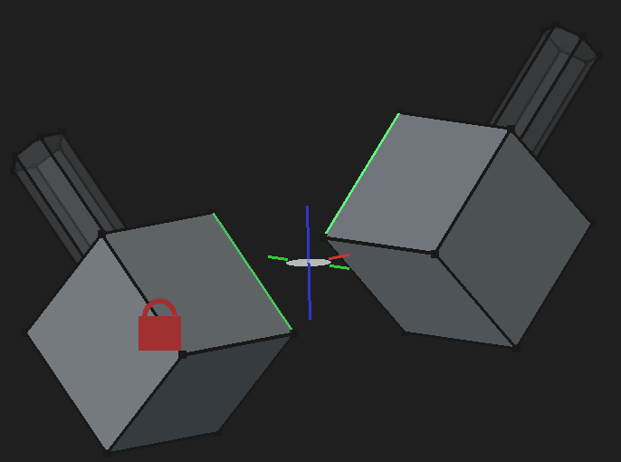
```

`{ref} https://wiki.freecad.org/Assembly_Workbench` `{ref} self`

### Grounded Joint

`{bm} /(Assembly Workbench\/Joints\/Grounded Joint)_TOPIC/i`

A grounded joint_FC locks the location and orientation of an assembly_FC piece. A non-empty assembly_FC needs to have at least one grounded joint_FC.


To apply a grounded joint_FC, select the component_FC and select toolbar button 7 (keyboard shortcut G). Doing this multiple times toggles the grounded joint_FC on and off.

Once a grounded joint_FC is applied, a red lock will appear over the piece.

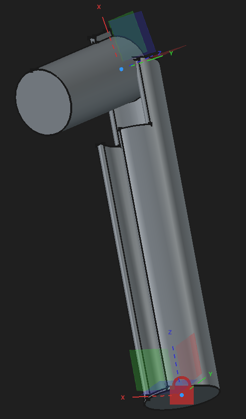

`{ref} https://wiki.freecad.org/Assembly_ToggleGrounded`

### Fixed Joint

`{bm} /(Assembly Workbench\/Joints\/Fixed Joint)_TOPIC/i`

```{prereq}
Assembly Workbench/Joints/Grounded Joint_TOPIC
```

A fixed joint_FC locks one component_FC onto another component_FC, preventing any movement or rotation.


To apply a fixed joint_FC, either ...

* select two elements_FC (e.g., edge, face, vertex), one on each component_FC, and then select toolbar button 8 (keyboard shortcut F).
* select toolbar button 8 (keyboard shortcut F), then select two elements_FC (e.g., edge, face, vertex), one on each component_FC.

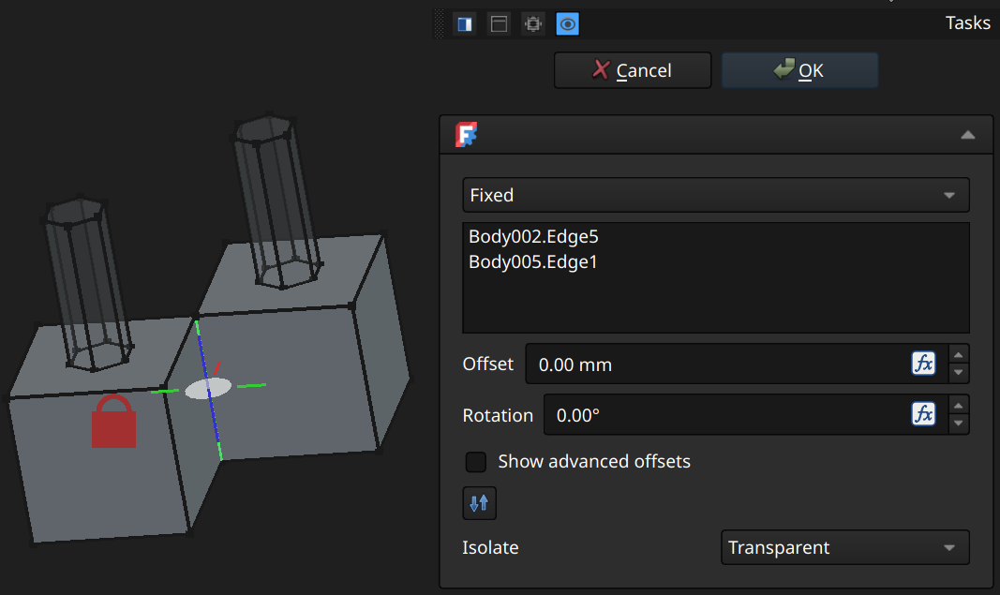

* **Offset**: Translates joint_FC's second frame_FC's LCS_FC's z-axis.
* **Rotation**: Rotates around the joint_FC's second frame_FC's LCS_FC's z-axis.
* **Up/down button**: !!Flips!! joint_FC's LCS_FC such that the z-axis points in the opposite direction.

```{note}
Options not described here are described in the parent section.
```

`{ref} https://wiki.freecad.org/Assembly_CreateJointFixed`

### Revolute Joint

`{bm} /(Assembly Workbench\/Joints\/Revolute Joint)_TOPIC/i`

```{prereq}
Assembly Workbench/Joints/Grounded Joint_TOPIC
```

A revolute joint_FC allows the rotation of one component_FC around another component_FC using the shared z-axis between both frames_FC. All other movements and rotations are restricted.


To apply a revolute joint_FC, either ...

* select two elements_FC (e.g., edge, face, vertex), one on each component_FC, and then select toolbar button 9 (keyboard shortcut R).
* select toolbar button 9 (keyboard shortcut R), then select two elements_FC (e.g., edge, face, vertex), one on each component_FC.

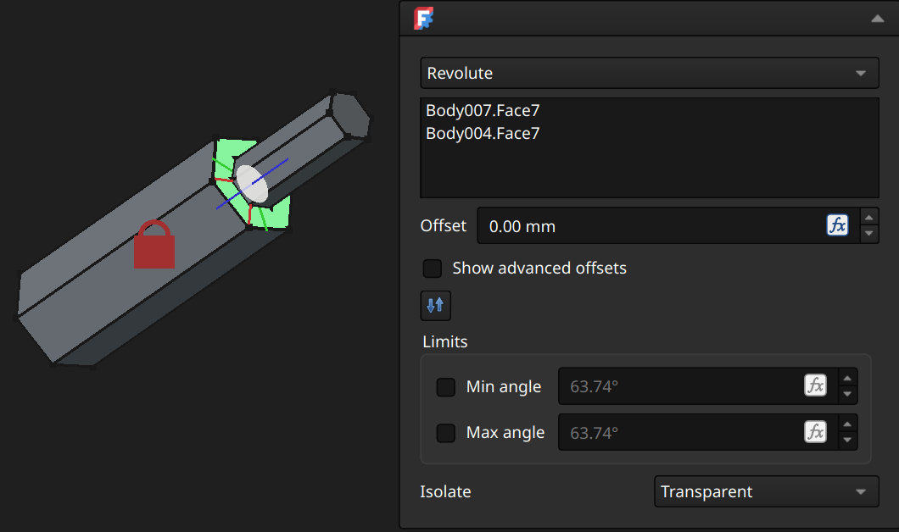

A revolute joint_FC lines matches up both frames_FC and rotates around the shared z-axis.

* **Offset**: Translates joint_FC's second frame_FC's LCS_FC's z-axis.
* **Up/down button**: !!Flips!! joint_FC's LCS_FC such that the normal points in the opposite direction.
* **Min angle / Max angle**: If enabled, restricts the rotational angle range.

```{note}
Options not described here are described in the parent section.
```

```{note}
There's a bug in 1.1.1 (and maybe other versions) where angles \< 180 or \> 180 roll over. Sometimes that's a problem because it can only target the interior angle range instead of the exterior angle range (or vice versa - I forget). You can workaround the bug by going into the joint_FC's properties and setting **Limits** → **Angle Min** / **Angle Max**.
```

`{ref} https://wiki.freecad.org/Assembly_CreateJointRevolute`

### Slider Joint

`{bm} /(Assembly Workbench\/Joints\/Slider Joint)_TOPIC/i`

```{prereq}
Assembly Workbench/Joints/Grounded Joint_TOPIC
```

A slider joint_FC allows the sliding of one component_FC along another component_FC using the shared z-axis between both frames_FC. All other movement and rotation are restricted.


To apply a slider joint_FC, either ...

* select two elements_FC (e.g., edge, face, vertex), one on each component_FC, and then select toolbar button 11 (keyboard shortcut S).
* select toolbar button 11 (keyboard shortcut S), then select two elements_FC (e.g., edge, face, vertex), one on each component_FC.


* **Rotation**: Rotates around the joint_FC's second frame_FC's LCS_FC's z-axis.
* **Up/down button**: !!Flips!! joint_FC's LCS_FC such that the normal points in the opposite direction.
* **Min length / Max length**: If enabled, restricts how far the two frames_FC can extend out in either direction.

```{note}
Options not described here are described in the parent section.
```

`{ref} https://wiki.freecad.org/Assembly_CreateJointSlider`

### Cylindrical Joint

`{bm} /(Assembly Workbench\/Joints\/Cylindrical Joint)_TOPIC/i`

```{prereq}
Assembly Workbench/Joints/Grounded Joint_TOPIC
Assembly Workbench/Joints/Revolute Joint_TOPIC
Assembly Workbench/Joints/Slider Joint_TOPIC
```

A cylindrical joint_FC is a combination of the slider joint_FC and revolute joint_FC. Both sliding and rotation are allowed (matching the allowed movement/rotation of both slider joint_FC and revolute joint_FC), but all other movements and rotations are restricted.


To apply a cylindrical joint_FC, either ...

* select two elements_FC (e.g., edge, face, vertex), one on each component_FC, and then select toolbar button 10 (keyboard shortcut C).
* select toolbar button 10 (keyboard shortcut C), then select two elements_FC (e.g., edge, face, vertex), one on each component_FC.

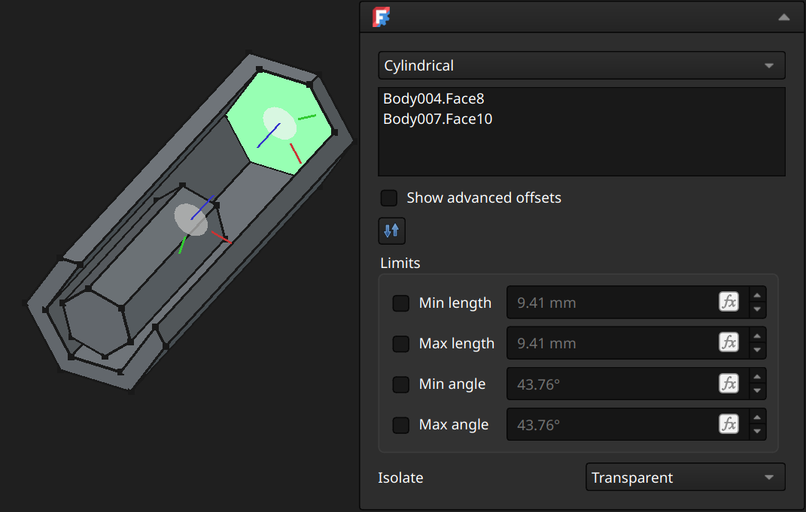

* **Up/down button**: !!Flips!! joint_FC's LCS_FC such that the normal points in the opposite direction.
* **Min length / Max length**: If enabled, restricts how far the two frames_FC can extend out in either direction.
* **Min angle / Max angle**: If enabled, restricts the rotational angle range.

```{note}
Options not described here are described in the parent section.
```

```{note}
There's a bug in 1.1.1 (and maybe other versions) where angles \< 180 or \> 180 roll over. Sometimes that's a problem because it can only target the interior angle range instead of the exterior angle range (or vice versa - I forget). You can workaround the bug by going into the joint_FC's properties and setting **Limits** → **Angle Min** / **Angle Max**.
```

```{note}
A core mistake people often make with joints_FC is thinking that they can be compounded. A joint_FC removes all but some options for movement. That's why if you try to place a sliding joint_FC and a revolute joint_FC on the same pair of objects, they cancel each other out.

* The sliding joint_FC cancels out all motion except moving up and down an axis.
* The revolute joint_FC cancels out all motion except revolving around an axis.

The sliding joint_FC won't let the revolute joint_FC revolve, and the revolute joint_FC won't let the sliding joint_FC slide. See [here](https://forum.freecad.org/viewtopic.php?t=105828).
```

`{ref} https://wiki.freecad.org/Assembly_CreateJointCylindrical`

### Ball Joint

`{bm} /(Assembly Workbench\/Joints\/Ball Joint)_TOPIC/i`

```{prereq}
Assembly Workbench/Joints/Grounded Joint_TOPIC
```

A ball joint_FC allows the movement of one component_FC relative to another component_FC so long as the center of those components_FC's frames_FC are touching.


To apply a ball joint_FC, either ...

* select two elements_FC (e.g., edge, face, vertex), one on each component_FC, and then select toolbar button 112(keyboard shortcut B).
* select toolbar button 12 (keyboard shortcut B), then select two elements_FC (e.g., edge, face, vertex), one on each component_FC.

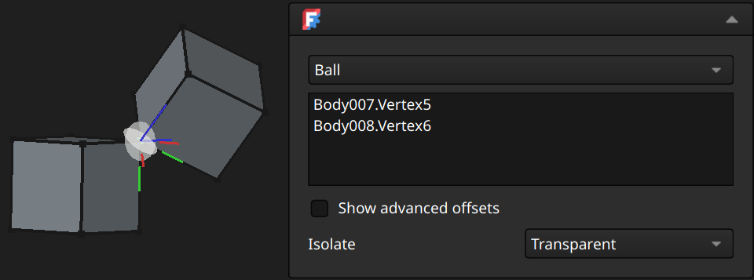

```{note}
Options not described here are described in the parent section.
```

`{ref} https://wiki.freecad.org/Assembly_CreateJointBall`

### Distance Joint

`{bm} /(Assembly Workbench\/Joints\/Distance Joint)_TOPIC/i`

```{prereq}
Assembly Workbench/Joints/Grounded Joint_TOPIC
```

A distance joint_FC allows the movement of one component_FC relative to another component_FC so long as the distance between them is some constant.


To apply a distance joint_FC, either ...

* select two elements_FC (e.g., edge, face, vertex), one on each component_FC, and then select toolbar button 13 (keyboard shortcut D).
* select toolbar button 13 (keyboard shortcut D), then select two elements_FC (e.g., edge, face, vertex), one on each component_FC.

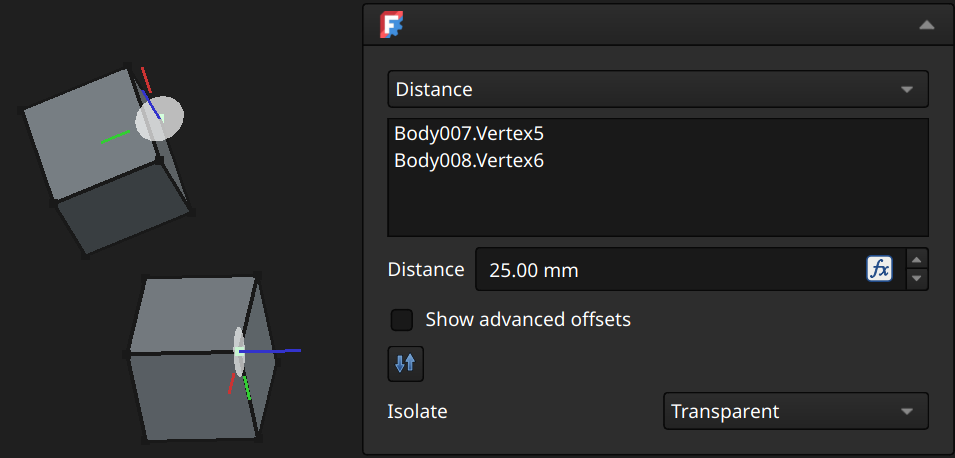

* **Distance**: Distance between frames_FC.
* **Up/down button**: !!Flips!! joint_FC's LCS_FC such that the normal points in the opposite direction.

```{note}
Options not described here are described in the parent section.
```

```{note}
There's a bug in 1.1.1 (and maybe other versions) where you have to select component_FC elements_FC in a certain order or certain way, otherwise this joint_FC won't work?
```

`{ref} https://wiki.freecad.org/Assembly_CreateJointDistance`

### Parallel Joint

`{bm} /(Assembly Workbench\/Joints\/Parallel Joint)_TOPIC/i`

```{prereq}
Assembly Workbench/Joints/Grounded Joint_TOPIC
```

A parallel joint_FC allows the movement of one component_FC relative to another component_FC so long as those components_FC's frames_FC have parallel planes.


To apply a parallel joint_FC, either ...

* select two elements_FC (e.g., edge, face, vertex), one on each component_FC, and then select toolbar button 14(keyboard shortcut N).
* select toolbar button 14 (keyboard shortcut N), then select two elements_FC (e.g., edge, face, vertex), one on each component_FC.

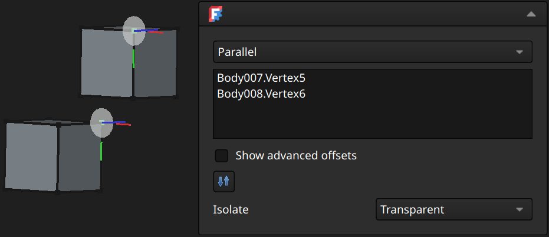

* **Up/down button**: !!Flips!! joint_FC's LCS_FC such that the normal points in the opposite direction.

```{note}
Options not described here are described in the parent section.
```

`{ref} https://wiki.freecad.org/Assembly_CreateJointParallel`

### Perpendicular Joint

`{bm} /(Assembly Workbench\/Joints\/Perpendicular Joint)_TOPIC/i`

```{prereq}
Assembly Workbench/Joints/Grounded Joint_TOPIC
```

A perpendicular joint_FC allows the movement of one component_FC relative to another component_FC so long as those components_FC's frames_FC have perpendicular planes.


To apply a perpendicular joint_FC, either ...

* select two elements_FC (e.g., edge, face, vertex), one on each component_FC, and then select toolbar button 15 (keyboard shortcut M).
* select toolbar button 15 (keyboard shortcut M), then select two elements_FC (e.g., edge, face, vertex), one on each component_FC.

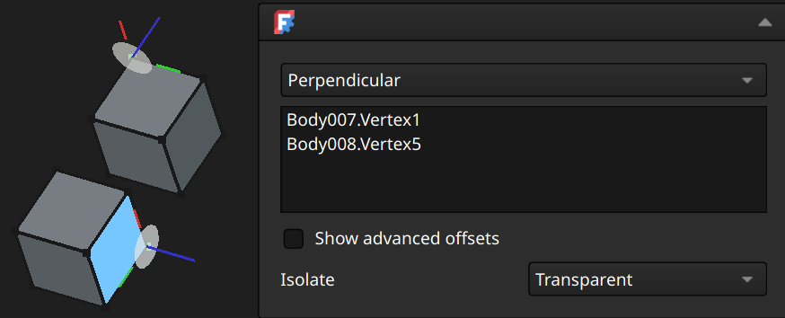

```{note}
Options not described here are described in the parent section.
```

`{ref} https://wiki.freecad.org/Assembly_CreateJointPerpendicular`

### Angle Joint

`{bm} /(Assembly Workbench\/Joints\/Angle Joint)_TOPIC/i`

```{prereq}
Assembly Workbench/Joints/Grounded Joint_TOPIC
```

An angle joint_FC allows the movement of one component_FC relative to another component_FC so long as those components_FC's frames_FC have normals at some constant angle.


To apply a angle joint_FC, either ...

* select two elements_FC (e.g., edge, face, vertex), one on each component_FC, and then select toolbar button 16 (keyboard shortcut X).
* select toolbar button 16 (keyboard shortcut X), then select two elements_FC (e.g., edge, face, vertex), one on each component_FC.

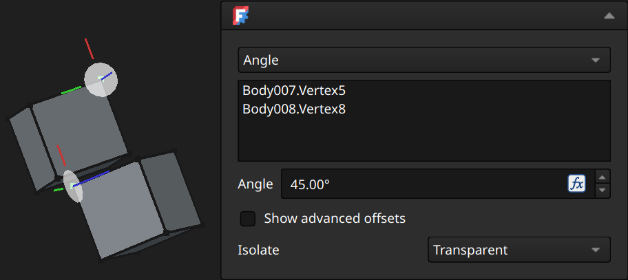

* **Angle**: Angle between the frame_FC normals.

```{note}
Options not described here are described in the parent section.
```

`{ref} https://wiki.freecad.org/Assembly_CreateJointAngle`

### Rack and Pinion Joint

`{bm} /(Assembly Workbench\/Joints\/Rack and Pinion Joint)_TOPIC/i`

```{prereq}
Assembly Workbench/Joints/Grounded Joint_TOPIC
Assembly Workbench/Joints/Revolute Joint_TOPIC
Assembly Workbench/Joints/Slider Joint_TOPIC
```

A rack and pinion joint_FC ties together a slider joint_FC and a revolute joint_FC, such that rotation of that revolve joint_FC results in sliding of the slider joint_FC and vice versa. This gives the impression of a cog/pinion moving across a rack.


Prior to applying a rack and pinion joint_FC, ensure that ...

1. there's a component_FC with a sliding joint_FC.
2. there's a component_FC with a revolute joint_FC.

To apply a rack and pinion joint_FC, either ...

* select two elements_FC (e.g., edge, face, vertex), one on each component_FC, and then select toolbar button 17 (keyboard shortcut Q).
* select toolbar button 17 (keyboard shortcut Q), then select two elements_FC (e.g., edge, face, vertex), one on each component_FC.

One element_FC must be on a component_FC that is sliding (e.g., the rack), while the second element_FC must be on the revolving component_FC (e.g., pinion). The normals of the 2 frames_FC must be perpendicular to each other  (*blue lines must be 90 degrees*).

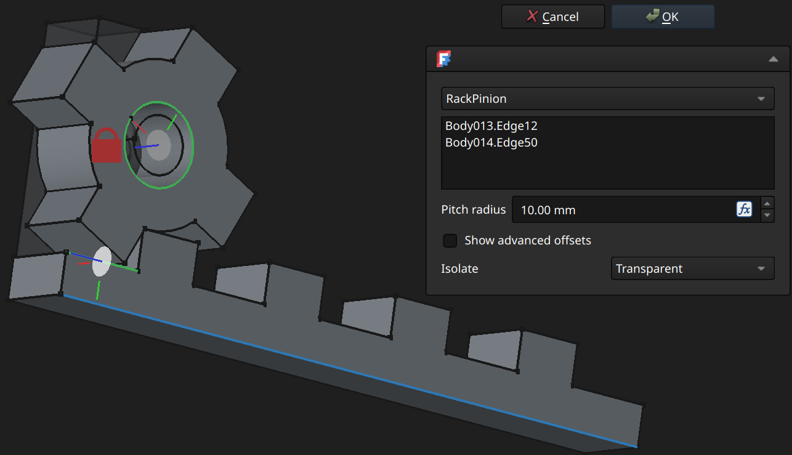

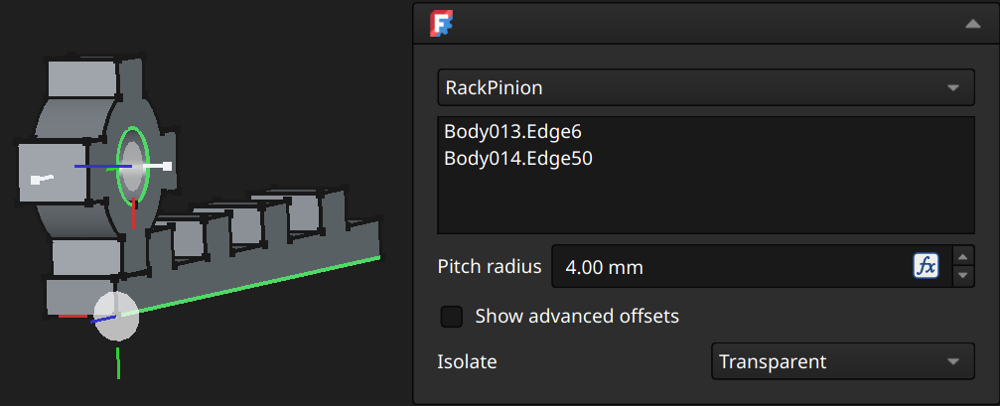

**Pitch radius**: The contact radius of the revolving component_FC against the rack component_FC.

```{note}
Options not described here are described in the parent section.
```

```{note}
If the pitch radius is 0, it'll crash once you try to move it? Noticed in FreeCAD 1.1.1.
```

```{note}
What does pitch / contact radius mean? Imagine you have a wheel with spokes rotating similar to the one in the example above, but the shape the sliding bar's indents were tapered down such that the teeth of the wheel can't fit all the way till they touch the bottom of the indent. The distance from the wheel's center to that touching point is the pitch radius.
```

```{note}
For effective use of this joint_FC type, you'll likely need to use helper geometry: Datum points_FC, datum planes_FC, local coordinate systems_FC, and sketch_FC elements_FC. Note the use of helper geometry in the second example screenshot above: The grounded joint_FC is a body_FC with nothing but a sketch_FC line on the z-axis and a sketch_FC line on the x-axis. The revolve joint_FC is using one of those lines as its revolving axis, and the slider joint_FC is using the other line as the sliding axis.
```

`{ref} https://wiki.freecad.org/Assembly_CreateJointRackPinion` `{ref} https://www.youtube.com/watch?v=hVuJGtUuzBc`

### Screw Joint

`{bm} /(Assembly Workbench\/Joints\/Screw Joint)_TOPIC/i`

```{prereq}
Assembly Workbench/Joints/Grounded Joint_TOPIC
Assembly Workbench/Joints/Revolute Joint_TOPIC
Assembly Workbench/Joints/Slider Joint_TOPIC
```

A screw joint_FC ties together a slider joint_FC and a revolute joint_FC, such that sliding the slider joint_FC revolves the revolute joint_FC. This gives the impression of a screw turning as it goes down.


Prior to applying a screw joint_FC, ensure that ...

1. there's a component_FC with a sliding joint_FC.
2. there's a component_FC with a revolute joint_FC rotating along the same axis that sliding is occurring on.

To apply a screw joint_FC, either ...

* select two elements_FC (e.g., edge, face, vertex), one on each component_FC, and then select toolbar button 18 (keyboard shortcut W).
* select toolbar button 18 (keyboard shortcut W), then select two elements_FC (e.g., edge, face, vertex), one on each component_FC.

One element_FC must be on a component_FC that the sliding joint_FC is sliding in/out of (e.g., screw !!hole!!), while the second element_FC must be on the revolving component_FC (e.g., screw). The normals of the 2 frames_FC must be pointing at each other (*blue lines must be facing each other*).

Once applied, sliding will also result in revolving.

```{note}
Not vice versa? Manual revolving doesn't seem to work?
```

```{note}
Unlike most other joints_FC, it looks like you have to actually apply this before you're able to slide and see the revolutions happening. If it hasn't been applied yet, it'll be locked?
```

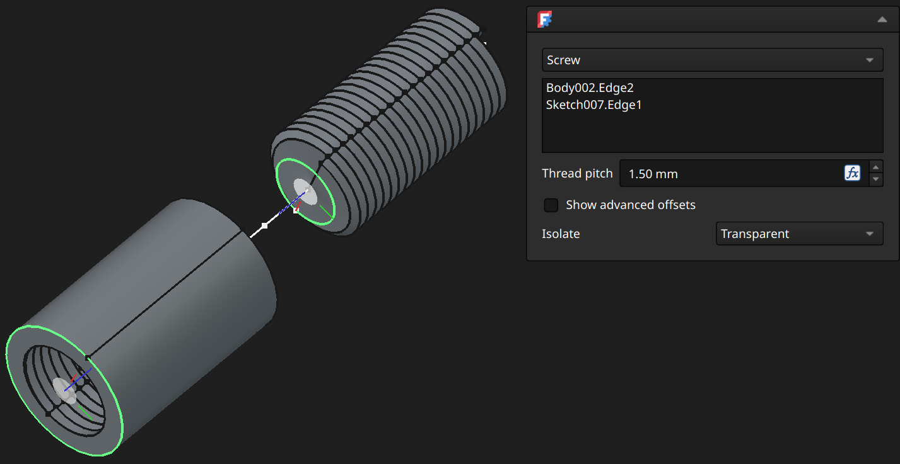

**Thread pitch**: The thread pitch of the revolving component_FC representing the screw (distance the screw advances in 1 full turn).

```{note}
Options not described here are described in the parent section.
```

```{note}
For effective use of this joint_FC type, you'll likely need to use helper geometry: Datum points_FC, datum planes_FC, local coordinate systems_FC, and sketch_FC elements_FC. Note the use of helper geometry in the example screenshot above: What's sliding in-and-out of the screw !!hole!! is a sketch_FC line, and the circle on the screw head is a sketch_FC circle placed on the face of the screw
```

`{ref} https://wiki.freecad.org/Assembly_CreateJointScrew` `{ref} https://www.youtube.com/watch?v=3O26-9ZFCg4` `{ref} https://www.youtube.com/shorts/iJmfQk553aA`

### Gear / Belt Joint

`{bm} /(Assembly Workbench\/Joints\/Gear \/ Belt Joint)_TOPIC/i`

```{prereq}
Assembly Workbench/Joints/Grounded Joint_TOPIC
Assembly Workbench/Joints/Revolute Joint_TOPIC
```

A gear / belt joint_FC ties two revolute joints_FC together, such that revolving one automatically revolves the other. This gives the impression of one gear moving another. A gear joint_FC revolves in opposite directions while a belt joint_FC revolves in the same direction.


Prior to applying a gear / belt joint_FC, ensure that there two components_FC each with a revolute joint_FC whose frame_FC normal points in the same direction / opposite direction. To apply a gear / belt joint_FC, either ...

* select two elements_FC - the element_FC that each component_FC has its revolve joint_FC on. Then, select toolbar button 19's drop-down and select either gear joint_FC (keyboard shortcut T) or belt joint_FC (keyboard shortcut L).
* select toolbar button 19's drop-down and select either gear joint_FC (keyboard shortcut T) or belt joint_FC (keyboard shortcut L). Then, select two elements_FC - the element_FC that each component_FC has its revolve joint_FC on.

```{note}
What happens if the frame_FC normals are in opposite directions? Will it rotate in the opposite direction when you intended it to rotate in the same direction?
```

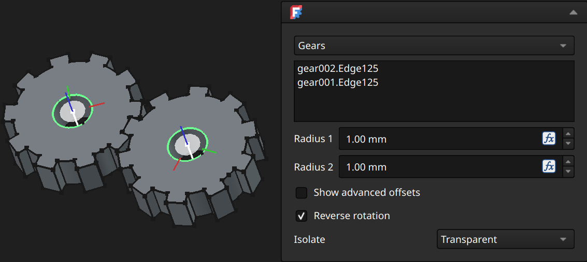

**Reverse rotation**: Swaps the joint_FC type between **Gears** and **Belt**. The only difference between them is if the direction is reversed

```{note}
Options not described here are described in the parent section.
```

```{note}
For effective use of this joint_FC type, you'll likely need to use helper geometry: Datum points_FC, datum planes_FC, local coordinate systems_FC, and sketch_FC elements_FC. Note the use of helper geometry in the example screenshot above: The two gears are each rotating around a sketch_FC line. Those 2 sketch_FC lines are on the same sketch_FC, which is in a body_FC that has a grounded joint_FC applied.
```

`{ref} https://wiki.freecad.org/Assembly_CreateJointGears` `{ref} https://wiki.freecad.org/Assembly_CreateJointBelt` `{ref} self`

## Exploded View

`{bm} /(Assembly Workbench\/Exploded View)_TOPIC/i`

```{prereq}
Assembly Workbench/User Interface_TOPIC
Assembly Workbench/Organization_TOPIC
Assembly Workbench/Joints_TOPIC
Standard Part_TOPIC
```

An exploded view_FC of an assembly_FC is the components_FC of that assembly_FC fanned out, for presentation purposes.

```{note}
One of the sources mentions that exploded views_FC are imported into the techdraw workbench_FC, where they can be further annotated and printed.
```


To create an exploded view_FC, select toolbar button 4 (keyboard shortcut E). An **!!Explode Views!!** pop-out will appear in addition to a **!!Exploded_Views**!! container. An assembly_FC can hold multiple exploded views_FC, all all of which live under that assembly_FC's single **!!Exploded_Views!!** container.

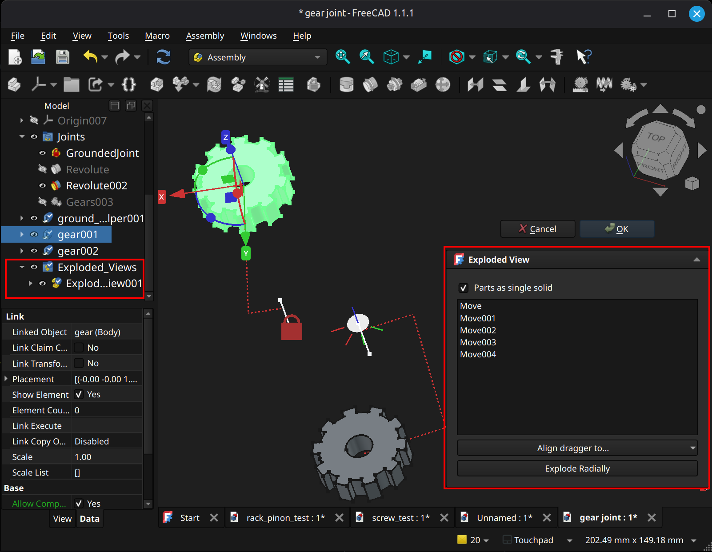

* The list within the **!!Exploded Views!!** pop-out is a sequence of move operations. There are multi ways to move:

  * Selecting a single component_FC in the 3D viewport exposes a gizmo which can move and rotate that component_FC. Each move on a component_FC generates a single "Move" item in the list along with a dashed red line tracing that move, as shown in the example above.

  * Selecting multiple components_FC in the 3D viewport exposes a single gizmo which can move and rotate those components_FC in tandem. Each move on the set of components_FC generates a single "Move" item in the list (e.g., even though multiple components_FC are being moved, a single "Move" item is generated) along with multiple dashed red line tracing the moves of the individual components_FC.

    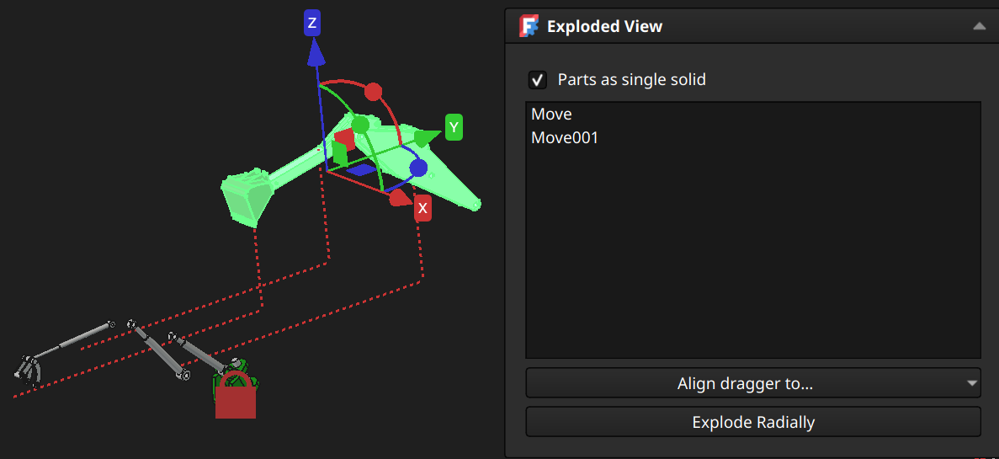

  * Clicking **Explode Radially** exposes a single gizmo at the center of the assembly_FC which can move and rotate all components_FC in tandem. Moving fans out the components_FC circularly. Each move on the set of components_FC generates a single "Move" item in the list (e.g., even though multiple components_FC are being moved, a single "Move" item is generated) along with multiple dashed red line tracing the moves of the individual components_FC.

    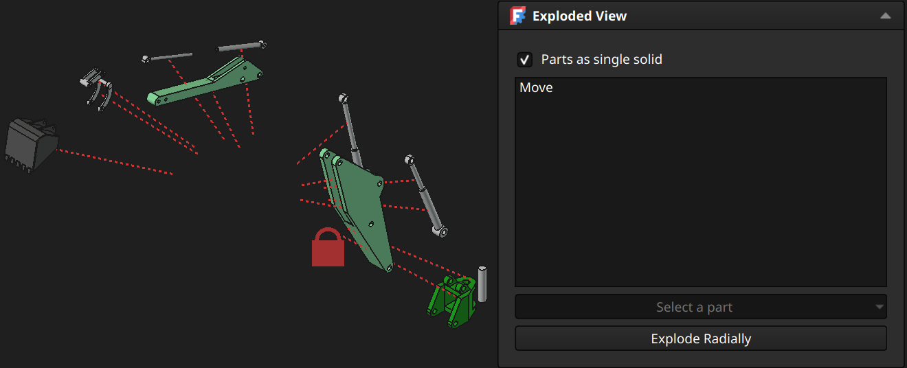 

* **Align dragger to...**: Moves the gizmo to a different location, such as the origin, center, or to a specific component_FC if multiple components_FC are selected for moving.

  ```{note}
  Moving to a different component_FC seems bugged in FreeCAD 1.1.1. It doesn't actually move, and if you look at the logs it keeps spamming `class 'TypeError'`.
  ```

* **Parts as a single solid**: Treats components_FC that are standard parts_FC as a single solid.

`{ref} https://wiki.freecad.org/Assembly_CreateView` `{ref} https://www.youtube.com/watch?v=3vGaiArjKko` `{ref} self`

## Bill of Materials

`{bm} /(Assembly Workbench\/Bill of Materials)_TOPIC/i`

```{prereq}
Assembly Workbench/User Interface_TOPIC
Assembly Workbench/Organization_TOPIC
Assembly Workbench/Joints_TOPIC
Standard Part_TOPIC
Spreadsheet Workbench_TOPIC
```

A bill of materials_FC (BOM_FC) of an assembly_FC is the list of that assembly_FC's components_FC as well as optionally its sub-components_FC, such as sub-assemblies_FC and the constituent pieces of a standard part_FC.


To create an BOM_FC, select toolbar button 6 (keyboard shortcut O). A **!!Bill of materials!!** pop-out will appear.

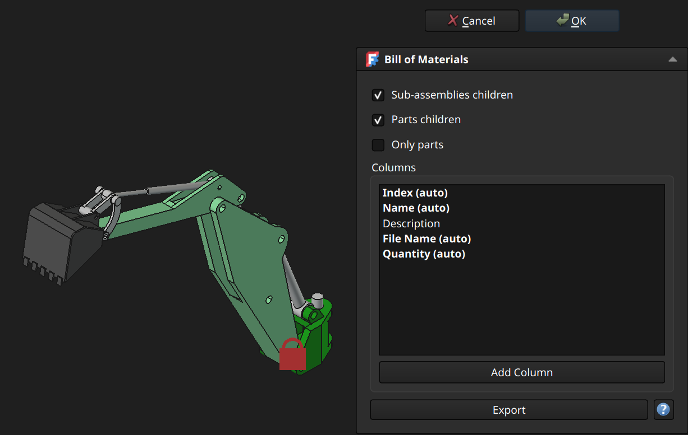

* **!!Sub-assemblies children!!**: If selected, includes children of sub-assemblies_FC in the BOM_FC.

* **Parts children**: If selected, includes children of standard parts_FC in the BOM_FC.

* **Only parts**: If selected, includes only standard parts_FC and sub-assemblies_FC in the BOM_FC, skipping other objects (e.g., bodies_FC).

* **Columns**: Columns to be included in the BOM_FC. New columns can be added by clicking the **Add Column** button, which injects a text field into the list to be filled out. A column will target an object property if it starts with with a period. For example, `.Visibility` pulls in the **Base.Visibility** property from each listed object's data properties.

  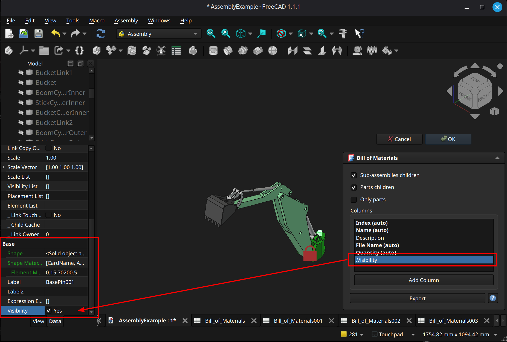

  ```{note}
  The example property above exists for nearly all 3D objects, found in the Model pane's data properties section. It might not appear because it's hidden - right-click and select "Show hidden" to see it.
  ```

  ```{note}
  I've tried targeting properties outside of **Base**. It doesn't seem to work. The only properties you can target seem to be those under **Base**. Note that you can inject custom properties by right-clicking in the properties and selecting **Add Property**, and then pull in that custom property to a BOM_FC column.
  ```

Clicking **OK** generates the spreadsheet_FC containing the BOM_FC. If the active object is an assembly_FC, the BOM_FC is generated for that assembly_FC under a **Bill_of_Materials** container. Otherwise, the BOM_FC is generated as a top-level objects for all assemblies_FC in the document (one BOM_FC covering all assemblies_FC).

Similarly, clicking **Export** saves the BOM_FC as a tab-separated text file (TSV).

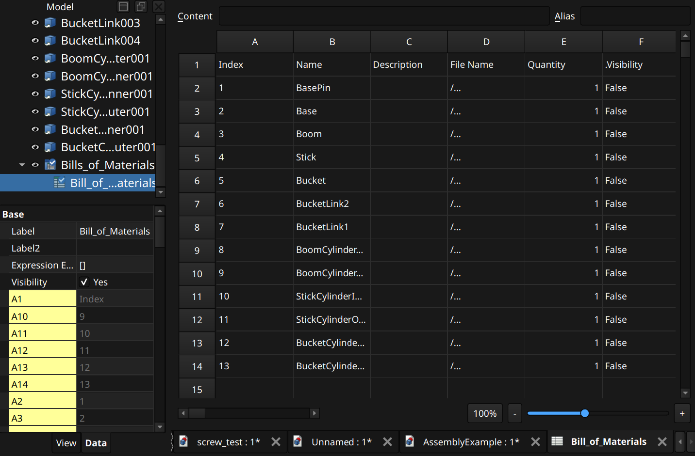

```{note}
The source says selected object, but I wrote active object. From experimentation I think it means active object. Selecting an assembly_FC that's not activated and generating a BOM_FC doesn't put that BOM_FC under the assembly_FC.
```

`{ref} https://wiki.freecad.org/Assembly_CreateBom` `{ref} self`

## Simulation

`{bm} /(Assembly Workbench\/Simulation)_TOPIC/i`

```{prereq}
Assembly Workbench/User Interface_TOPIC
Assembly Workbench/Organization_TOPIC
Assembly Workbench/Joints_TOPIC
Spreadsheet Workbench/Expressions_TOPIC
```

A simulation_FC updates the motion state of one or more of an assembly_FC's joints_FC across some duration of time, resulting in !!simulated!! movement. The motion state of the joint_FC is a function of time elapsed (e.g., for a duration of 5 seconds, a revolute joint_FC's angle should be `5*time`).


To create an simulation_FC, select toolbar button 7 (keyboard shortcut V). A simulation_FC gets placed under the assembly_FC's **!!Simulations!!** container and a **!!Simulations!!** pop-out will appear.

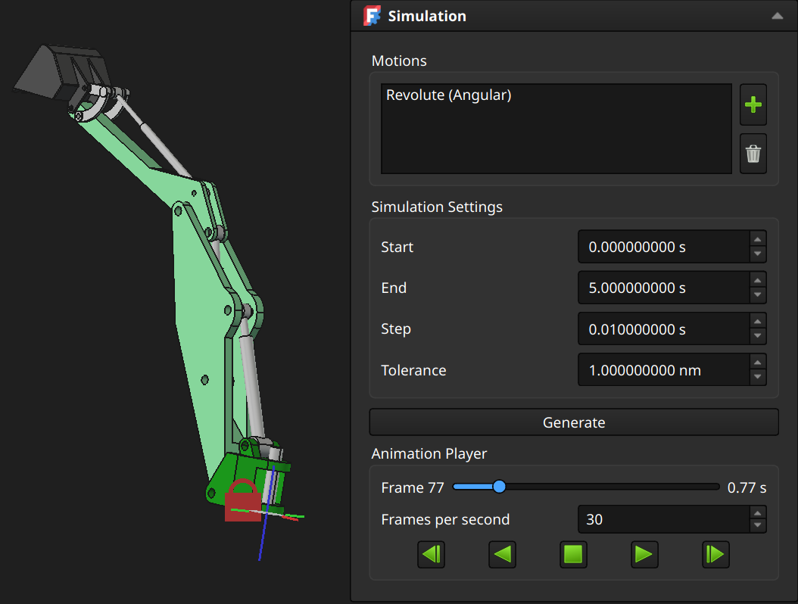

* **Motions**: The joints_FC to which motion are to be applied to. To add a joint_FC, use the green plus button to open a selection pop-out.

  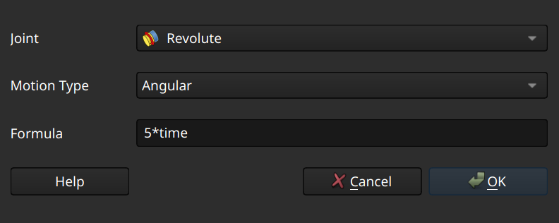

  Use **!!Joint!!** to target the joint_FC to apply motion to, and **Motion type** to apply the target the type of motion. Some joints_FC !!support!! multiple types of motion (e.g., a cylindrical joint_FC !!supports!! both sliding and rotating), but most joints_FC only !!support!! one type of motion.

  **Formula** is the expression used to update the motion state of the joint_FC. The motion is a function of time elapsed across a duration (e.g., for a duration of 5 seconds, a revolute joint_FC's angle should be `5*time`). The **Help** button extends the pop-out to give examples of formulas.

* **!!Simulation!! Settings**: The duration and cadence across which motion occurs:

  **Start** / **Stop**: Duration, specified as a start and stop time.
  **Step**: How often to update the motion state (e.g., if the duration is 5s and the step value is 1s, the motion's state will be updated once a second).

  ```{note}
  What is **Tolerance**? I'm not sure. AI is saying that it's the tolerance of the assembly workbench_FC's numerical solver - how close it has to get to solution before it considers it solved. I couldn't find anything in the documentation or forums corroborating this.

  Best not to mess with the default.
  ```

Once **Motions** and **!!Simulation!! Settings** have been defined, the **Generate** button produces an animation scrubber that can be used to play and scrub through the simulation_FC. Updates to **Motion** and / or **!!Simulation!! Settings** require the **Generate** button to be pressed again for the scrubber to update.

```{note}
Simulations_FC are still very finicky in FreeCAD 1.1.1. Here's what I've experienced so far...

* segfaults.
* if you select conflicting joints_FC for motion, the simulation_FC seems to lockup / do nothing instead of showing an error.
* sometimes, clicking **Generate** will cause an error saying that it failed but the scrubber still shows up.  This may be because the motion being applied goes past the limits of the joint_FC (e.g., revolute joint_FC has a certain min/max angle set, but the simulation_FC exceeds it).
```

`{ref} https://wiki.freecad.org/Assembly_CreateSimulation` `{ref} self`

# Datum Geometry

`{bm} /(Datum Geometry)_TOPIC/i`

```{prereq}
Sketcher Workbench/Sketching/Construction Geometry_TOPIC
```

Datum geometry_FC are helper primitives typically used to position other objects (e.g., sketches_FC, features_FC, bodies_FC in an assembly_FC), similar to construction geometry_FC in sketches_FC. Datum geometry_FC aren't unique to a specific workbench_FC.

Datum geometry_FC can inserted using the toolbar button next to the button that creates a new standard part_FC.

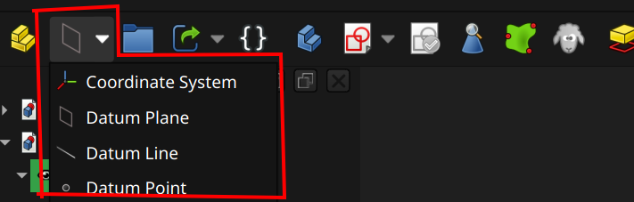

`{ref} https://wiki.freecad.org/Datum`

## Datum Point

`{bm} /(Datum Geometry\/Datum Point)_TOPIC/i`

A datum point_FC commonly needs one or more objects to define its attachment / positioning (e.g., faces, lines, vertices). To insert a datum point_FC, either ...

* select the objects to attach the datum point_FC to, then select the Datum Point_FC toolbar button.
* deselect everything, select the Datum Point_FC toolbar button, then individually reference objects in the Attachment pane pop-up by clicking a Reference button and selecting the entity.


The **Attachment mode** parameter defines what types of objects are needed for positioning / attachment (hovering over an option describes what it does as well as !!supported!! reference types). Once attached, the **Attachment offset** parameters tweak the position by offsetting and a rotation.

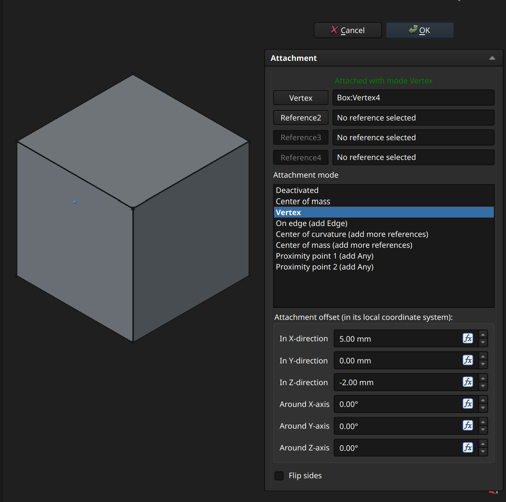

The example above attaches the datum point_FC to a vertex and then positionally offsets itself.

```{note}
One thing I found that might be useful for the future:

1. Attach to the datum point_FC to an edge (and nothing else) and set **Attachment mode** to **On edge**.
2. Click OK to finish placing the datum point_FC.
3. Select the datum point_FC, right-click in the Properties pane, and enable **Show hidden**.
4. Set the **Map Path Parameter** to move the point along the line (between 0 to 1).

Why does this matter? I wanted to use this to appropriately position a helix_FC, but it didn't work out. You can use two datum points_FC to make a datum line_FC, but a datum line_FC is infinite (it doesn't have a start/stop). Furthermore, FreeCAD currently doesn't let you further put a datum point_FC on that datum line_FC. The idea I had was to use datum points_FC to create a datum line_FC, then place a datum point_FC on that datum line_FC to act as the center point for a datum plane_FC. The datum plane_FC's normal would be defined with another datum line_FC that's 90 degrees to the first datum line_FC.

ChatGPT instead suggested I place a sketch_FC on the face with ...

* a point for the center of the helix_FC rotation axis.
* a horizontal line from the point.
* a vertical line from the point.

Then, create a new datum plane_FC and use the center point as reference 1, the horizontal line as reference 2, and the vertical line as reference 3, and **Align O-X-Y** as the **Attachment mode**. You can then attach a sketch_FC to that datum plane_FC and the origin will be the center point.
```

`{ref} https://wiki.freecad.org/Part_DatumPoint`

## Datum Line

`{bm} /(Datum Geometry\/Datum Line)_TOPIC/i`

```{prereq}
Datum Geometry/Datum Point_TOPIC
```

A datum line_FC typically needs one or more objects to define its attachment / positioning (e.g., faces, lines, vertices). To insert a datum line_FC, either ...

* select the objects to attach the datum line_FC to, then select the Datum Line_FC toolbar button.
* deselect everything, select the Datum Line_FC toolbar button, then individually reference objects in the Attachment pane pop-up by clicking a Reference button and selecting the entity.


The **Attachment mode** parameter defines what types of objects are needed for positioning / attachment (hovering over an option describes what it does as well as !!supported!! reference types). Once attached, the **Attachment offset** parameters tweak the position by offsetting and a rotation.

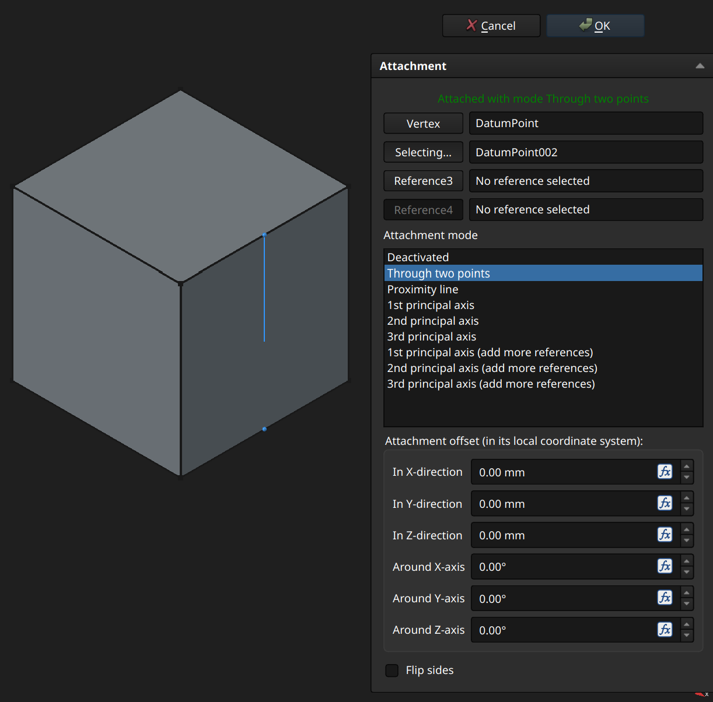

The example above attaches the datum line_FC to 2 datum points_FC, defining that line.

```{note}
In the 3D viewport, the line doesn't extend all the way to the second point. That's likely because a datum line_FC is unbounded and should be treated more like an axis than a line that starts/stops at specific points?
```

`{ref} https://wiki.freecad.org/Part_DatumLine`

### Datum Plane

`{bm} /(Datum Geometry\/Datum Plane)_TOPIC/i`

```{prereq}
Datum Geometry/Datum Point_TOPIC
Datum Geometry/Datum Line_TOPIC
```

A datum plane_FC needs one or more objects to define its attachment / positioning (e.g., faces, lines, vertices). To insert a datum line_FC, either ...

* select the objects to attach the datum plane_FC to, then select the Datum Plane_FC toolbar button.
* deselect everything, select the Datum Plane_FC toolbar button, then individually reference objects in the Attachment pane pop-up by clicking a Reference button and selecting the entity.


The **Attachment mode** parameter defines what types of objects are needed for positioning / attachment (hovering over an option describes what it does as well as !!supported!! reference types). Once attached, the **Attachment offset** parameters tweak the position by offsetting and a rotation.

```{note}
There are lots of attachment modes, but it seems the align ones are the simplest to use.
```

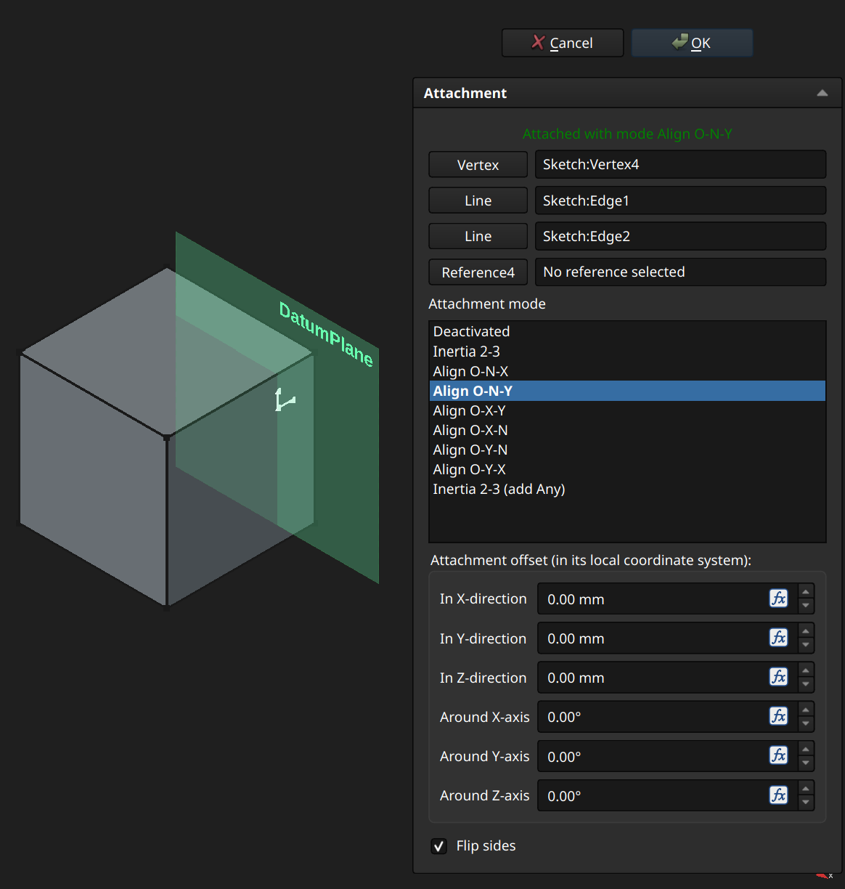

The example above attaches the datum plane_FC to a vertex (origin) and 2 edges (normal vector and Y vector), defining that plane.

`{ref} https://wiki.freecad.org/Part_DatumPlane`

### Local Coordinate System

`{bm} /(Datum Geometry\/Local Coordinate System)_TOPIC/i`

```{prereq}
Datum Geometry/Datum Point_TOPIC
Datum Geometry/Datum Line_TOPIC
Datum Geometry/Datum Plane_TOPIC
```

A local coordinate system_FC is a !!frame!! of reference, defining it's own origin and basis axes relative to the parent origin and basis axes. A local coordinate system_FC needs one or more objects to define its attachment / positioning (e.g., faces, lines, vertices). To insert a datum line_FC, either ...

* select the objects to attach the datum plane_FC to, then select the Datum Plane_FC toolbar button.
* deselect everything, select the Datum Plane_FC toolbar button, then individually reference objects in the Attachment pane pop-up by clicking a Reference button and selecting the entity.


Many objects come with their own builtin local coordinate system_FC (e.g., a prism may have its own local coordinate system_FC, where the vertexes of the prism are defined related to that local coordinate system_FC). Objects may also be attached to local coordinate system_FC (or some other object with a builtin local coordinate system_FC), such that their position and/or orientation are relative to the local coordinate system_FC (**Attachment Mode** property). `{ref} https://wiki.freecad.org/Part_CoordinateSystem` `{ref} https://www.youtube.com/watch?v=BxcHS0GLdKg`

# Standard Part

`{bm} /(Standard Part)_TOPIC/i`

```{prereq}
User Interface Layout_TOPIC
Datum Geometry/Local Coordinate System_TOPIC
```

A standard part_FC is a container that holds multiple 3D objects (e.g., bodies_FC, assemblies_FC), treating the collection of 3D objects as a single unit. A standard part_FC has its own local coordinate system_FC so that objects within it are positioned and rotated relative to that local coordinate system_FC, but externally the standard part_FC (and everything within it) is moveable and rotatable as a single unit.

Standard parts_FC aren't unique to a specific workbench_FC.


To create a standard part_FC, use toolbar button 1. Objects can be moved in to / out of the standard part_FC by dragging them within the Model pane.

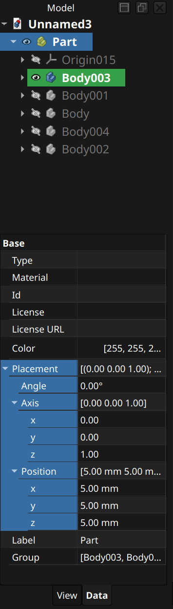

`{ref} https://wiki.freecad.org/Std_Part` `{ref} self`

# Standard Group

`{bm} /(Standard Group)_TOPIC/i`

```{prereq}
User Interface Layout_TOPIC
```

A standard group_FC is a general purpose container that holds multiple objects of any type (e.g., spreadsheets_FC, bodies_FC, standard parts_FC). Standard groups_FC are typically used to hierarchically organize objects together, similar to a files and folders in a filesystem.

Standard groups_FC aren't unique to any specific workbench_FC.


To create a standard group_FC, use the toolbar button that's immediately to the right of toolbar button 2 (folder icon). Objects can be moved in to / out of the standard group_FC by dragging them within the Model pane.

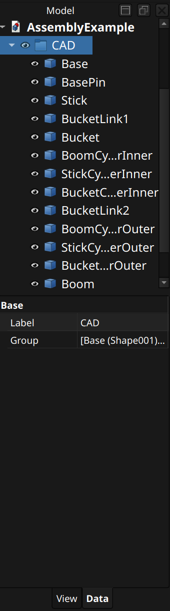

`{ref} https://wiki.freecad.org/Std_Group` `{ref} self`

# App Link

`{bm} /(App Link)_TOPIC/i`

```{prereq}
User Interface Layout_TOPIC
Part Design Workbench_TOPIC
```

An app link_FC is an object that links to another object, intended to efficiently duplicate a single object multiple times.

App links_FC aren't unique to any specific workbench_FC.


To create an app link_FC, use the toolbar button that's 2 to the right of toolbar button 2 (rounded rectangle with green arrow icon). An app link_FC inherits the referenced object's icon and adds a small arrow to lower left to identify that it's an app link_FC. It's Data properties will also contain a **Link** section, objects that are all links_FC have 

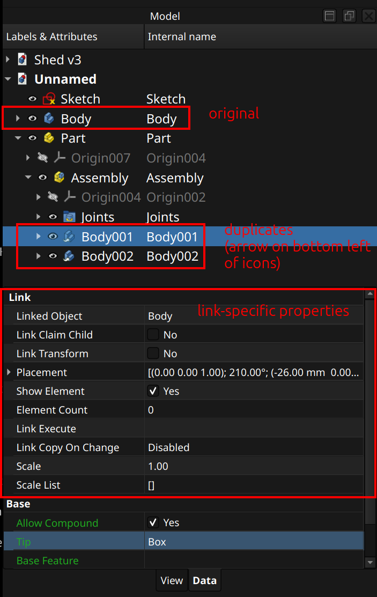

* **Linked Object**: Object being referenced by this app link_FC.

* **Link Transform**: Flag controlling whether to inherit **Linked Object**'s **Placement** as this app link_FC's **Placement**.

  * When true, inherit's **Linked Object**'s **Placement** as this app link_FC's **Placement** and instead exposes a **Link Placement** property in its place.
  * When false, overrides **Linked Object**'s **Placement** with its own **Placement** property.

* **!!Element!! Count** and **Show !!Element!!**: The number of duplicates produced by this app link_FC and how they're presented in the hierarchy.

  * When **!!Element!! Count** == 0, **Linked Object** is duplicated exactly once and this app link_FC's children will mirror **Linked Object**'s children.
  * When **!!Element!! Count** > 0 and **Show !!Element!!** is true, **Linked Object** is duplicated **!!Element!! Count** times and this app link_FC will have **!!Element!! Count** children where each child is a link to **Linked Object**.
  * When **!!Element!! Count** > 0 and **Show !!Element!!** is false, **Linked Object** is duplicated **!!Element!! Count** times and this app link_FC will have a single child linking to **Linked Object**.

* **Link Execute**: Python function to run anytime the link is recomputed.

* **Link Copy On Change**: Copy-on-write behavior.

  * When **Disabled**, this app link_FC acts as a link: Changes to **Linked Object** are reflected in this app link_FC and vice versa.
  * When **Enabled**, this app link_FC acts as a link until it's changed: Changes to **Linked Object** are reflected in this app link_FC until a "CopyOnChange" property is updated on this app link_FC, at which point **Link Copy On Change** switches to **Owned** (changes to copied instead of linked). To mark/unmark a property as "CopyOnChange", right-click on it within the Model pane's Data panel, navigate to **Status**, and either select or unselect **CopyOnChange**. 
  * When **Owned**, this app link_FC is a deep copy of **Linked Object** rather than a link.
  * When **Tracked**, this app link_FC is a deep copy of **Linked Object** rather than a link but attempts to keep non-modified properties in sync with future edits made to **Linked Object**.

* **Scale**: Uniform scaling factor that applies to all duplicates.

* **Scale List**: Per-axis scaling factor applied to each duplicate of **!!Element!! Count** (e.g., x scaling, y scaling, z, scaling). Only applicable if **!!Element!! Count** > 0.

```{note}
Important thing to remember is that app links_FC have their own position and visibility. At the top-level, you can position a duplicate and the original independently, and you can independently change make them visible / invisible. Outside of the top-level, this may not apply. For example, if you've created an app link_FC to a part design_FC body_FC, changing the visibility of a feature_FC within that body_FC reflects in all duplicates.
```

`{ref} https://wiki.freecad.org/App_Link` `{ref} https://wiki.freecad.org/Std_LinkMake`

# Variable Sets

`{bm} /(Variable Sets)_TOPIC/i`

# Quality-of-Life Settings

`{bm} /(Quality-of-Life Settings)_TOPIC/i`

The following sections highlight several settings to improve quality-of-life.

**Enable dark mode**:

The following instructions enable dark mode.

1. Go to **Edit** → **Preferences** → **General** → **General** and set **Theme** to **FreeCAD Dark**.

`{ref} self`

**Easier selections using trackpad**

The following instructions make it easier to select items using a trackpad, where you don't have the same level of precision as a mouse.

1. Go to **Edit** → **Preferences** → **Display** → **3D View** and set **Marker size** to **11 px**.
2. Go to **Edit** → **Preferences** → **General** → **Selection** and set **Radius** to **11 px**.
3. Go to **Edit** → **Preferences** → **Sketcher_FC** → **Appearance** and set all line widths to **4 px** (these seem to just be for elements_FC, not constraints_FC?).
4. Go to **Edit** → **Preferences** → **Part Design_FC** → **Shape Appearance** and set **Vertex Size** to **9 px** (can't seem to go till 11).
5. Go to **Edit** → **Preferences** → **Part Design_FC** → **Shape Appearance** and set **Line Width** to **4 px**.

**Rotate at point**

The following instructions make it so that rotation happens at where your mouse cursor is at, not at the viewport center.

1. Go to **Edit** → **Preferences** → **Display** → **Navigation** → **Navigation** and set **Rotation mode** to **Drag at cursor**.

**Less lost work**

The following instructions make it so that auto-recovery saves happen much more frequently.

1. Go to **Edit** → **Preferences** → **General** → **Document** → **Storage** and set **Save auto-recovery information every** to something short (e.g., 1 minute).
2. Go to **Edit** → **Preferences** → **General** → **Document** → **Storage** and set **Maximum number of backup files to keep when resaving documents** to something large (e.g., 50 or 100).

`{ref} self`

# Development Environment

`{bm} /(Development Environment)_TOPIC/i`

1. Install podman and distrobox.

1. Create distrobox container:

   ```
   distrobox create \
      --root \
      --name freecad-dev \
      --image quay.io/toolbx/ubuntu-toolbox:25.04 \
      --home "$HOME/Distrobox_Homes/freecad-dev" \
      --additional-flags "--cap-add=SYS_PTRACE --security-opt seccomp=unconfined --security-opt apparmor=unconfined
   ```

1. Enter distrobox container:

   ```
   distrobox enter \
      --root \
      --name freecad-dev \

   cd ~
   ```

1. Install pixi:

   ```
   curl -fsSL https://pixi.sh/install.sh | bash
   exec "$SHELL"
   ```

1. Clone, configure, build, and test:

   ```
   `git clone https://github.com/FreeCAD/FreeCAD.git`
   cd FreeCAD
   pixi run configure
   pixi run build
   pixi run test
   pixi run freecad
   ```

1. Install  and configure CLion:

   1. Install CLion.

   1. Create pixi-clion.sh:

      ```
      #!/usr/bin/env bash
      eval "$(pixi shell-hook --manifest-path /absolute/path/to/FreeCAD)"
      ```

   1. Launch CLion though pixi:
     
      ```
      pixi run ~/clion/bin/clion .  # Opens freecad in clion
      ```

   1. Go to "Settings" → "Build, Execution, Deployment" → "Toolchains", select "Add environment"  → "From file", and select "pixi-clion.sh" as the file.

   1. Go to "Settings" → "Build, Execution, Deployment" → "CMake", enable "Conda Debug", and disable all other profile

```{note}
Once everything's been set up, the easiest way to debug is to launch FreeCAD via "pixi run freecad" and then attach to the running process within CLion.
```

`{ref} self`

# Macro Ideas

## Boolean Union Lineup

Given two bodies_FC A and B, this script helps position body_FC B when union'd onto body_FC A. Both body_FC A and body_FC B should have a local coordinate system_FC positioned and oriented at the attachment point. The macro will translate and rotate body_FC B such that its LCS_FC matches body_FC A's LCS_FC.

This script assumes flat faces from body_FC A and body_FC B will be "kissing" when the local coordinate system_FCs line up. This might be a problem if floating point rounding error causes FreeCAD to see a gap between the faces (see [here](https://forum.freecad.org/viewtopic.php?p=891702#p891702)).


```python
import FreeCAD as App
import FreeCADGui as Gui

doc = App.ActiveDocument
sel = Gui.Selection.getSelection()

if len(sel) != 2:
    raise Exception("Select exactly two LCS objects: first A_LCS, second B_LCS")

a_lcs = sel[0]
b_lcs = sel[1]

# Find the Body that owns B_LCS
b_body = b_lcs.getParentGeoFeatureGroup()
if b_body is None:
    raise Exception("Could not find Body containing B_LCS")

# Global placement of target LCS on A
a_lcs_global = a_lcs.getGlobalPlacement()

# Global placement of source LCS on B, before moving B
b_lcs_global = b_lcs.getGlobalPlacement()

# Global placement of B Body, before moving it
b_body_global = b_body.getGlobalPlacement()

# Transform needed to move B_LCS onto A_LCS
delta = a_lcs_global.multiply(b_lcs_global.inverse())

# Apply same transform to B Body
b_body_new_global = delta.multiply(b_body_global)

# Convert back to local placement if B Body has a parent container
parent = b_body.getParentGeoFeatureGroup()
if parent is not None:
    parent_global = parent.getGlobalPlacement()
    b_body.Placement = parent_global.inverse().multiply(b_body_new_global)
else:
    b_body.Placement = b_body_new_global

doc.recompute()

print("Moved B Body so B_LCS matches A_LCS")
```

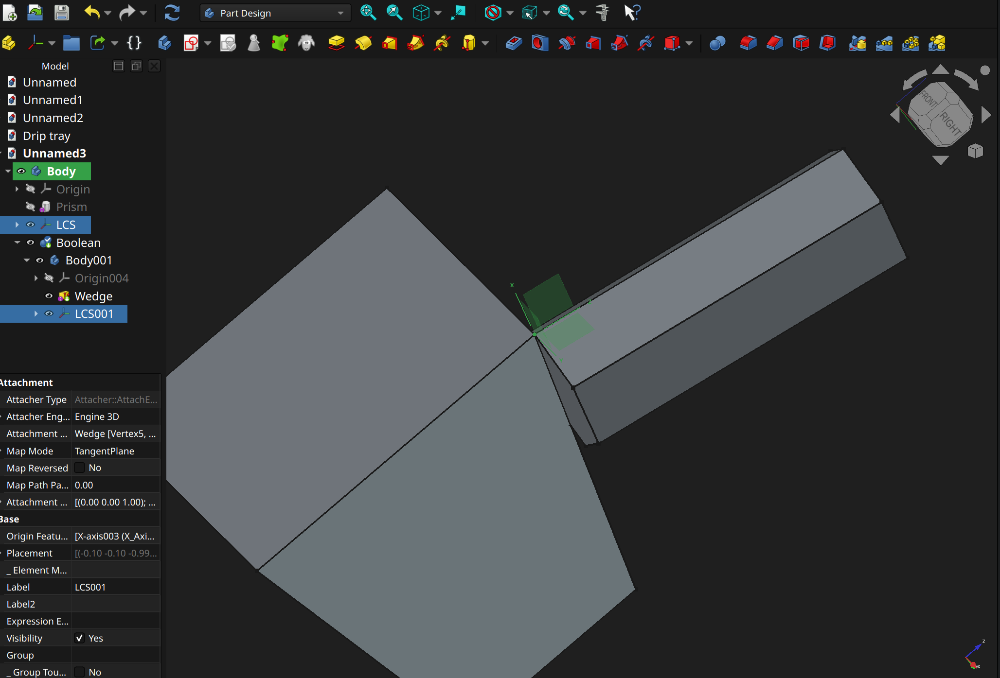

* drop a datum plane_FC cutting through a plane

  why is this useful?
  this is useful for doing things like mirror pattern of a feature_FC, when your sketch_FC isn't centered at the origin and oriented to one of the basis axes.

  1. sketch_FC on face
  2. pull in edges of face as construction geometry_FC on sketch_FC
  3. drop 3 points on sketch_FC in L shape, constrain them so that they're 1mm away from each other
  4. constrain middle point, lock to origin using horizontal and vertical dimension
  5. exit sketch_FC
  6. insert datum plane_FC that references the 3 points in the sketch_FC, select attachment mode of "Align O-Y-N" or "Align O-N-Y"
  7. user may have to go into sketch_FC and adjust L points !!based!! on where they want the datum plane_FC to be positioned exactly

* drop a datum line_FC matching a face's normal

  why is this useful?
  this is useful for doing things like polar pattern of a feature_FC when your sketch_FC isn't centered at the origin and oriented to one of the basis axes.
  this is useful if you want to attach two bodies_FC together (via boolean), where the body_FC being attached needs to be positioned - you can place the point and datum line_FC somewhere, and then reference it in the body_FC's transformation properties

  1. sketch_FC on face
  2. pull in edges of face as construction geometry_FC on sketch_FC
  3. drop point on sketch_FC, lock to origin using horizontal and vertical dimension
  4. exit sketch_FC
  5. insert datum line_FC that references sketch_FC's point and face, select attachment mode as "normal to surface
  6. user will have to go into sketch_FC and adjust point !!based!! on where they want the datum line_FC to protrude from

# Terminology

* `{bm} FreeCAD` - A parametric 3D computer-aided design / modeling tool. `{ref} https://www.freecad.org/`

* `{bm} /(workbenches|workbench)_FC/i` - A set of tools, commands, views, panels, and workflows within FreeCAD grouped together for a particular type of design (e.g., spreadsheet workbench_FC). `{ref} https://wiki.freecad.org/Workbenches`

  `{bm-error} Did you mean to add _FC here? If not, wrap in !!/(workbenches|workbench)|/i`

* `{bm} spreadsheet workbench/(spreadsheet workbench)_FC/i` `{bm} /(spreadsheets?)_FC/i` - A FreeCAD workbench_FC that allows creating and editing of !!spreadsheets!!, similar to Excel or LibreOffice Calc. Spreadsheets_FC are intended for parameterization of models and extraction of model parameters. `{ref} https://wiki.freecad.org/Spreadsheet_Workbench`

  `{bm-error} You added _FC to the wrong part. Add after workbench/(spreadsheet_FC workbench)/i`
  `{bm-error} Did you mean to add _FC here? If not, wrap in !!/(spreadsheet workbench)/i`
  `{bm-error} Did you mean to add _FC here? If not, wrap in !!/(spreadsheets?)/i`

* `{bm} sketcher workbench/(sketcher workbench|sketcher)_FC/i` `{bm} /(sketches|sketching|sketch)_FC/i` - A workbench_FC that allows creating and editing of 2D !!sketches!!. !!Sketches!! typically go on to be used to build out 3D features_FC within the part design workbench_FC. The !!sketcher workbench!! is often just referred to as the !!sketcher!!. `{ref} https://wiki.freecad.org/Sketcher_Workbench`

  `{bm-error} You added _FC to the wrong part. Add after workbench/(sketcher_FC workbench)/i`
  `{bm-error} Did you mean to add _FC here? If not, wrap in !!/(sketcher workbench|sketcher)/i`
  `{bm-error} Did you mean to add _FC here? If not, wrap in !!/(sketches|sketching|sketch)/i`

* `{bm} element/(elements?)_FC/i` - A geometric building block.

  * For a 3D model, examples of !!elements!! include vertices, lines, and faces.
  * For a 2D sketch_FC, examples of !!elements!! include points, lines, arcs, and splines.

  Some !!elements!! may contain !!sub-elements!!. For example, a sketch_FC line has two points.
  
  `{ref} https://wiki.freecad.org/Basic_Sketcher_Tutorial` `{ref} self`

  `{bm-error} Did you mean to add _FC here? If not, wrap in !!/(elements?)/i`

* `{bm} constraint/(constraints?|constraining|constrained)_FC/i` - A definition of an element_FC's measurement, either directly (e.g., 5mm radius for an arc) or as a relationship (e.g., line 1's slope must be perpendicular to line 2's slope). `{ref} https://wiki.freecad.org/Basic_Sketcher_Tutorial`

  `{bm-error} Did you mean to add _FC here? If not, wrap in !!/(constraints?|constraining|constrained)/i`

* `{bm} reference constraint/(reference constraints?)_FC/i` - A constraint_FC that's rendered in the sketch_FC but unenforced. `{ref} https://forum.freecad.org/viewtopic.php?t=23535` `{ref} https://wiki.freecad.org/Sketcher_ToggleDrivingConstraint`

  `{bm-error} Did you mean to add _FC here? If not, wrap in !!/(reference constraints?)/i`

* `{bm} driving constraint/(driving constraints?)_FC/i` - A constraint_FC that's enforced (as opposed to a reference constraint_FC, which is unenforced). `{ref} https://wiki.freecad.org/Sketcher_ToggleDrivingConstraint`

  `{bm-error} Did you mean to add _FC here? If not, wrap in !!/(driving constraints?)/i`

* `{bm} auto constraints/(auto\s?constraints?)_FC/i` - When creating an element_FC, if the placement of some part of that element_FC ends on an existing element_FC, an auto constraint_FC may be applied. An auto constraint_FC is a constraint_FC that's automatically added by virtue of how the elements_FC end up together. `{ref} https://wiki.freecad.org/Sketcher_Workbench#Drawing_aids`

  `{bm-error} Did you mean to add _FC here? If not, wrap in !!/(auto\s?constraints?)/i`

* `{bm} On-View-Parameters/(On-View-Parameters|On-View-Params)_FC/i` - For certain element_FC creation tools, !!On-View-Parameters!! allows explicitly adding constraints_FC during the creation process by presenting input fields alongside the element_FC's preview. `{ref} https://wiki.freecad.org/Sketcher_Workbench#Drawing_aids`

  `{bm-error} Did you mean to add _FC here? If not, wrap in !!/(On-View-Parameters|On-View-Params)/i`

* `{bm} continue mode/(continue mode|continuous mode)_FC/i` - Does not exit an element_FC / constraint_FC creation tool once the element_FC has been created, allowing multiple such elements_FC / constraints_FC to be created many times over. `{ref} https://wiki.freecad.org/Sketcher_Workbench#Drawing_aids`

  `{bm-error} Did you mean to add _FC here? If not, wrap in !!/(continue mode|continuous mode)/i`

* `{bm} under-constrained/(under[\s\-]?constrained)_FC/i` - A sketch_FC is said to be !!under-constrained!! if there exists at least 1 element_FC which has at least 1 degree of freedom_FC (e.g., it can move freely horizontally, it can move freely vertically, it can rotate freely around a point). `{ref} https://www.reddit.com/r/FreeCAD/comments/1ivu9lm/newbie_question_on_underconstrained/`

  `{bm-error} Did you mean to add _FC here? If not, wrap in !!/(under[\s\-]?constrained)/i`

* `{bm} fully constrained/(fully[\s\-]?constrained)_FC/i` - A sketch_FC is said to be !!fully constrained!! if all elements_FC have 0 degrees of freedom_FC (e.g., it can't move freely horizontally, it can't move freely vertically, it can't rotate freely around a point). `{ref} https://wiki.freecad.org/Sketcher_Workbench#Constraints`

  `{bm-error} Did you mean to add _FC here? If not, wrap in !!/(fully[\s\-]?constrained)/i`

* `{bm} redundant constraints?/(partially[\s-]redundant[\s\-]constraints?|partially[\s-]redundant|redundant[\s\-]constraints?)_FC/i` - A sketch_FC is said to have !!redundant constraints!! if there exists 1 or more constraints_FC that deduce to the same thing (e.g., a line is constrained_FC to have a horizontal distance of 1mm and a vertical distance of 1mm, but it's also constrained_FC to 45 degrees from the X axis - the angle is redundant as it's implied from the distances). `{ref} https://forum.freecad.org/viewtopic.php?p=732972#p732972`

  `{bm-error} Did you mean to add _FC here? If not, wrap in !!/(partially[\s-]redundant[\s\-]constraints?|partially[\s-]redundant|redundant[\s\-]constraints?)/i`

* `{bm} over-constrained/(over[\s\-]?constrained)_FC/i` - A sketch_FC is said to be !!over-constrained!! if it has conflicting constraints_FC (e.g., a line is constrained_FC to have a horizontal distance of 1mm and a vertical distance of 1mm, but it's also constrained_FC to 30 degrees from the X axis - the angle 30 degree angle is in conflict with the angle implied from the 1mm vertical and 1mm horizontal distance, which is 45 degrees). `{ref} https://www.reddit.com/r/FreeCAD/comments/1m24jo0/what_is_over_constraining/` `{ref} https://forum.freecad.org/viewtopic.php?p=732972#p732972`

  `{bm-error} Did you mean to add _FC here? If not, wrap in !!/(over[\s\-]?constrained)/i`

* `{bm} projection geometry/(projection geometry|projection geometries|projected geometry|projected geometries|external geometry|external geometries)_FC/i` - An element_FC pulled in from a 3D object visible from the sketch_FC, linked to the 3D object it came from. `{ref} https://wiki.freecad.org/Sketcher_Projection`

  `{bm-error} Did you mean to add _FC here? If not, wrap in !!/(projection geometry|projection geometries|projected geometry|projected geometries)/i`

* `{bm} construction geometry/(construction geometry|construction geometries|internal alignment geometry|internal alignment geometries)_FC/i` - An element_FC that isn't exposed to consumers of the sketch_FC (it's internal to the sketch_FC, hidden once the sketch_FC is closed). `{ref} https://www.reddit.com/r/FreeCAD/comments/1m77d13/what_are_construction_geometries/`

  `{bm-error} Did you mean to add _FC here? If not, wrap in !!/(construction geometry|construction geometries|internal alignment geometry|internal alignment geometries)/i`

* `{bm} degrees of freedom/(degrees? of freedom)_FC/i` - An element_FC that isn't constrained_FC to the point where it's locked into a specific parameterization (e.g., location, rotation, angle) is said to have n !!degrees of freedom!!, where n >= 1. `{ref} https://www.reddit.com/r/FreeCAD/comments/1ivu9lm/newbie_question_on_underconstrained/`

  `{bm-error} Did you mean to add _FC here? If not, wrap in !!/(degrees? of freedom)/i`

* `{bm} sketch flipping/(sketch flipping|flipped|flips?|flipping)_FC/i` - A phenomenon where a sketch_FC !!flips!! because there is more than 1 mathematical solution to its constraints_FC. For example, imagine a triangle where the ...

  1. !!base!! is constrained_FC to be between (0,0) and (0,5).
  2. left side is constrained_FC to start at (0,0) and have a distance of 3mm.
  3. right side is constrained_FC to start at (0,5) and have a distance of 3mm.
  4. left side and right side are constrained_FC to have their ends at the same location (coincident constraint_FC).

  The above set of constraints_FC has 2 solutions: Either the tip of the triangle can be above the X-axis or below the X-axis. `{ref} https://wiki.freecad.org/Sketcher_Workbench#Flipping` `{ref} https://forum.freecad.org/viewtopic.php?t=10872`

  ```{seealso}
  FreeCAD/Sketcher Workbench/Sketching/Sketch Flipping_TOPIC
  ```

  `{bm-error} Did you mean to add _FC here? If not, wrap in !!/(sketch flipping|flipped|flips?|flipping)/i`
  `{bm-error} Did you add _FC to the wrong word? If not, wrap in !!/(sketch_FC flip)/i`

* `{bm} standard group/(standard group containers?|standard groups?\b|\bgroup containers?|stdgroup containers?|stdgroups?)_FC/i` - A FreeCAD container that can hold any object. A !!standard group container!! is typically used to hierarchically organize objects together, similar to a files and folders in a filesystem. `{ref} https://wiki.freecad.org/Std_Group`

  `{bm-error} Did you mean to add _FC here? If not, wrap in !!/(standard group containers?|standard groups?\b|\bgroup containers?|stdgroup containers?|stdgroups?)/i`

* `{bm} standard part/(standard part containers?|standard parts?\b|\bpart containers?|stdpart containers?|stdparts?)_FC/i` - A FreeCAD container with its own coordinate system that can hold one or more 3D objects. For example, a !!standard part container!! can hold multiple bodies_FC, where those bodies_FC's position and rotation are relative to that !!standard part container's!! coordinate system. `{ref} https://wiki.freecad.org/Std_Part`

  `{bm-error} Did you mean to add _FC here? If not, wrap in !!/(standard part containers?|standard parts?\b|\bpart containers?|stdpart containers?|stdparts?)/i`

* `{bm} datum/(datum geometry|datum geometries|datum)_FC/i` - Auxiliary geometry that is not part of the final shape of the model, but used as a reference and !!support!! for sketches_FC and other objects. !!Datums!! aren't unique to a specific workbench_FC. `{ref} https://wiki.freecad.org/Datum`

  `{bm-error} Did you mean to add _FC here? If not, wrap in !!/(datum geometry|datum geometries|datum)/i`

* `{bm} datum point/(datum points?)_FC/i` - Datum geometry_FC that's a point. `{ref} https://wiki.freecad.org/Part_DatumPoint`

  `{bm-error} Did you mean to add _FC here? If not, wrap in !!/(datum points?)/i`

* `{bm} datum line/(datum lines?)_FC/i` - Datum geometry_FC that's an infinite line (axis). `{ref} https://wiki.freecad.org/Part_DatumLine`

  `{bm-error} Did you mean to add _FC here? If not, wrap in !!/(datum lines?)/i`

* `{bm} datum plane/(datum planes?)_FC/i` - Datum geometry_FC that's a plane. `{ref} https://wiki.freecad.org/Part_DatumPlane`

  `{bm-error} Did you mean to add _FC here? If not, wrap in !!/(datum planes?)/i`

* `{bm} local coordinate system/(local coordinate systems?)_FC/i` `{bm} /(LCS)_FC/` - Datum geometry_FC that acts as a !!frame!! of reference, defining it's own origin and basis axes relative to the parent origin and basis axes. Many objects come with their own builtin !!local coordinate system!! (e.g., a prism may have its own !!local coordinate system!!, where the vertexes of the prism are defined in reference to that !!local coordinate system!!). Objects may also be attached to !!local coordinate system!! (or some other object with a builtin !!local coordinate system!!), such that their position and/or orientation are relative to the !!local coordinate system!! (see Attachment Mode property). `{ref} https://wiki.freecad.org/Part_CoordinateSystem` `{ref} https://www.youtube.com/watch?v=BxcHS0GLdKg`

  `{bm-error} Did you mean to add _FC here? If not, wrap in !!/(local coordinate system)/i`
  `{bm-error} Did you mean to add _FC here? If not, wrap in !!/(LCS)/`

* `{bm} part design workbench/(part design workbench)_FC/i` `{bm} /(part design)_FC/i` - A workbench_FC allows building a single solid (body_FC) via a linear chain of features_FC. `{ref} https://wiki.freecad.org/PartDesign_Workbench`

  `{bm-error} You added _FC to the wrong part. Add after workbench/(part design_FC workbench)/i`
  `{bm-error} Did you mean to add _FC here? If not, wrap in !!/(part design workbench)/i`

* `{bm} body/(body|bodies)_FC/i` - A single contiguous 3D model, mostly built through a linear chain of operations where each operation compounds a sketch_FC (or a set of sketches_FC) into a feature_FC. `{ref} https://wiki.freecad.org/PartDesign_Body` `{ref} https://wiki.freecad.org/Body`

  `{bm-error} Did you mean to add _FC here? If not, wrap in !!/(body|bodies)/i`

* `{bm} feature/(additive features?|subtractive features?|features?)_FC/i` - A distinct and editable step within a body_FC. An !!additive feature!! is a !!feature!! that adds to the body_FC, while a !!subtractive feature!! is a !!feature!! that removes something from the body_FC. `{ref} https://wiki.freecad.org/PartDesign_Feature`

  `{bm-error} Did you mean to add _FC here? If not, wrap in !!/(additive features?|subtractive features?|features?)/i`

* `{bm} loft/(lofts?)_FC/i` - A feature_FC that constructs a solid by transitioning through sketches_FC that act as !!slices!! within the solid. `{ref} https://wiki.freecad.org/PartDesign_AdditiveLoft` `{ref} https://wiki.freecad.org/PartDesign_SubtractiveLoft`

  `{bm-error} Did you mean to add _FC here? If not, wrap in !!/(lofts?)/i`

* `{bm} pipe/(pipes?|sweeps?|piping|piped|sweeping|sweeped)_FC/i` - A feature_FC that constructs a solid by transitioning through sketches_FC that act as !!slices!! within the solid in addition to following a chain of one or more paths (e.g., edge, arc, b-spline). `{ref} https://wiki.freecad.org/PartDesign_AdditivePipe` `{ref} https://wiki.freecad.org/PartDesign_SubtractivePipe` `{ref} https://www.youtube.com/watch?v=AqzJ58bM2rs`

  `{bm-error} Did you mean to add _FC here? If not, wrap in !!/(pipes?|sweeps?|piping|piped|sweeping|sweeped)/i`

* `{bm} helix/(helix|helixes)_FC/i` - A feature_FC that constructs solid by taking a sketch_FC and rotating it up / down some axis, similar to the threads of a screw. `{ref} https://wiki.freecad.org/PartDesign_AdditiveHelix` `{ref} https://wiki.freecad.org/PartDesign_SubtractiveHelix`

  `{bm-error} Did you mean to add _FC here? If not, wrap in !!/(helix|helixes)/i`

* `{bm} fillet/(filleting|filleted|fillet'd|fillets?)_FC/i` - A feature_FC that cuts into a edge, rounding it. `{ref} https://wiki.freecad.org/PartDesign_Fillet`

  `{bm-error} Did you mean to add _FC here? If not, wrap in !!/(filleting|filleted|fillet'd|fillets?)/i`

* `{bm} chamfer/(chamfering|chamfered|chamfer'd|chamfers?)_FC/i` - A feature_FC that cuts into a edge, creating an angled straight edge where that edge was. `{ref} https://wiki.freecad.org/PartDesign_Chamfer`

  `{bm-error} Did you mean to add _FC here? If not, wrap in !!/(chamfering|chamfered|chamfer'd|chamfers?)/i`

* `{bm} thickness/(thickness|thicker|thicken|thick)_FC/i` - A feature_FC that converts a solid to a shell, removing selected faces and !!thickening!! the faces. `{ref} https://wiki.freecad.org/PartDesign_Thickness`

  `{bm-error} Use _FC if referencing the FreeCAD thickness feature, or wrap in !!/(thickness|thicker|thicken|thick)/i`

* `{bm} assembly workbench/(assembly workbench|assembly|assemblies|assembled)_FC/i` - A FreeCAD workbench_FC that specifies how individual models fit and move together (e.g., model A and model B slide against each other) to simulate mechanical movements. `{ref} https://wiki.freecad.org/Assembly_Workbench`

  `{bm-error} Did you mean to add _FC here? If not, wrap in !!/(assembly workbench|assembly|assemblies|assembled)/i`
  `{bm-error} Did you add _FC to the wrong part? If not, wrap in !!/(assembly_FC workbench)/i`

* `{bm} joint/(joints?)_FC/i` - Fully or partially restricts the movement of one or more components_FC, often relative to each other. `{ref} https://wiki.freecad.org/Assembly_Workbench`

  `{bm-error} Did you mean to add _FC here? If not, wrap in !!/(joints?)/i`

* `{bm} component/(components?)_FC/i` - A component_FC is a non-joint_FC object within the assembly_FC (e.g., body_FC, standard part_FC, sub-assemblies_FC). `{ref} https://wiki.freecad.org/Assembly_Workbench`

  `{bm-error} Did you mean to add _FC here? If not, wrap in !!/(components?)/i`

* `{bm} frame/(frames?)_FC/i` - Binds a component_FC's element_FC (e.g., face, plane, vertex) to a joint_FC. `{ref} self`

  `{bm-error} Did you mean to add _FC here? If not, wrap in !!/(frames?)/i`

* `{bm} exploded view/(exploded views?)_FC/i` - An !!exploded view!! of an assembly_FC is the components_FC of that assembly_FC fanned out, for presentation purposes. `{ref} https://wiki.freecad.org/Assembly_CreateView` `{ref} https://www.youtube.com/watch?v=3vGaiArjKko`

  `{bm-error} Did you mean to add _FC here? If not, wrap in !!/(exploded views?)/i`

* `{bm} bill of materials/(bill of materialses|bill of materials)_FC/i` `{bm} /(\bBOMs?\b)_FC/` - List of components_FC as well as optionally its sub-components_FC, such as sub-assemblies_FC and the constituent pieces of a standard part_FC. Can targeted at a single assembly_FC or all assemblies_FC in a document.

  `{bm-error} Did you mean to add _FC here? If not, wrap in !!/(bill of materiales|bill of materials)/i`
  `{bm-error} Did you mean to add _FC here? If not, wrap in !!/(\bBOMs?\b)/i`

* `{bm} simulation/(simulations?|simulated)_FC/i` - Updates the state of one or more of an assembly_FC's joints_FC across some duration of time, resulting in !!simulated!! movement. `{ref} https://wiki.freecad.org/Assembly_CreateSimulation`

  `{bm-error} Did you mean to add _FC here? If not, wrap in !!/(simulations?|simulated)/i`

* `{bm} part workbench/(part workbench)_FC/i` - A workbench_FC allows building a 3D object via a hierarchy of transformations and combination operations. `{ref} https://wiki.freecad.org/PartDesign_Workbench`

  `{bm-error} You added _FC to the wrong part. Add after workbench/(part_FC workbench)/i`
  `{bm-error} Did you mean to add _FC here? If not, wrap in !!/(part workbench)/i`

* `{bm} ruled surface` - A surface that can be formed by !!sweeping!! a straight line through space (e.g., between two wires). `{ref} https://en.wikipedia.org/wiki/Ruled_surface`

* `{bm} app link/(app links?)_FC/i` - An object that is a link to another object. `{ref} https://wiki.freecad.org/App_Link` `{ref} https://wiki.freecad.org/Std_LinkMake`

  `{bm-error} You added _FC to the wrong part./(app_FC links?)/i`

`{bm-ignore} !!([\w\-'\s]+?)!!/i`

`{bm-error} Missing topic reference/(_TOPIC)/i`